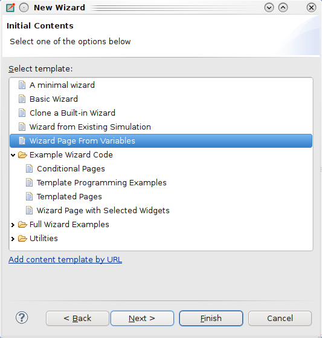
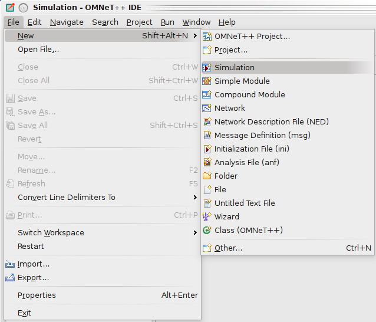
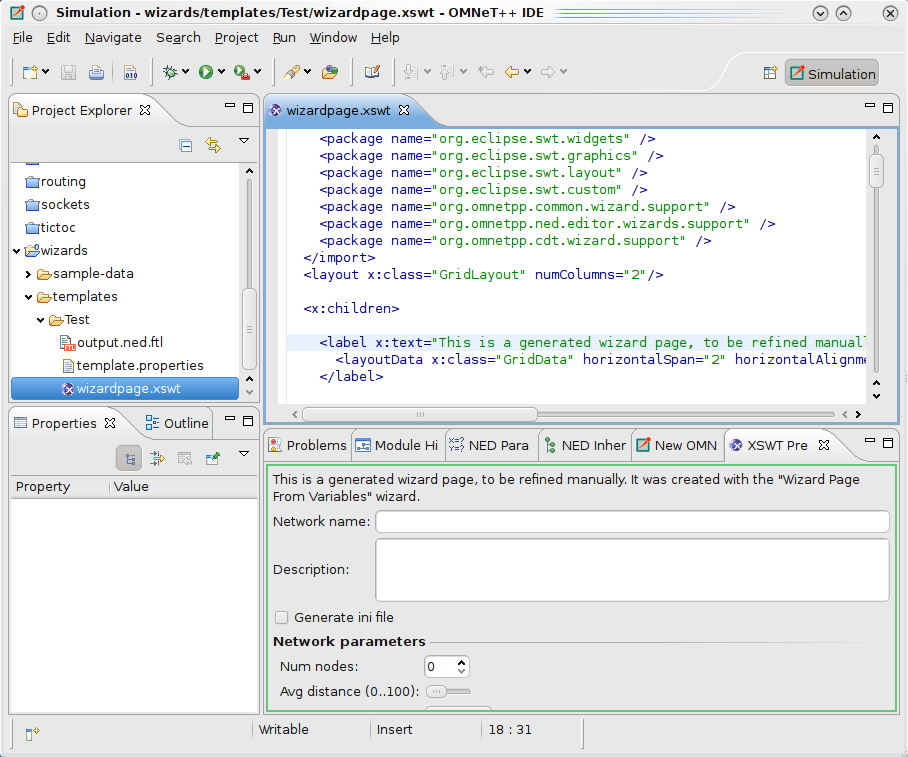

.. _ide-customization-guide:

IDE Customization Guide
=======================

Motivation
----------

The IDE offers several wizards via the *File|New* menu: *New |omnet++| Project*, *New Simple Module*, *New Compound
Module*, *New Network*, *New Simulation*, *New Msg File*, and *New Ini File*. This chapter describes how a user can add
content to these dialogs to create wizards that are specific to simulation models. These wizards include a *New INET
Ad-Hoc Network* wizard, a *New MiXiM Simulation* wizard, an *Import INET Network From CSV File* wizard, a *New MiXiM
Radio Model* wizard, and others.

For someone who is writing a model framework which will be available for the general public, wizards are a great way to
educate future users about the simulation model. While documentation and example simulations are somewhat passive ways
of showing off model features to users, wizards encourage users to experiment with the model and explore its
capabilities. The right set of capable wizards can give users a jump start by emphasizing learning by doing.

   The New Wizard wizard

Users can prepare these wizards with little effort and without any Java or C++ programming, and can be distributed
with the corresponding model framework (i.e. INET or MiXiM). When end users import the model framework project into the
IDE, the wizards are automatically added to the corresponding wizard dialogs; the end user does not need to install them
or do anything to deploy the wizards.

To facilitate the creation of wizards, we have also added a *New Wizard* wizard to the *File|New* menu.

Overview
--------

Custom wizards are read from the ``templates/`` folder of |omnet++| projects. Wizards are implemented by mixing a
templating engine (for generating the output files) and a GUI description language (for custom wizard pages to gather
user input for the file generation). Because of the use of a templating engine, we will also refer to custom wizards as
"content templates."

The IDE offers several |omnet++| related wizard dialogs: *New |omnet++| Project*, *New NED File*, *New Simple Module*, and
so on. Every content template can contribute to one or more of those wizard dialogs.

   The File --> New menu

In the ``templates/`` folder, every subfolder that contains a ``template.properties`` file is treated as a content
template (other folders are ignored). Every content template folder may contain several types of files:

-  The ``template.properties`` file contains general information about the wizard. It defines the initial value for the
   template variables and specifies the custom wizard pages to be shown when the wizard is run.

-  ``*.ftl`` files are template files that will be copied (without the ``.ftl`` extension) into the target folder after
   template variable substitution.

-  ``*.xswt`` files describe custom wizard pages that gather user input.

-  ``*.fti`` (template include) files are included by ``*.ftl`` files. This can be used to factor out common parts from
   the template files. The wizard ignores ``.fti`` files (i.e. does not copy them into the new project or folder).

-  ``*.jar`` files can be used to extend the wizard’s functionality with dynamically loaded Java code.

-  All other files are regarded as files that have to be copied into the target folder verbatim when the wizard runs.
   The wizard folder may contain subdirectories which may also contain files of the above type (except
   ``template.properties``, of course).

Template Processing
~~~~~~~~~~~~~~~~~~~

Template processing uses the FreeMarker library (*http://freemarker.org*) and all template syntax supported by
FreeMarker can be used. In particular, variable references of the syntax ``${varName}`` will be replaced with the
variable value.

The FreeMarker language also offers constructs that make it a full programming language: variable assignments,
conditionals, loops, switch statement, functions, macros, expression evaluation, built-in operators, etc., as well as
access to fields and methods of classes defined in Java. This means that any algorithm can be expressed in the
FreeMarker language, and if that is not enough, one can directly access Java classes using FreeMarker’s Bean Wrapper.

.. tip::

   Documentation for the FreeMarker template language can be found at: *http://freemarker.org/docs/index.html*

Templates can use several sources for input. They can:

-  gather information from the user, using custom wizard pages,

-  call any Java code to execute any arbitrarily complex algorithm,

-  call external programs, and

-  read and write from/to any file on the filesystem

Defining the GUI
~~~~~~~~~~~~~~~~

Custom wizard pages are defined in XSWT (*http://xswt.sourceforge.net*). XSWT is an XML based language that allows the
definition of SWT (the widget set used by Eclipse) widget hierarchies, without the need to write any code in Java. XSWT
also maps widget properties to XML attributes so the visual appearance of the wizard pages can be easily tweaked. It is
also possible to invoke methods on the generated widgets and use the SWT layout containers, allowing further
customizations. Each ``.xswt`` file in the template directory defines a separate wizard page which can be shown either
conditionally or unconditionally.

.. tip::

   XSWT documentation and a tutorial can be found at:
   *http://www.coconut-palm-software.com/the_new_visual_editor/doku.php?id=xswt:home*.

.. note::

   Currently we use XSWT 1.1.2. Newer XSWT versions from
   *http://www.coconut-palm-software.com/~xswt/integration/plugins/* did not work well.

Using the IDE
-------------

The IDE offers support for editing both ``.ftl`` and ``.xswt`` files to help create wizard pages and templates.

Editing XSWT Files
~~~~~~~~~~~~~~~~~~

Double-clicking on an XSWT file will open it in the XSWT editor. The editor provides basic syntax highlighting. An
extremely useful feature of the IDE is the XSWT Preview, where you can preview the form being edited (it updates when
you save the file). The Preview should open automatically when you open the XSWT file; if it does not (or you close it),
you can access it via the *Window|Show View…* menu item.

Some (custom) widgets may not appear in the Preview; this is because the Preview does not load jar files from the
projects.

   Editing an XSWT file

Editing Template Files
~~~~~~~~~~~~~~~~~~~~~~

The FreeMarker Editor opens when you double-click files with the ``*.ftl`` or ``*.fti`` extension. The FreeMarker Editor
offers basic syntax highlighting, validation (error markers appear during editing if the template is not syntactically
correct), and basic content assist. Content assist can help you with directives (``<#...>`` syntax) and built-in
operations (like ``?number, ?size, ?default``, etc). The content assist popup appears automatically when you type ``<#``
(actually a closing ``>`` is also needed for the editor to recognize the tag), and when you hit ``?`` within a directive
or an interpolation (``${...}``).

Writing an Example Wizard
-------------------------

In the following sections, we will create a simple wizard as an example, which will support either creating a simulation
(complete with NED and INI files), or just a single NED file with a network defined in it. The user will be able to
specify the type and the number of the submodules the network contains.

Configuring the Wizard
~~~~~~~~~~~~~~~~~~~~~~

The first step when creating a wizard is to create a new folder under the ``templates`` directory of the project. A file
named ``template.properties`` must be present in the newly created directory. This file is used to configure the wizard.
Create a folder a folder named ``templates/examplewizard`` under the project, then create ``template.properties`` and
add the following lines to it:

::

   templateName = New Test Wizard
   templateDescription = Generate an example
   templateCategory = Test Wizards
   supportedWizardTypes = simulation, network

These lines specify the name, type and category for the wizard. Category is used to specify how the wizards will be
grouped in the tree control section of the template selection page. Wizard type specifies in which *New … Wizard* your
wizard will appear. You can specify one or more of ``project``, ``simulation``, ``network``, etc.; the list of all
possible wizard types will be covered later in this document. In this case, the wizard will appear in the *New
Simulation* and *New Network* wizard dialogs.

You can now decide what data you would like to ask the user to provide. Template variables and their values can be
defined as key-value pairs:

::

   nodeType = Dummy
   networkSize = 6

The ``nodeType`` variable will be used as the submodule type in your network, while the ``networkSize`` defines how many
submodules you want in the network.

We define a custom wizard page where the user can specify the values of the above variables (i.e. override their default
value, specified above).

::

   page.1.file = parameters.xswt
   page.1.title = Network parameters

We will use the file ``parameters.xswt`` to define the layout and the content of the new wizard page.

.. note::

   There are numerous other configuration keys that can be used in ``template.properties``. See the "Configuration Keys"
   section for an exhaustive list of options.

Creating a New Wizard Page
~~~~~~~~~~~~~~~~~~~~~~~~~~

Files with ``.xswt`` extension (Wizard Page definitions) are used to define the UI and add new wizard pages to gather
user input for template generation. In the previous section, we specified that the file called ``parameters.xswt`` will
contain the new wizard page definition. We will add a *spinner* control to specify the size of our network and a *text*
control to specify the node type. Create a new file called ``parameters.xswt`` with the following content:

::

   <xswt xmlns:x="http://sweet_swt.sf.net/xswt">
     <x:import>
       <!-- Import all widgets and utility classes  -->
       <package name="java.lang"/>
       <package name="org.eclipse.swt.widgets" />
       <package name="org.eclipse.swt.graphics" />
       <package name="org.eclipse.swt.layout" />
       <package name="org.eclipse.swt.custom" />
       <package name="org.omnetpp.common.wizard.support" />
       <package name="org.omnetpp.ned.editor.wizards.support" />
       <package name="org.omnetpp.cdt.wizard.support" />
     </x:import>
     <!-- Create a two-column layout  -->
     <layout x:class="GridLayout" numColumns="2"/>
     <x:children>
       <!-- First row -->
       <label text="Number of nodes in the network:"/>
       <spinner x:id="networkSize" minimum="2" x:style="BORDER"/>
       <!-- Second row -->
       <label text="Type of nodes:"/>
       <text x:id="nodeType" x:style="BORDER"/>
     </x:children>
   </xswt>

The above defined wizard page will have two columns. The first column contains labels and the second contains editable
widgets. The ``x:id="varName"`` attributes in the spinner and text control definitions are used to bind a template
variable to the control. When a page is displayed, the content of the bound variables are copied into the controls. When
the user navigates away from the page or presses the *Finish* button, the content of the controls are copied back to the
bound variables. These variables can be used in the template files we are about to define in the following section.

.. note::

   To see the list of all available widgets, check the Appendix.

Creating Templated Files
~~~~~~~~~~~~~~~~~~~~~~~~

When the template is used, the contents of the template folder (and its subfolders) will be copied over into the new
project, thus preserving the directory structure with the exception of ``template.properties`` (it is also possible to
specify other files and folders to be ignored by specifying a file list for the ``ignoreResources`` configuration key).

When the wizard is being used, a pool of variables is kept by the wizard dialog. These variables are initialized from
the ``key = value`` lines in the ``template.properties`` files; they can get displayed and/or edited on custom wizard
pages. Eventually, they get substituted into ``*.ftl`` files (using the ``${varname}`` syntax).

Some variables have special meaning and are interpreted by the wizard dialog (e.g. the ``nedSrcFolders`` variable
determines which folders get denoted as NED Source Folders by the *New |omnet++| Project* wizard). Variables can be used
to generate output file names, can be used as input file names, and can serve as input and working variables for
arbitrarily complex algorithms programmed in the template (``*.ftl``) files.

Let us have a quick look at the FreeMarker template language. Variables can be inserted into the output using the
``${varname}`` syntax. One can also write expressions inside ``${..}``. For example, ``${numServers?number + 1}`` uses
the ``number`` built-in operator to convert the ``numServers`` variable to a number, adds one to it, and inserts the
result into the template output. FreeMarker has many other functions (conversion to string, upper-case version of a
string, size of an array, etc.) that work as built-in operators.

Programming facilities can be accessed via directives that have the ``<#...>`` syntax. Use ``<#if>``
(``<#if> cond>..<#elseif cond>..<#else>..</#if>``) for conditionals; ``<#list>`` for iterations and loops (e.g.
``<#list words as w>..</#list>``; ``<#list 0..9 as i>..</#list>``; ``<#list 9..0 as i>..</#list>``); and ``<#assign>``
for assigning variables (``<#assign x=5>``; ``<#assign x>the number ${i}</#assign>``). One can define functions
(``<#function>``) and macros (``<#macros>``). You can also include other templates (``<#include>``). Here, we only
covered a small fraction of FreeMarker’s possibilities; we recommend that you read the FreeMarker manual for more
information.

Let us create a file with a filename that has an ``.ftl`` extension (e.g. ``untitled.ned.ftl``). Because of the
extension, this file will be processed by the templating engine. The actual name of the file does not matter, because
the ``<@setoutput .../>`` directive instructs the templating engine to output everything from the current file into the
file that is specified by the ``targetFileName`` variable. The ``targetFileName``, ``targetTypeName``, ``bannerComment``
and ``nedPackageName`` variables are automatically filled out by the wizard, based on the filename and folder the user
selected on the first wizard page.

::

   <@setoutput path=targetFileName />
   ${bannerComment}

::

   <#if nedPackageName!="">package ${nedPackageName};</#if>

::

   network ${targetTypeName}
   {
       node[${networkSize}] : ${nodeType}
   }

The template variables will be substituted into the template automatically.

Specific wizard dialog types will also define extra variables for use in the templates. For example, the wizard type
that creates a complete simulation (with all required files) will put the ``simulationName`` variable into the context.
To see all defined variables, check the Appendix.

.. tip::

   The *New Wizard* wizard in the IDE provides you with some working examples, useful utilities for writing wizards, and
   sample code for accessing various features along with other helpful information. The aim of these wizards is to help
   you become productive in the shortest time possible.

As a last step in our example, we will also create an INI file template:

Create a file called ``omnetpp.ini.ftl``, and fill with:

::

   <#if wizardType=="simulation">
   network = ${targetTypeName}
   </#if>

We need the INI file only if we are creating a simulation. If the current type is not ``simulation``, the content will
be empty, and the file will not be written to the disk.

Wizard Types
------------

The wizard will set the ``wizardType`` template variable when it executes, so template code can check under which wizard
type it is running (using ``<#if>..</#if>``), and execute accordingly. This feature allows the user to create templates
that can be used for multiple wizard types.

There are several types of wizards you can create. Each one has a different goal.

New Project Wizards
~~~~~~~~~~~~~~~~~~~

::

   wizardType = project

Project wizards create new projects and let the user create files in them. It is possible to adjust project properties
to customize the new project. You can add C++ support to the project, set source and NED folders, etc.

The first two pages of the wizard are standard: they prompt the user for the name of the new project and let the user
choose a content template. These pages are followed by pages provided by the selected content template. If the user
selected C++ support on the first page, custom pages are followed by the standard CDT New Project pages.

When the user clicks *Finish*, the wizard creates the project and configures it according to the selected options (C++
support, source folders, etc.). Then, template files are copied into the new project, performing template processing as
necessary. Templated pages are responsible for creating the ``package.ned`` file according to the ``nedPackageName`` and
``namespaceName`` options, as well as creating source files in the NED and C++ source folders.

.. note::

   NED and C++ files are not automatically placed into the NED and C++ source folders. Templated pages have to be
   written (for example using ``setoutput``) so that they explicitly create the files in the proper places.

There are a few useful variables that template files use. The ``rawProjectName`` variable contains the project name.
This variable cannot be directly used as C++ or NED package names, type names, etc, because it may contain spaces or
other characters not allowed in identifiers. For convenience, the wizard provides sanitized versions of the project name
that can be used as identifiers; they are in the variables ``projectName``, ``PROJECTNAME`` and ``projectname``, and
differ in capitalization. The ``targetFolder`` variable is set to ``/``\ *<project name>*. These variables cannot be
edited in custom wizard pages.

The variables ``addProjectReference``, ``makemakeOptions``, ``sourceFolders`` and ``nedSourceFolders`` affect the
creation of the project before template files get processed. It is allowable to provide an initialization value for
these variables in ``template.properties`` and to let the user change them in custom pages.

For conformance with other wizards, the project wizard initializes the following variables with different case versions
of the project name: ``targetTypeName``, ``nedPackageName``, and ``namespaceName``. The ``targetMainFile`` variable is
initialized to *projectName*\ +\ ``.ned``, but there is no requirement for the template to actually create this file. It
can provide a different initialization value for these variables in ``template.properties`` and can let the user change
them in custom pages.

.. tip::

   If the new project contains a simulation, it is recommended that ``targetTypeName`` and ``targetMainFile`` are used
   as the network name and NED file name respectively.

.. note::

   The ``targetFileName`` variable is not set because the project wizard is not required to create a file.

See the appendix for the variable names that are supported in project wizard templates.

New Simulation Wizards
~~~~~~~~~~~~~~~~~~~~~~

::

   wizardType = simulation

A new simulation is basically a new folder containing all files required to run a simulation. The simulation folder
usually contains NED files, an INI file, and possibly also CC, H and MSG files.

The first two pages of the wizard are standard; they prompt the user for the parent and name of the new folder, and let
the user choose a content template. These pages are followed by pages provided by the selected content template.
Simulations can only be created in new folders under existing projects or folders.

When the user clicks *Finish*, the wizard creates the folder. The template files are then copied into the new folder,
performing template processing as necessary.

There are a few useful variables that template files can use. The ``simulationFolderName`` contains the name of the new
folder (without path). This variable cannot be directly used as a C++ or NED identifier, because it may contain spaces
or other characters not allowed in identifiers. For convenience, the wizard provides the ``simulationName`` variable
which is a sanitized version of the folder name. The ``targetFolder`` variable is set to the workspace path of the new
folder. These variables cannot be edited in custom wizard pages.

For conformance with other wizards, the simulation wizard initializes the ``targetTypeName`` variable with the
simulation name. The ``targetMainFile`` variable is initialized to *simulationName*\ +\ ``.ned``, but there is no
requirement that the template actually creates this file. It can provide a different initialization value for these
variables in ``template.properties`` and can let the user change them in custom pages.

.. tip::

   The intended purpose of ``targetTypeName`` and ``targetMainFile`` is to be used as the network name and NED file name
   respectively in the new simulation.

.. note::

   The ``targetFileName`` variable is not set because the simulation wizard is not required to create a file.

The ``nedPackageName`` and ``namespaceName`` variables are set by the wizard to the NED package name and C++ namespace
expected for the given folder. These values are derived from the folder path, the toplevel ``package.ned`` file and the
``@namespace`` property in it, and cannot be overridden.

See the appendix for the variable names that are supported in simulation wizard templates.

New INI, MSG or NED File Wizards
~~~~~~~~~~~~~~~~~~~~~~~~~~~~~~~~

::

   wizardType = compoundmodule, network, nedfile, inifile, msgfile

These wizard types generate a single file. The first two pages of the wizard are standard; they prompt the user for the
parent folder and name of the new file, and let the user choose a content template. These pages are followed by pages
provided by the selected content template.

.. note::

   Currently the wizard does not ensure that the created file will be under a NED/C++ source folder. This may change
   in the future.

When the user clicks *Finish*, template files are copied into the selected parent folder, performing template processing
as necessary. The template files are expected to create a file with the name chosen by the user.

The wizard passes the file name to the template files in the ``targetFileName`` variable.

.. note::

   The wizard does not prevent the templates from creating other files than ``targetFileName``. It is the responsibility
   of the template author to ensure that only a single file is created.

There are a few useful variables that template files can use. The ``targetFolder`` variable is set to the workspace path
of the parent folder. This variable cannot be edited in custom wizard pages.

For conformance with other wizards, the new wizard initializes the ``targetTypeName`` variable to a sanitized version of
the file name (minus extension). This variable can be used as a NED or message type name in the generated file. The
``targetMainFile`` variable is the same as ``targetFileName``.

One can provide a different initialization value for the ``targetTypeName`` variable in ``template.properties`` and let
the user change it in custom pages.

The ``nedPackageName`` and ``namespaceName`` variables are set by the wizard to the NED package name and C++ namespace
expected for the given folder. These values are derived from the file path, the toplevel ``package.ned`` file and the
``@namespace`` property in it, and cannot be overridden.

See the appendix for the variable names that are supported in new file wizard templates.

New Simple Module Wizard
~~~~~~~~~~~~~~~~~~~~~~~~

::

   wizardType = simplemodule

The simple module wizard creates a simple module, usually consisting of a NED file and C++ implementation files. This
wizard works in a similar way as the *New NED File* or *New Compound Module* wizard, but it is allowed to create other
files (C++ sources) in addition to the NED file.

Import Wizards
~~~~~~~~~~~~~~

::

   wizardType = import

An import wizard is not a standalone type, but rather a flag on other wizard types. It makes the wizard appear in the
*File|Import…* dialog in addition to the *File|New …* dialogs.

To access the import wizards, choose *|omnet++|*, *Networks, simulations and other items* as import source on the first
page of the *Import* dialog. The next page will be the content template selection page. After choosing a template, the
next page will be the file, folder or project name selection page of the *New…* wizard, followed by the custom wizard
pages.

.. note::

   If an import wizard supports more than one wizard types (e.g. ``project``, ``simulation``, ``nedfile``, etc.), the
   *File|Import…* dialog will use only one of those types. The type is chosen in the following order of preference:
   ``network``, ``nedfile``, ``compoundmodule``, ``simplemodule``, ``msgfile``, ``inifile``, ``simulation``, and
   ``project``. This may be changed in the future to explicit wizard type selection.

Export Wizards
~~~~~~~~~~~~~~

::

   wizardType = export

Export wizards can be accessed via the *File|Export…* dialog and export data into one or more files in the workspace or
in the file system.

To access the export wizards, choose *|omnet++|*, *Networks, simulations and other items* as export destination on the
first page of the *Export* dialog. The next page will be the content template selection page, followed by the custom
wizard pages.

Export wizards do not have a standard file/folder selection page, the target file name(s) must be obtained from the user
on custom wizard pages.

.. tip::

   You can use the ``SaveAsChooser`` and ``ExternalSaveAsChooser`` custom controls to prompt for a file name in the
   workspace and in the file system respectively.

The export wizard does not set ``targetFileName``, ``targetMainFile``, or any similar variables. It is entirely up to
the template author to define a variable for storing the output file name, letting the user edit it, and saving the
content in that file.

Template files are not allowed to produce any output; they are supposed to create the target files programmatically.

.. tip::

   Templates can use static methods of the ``FileUtils`` class, such as ``createFile(workspacepath, content)`` and
   ``createExternalFile(filesystempath, content)``, to create the files. Here, ``content`` is a string that holds the
   text to be written out into the file in the platform’s default encoding.

.. tip::

   The content text may be assembled using plain string concatenation (``<#assign content = content + "\nsome text">``),
   or templated content (``<#assign content>some text, ${foo} and ${bar}...</#assign>``).

New Wizard Wizard
~~~~~~~~~~~~~~~~~

::

   wizardType = wizard

A *New Wizard* wizard creates a wizard under the ``templates/`` folder of a workspace project.

The first two pages of the wizard are standard. They prompt the user to select the project that will hold the wizard,
choose the wizard name (name of the new folder under ``templates/``), and pick a content template. These pages are
followed by pages provided by the selected content template.

When the user clicks *Finish*, the wizard creates the folder under the ``templates/`` folder of the chosen project.
After that, template files are copied into the new folder, performing template processing as necessary.

There are a few useful variables that template files can use. The ``newWizardName`` variable contains the name of the
new folder (without path), and ``newWizardProject`` contains the name of the project. The project name variables
(``rawProjectName``, ``projectName``, ``PROJECTNAME``, etc.) and ``targetFolder`` variables are also set. These
variables cannot be edited in custom wizard pages.

.. note::

   The wizard does not set the ``targetFileName`` and ``targetMainFile`` variables.

See the appendix for the variable names that are supported in *New Wizard* wizard templates.

.. tip::

   To create a ``template.properties`` file for the new wizard, use a ``template.properties.ftl`` file in the wizard
   wizard. Similarly, you will likely have files with the ``.xswt.ftl`` and ``.ftl.ftl`` extensions in the wizard
   wizard. Inside ``.ftl.ftl`` files, use the ``<#noparse>..</#noparse>`` directive to protect parts that you want to be
   copied verbatim into the created wizards.

Configuration Keys
------------------

The ``template.properties`` file is a standard Java property file (``key = value`` syntax) that can be used to supply a
template name, a template description, and other information.

Recognized property file keys:

``templateName``
   The template’s display name. This is the name that appears in the tree in the template selection page. This property
   defaults to the name of the folder that holds the wizard files.

``templateDescription``
   Description of the template. This may appear as a tooltip or in a description page in the wizard.

``templateCategory``
   Template category is used for organizing the templates into a tree in the wizard’s template selection page. Defaults
   to the name of the project that provides the template.

``templateImage``
   Name of the icon that appears with the name in the wizard’s template selection page.

``supportedWizardTypes``
   Comma-separated or JSON-syntax list of wizard types (e.g. ``nedfile``, ``simplemodule``, ``project``, ``inifile``)
   that this template supports. If not specified, the wizard will support all known wizard types.

``ignoreResources``
   Comma-separated or JSON-syntax list of non-template files or folders designating those files that will not get copied
   over to the new project. The ``template.properties`` file and custom wizard page files automatically count as
   non-templates, so they do not have to be listed. Wildcards (``*``, ``**``, ``?``) are accepted. Note that ``*.foo``
   is interpreted as ``./*.foo``; write ``**/*.foo`` to mean foo files anywhere.

``verbatimFiles``
   Comma-separated or JSON-syntax list of files that need to be copied over into the target project verbatim, even if
   they have the ``.ftl`` extension. Wildcards (``*``, ``**``, ``?``) are accepted. Note that ``*.foo`` is interpreted
   as ``./*.foo``; write ``**/*.foo`` to mean foo files anywhere.

The *New |omnet++| Project* wizard also recognizes the following options (these options can be overridden from custom
wizard pages):

``addProjectReference``
   True or false; defaults to true. If true, the template’s project will be added to the referenced project’s list of
   the new project.

``sourceFolders``
   Comma-separated or JSON-syntax list of C++ source folders to be created and configured. By default, none.

``nedSourceFolders``
   Comma-separated or JSON-syntax list of NED source folders to be created and configured. By default, none.

``makemakeOptions``
   Comma-separated list of items in the syntax "folder:options", or a JSON-syntax map of strings; it sets opp_makemake
   options for the given folders. There is no default.

There are additional options for adding custom pages into the wizard, as described in the next section.

Templates
---------

For wizards, several variables are predefined, such as ``templateName, targetFolder, date,`` and ``author``; others,
like ``targetFileName, targetTypeName, simulationFolderName,
nedPackageName``, etc., are defined only for certain wizard dialogs. A full list of variables is provided in the
Appendix.

Generating multiple files
~~~~~~~~~~~~~~~~~~~~~~~~~

By default, templates are processed and copied with the same name (chopping the ``.ftl`` extension), but it is possible
to redirect the output of the template to a different file using the ``<@setoutput path=.../>`` macro. The filename can
contain slashes, too, which means that one can write files in a different folder. If the folder does not exist, it will
be created. For example:

::

   <@setoutput path=targetFileName/>

If filename is empty, the directive restores output to the original file name (the template’s name). This also works if
a folder name is given and only the file name is missing (``<@setoutput path="src/">``). Then, it will write the file
with the original name but into the specified folder.

.. note::

   If there are multiple ``setoutput`` macros with the same file name within a template, the content will be
   concatenated. Concatenation only works within one template; if you have multiple templates writing into the same
   file, they will overwrite each other’s content. It is undefined which one will win.

Conditional file creation
~~~~~~~~~~~~~~~~~~~~~~~~~

Empty and blank files (i.e. those containing only white space) will not be created (i.e. processing will skip writing it
without any question, warning or error). This allows you to easily create files conditionally; you just have to surround
the file body with ``<#if>..</#if>``.

.. note::

   The above rule also means that one cannot even deliberately create empty files with templates. However, this
   "limitation" is easy to overcome. Most file formats (NED, C++, INI, XML, etc.) have a comment syntax, so you can
   write a file that contains only a comment (``// file intentionally left blank``). Alternatively, you can create an
   empty file using the ``FileUtils`` Java utility class (``<@do FileUtils.createFile("empty.txt", "")!/>``).

.. note::

   Although blank files are not created, the template engine will not delete an existing file that happens to be already
   there with the same name.

Custom Wizard Pages
-------------------

The following properties can be used to define custom pages in the wizard. ``<i>`` is an integer page ID (starting with
1); its ordering defines the order of wizard pages.

``page.<i>.file``
   The name of the XSWT file that describes the wizard page layout.

``page.<i>.class``
   In addition to XSWT files, custom Java pages may also be defined in Java code. This can be useful when the wizard
   page would be too complex to describe with XSWT, when it would need to have significant active behavior, or when the
   wizard page code already exists in Java form. See below for further discussion about custom pages.

``page.<i>.title``
   Title of the wizard page, displayed in the page’s title area. Defaults to the template name.

``page.<i>.description``
   Description of the wizard page, shown in the dialog’s title area below the title. Defaults to text in the format
   "Page 1 of 3".

``page.<i>.condition``
   A condition for showing the page. If it evaluates to false, the page will be skipped when it would normally come in
   the page sequence of the wizard. This makes it possible not only to skip pages, but also to show different pages
   based on some choice or choices the user made earlier in the wizard (decision tree). The condition will be evaluated
   by the template engine, so any valid FreeMarker expression that can produce true or "true" as a result will do. The
   expression must be supplied without the ``${`` and ``}`` marks. The string you enter will be substituted into the
   "``${( <condition> )?string}``" string (will replace "``<condition>``"), and evaluate as such. An example will be
   provided later.

All property file entries are available as template variables, too. In addition, most property values may refer to other
property values or template variables, using the ``${name}`` syntax.

XSWT Forms
~~~~~~~~~~

An XSWT form is defined in an XML file with the root element ``<xswt>``. Some XSWT specific elements and attributes
(``import`` and ``package`` declarations, ``id`` and ``class`` attributes to name a few) are defined in the
``http://sweet_swt.sf.net/xswt`` XML namespace (we use the ``x`` namespace prefix here).

Controls that can be used in XSWT are instantiated by an element with same name as the control (but starting with
lowercase).

Controls and classes used in an XSWT file must be imported before they can be used.

::

   <xswt xmlns:x="http://sweet_swt.sf.net/xswt">
     <x:import>
       <package name="java.lang"/>
       <package name="org.eclipse.swt.widgets" />
       <package name="org.eclipse.swt.custom" />
       <package name="org.eclipse.swt.graphics" />
       <package name="org.eclipse.swt.layout" />
       <package name="org.omnetpp.common.wizard.support" />
       <package name="org.omnetpp.ned.editor.wizards.support" />
       <package name="org.omnetpp.cdt.wizard.support" />
     </x:import>
     <label text="Hello"/>
   </xswt>

Entities and attributes in an XSWT file are directly mapped to the corresponding SWT controls and their properties. For
example, a ``<styledText>`` tag creates an ``org.eclipse.swt.custom.StyledText`` control. Similarly, a ``text``
attribute causes the ``setText()`` method of the control to be called.

::

   <styledText text="Hello world!" />

Alternatively, it is possible to call a public method on the control by embedding a "call" as a child tag and supplying
the parameters as ``p0``, ``p1``, etc.:

::

   <styledText>
     <setText x:p0="Hello World"/>
   </styledText>

.. note::

   Because of a limitation in XSWT, only methods accepting ``String`` parameters can be accessed this way.

Integer constants in controls (``public static final int`` fields) can be used in an XSWT file by appending the Java
class name before them:

::

   <gateChooser gateFilter="GateChooser.INOUT|GateChooser.VECTOR"/>

Constants in the SWT class do not need the ``SWT.`` prefix. You can write:

::

   <button x:style="RADIO"/>

Children can be added to a compound control inside the ``<x:children></x:children>`` tags.

::

   <group text="Hello">
     <x:children>
       <label text="Label 1" />
       <label text="Label 2" />
     </x:children>
   </group>

Layout and layout data can also be added as a new tag inside a control element:

::

   <text x:id="numServers" x:style="BORDER">
     <layoutData x:class="GridData" horizontalAlignment="FILL"
                 grabExcessHorizontalSpace="true"/>
   </text>

.. note::

   Layout is always needed; otherwise, the control will not appear on the page.

.. tip::

   SWT is documented on the Eclipse website. See: *http://www.eclipse.org/swt/docs.php* for documentation, examples and
   tutorials.

Binding of Template Variables to Widgets
~~~~~~~~~~~~~~~~~~~~~~~~~~~~~~~~~~~~~~~~

XSWT allows one to tag widgets with ID attributes. Widget IDs will become the names of template variables with the
values being the content of widgets. For example, text widgets (org.eclipse.swt.widgets.Text) provide a string value
(Java type "String"), while checkboxes and radio buttons provide a boolean (Java type "Boolean").

XSWT also allows filling up the widgets with default values (e.g. ``<styledText text="some text"/>``), but this feature
should be used with care because the defaults set in XSWT may not make it to the file templates. This occurs because if
the user clicks *Finish* early, the rest of the wizard pages (and their widgets) may not be created at all, so values
set in the XSWT will take no effect.

For this reason, defaults should always be set in the property file. To do so, simply use a key with the ID of the
widget; those values will be written into the wizard page when the page is created. For example, if you have a text
widget with ``x:id="numNodes"`` and a checkbox with ``x:id="generateTraffic"``, then the following lines

::

   numNodes = 100
   generateTraffic = true

will fill in the text widget with "100" and select the checkbox. Widgets that do not have such lines in the property
file will be left alone. The property file takes precedence over values specified in the XSWT file.

Compound data structures (arrays, maps, and any combination of them) can be specified in the JSON syntax
(*http://json.org*). They can be iterated over in the templates and can be used as input/output for custom compound
widgets. Examples:

::

   apps = ["ftp", "smtp", "news"]
   layers = {"datalink":"ieee80211", "network":"ip", "transport":["tcp","udp"]}

.. tip::

   If you get an error about syntax errors in a JSON entry, the *http://jsonlint.com* website can help you locate the
   problem.

Conditional Pages
~~~~~~~~~~~~~~~~~

Now that we have covered basic XSWT, we can revisit how one can use page conditions. Consider the following practical
example of creating a wizard for wireless networks.

On the first page of the wizard you could have a *[] Configure routing* checkbox with the ID ``wantRouting``. If this
checkbox is selected, you want to display a second page where the user can select a routing protocol, followed by
configuration pages determined by the chosen routing protocol.

To achieve this, you would add the following lines to ``template.properties``:

::

   # page with the "wantRouting" checkbox
   page.1.title = General
   # page with the "protocol" combobox
   page.2.title = Choose Routing Protocol
   page.3.title = AODV Options
   page.4.title = DSDV Options

::

   page.2.condition = wantRouting
   page.3.condition = wantRouting && protocol=="AODV"
   page.4.condition = wantRouting && protocol=="DSDV"

The ``.condition`` keys will make the wizard include only the pages where the condition evaluates to true. Conditions
can be arbitrary FreeMarker expressions that evaluate to ``true`` (as boolean) or ``"true"`` (as string). Conditions are
re-evaluated after every page, so you can depend on variables edited on earlier pages.

Conditional Widgets
~~~~~~~~~~~~~~~~~~~

It is also possible to create controls conditionally. To overcome the limitation that XSWT page descriptions are
completely static, XSWT files undergo FreeMarker template processing before giving them to the XSWT engine for
instantiation. This template processing occurs right before the page gets displayed, so data entered on previous pages
can also be used as input for generating XSWT source. This feature can be useful in making conditional widgets (i.e.
using ``<#if>`` to make part of the page appear only when a certain option has been activated on earlier pages), to
create a previously unknown number of widgets (using a ``<#list>..</#list>`` loop), to populate combo boxes, listboxes
or other widgets with options, and more.

::

   <!-- Show only if the wizard is run from the New Simulation wizard-->
   <#if wizardType=="simulation">
   <label text="Description how the wizard works for new simulations."/>
   </#if>

If the user navigates in the wizard back and forth several times (using the Next and Back buttons), the contents of
wizard pages are always re-created with the current values of template variables just before getting displayed, so they
will always be up to date.

Extending the Wizards in Java
-----------------------------

It is possible to create new Wizard pages, custom widgets or add new template variables by extending the wizards in
Java.

Creating Wizard Pages
~~~~~~~~~~~~~~~~~~~~~

Defining a wizard page in Java requires that you install the Eclipse Plug-in Development Environment (PDE) and that you
have some Eclipse development skills.

The ``template.properties`` key for denoting a Java-based wizard page is ``page.<NN>.class``, and the value should be
the fully qualified name of the Java class that implements the wizard page. The requirements for the class are:

-  the class must be accessible to the class loader,

-  the class must extend ``org.omnetpp.common.wizard.ICustomWizardPage, and``

-  the class must have a public constructor with the following argument list:
   ``(String name, IContentTemplate creatorTemplate, String condition)``

Creating Custom Widgets
~~~~~~~~~~~~~~~~~~~~~~~

Since XSWT works via Java reflection, your own custom widgets can be used in forms, similar to normal SWT widgets. No
glue or registration code is needed; simply add their package to the ``<import>`` tags at the top of the XSWT file.

However, some Java code is needed so that the wizard knows how to write template variables into your widgets and how to
extract them after editing. This functionality can be added via the ``org.omnetpp.common.wizard.IWidgetAdapter``
interface. This interface must be implemented either by the widget class itself, or by a class named
``<widgetclass>Adapter`` in the same package. The interface has methods to tell whether the adapter supports a given
widget, to read the value out of the widget, and to write a value into the widget.

In addition to basic data types (``Boolean, Integer, Double, String, etc.``), it is possible to use compound data types
as well (i.e. those composed of the List and Map interfaces of the Java Collections API). The default values can be
given in the ``template.properties`` file in the JSON notation and the result can be used in the templates (iteration
via ``<#list>``, etc.).

Extending your Template with Custom Classes and Widgets
~~~~~~~~~~~~~~~~~~~~~~~~~~~~~~~~~~~~~~~~~~~~~~~~~~~~~~~

Jar files placed into the ``plugins/`` subdirectory of an |omnet++| project will be loaded automatically and will be
available to all templates. Jar files in that directory may be plain Java jars and Eclipse plug-in jars (the latter
makes it also possible to contribute new functionality into the IDE via various extension points, but this is outside
the scope of this discussion about wizards).

Jar files placed in the folder of the template will be loaded automatically when the template is used and the classes in
it will be available for that template. Custom SWT widget classes can be imported and used in XSWT forms, and other code
can be used in the template files via the FreeMarker Bean Wrapper (e.g.
``${classes["org.example.SomeClass"].someStaticMethod(...)}``, see the example wizards.) Like ``.xswt`` files and
``template.properties``, jar files are not copied over into the destination folder when the wizard executes.

Extending the Template Processing
~~~~~~~~~~~~~~~~~~~~~~~~~~~~~~~~~

If you are skilled in writing Eclipse plug-ins, there are ways you can extend content templates. One is to contribute to
the ``org.omnetpp.common.wizard.templatecontributor`` extension point, which lets you supply
``IContentTemplateContributor`` objects that can extend the content template implementation in various ways. You can
contribute new variables, functions or macros to the template context.

Common Pitfalls
---------------

-  Variables need to be defined. Referring to an undefined variable is an error in FreeMarker (i.e. it does not return
   an empty string as in bash or in makefiles).

-  Default values should be specified in ``template.properties``, not in the XSWT forms. You should not define them in
   the XSWT page by pre-filling the corresponding widget (e.g. ``<text x:id="n" text="100">``). If you specify the value
   in a page, the assignment will not take effect if the user skips that page (i.e. clicks *Finish* earlier). That
   causes the variable to remain undefined, resulting in a runtime error during template processing.

-  Type mismatch. Variables have types in FreeMarker and one can get type conversion errors if the templates are not
   programmed carefully. For example, comparing a number and a string is a runtime error. A more serious problem is that
   widgets in wizard pages may implicitly perform type conversion. For example, a ``numHosts=100`` line in
   ``template.properties`` defines a number, but if you have a ``<text x:id="numHosts"/>`` widget in the form, the
   variable will come back from it as a string. Even worse, whether the number->string conversion takes place will
   depend on whether the page gets displayed in the wizard session. Therefore, it is recommended that you explicitly
   convert numeric variables to numbers at the top of templates (e.g. ``<#assign numHosts = numHosts?number>``).

-  For some reason, FreeMarker refuses to print boolean variables (e.g. ``${isFoo}`` results in a runtime error). The
   common workaround is to write ``<#if isFoo>true<#else>false</#if>``; this can be shortened with our *iif()* function:
   ``${iff(isFoo, "true", "false")}``.

-  Many string operations are available both as built-in FreeMarker operators (``varname?trim``) and as Java methods via
   FreeMarker’s BeanWrapper (``varname.trim()``). If you are mixing the two, it is possible that you will start getting
   spurious errors for the Java method calls. In that case, simply change Java method calls to FreeMarker built-ins.

-  Some Java functionality (the instance of operator, ``Class.newInstance()``, etc.) cannot be accessed via BeanWrapper.
   If you hit such a limitation, check our ``LangUtils`` class that provides FreeMarker-callable static methods to plug
   these holes.

XSWT Tips and Tricks
--------------------

**How can I make a checkbox or radio button? ``<checkbox>`` and ``<radio>`` are not recognized in my XSWT files!**

They are called ``<button x:style="CHECK">`` and ``<button x:style="RADIO">`` in SWT.

**My text fields, combo boxes, etc. look strange. What am I doing wrong?**

You usually want to add the ``BORDER`` option, like this: ``<text x:style="BORDER">``

**How can I make a long label wrap nicely?**

Specifying x:style="WRAP" is necessary, but not enough. You must also make sure that the label widget expands and fills
the space horizontally:

::

   <label text="Some long text..." x:style="WRAP">
       <layoutData x:class="GridData" horizontalAlignment="FILL"
          grabExcessHorizontalSpace="true"/>
   </label>

**How can I set the initial focus?**

Add ``<setFocus/>`` to the XML body of the desired widget.

**How can I make the presence of some widget conditional to some previous input?**

You can use ``<#if>`` and other FreeMarker directives in XSWT files. These files undergo template processing each time
the corresponding page appears.

**How can I carry forward data from a previous page to the next?**

Use FreeMarker variables (``${varName}``) in the page.

**How can I fill a combo box with values that I will only know at runtime?**

You can generate the ``<option>`` children of the combo using FreeMarker directives (e.g. ``<#list>...</#list>``).

**How can I have more sophisticated user input than what I can get through simple textedit fields, checkboxes and the
like?**

You can implement custom SWT controls in Java and use them in the wizard pages. The custom controls may even be packaged
into jar files in the template’s directory (i.e. you do not need to write a separate Eclipse plug-in, etc.). Have a look
at the source files of the existing custom controls (``FileChooser``, ``NedTypeChooser``, ``InfoLink``, etc.).

**How can I dynamically enable/disable controls on a page, depending on other controls (i.e. the state of a checkbox or
a radio button)?**

Currently, you cannot do this. If you are desperate, you have the following options: (1) put the dependent controls on a
separate page, which you can make conditional; (2) write a custom ``CheckboxComposite`` control in Java that features a
checkbox that enables/disables child controls when the checkbox selection changes; (3) write the full custom wizard page
entirely in Java and register it in ``template.properties`` with ``page.xx.class=`` instead of ``page.xx.file=``; or (4)
implement scripting support for XSWT 1.x and contribute the patch to us.

**In the Project wizard, how does it get decided which templates get offered when the With C++ Support checkbox is
selected and when it is not selected on the first page?**

If the C++ support checkbox is cleared, templates that require C++ support will not appear; when it is checked,
there is no such filtering. A template is regarded as one that requires C++ support if the ``template.properties``
file contains any of the following: ``sourceFolders=``, ``makemakeOptions=``, or ``requiresCPlusPlus=true``.

Appendix A - Widgets in XSWT
----------------------------

Standard SWT widgets
~~~~~~~~~~~~~~~~~~~~

.. tip::

   The SWT controls are documented on the Eclipse web site. See:
   *http://help.eclipse.org/galileo/topic/org.eclipse.platform.doc.isv/reference/api/org/eclipse/swt/widgets/package-summary.html*

It is possible to bind template variables to a specific control by using the ``x:id`` attribute.

::

   <text x:id="templateVariableName" />

This is the way that template variables are bound to the controls (R=read, W=write):

Button
   This SWT class represents buttons, checkboxes and radio buttons, depending on its style attribute 
   (``SWT.PUSH, SWT.CHECK, SWT.RADIO``).

   -  W: the string "true" selects the checkbox/radio button; everything else clears it.

   -  R: returns a Boolean.

Combo, CCombo
   Represent a combo box and a custom combo box. It can be made read-only (with the ``SWT.READ_ONLY`` style). A
   read-only combo allows list selection but no manual editing. The list items can be specified from XSWT. Variables
   only work with the textedit part (cannot add/remove list items).

   -  W: the string value gets written into the combo. If the combo is read-only and contains no such item, nothing
      happens.

   -  R: returns the currently selected item as string.

DateTime
   A widget for editing date/time.

   -  W: accepts a string in the following format: "yyyy-mm-dd hh:mm:ss". If the string is not in the right format, an
      error occurs.

   -  R: returns a string in the same format, "yyyy-mm-dd hh:mm:ss".

Label
   Label widget (not interactive).

   -  W: sets the label to the string.

   -  R: returns the label.

List
   A listbox widget that allows selection of one or more items, depending on the style attribute (``SWT.SINGLE`` or
   ``SWT.MULTI``). List items can be specified from XSWT. Template variables only work with the selection (cannot
   add/remove list items).

   -  W: accepts a string with comma-separated items and selects the corresponding item(s) in the listbox. Items that
      are not among the listbox items are ignored.

   -  R: Returns a string array object (String[]) that can be iterated over in the template.

Scale
   A graphical widget for selecting a numeric value.

   -  W: accepts strings with an integer value. Non-numeric strings will cause an error (a message dialog will be
      displayed).

   -  R: returns an Integer which can be used in arithmetic expressions in the template.

Slider
   A scrollbar-like widget for selecting a positive numeric value. Handled in a similar way as Scale.

Spinner
   Similar to a textedit, but contains little up and down arrows and can be used to input an integer number. Handled in
   a similar way as Scale.

StyledText
   A textedit widget which allows displaying and editing of styled text. Handled similarly to Text.

Text
   A textedit widget. It can be single-line or multi-line, depending on the style attribute (``SWT.SINGLE, SWT.MULTI``).

   -  W: accepts a (potentially multiline) string.

   -  R: returns the edited text as a string.

Custom widgets
~~~~~~~~~~~~~~

HttpLink
   A control containing a text and a hyperlink between ```` tags. An URL can be specified to be opened in an
   external browser.

   -  W: accepts a string with the target URL.

   -  R: returns the target URL as string.

   -  Other attributes:

      -  text : the textual content of the control ```` denotes the link inside.

      -  URL: the target URL where the control points to.

InfoLink
   A control that displays a text with embedded link(s). Clicking on a link will display a hover text in a window. The
   hover text can be given with the setHoverText method (i.e. the hoverText XSWT attribute), or bound to a template
   variable (using the x:id XSWT attribute).

   -  W: accepts a string with the hover text for the control.

   -  R: returns the hover text as string.

   -  Other attributes:

      -  text: the content of the control.

      -  hoverText: the html formatted text displayed in the hover control.

      -  hoverMinimumWidth: the minimum width for the hover control.

      -  hoverMinimumHeight: the minimum height for the hover control.

      -  hoverPreferredWidth: the preferred width for the hover control.

      -  hoverPreferredHeight: the preferred height for the hover control.

FileLink
   A control for displaying the name of a resource as a link. When clicked, it shows the resource (opens Project
   Explorer and focuses it to the resource).

   -  W: accepts a string with the workspace path of the resource to be shown.

   -  R: returns the full workspace path of the resource.

   -  Other attributes:

      -  resourcePath: the full workspace path of the file.

FileChooser
   A control for selecting a file from the workspace. Implemented as a Composite with a single-line Text and a Browse
   button.

   -  W: accepts a string with the workspace file name.

   -  R: returns the name of the selected file as a string from the workspace.

   -  Other attributes:

      -  fileName : the full workspace path of the selected file.

ExternalFileChooser
   A control for selecting a file from the filesystem. Implemented as a Composite with a single-line Text and a Browse
   button.

   -  W: accepts a string with the full file name.

   -  R: returns the name of the selected file as a string from the filesystem.

   -  Other attributes:

      -  fileName : the full filesystem path of the selected file.

SaveAsChooser
   A control for selecting a name for a new file from the workspace. Implemented as a Composite with a single-line Text
   and a Browse button.

   -  W: accepts a string with the workspace file name.

   -  R: returns the name of the selected file as a string from the workspace.

   -  Other attributes:

      -  fileName : the full workspace path for the new file.

ExternalSaveAsChooser
   A control for selecting a name for a new file in the filesystem. Implemented as a Composite with a single-line Text
   and a Browse button.

   -  W: accepts a string with the full file name.

   -  R: returns the name (with full filesystem path) of the new file as a string.

   -  Other attributes:

      -  fileName : the full filesystem path for the new file.

GateChooser
   A control for selecting a gate of a NED module type. If the module exists, it lets the user select one of its gates
   from a combo; if the module does not exist, it lets the user enter a gate name.

   -  W: accepts strings with a gate name.

   -  R: returns the name of the selected gate as a string.

   -  Other attributes:

      -  gateName: the name of the selected gate.

      -  nedTypeName : the NED type whose gates should be enumerated.

      -  gateFilter : type filter for the enumerated gates. Expects a binary OR (|) of the following values:
         ``GateChooser.INPUT, GateChooser.OUTPUT, GateChooser.INOUT, GateChooser.VECTOR, GateChooser.SCALAR``.

         ::

            <gateChooser x:id="gateName"
              nedTypeName="${nodeType}"
              gateFilter="GateChooser.INOUT|GateChooser.VECTOR"/>

NedTypeChooser
   A control for selecting a NED module type. An existing type name can be selected or a new one can be entered.

   -  W: accepts strings with a NED type name.

   -  R: returns the name of the selected NED type as a string.

   -  Other attributes:

      -  nedName: the NED module type as a string.

      -  acceptedTypes : filter for the enumeration of types. Expects a binary OR (|) of the following values:
         ``NedTypeChooser.MODULE, NedTypeChooser.SIMPLE_MODULE, NedTypeChooser.COMPOUND_MODULE, NedTypeChooser.MODULEINTERFACE, NedTypeChooser.CHANNEL, NedTypeChooser.CHANNELINTERFACE, NedTypeChooser.NETWORK``.

         ::

            <nedTypeChooser x:id="channelType"
                 acceptedTypes="NedTypeChooser.CHANNEL"/>

.. note::

   Table and tree widgets are currently not supported in a useful way; the main reason being that SWT Tables and Trees
   are not editable by default.

Some non-interactive widgets which cannot be connected to template variables but are useful in forms as structuring
elements:

Composite
   Used to group two or more controls into a single one.

   ::

      <composite>
        <layoutData x:class="GridData" horizontalSpan="2"/>
        <layout x:class="GridLayout"/>
        <x:children>
          <button x:id="dynamic" text="Dynamic" x:style="RADIO"/>
          <button x:id="static" text="Static" x:style="RADIO"/>
        </x:children>
      </composite>

Group
   Used to group the controls with a visual heading.

   ::

      <group text="Heading text">
        <x:children>
           <label text="Control 1"/>
           <label text="Control 2"/>
        </x:children>
      </group>

TabFolder/TabItem
   Can be used to group the controls into separate pages.

   ::

      <tabFolder>
        <x:children>
          <composite x:id="page1"></composite>
          <composite x:id="page2"></composite>
          <tabItem text="Tab 1" control="page1"/>
          <tabItem text="Tab 2" control="page2"/>
        </x:children>
      </tabFolder>

Appendix B - Predefined Template Variables
------------------------------------------

+-----------------------------------+-----------+-----------+-----------+-----------+-----------+-----------+-----------+
| variable name                     | project   | simul.    | msgfile   | inifile   | nedfile   | wizard    | export    |
+-----------------------------------+-----------+-----------+-----------+-----------+-----------+-----------+-----------+
| ``addProjectReference``           | X         |           |           |           |           |           |           |
+-----------------------------------+-----------+-----------+-----------+-----------+-----------+-----------+-----------+
| ``author``                        | X         | X         | X         | X         | X         | X         | X         |
+-----------------------------------+-----------+-----------+-----------+-----------+-----------+-----------+-----------+
| ``date``                          | X         | X         | X         | X         | X         | X         | X         |
+-----------------------------------+-----------+-----------+-----------+-----------+-----------+-----------+-----------+
| ``licenseCode``                   | X         | X         | X         | X         | X         | X         | X         |
+-----------------------------------+-----------+-----------+-----------+-----------+-----------+-----------+-----------+
| ``licenseText``                   | X         | X         | X         | X         | X         | X         | X         |
+-----------------------------------+-----------+-----------+-----------+-----------+-----------+-----------+-----------+
| ``makemakeOptions``               | X         |           |           |           |           |           |           |
+-----------------------------------+-----------+-----------+-----------+-----------+-----------+-----------+-----------+
| ``namespaceName``                 |           | X         | X         |           | X         |           |           |
+-----------------------------------+-----------+-----------+-----------+-----------+-----------+-----------+-----------+
| ``nedPackageName``                | X         | X         |           | X         | X         |           |           |
+-----------------------------------+-----------+-----------+-----------+-----------+-----------+-----------+-----------+
| ``nedSourceFolders``              | X         |           |           |           |           |           |           |
+-----------------------------------+-----------+-----------+-----------+-----------+-----------+-----------+-----------+
| ``newWizardName``                 |           |           |           |           |           | X         |           |
+-----------------------------------+-----------+-----------+-----------+-----------+-----------+-----------+-----------+
| ``newWizardProject``              |           |           |           |           |           | X         |           |
+-----------------------------------+-----------+-----------+-----------+-----------+-----------+-----------+-----------+
| ``projectName``                   | X         | X         | X         | X         | X         | X         |           |
+-----------------------------------+-----------+-----------+-----------+-----------+-----------+-----------+-----------+
| ``PROJECTNAME``                   | X         | X         | X         | X         | X         | X         |           |
+-----------------------------------+-----------+-----------+-----------+-----------+-----------+-----------+-----------+
| ``projectname``                   | X         | X         | X         | X         | X         | X         |           |
+-----------------------------------+-----------+-----------+-----------+-----------+-----------+-----------+-----------+
| ``rawProjectName``                | X         | X         | X         | X         | X         | X         |           |
+-----------------------------------+-----------+-----------+-----------+-----------+-----------+-----------+-----------+
| ``requiresCPlusPlus``             | X         |           |           |           |           |           |           |
+-----------------------------------+-----------+-----------+-----------+-----------+-----------+-----------+-----------+
| ``simulationFolderName``          |           | X         |           |           |           |           |           |
+-----------------------------------+-----------+-----------+-----------+-----------+-----------+-----------+-----------+
| ``simulationName``                |           | X         |           |           |           |           |           |
+-----------------------------------+-----------+-----------+-----------+-----------+-----------+-----------+-----------+
| ``sourceFolders``                 | X         |           |           |           |           |           |           |
+-----------------------------------+-----------+-----------+-----------+-----------+-----------+-----------+-----------+
| ``targetFileName``                |           |           | X         | X         | X         |           |           |
+-----------------------------------+-----------+-----------+-----------+-----------+-----------+-----------+-----------+
| ``targetFolder``                  | X         | X         | X         | X         | X         | X         |           |
+-----------------------------------+-----------+-----------+-----------+-----------+-----------+-----------+-----------+
| ``targetMainFile``                | X         | X         | X         | X         | X         |           |           |
+-----------------------------------+-----------+-----------+-----------+-----------+-----------+-----------+-----------+
| ``targetTypeName``                | X         | X         | X         | X         | X         |           |           |
+-----------------------------------+-----------+-----------+-----------+-----------+-----------+-----------+-----------+
| ``templateCategory``              | X         | X         | X         | X         | X         | X         | X         |
+-----------------------------------+-----------+-----------+-----------+-----------+-----------+-----------+-----------+
| ``templateDescription``           | X         | X         | X         | X         | X         | X         | X         |
+-----------------------------------+-----------+-----------+-----------+-----------+-----------+-----------+-----------+
| ``templateFolderName``            | X         | X         | X         | X         | X         | X         | X         |
+-----------------------------------+-----------+-----------+-----------+-----------+-----------+-----------+-----------+
| ``templateFolderPath``            | X         | X         | X         | X         | X         | X         | X         |
+-----------------------------------+-----------+-----------+-----------+-----------+-----------+-----------+-----------+
| ``templateName``                  | X         | X         | X         | X         | X         | X         | X         |
+-----------------------------------+-----------+-----------+-----------+-----------+-----------+-----------+-----------+
| ``templateProject``               | X         | X         | X         | X         | X         | X         | X         |
+-----------------------------------+-----------+-----------+-----------+-----------+-----------+-----------+-----------+
| ``templateURL``                   | X         | X         | X         | X         | X         | X         | X         |
+-----------------------------------+-----------+-----------+-----------+-----------+-----------+-----------+-----------+
| ``withCplusplusSupport``          | X         |           |           |           |           |           |           |
+-----------------------------------+-----------+-----------+-----------+-----------+-----------+-----------+-----------+
| ``wizardType``                    | X         | X         | X         | X         | X         | X         | X         |
+-----------------------------------+-----------+-----------+-----------+-----------+-----------+-----------+-----------+
| ``year``                          | X         | X         | X         | X         | X         | X         | X         |
+-----------------------------------+-----------+-----------+-----------+-----------+-----------+-----------+-----------+

General
~~~~~~~

In the following sections, we describe the individual wizard types and their supported template variables. Variables
will be marked with one or more letters to show in which wizard types they are supported as shown in the previous table.

-  A: supported in all wizards

-  P: project

-  S: simulation

-  M: messagefile

-  I: inifile

-  N: nedfile, simplemodule, compoundmodule, network

-  W: wizard

Variables marked as (*) are set by the wizard automatically and generally it does not make sense to change their values.

``date`` (A)
   current date in yyyy-mm-dd format

``year`` (A)
   year in yyyy format

``author`` (A)
   user name ("user.name" Java system property)

``licenseCode`` (A)
   license identifier for the @license NED property

``licenseText`` (A)
   copyright notice for the given license

``bannerComment`` (A)
   banner comment for source files; includes license text

Template information
~~~~~~~~~~~~~~~~~~~~

``wizardType`` (A,*)
   the wizard type the template is invoked as. One of the following: ``project``, ``simulation``, ``nedfile``,
   ``inifile``, ``msgfile``, ``simplemodule``, ``compoundmodule``, ``network``, ``wizard``, or ``export``

``templateName`` (A,*)
   name of the template

``templateDescription`` (A,*)
   template description

``templateCategory`` (A,*)
   template category, used to visually group the templates in the wizards

``templateURL`` (A,*)
   the URL, the template was loaded from (only for built-in and other URL-based wizards)

The following variables are only defined if the template was loaded from the workspace (i.e. a project’s ``templates/``
subdirectory):

``templateFolderName`` (A,*)
   name of the folder (without path) in which the template files are located

``templateFolderPath`` (A,*)
   full workspace path of the folder in which the template files are located

``templateProject`` (A,*)
   name of the project that defines the template

File name related variables
~~~~~~~~~~~~~~~~~~~~~~~~~~~

``targetFolder`` (A,*)
   the project or folder path in which the project will generate files. For project wizards, this holds the name of the
   project being created; for file wizards, it holds the name of the folder in which the file will be created; and for
   simulation wizards, it holds the name of the folder where files will be created.

``targetFileName`` (N,I,M,*)
   the name of the new file to be created. The file can be specified on the first wizard page.

``targetTypeName`` (P,S,N,I,M)
   a typename that can be used as the main *type* for the resulting code (for projects, it is the ``${projectName}``;
   for simulations, it is the specified ``${simulationName}``; and for the rest of wizards, it is calculated from the
   ``${targetFileName}``).

``targetMainFile`` (P,S,N,I,M)
   a file name that can be used as the *main* output file for the template (for projects and simulations it is
   ``${targetTypeName}.ned``, while for ned, msg and ini files, it is ``${targetFileName}``).

Project name related variables
~~~~~~~~~~~~~~~~~~~~~~~~~~~~~~

``rawProjectName`` (A)
   the project name, "as is"

``projectName`` (A)
   sanitized project name with the first letter capitalized

``projectname`` (A)
   sanitized project name; all in lowercase

``PROJECTNAME`` (A)
   sanitized project name; all in uppercase

Sanitization means making the name suitable as a NED or C/C++ identifier (spaces, punctuation and other inappropriate
characters are replaced with underscore, etc.).

C++ project control
~~~~~~~~~~~~~~~~~~~~~

``addProjectReference`` (P)
   If true, the wizard will make the result project dependent on the project containing the wizard itself.

``withCplusplusSupport`` (P,*)
   Whether the project supports C++ code compilation. This is the state of the "C++ support" checkbox on the first
   page of the project wizard. Setting this variable does not have any effect on the created project.

``sourceFolders`` (P)
   Source folders to be created and configured automatically

``makemakeOptions`` (P)
   makemake options, as "folder1:options1, folder2:options2,…". The wizard will automatically configure the C++
   project with the given options.

``requiresCPlusPlus`` (P)
   If true, the wizard requires the "support C++ option" during the project creation. If any of the ``sourceFolders``
   and ``makemakeOptions`` are present or ``withCplusplusSupport=true``, the template will be displayed only if the
   "support C++ option" option was set on the first page of the project wizard.

``namespaceName`` (S,N,M)
   The namespace where C++ classes should be placed. This is determined automatically by looking up the value of the
   ``@namespace`` property in NED files in the NED source folder.

NED files and message files
~~~~~~~~~~~~~~~~~~~~~~~~~~~

``nedSourceFolders`` (P)
   NED source folders to be created and configured automatically.

``nedPackageName`` (P,S,N,I)
   The NED package name. For projects, it is ``${projectname}``. For simulations, NED and INI files, it is automatically
   calculated from the folder hierarchy where the file is generated.

Variables specific to New Simulation wizards
~~~~~~~~~~~~~~~~~~~~~~~~~~~~~~~~~~~~~~~~~~~~

``simulationFolderName`` (S,*)
   the folder where the simulation will be created

``simulationName`` (S,*)
   The name of the simulation. It is the capitalized and sanitized name derived from the ``simulationFolderName``.

Variables for New Wizard generation
~~~~~~~~~~~~~~~~~~~~~~~~~~~~~~~~~~~

``newWizardName`` (W,*)
   The name of the new wizard to be created. It is the name of the folder under the ``templates`` directory where all
   the template files will be stored.

``newWizardProject`` (W)
   The project where the new wizard will be created.

Miscellaneous
~~~~~~~~~~~~~

The variables below are for advanced use only. They can be used to access directly all known NED and message types,
static classes for utility functions and the whole context used during template processing.

``creationContext`` (A)
   The template evaluation context. Provided for low level access.

``classes`` (A)
   Access to class static models. It is possible to access class static methods via this variable. See
   *http://freemarker.org/docs/pgui_misc_beanwrapper.html#autoid_54* for further details.

``nedResources`` (A)
   Provides direct access to the in-memory model of the parsed NED files. It is possible to query, check and iterate
   over the available NED types.

``msgResources`` (A)
   Provides access to the in-memory model of the parsed NED files.

.. note::

   In addition to the above variables, all keys found in the template.properties file are added automatically to the
   context as a template variable.

Appendix C - Functions, Classes and Macros available from Templates
-------------------------------------------------------------------

In addition to the standard FreeMarker template constructs, there are several Java utility classes, template macros and
functions that can be used in your wizard templates to ease the development of custom wizards. The following sections
briefly describe these classes and methods.

Custom Macros and Functions
~~~~~~~~~~~~~~~~~~~~~~~~~~~

::

   iif(condition, valueIfTrue, valueIfFalse)

Inline if. The FreeMarker language does not have a conditional operator (like ?: of C/C++ ), but the ``iif()``
function can save you from having to spell out ``<#if>..<#else>..</#if>``, when required. It is important to note that
unlike in C/C++, the evaluation is not lazy (i.e. both the "then" and the "else" expressions are always evaluated).

::

   <@do expression !/>

FreeMarker does not have a construct for calling a function and then discarding the result. One could use
``<#assign dummy = expression>``, but this will fail if the called (Java) function is void or returns null. We recommend
our small ``<@do ..!/>`` macro which takes one argument and does nothing, and the exclamation mark (the FreeMarker
default value operator) cures the void/null problem.

The following Java classes are available during template processing:

Math
   java.lang.Math

StringUtils
   org.apache.commons.lang.StringUtils

CollectionUtils
   org.apache.commons.lang.CollectionUtils

WordUtils
   org.apache.commons.lang.CollectionUtils

FileUtils
   see below for documentation

NedUtils
   see below for documentation

IDEUtils
   see below for documentation

ProcessUtils
   see below for documentation

LangUtils
   see below for documentation

Math
~~~~

Represents the Java Math class, which contains mathematical functions. See
*http://java.sun.com/j2se/1.5.0/docs/api/java/lang/Math.html*.

Math has the following methods:

::

   double cos(double x)

::

   double sin(double x)

::

   double pow(double x, double y)

etc.

StringUtils
~~~~~~~~~~~

Represents the Apache Commons StringUtils class, which contains over a hundred utility functions for manipulating
strings. See: *http://commons.apache.org/lang/api/org/apache/commons/lang/StringUtils.html*.

StringUtils has the following methods:

::

   boolean isEmpty(String s)

::

   boolean isBlank(String s)

::

   String capitalize(String s)

::

   String upperCase(String s)

::

   String lowerCase(String s)

::

   boolean startsWith(String s, String suffix)

::

   boolean endsWith(String s, String prefix)

::

   String[] split(String s)

::

   String join(String[] strings)

etc.

WordUtils
~~~~~~~~~

Represents the Apache Commons WordUtils class, which contains utility functions for manipulating strings as word
sequences. See *http://commons.apache.org/lang/api/org/apache/commons/lang/WordUtils.html*.

WordUtils has the following methods:

::

   String wrap(String str, int wrapLength)

::

   String capitalize(String str)

::

   String swapCase(String str)

etc.

CollectionUtils
~~~~~~~~~~~~~~~

Represents the Apache Commons CollectionUtils class, which contains some useful functions for manipulating collections
(like lists). Functions include computing set union, intersection, and difference. See
*http://commons.apache.org/collections/apidocs/org/apache/commons/collections/CollectionUtils.html*

CollectionUtils has the following methods:

::

   Collection union(Collection a, Collection b)

::

   Collection intersection(Collection a, Collection b)

::

   Collection subtract(Collection a, Collection b)

etc.

FileUtils
~~~~~~~~~

Contains utility functions for reading files in the following formats: XML, JSON, CSV, property file, and functions to
read and return a text file as a single string, as an array of lines, and as a an array of string arrays (where string
arrays were created by splitting each by whitespace).

There are two sets of functions; one works on files in the Eclipse workspace and the other on "external" files (i.e.
files in the file system). Files are interpreted in the Java platform’s default encoding (unless they are XML files,
which specify their own encoding).

FileUtils has the following methods:

::

   org.w3c.dom.Document readXMLFile(String fileName)
   org.w3c.dom.Document readExternalXMLFile(String fileName)

Parses an XML file, and return the Document object of the resulting DOM tree.

::

   Object readJSONFile(String fileName)
   Object readExternalJSONFile(String fileName)

Parses a JSON file. The result is a Boolean, Integer, Double, String, List, Map, or any data structure composed of them.
The JSON syntax is documented at *http://json.org* ; if you want to check whether a particular text file corresponds to
the JSON syntax, use *http://jsonlint.com*.

::

   String[][] readCSVFile(String fileName, boolean ignoreFirstLine,
                          boolean ignoreBlankLines,
                          boolean ignoreCommentLines)
   String[][] readExternalCSVFile(String fileName, boolean ignoreFirstLine,
                          boolean ignoreBlankLines,
                          boolean ignoreCommentLines)

Reads a CSV file. The result is an array of lines, where each line is a string array. Additional method parameters
control whether to discard the first line of the file (which is usually a header line), whether to ignore blank lines,
and whether to ignore comment lines (those starting with the # character). Comment lines are not part of the commonly
accepted CSV format, but they are supported here nevertheless due to their usefulness.

::

   Properties readPropertyFile(String fileName)
   Properties readExternalPropertyFile(String fileName)

Parses a Java property file (*key=value* lines) in the workspace. The result is a Properties object, which is a hash of
key-value pairs.

::

   String[][] readSpaceSeparatedTextFile(String fileName,
                            boolean ignoreBlankLines,
                            boolean ignoreCommentLines)
   String[][] readExternalSpaceSeparatedTextFile(String fileName,
                            boolean ignoreBlankLines,
                            boolean ignoreCommentLines)

Reads a text file and return its contents, split by lines with each line split by whitespace. Additional method
parameters control whether to ignore blank lines and/or comment lines (those starting with the # character). The result
is an array of lines, where each line is a string array of the items on the line.

::

   String[] readLineOrientedTextFile(String fileName)
   String[] readExternalLineOrientedTextFile(String fileName)

Reads a text file in the workspace and returns its lines. Comment lines (those starting with a hash mark, #) are
discarded. The result is a string array.

::

   String readTextFile(String fileName)
   String readExternalTextFile(String fileName)

Reads a text file, and return its contents unchanged as a single string.

::

   boolean isValidWorkspacePath(String path)

Returns true if the given string is syntactically a valid workspace path.

::

   boolean isValidWorkspaceFilePath(String path)

Returns true if the given string is syntactically a valid workspace file path. This function does not check whether the
file exists, or whether the given path already points to a resource of a different type.

::

   IWorkspaceRoot getWorkspaceRoot()

Returns the workspace root object. The workspace contains the user’s projects.

::

   IProject asProject(String path)

Returns the handle for the workspace project with the given name. Throws exception if the path is not a valid workspace
project path. This function does not test whether the project exists. To test that, call the exists() method on the
returned handle.

::

   IContainer asContainer(String path)

Returns the handle for the workspace container (i.e. project or folder) with the given name. Throws exception if the
path is not a valid workspace container path. This function does not test whether the container exists. To test that,
call the exists() method on the returned handle.

::

   IFile asFile(String path)

Returns the handle for the workspace file with the given name. Throws exception if the path is not a valid workspace
file path. This function does not test whether the file exists. To test that, call the exists() method on the returned
handle.

::

   IResource asResource(String pathName)

Returns the handle for the workspace project, folder or file with the given name. If the resource does not exist and the
path contains more than one segment (i.e. it cannot be a project), it is returned as a file handle if it has a file
extension, and as a folder if it does not.

::

   File asExternalFile(String path)

Returns a java.io.File object for the given path. The object can be used to access operations provided by the File API,
such as exists(), length(), etc.

::

   void copy(String path, String destPath, IProgressMonitor monitor)

Copies a workspace resource (file, folder or project) specified with its path to the destination path. For projects and
folders, it copies recursively (i.e. copies the whole folder tree). From the project root directory, it leaves out dot
files, hidden files, and team private files.

::

   void copyURL(String url, String destFilePath,
                         IProgressMonitor monitor)

Copies the file at the given URL to the given destination workspace file.

::

   String createTempFile(String content)

Writes the given string to a temporary file and returns the path of the temporary file in the file system. The file will
be automatically deleted when the IDE exits, but it can be also deleted earlier via deleteExternalFile().

::

   void createFile(String fileName, String content)

Creates a workspaces text file with the given contents in the platform’s default encoding.

::

   void createExternalFile(String fileName, String content)

Creates a text file in the file system with the given contents in the platform’s default encoding.

::

   void deleteFile(String fileName)

Deletes the given workspace file. It is acceptable to invoke it on a nonexistent file.

::

   void deleteExternalFile(String fileName)

Deletes the given file from the file system. It is acceptable to invoke it on a nonexistent file.

::

   void createDirectory(String fileName)

Creates a workspace folder. The parent must exist.

::

   void createExternalDirectory(String fileName)

Creates a directory in the file system. The parent must exist.

::

   void removeDirectory(String fileName)

Deletes a workspace folder. The folder must be empty. It is acceptable to invoke it on a nonexistent folder.

::

   void removeExternalDirectory(String fileName)

Deletes a directory in the file system. The directory must be empty. It is acceptable to invoke it on a nonexistent
directory.

NedUtils
~~~~~~~~

Provides utility methods to work with NED types and check their existence.

NedUtils has the following methods:

::

   boolean isVisibleType(String typeName, String inFolder)

Returns whether the given NED type is visible in the given folder. If the type is a fully qualified name, it is
recognized if it is defined in the same project as the given folder, or in one of its referenced projects. If the type
is a simple name (without package), it is recognized if it is in the NED package of the given folder.

::

   INEDTypeInfo getNedType(String typeName, String inFolder)

Like isVisibleNedType(), but actually returns the given NED type if it was found; otherwise, it returns null. Useful if
you implement a complex wizard page in Java.

IDEUtils
~~~~~~~~

Provides entry points into various aspects of the IDE. This includes access to the Eclipse workspace (projects, folders,
files) and the NED index. The former is documented in the Eclipse Platform help; documentation for the latter can be
found in the sources (Javadoc). See
*http://help.eclipse.org/galileo/index.jsp?topic=/org.eclipse.platform.doc.isv/guide/resInt.htm* and
*http://help.eclipse.org/galileo/topic/org.eclipse.platform.doc.isv/reference/api/org/eclipse/core/resources/IWorkspaceRoot.html*

IDEUtils has the following methods:

::

   boolean openConfirm(String title, String message,
                               String detailsMessage)
   boolean openQuestion(String title, String message,
                                String detailsMessage)
   boolean openError(String title, String message,
                             String detailsMessage)
   boolean openWarning(String title, String message,
                               String detailsMessage)
   boolean openInformation(String title, String message,
                               String detailsMessage)

Opens a standard message dialog with a closable details message.

LangUtils
~~~~~~~~~

Provides a collection of Java language related utility functions.

LangUtils has the following methods:

::

   boolean hasMethod(Object object, String methodName)

Returns true if the object has a method with the given name. Method args and return type are not taken into account.
Search is performed on the object’s class and all super classes.

::

   boolean hasField(Object object, String fieldName)

Returns true if the object has a field with the given name. Field type is not taken into account. Search is performed on
the object’s class and all super classes.

::

   boolean instanceOf(Object object, String classOrInterfaceName)

Returns true if the given object is an instance of (subclasses from or implements) the given class or interface. To
simplify usage, the class or interface name is accepted both with and without the package name.

::

   String toString(Object object)

Produces a user-friendly representation of the object. In case of collections (lists, maps, etc.), the representation is
JSON-like.

::

   List<Object> newList()

Creates and returns a new mutable List object (currently ArrayList).

::

   Map<Object, Object> newMap()

Creates and returns a new mutable Map object (currently HashMap).

::

   Set<Object> newSet()

Creates and returns a new mutable Set object (currently HashSet).

::

   Class<?> getClass(Object object)

Returns the class of the given object. Provided because BeanWrapper seems to have a problem with the getClass() method.

ProcessUtils
~~~~~~~~~~~~

Provides functionality to start external applications from the wizard.

ProcessUtis has the following methods:

::

   ProcessResult exec(String command, String[] arguments,
                              String workingDirectory,
                              String standardInput, double timeout)

Executes the given command with the arguments as a separate process. The standard input is fed into the spawn process
and the output is read until the process finishes or a timeout occurs. The timeout value 0 means wait infinitely long to
finish the process. Arguments at the end of the argument list are optional.

::

   String lookupExecutable(String name)

Finds the given executable in the path and returns it with full path. If not found, it returns the original string.
