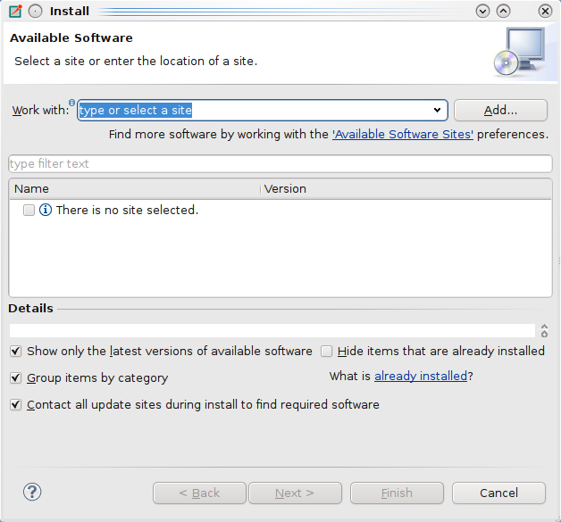
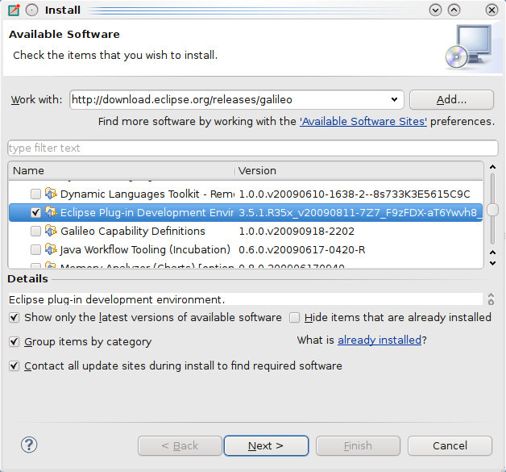
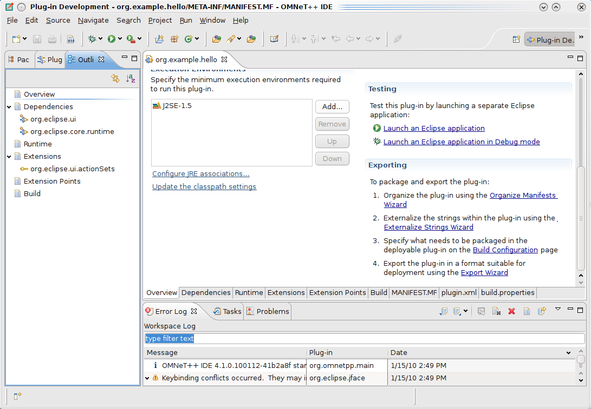
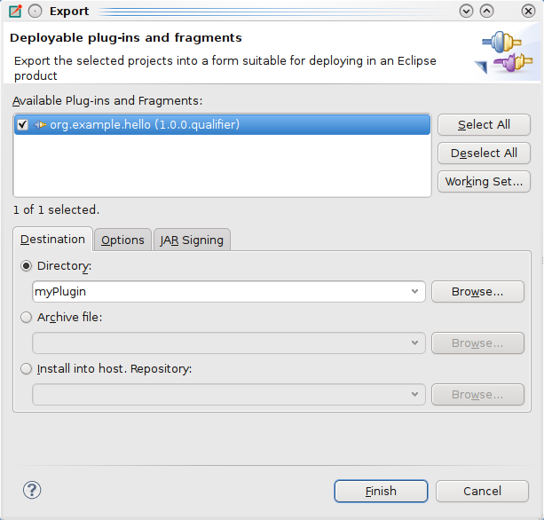
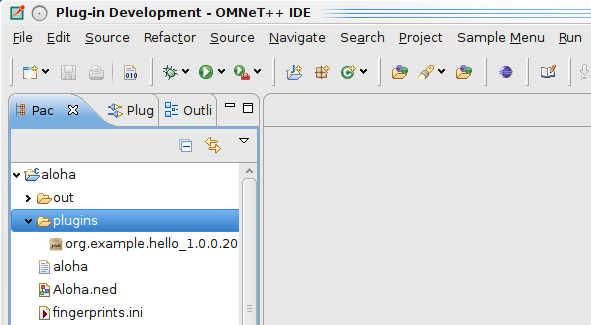
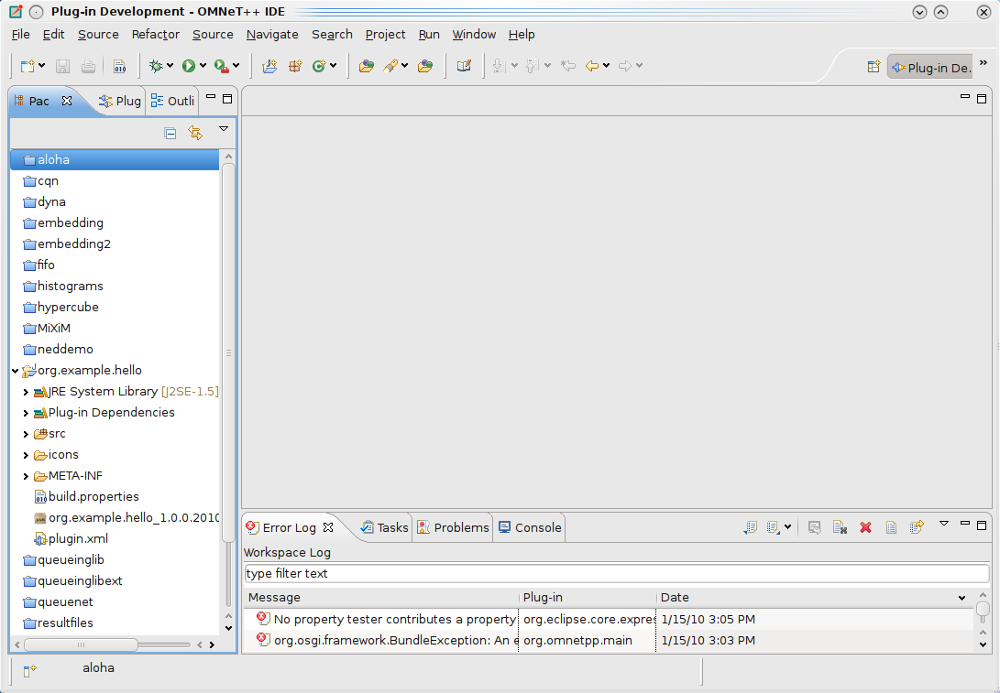

.. _ide-developers-guide:

IDE Developers Guide
====================

Introduction
------------

The |omnet++| IDE is based on the Eclipse platform which is an extensible, Java based framework. While it started as an
IDE framework only, its main goal is to be a generic integration platform. Extensions (called plug-ins) can be written
in Java language. Plug-ins can be simply added to an existing Eclipse installation, extending it with new functionality
by contributing various user interface elements into the platform user interface.

The |omnet++| IDE is in fact an Eclipse installation with some additional - simulation related - tools pre-installed:

-  The |omnet++| feature which contains all |omnet++| specific tools you use: the NED, MSG and INI file editor, simulation
   launcher, result analysis tools, sequence char view, documentation generator etc.

-  CDT (C/C++ Development Tooling - eclipse.org/cdt) - for C++ development and debugging. This feature integrates with
   the standard ``gcc`` toolchain and the ``gdb`` debugger.

-  Version control integration plug-ins for Git and Subversion.

To keep the size of |omnet++| distribution *small*, the |omnet++| IDE does not contain the tools required for Java
development. If you would like to develop your own plug-ins for the IDE, you will need to install some additional
components manually:

-  JDT (Java Development Tools) - for generic Java development. JDT contains a Java compiler and all the editors
   debuggers and tools used during Java development.

-  PDE (Plug-in Development Environment) - this component contains additional tools, API definitions and documentation
   for developing plug-ins. PDE requires the presence of JDT.

We recommend first learning the basics of Eclipse plug-in development. The best place to start is the *Platform Plug-in
Developer Guide* which can be accessed from the *Help* menu after you have installed the PDE. Of course, you will need
some Java programming experience as well.

Installing the Plug-in Development Environment
----------------------------------------------

To develop plug-ins for the IDE, you need to install the Eclipse Plug-in Development Environment (PDE) into the IDE.
This section describes how to install PDE.

Start the IDE, and select *Help -> Install New Software…* from the menu. This will bring up the *Install* dialog.

At the top of the dialog you can choose an Eclipse software repository to install software from. Select *Indigo* from
the list.

If *Indigo* is not present, add it: Click the *Add…* button, then fill in the dialog that comes up:

-  Name: ``Indigo``

-  Location: ``http://download.eclipse.org/releases/indigo``

Then click OK.

After a while, the *Install* dialog should show the list of available Eclipse packages. Select *Eclipse Plug-in
Development Environment* from the *General Purpose Tools* group, then go thought the rest of the wizard to get PDE
installed. This will install PDE’s prerequisites, most notably JDT (Java Development Tooling) as well.

When the download and the installation finished, restart the IDE.

Now the IDE is ready for plug-in development.

Creating The First Plug-in
--------------------------

Creating the Plug-in
~~~~~~~~~~~~~~~~~~~~

Once PDE is installed, we can create a small example *Hello World* plug-in. This plug-in will place a menu item on the
main menubar. Invoking the menu item will launch a simple dialog.

Choose *File --> New --> Project…* from the menu. The *New Project* wizard dialog comes up, with project type selection on
the first page. Choose *Plug-in Project* from the *Plug-in Development* group and click *Next*.

.. figure:: images/new-plugin-project.png
   :width: 60%

On the next page, enter ``org.example.hello`` for project name, then click *Next*. On the following page (*Content*),
you can just click *Next* as well. The following page allows you to choose the initial content for your project from
among several code examples. Choose *Hello, World*, then click *Finish*.

A new project named ``org.example.hello`` will be created.

The IDE will also ask you if you want to switch to the *Plug-in Development* perspective; answer *Yes*.

The project
~~~~~~~~~~~

Open the project and explore the generated files. There are two important files that are often used during plug-in
development: plugin.xml and MANIFEST.MF. They both contain metadata that describe how your plug-in should be used by the
platform.

``MANIFEST.MF`` contains basic information about your plug-in. External dependencies, name, version number etc. The
``plugin.xml`` file describes what your plug-in contributes to the platform. You should always specify your
contributions otherwise they will not appear on the user interface.

Double-click on one of the above files. This will start a form editor with several pages. Explore the possibilities.
Later you can add other plug-ins here you are depending on, or you can specify what Java packages you plan to provide to
other plug-ins. On he first page, there are useful shortcuts to export your plug-in in a deployable format (JAR file).

Of course you can have other files inside the plug-ins. You will need ``.class`` files (containing your code of course)
or image resources for icons.

Testing the Plug-in
~~~~~~~~~~~~~~~~~~~

On the *Overview* tab click the *Launch an Eclipse application* link

A new instance of Eclipse will be started containing the generated plug-in. If everything is OK you should see a *Sample
Menu* containing a *Sample Action*. When clicked, it will bring up a message dialog.

.. figure:: images/plugin-running.png
   :width: 60%

Exporting the plug-in
~~~~~~~~~~~~~~~~~~~~~

Use the *Export plug-in* link on the *Overview* page of the manifest editor.

Choose *Directory* radio button for *Destination*, specify directory name, and click [Finish]

The plug-in will be generated as <dirname>/plugins/aaaa_1.0.0.201001061910.jar

Deploying the plug-in in a project
~~~~~~~~~~~~~~~~~~~~~~~~~~~~~~~~~~

Once you have a final, exported plug-in in a deployable format you have to copy it into your Eclipse installation
(<omnetpp>/ide/dropins). You should restart the IDE so it can recognize it.

The |omnet++| IDE can load plug-ins from the workspace (projects) as well. This can be useful if you have implemented an
extension that is useful only for certain type of project. (e.g. a plug-in helping to assign IP addresses to hosts
should be active only if the INET project is open).

Open an existing |omnet++| project (e.g. aloha). Create a folder named ``plugins``.

Copy the exported plug-in file (jar) into the ``plugins`` folder.

It should be activated automatically. If you delete it, or close the project it should disappear. If you replace it with
a new version, it will be updated.

.. note::

   Not all plug-ins behave nicely; (they have to support correctly the activation and deactivation themselves). If you
   experience problems, it might be a good idea to restart the IDE.

Eclipse Plug-in Development
---------------------------

It is out of scope of this manual to teach the reader on how to write Eclipse plug-ins. There are excellent books and
on-line resources on this topic; we’ll list some of them below.

The most straightforward resources are the Eclipse manuals themselves. Open the Eclipse help system (*Help -> Help
Contents*). If PDE is installed, you will find the following manuals in it:

-  *Platform Plug-in Developer Guide*

-  *Plug-in Development Environment Guide*

Searching for *developing Eclipse plug-ins* on the web will reveal many good tutorials, overviews and other articles.

A more in-depth coverage of the topic is the book *Eclipse Plug-ins*, by Eric Clayberg and Dan Rubel. Former editions
were titled *Eclipse: Building Commercial-Quality Plug-ins*, which might be familiar to more people. The book has an
associated web site: http://www.qualityeclipse.com.

Another book that we found useful is *The Official Eclipse 3.0 FAQs* by John Arthorne and Chris Laffra. The book is now
available online: http://wiki.eclipse.org/index.php/The_Official_Eclipse_FAQs.

One can find several more good books on amazon.com about Eclipse’s architecture, services, developing plug-ins.

The rest of this Manual assumes that you are familiar with Eclipse concepts and Eclipse plug-in development in general.

|omnet++| IDE Developers Guide
------------------------------

Overview
~~~~~~~~

Developing a plug-in for the |omnet++| IDE is exactly the same how you would develop a normal Eclipse plug-in. In addition
to Eclipse API, you can access the API provided by the |omnet++| specific plug-ins. These plug-ins allow you to browse,
access and even modify the data structures representing the NED and MSG files. To access |omnet++| specific APIs, you
first have to add the appropriate |omnet++| plug-in as a dependency to your plug-in.

Double click on the ``plugin.xml`` file in your plug-in project and open the dependencies page. Add the
``org.omnetpp.ned.model`` and the ``org.omnetpp.ned.core`` plug-in as a dependency. (Also add
``org.eclipse.core.resources``. We will need it for our example later.)

.. figure:: images/ned-core-dependency.png
   :width: 60%

Accessing NED and Message Types
~~~~~~~~~~~~~~~~~~~~~~~~~~~~~~~

We will modify our earlier *Hello world* example to print out the number of NED types in all open projects. Note that
this is not the same as the number of NED files. Some NED files may contain more than one type while others contain none
at all (e.g. package.ned). We can access the internal NED model via the ``NEDResources`` class.

Open the ``SampleAction.java`` file and modify its content:

.. code-block:: java

   public void run(IAction action) {
     MessageDialog.openInformation(
       window.getShell(), "NED Info",
       "Number of NED types: "+NEDResources.getInstance().
           getNedTypesFromAllProjects().size());
   }

The parsed model of all NED files can be accessed via the ``NEDResources.getInstance()`` singleton object. The
``NEDResources`` class is the main entry point to access and manipulate the content of NED files. If you know the fully
qualified name of a type, you can obtain its type descriptor (``INedTypeInfo``) using the ``getToplevelNedType()``
method. There are numerous other ways to access and query the NED types. Check the documentation of the ``NEDResources``
and ``INedTypeInfo`` class.

Similarly, you can access information about message files using the ``MsgResources.getInstance()`` method. Check the
documentation of the ``IMsgTypeResolver`` and ``IMsgTypeInfo`` interfaces for further information.

.. note::

   You have to add the ``org.omnetpp.ned.core`` and ``org.omnetpp.ned.model`` plug-ins to the project dependencies to
   access their classes.

Accessing Projects
~~~~~~~~~~~~~~~~~~

If you want to work with projects or files in your plug-in, there are several useful classes that can help you. The
``ProjectUtils`` class from the ``org.omnetpp.common`` plug-in can be used to enumerate open or referenced projects, or
NED folders. You can add |omnet++| support to existing projects.

If you add ``org.omnetpp.common`` to your project dependencies, you can use ``CDTUtils`` to enumerate C++ source or
excluded folders. ``MakefileToools`` and ``MetaMakemake`` from ``org.omnetpp.cdt`` are used to control the Makefile
generation.

.. note::

   The source of the |omnet++| plug-ins are bundled with the IDE. You can easily access their documentation.

Extension Points
~~~~~~~~~~~~~~~~

The |omnet++| plug-ins define some extension points that can be used to change or extend the current functionality of the
IDE.

From ``org.omnetpp.common``:

-  ``org.omnetpp.common.wizard.contenttemplates`` : You can add additional content templates to the ``New File``
   wizards. You must specify the location of the template files in your project (by default it is ``templates``).

-  ``org.omnetpp.common.wizard.templatecontributors`` : You can add template variables to all of your templates. The
   plug-in must implement the ``org.omnetpp.common.wizard.IContentTemplateContributor`` interface to contribute to the
   template variables.

Wizards
^^^^^^^

New wizards can be added to IDE by implementing them directly in Java. For complicated wizards, this is the recommended
strategy. If your wizard just gathers some data from the user and then generates some file as the result, we recommend
creating template-based wizards instead, as they do not require Java language knowledge. For further info about how to
write custom wizards please read the *IDE Customization Guide*.
