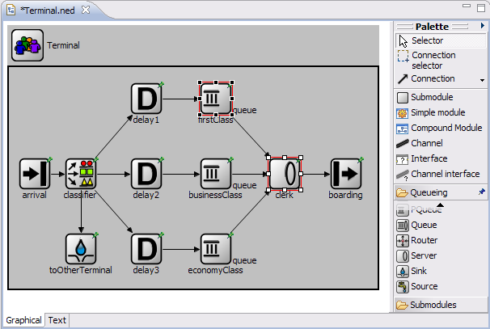
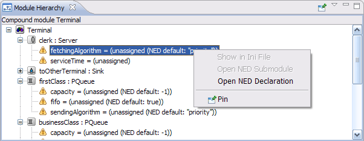
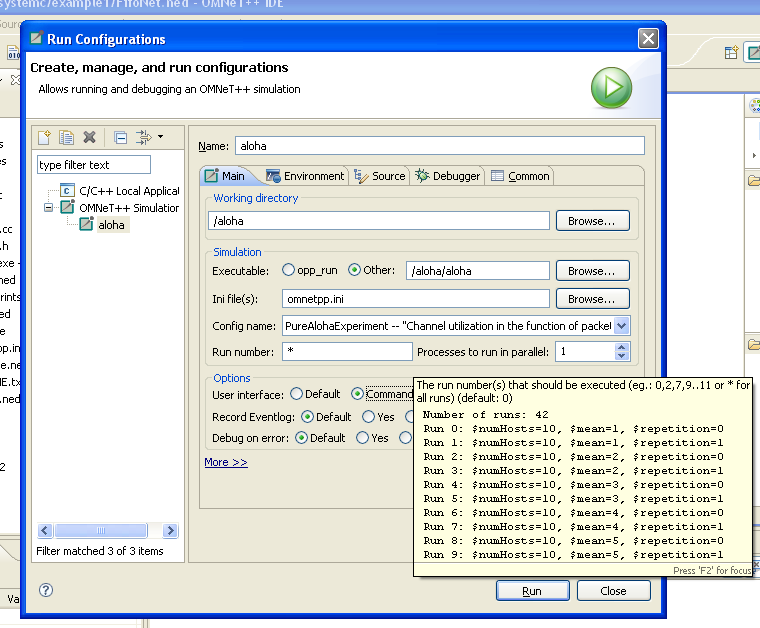
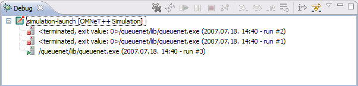
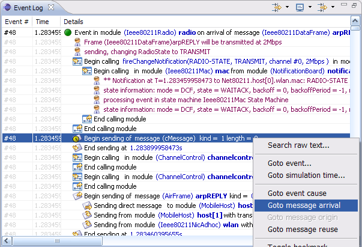
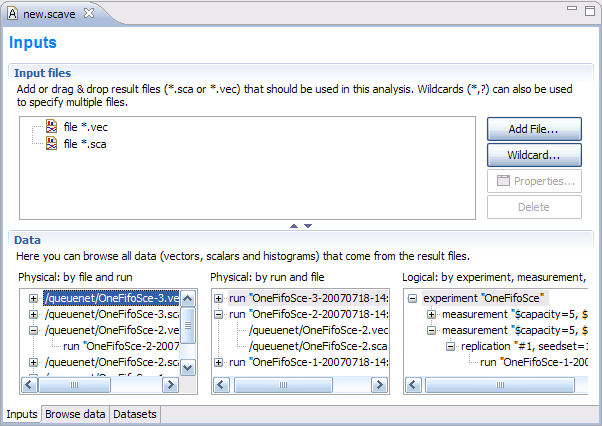
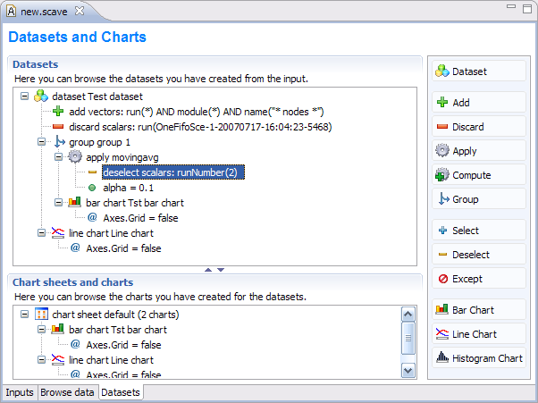
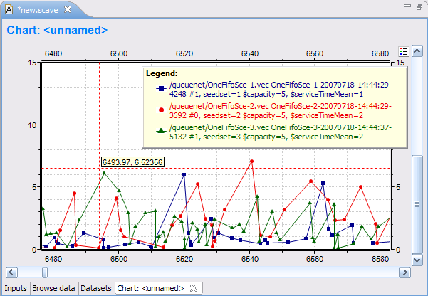
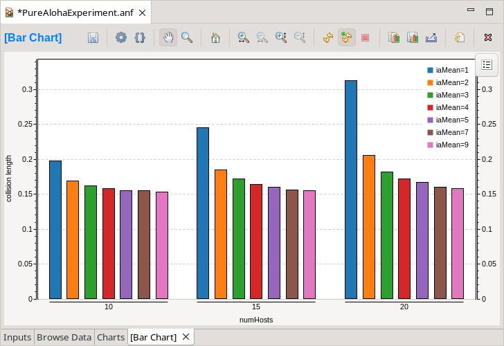
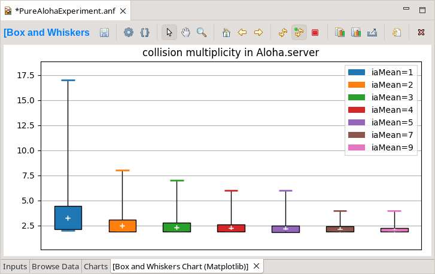

Overview of the |omnet++| IDE
=============================

Introduction
------------

The |omnet++| Integrated Development Environment is based on the Eclipse platform, and extends it with new editors, views,
wizards, and additional functionality. |omnet++| adds functionality for creating and configuring models (NED and ini
files), performing batch executions, and analyzing simulation results, while Eclipse provides C++ editing, SVN/GIT
integration, and other optional features (UML modeling, bugtracker integration, database access, etc.) via various
open-source and commercial plug-ins.

The following screenshots introduce the main components of the |omnet++| IDE.

.. figure:: pictures/img1.png

   The |omnet++| IDE, editing a NED file

The NED Editor
--------------

The NED Editor can edit NED files both graphically or in text mode, and the user can switch between the two modes at any
time, using the tabs at the bottom of the editor window.

   The NED Editor in graphical editing mode

In graphical mode, one can create compound modules, channels, and other component types. Submodules can be created using
the palette of available module types. Visual and non-visual properties can be modified in the Properties View, or by
dialogs invoked from the context menu. The editor offers many features such as unlimited undo/redo, object cloning,
constrained move and resize, alignment of objects, and zooming.

Submodules can be pinned (having a fixed position), or unpinned (auto-layout). Graphical features that can be edited are
background image, background grid, default icons (via display string inheritance), icon sizing and coloring,
transmission range, and many others.

.. figure:: pictures/img3.png

   Properties view

The Properties View lets the user edit graphical and non-graphical properties of objects. Special cell editors
facilitate selecting colors, icons, etc. Undo and redo is supported for property changes too. The Properties View is
also used with other editors like the Result Analysis editor, where it allows the user to customize charts and other
objects.

.. figure:: pictures/img4.png

   The NED Editor in source editing mode

Text mode lets the user work with the NED source directly. When hitting :kbd:`Ctrl+SPACE`, the editor offers context-aware
completion of keywords and module type, parameter, gate, and submodule names. Template proposals to insert full compound
module skeletons, submodules, various connection structures, etc. are also available. Documentation of referenced module
types can be viewed by hovering over the NED type name. The NED source is continually parsed and validated as the user
is typing, and errors are displayed in real time on the left margin. Syntax highlighting, automatic indentation, and
automatic conversion from the |omnet++| 3.x NED syntax are also provided.

.. figure:: pictures/img5.png

   Outline View

The Outline View shows the structure of NED files in both graphical and text editing mode, and allows navigation, as
well.

*Other Views.* The Module Hierarchy View and the NED Parameters View can also be used with the NED Editor (they will
display the submodule hierarchy and the parameters of the selected module or submodule) – these views will be described
with the Ini File Editor. Further related views are the Problems View (which displays errors and warnings in NED files
and other files), and Tasks View (which shows a list of all FIXME and TODO comments found in NED files and other source
files.)

The Ini File Editor
-------------------

The Ini File Editor lets the user configure simulation models for execution. It features both form-based and source
editing.

.. figure:: pictures/img6.png

   Form-based ini file editing

The Ini File editor considers all supported configuration options and offers them in several forms, organized by topics.
Descriptions and default values are displayed in tooltips, which can be made persistent for easier reading. The
structure of the ini file (sections and their inheritance tree) is also visualized and editable via drag&drop and
dialogs. Validation and content assist ( :kbd:`Ctrl+SPACE`) are also provided where needed. The editor supports unlimited
undo/redo and automatic conversion from |omnet++| 3.x ini files.

.. figure:: pictures/img7.png

   The ini file source editor

The text editor lets the user work with the ini file directly, which is more efficient for advanced users than forms.
Unlimited undo/redo, syntax coloring, and completion of configuration keys, values, and module parameter patterns (on
:kbd:`Ctrl+SPACE`) are provided. As the user types, the file is continually analyzed and errors/warnings are displayed in real
time.

The editor considers all NED declarations (simple modules, compound modules, channels, etc.) and can fully exploit this
information to provide diagnostics and assistance to the user. Looking at the *network=* configuration key, it knows the
top-level compound module NED type, and internally builds a static picture of the network by recursively enumerating the
top-level module's submodules, sub-submodules, sub-sub-submodules, etc., and continually relates this information to the
ini file contents. Thus, the editor always knows which ini file keys match which module parameters, which are the ini
file keys that are unused (will not match anything), and which module parameters are still open (i.e. have no value
assigned yet). It displays this information in tooltips, as warnings, and in various views.

.. figure:: pictures/img8.png
   :width: 60%

   The Add Missing Keys dialog

To speed up the process of creating ini files from scratch, the editor offers an *Add Missing Keys* dialog. After
clicking OK, the editor will insert ini file keys for all open NED parameters. The user will only need to supply the
values.

   Module Hierarchy View

The Module Hierarchy View displays the submodule hierarchy of the current configuration's network, together with the
module's parameters. It shows how module parameters obtain their values (from NED, by applying a NED default value, or
from the ini file). It is able to resolve simple cases where a submodule type comes from a string parameter (NED's
*like* keyword). By using the context menu, the user can go to the NED declaration of a module, submodule, parameter,
gate, or to the place where a parameter gets its value (in NED or in the ini file).

The View can be pinned to a particular editor to prevent its contents from changing when the user switches across NED
and ini file editors.

.. figure:: pictures/img10.png

   The NED Parameters View

By default, the NED Parameters View displays the table of all unassigned NED parameters in the current configuration's
network and it can be switched over to show all parameters, assigned or unassigned. For assigned parameters, it shows
how they obtain their values (from NED, by applying a NED default value, or from the ini file). The user can open the
relevant places in the NED files or the ini file. This View can also be pinned.

.. figure:: pictures/img11.png

   The Problems View

The Problems View presents errors, warnings, and info messages in NED files, ini files, and other source files in a
unified manner. Double-clicking on an item opens the corresponding file and goes to the error's location. The view's
contents can be filtered in various ways (current file, current project, all projects, by severity, etc).

*Other Views.* The Outline View displays the list of sections in the current ini file and can be used for navigation as
well.

Simulation Launcher
-------------------

The |omnet++| IDE makes it possible to run simulations directly from the integrated environment. It is possible to run a
simulation as a normal C/C++ application and perform C++ source-level debugging on it. The user can also run it as a
standalone application (under Qtenv or Cmdenv) or run batches of simulations where runs differ in module parameter
settings or random number seeds (NOTE: an Eclipse-based runtime environment [“IDEEnv”] does not exist yet; it is planned
for future releases).

   The Run dialog showing a simulation launch configuration

In the Eclipse IDE, the various ways of launching a program under development is described by launch configurations.
There are various launch configuration types (C/C++ Application, Java Application, etc.). To launch a program for the
first time, the user creates an instance of a launch configuration, fills in a form (program name, command-line
arguments, etc.), and hits the Run button. |omnet++| provides launch configuration types for simulations: one extends the
normal “C/C++ Local Application” launch type with a *Simulation* tab (for convenient editing of simulation-related
command-line options), and a standalone launch type for launching a simulation or running simulation batches. The former
can be used for C++ debugging, as well.

The dialog shows a standalone launch type for the QueueNet example simulation model. Batch simulations can be launched
by specifying more than one run number in the dialog. Ini files allow the user to define various scenarios iterating
over a list of values for certain NED parameters, and/or do multiple runs with different seeds. The launch dialog helps
the user select the desired run numbers by showing which runs correspond to which parameters and seed settings.

Multi-processor or multi-core computers can be exploited by specifying that more than one process may be launched (i.e.
may be running) at a time.

.. figure:: pictures/img13.png

   Progress View

The Progress View reports the status of simulation execution when you have a long-running simulation, or you are
executing several runs in a batch. It is possible to cancel the whole batch operation with a single click, if necessary.
Simulations run in separate processes that do not block the IDE, so users can keep working while their simulations run
in the background. In the above screenshot, the number of processes to run in parallel was set to 2; run #1 has already
terminated (and is no longer shown), run #3 has already launched, and run #2 is still running.

.. figure:: pictures/img14.png

   Console View

Each running process sends its output to a separate console buffer within the Console View, so the user can review the
output after a simulation has finished. One can switch between console buffers using the Console View's menu or toolbar,
or by double-clicking on a process in the Debug View.

   The Debug View showing three runs in a simulation batch

The Debug View is another one of Eclipse's standard Views, but it is not only useful for debugging. While the Progress
View only shows currently executing processes, the Debug View displays the ones already terminated, as well, together
with their exit codes. Processes are marked with run numbers and launch times for easier identification. Double-clicking
an item reveals the process output in the Console View.

Sequence Chart
--------------

The |omnet++| simulation kernel is capable of logging various events during simulation: scheduling and canceling
self-messages, sending messages, display changes, module and connection creation and deletion, user log messages, etc.
The result is an event log file which contains detailed information of the simulation, and later can be used for various
purposes, such as visualizing message exchanges among modules on a sequence chart. The file format is line-based text to
facilitate processing by third party tools.

.. figure:: pictures/img16.png

   A Sequence Chart showing ARP on a wireless network

An event log can be visualized with the Sequence Chart in the IDE. On the Sequence Chart, events are represented as
nodes, and message send/schedule/reuse operations as arrows. The chart can be filtered according to modules, message
types, and various other criteria. The chart can also be filtered according to the causes/consequences of a particular
event (this works by following message arrows backward and forward in simulation time). The chart timeline can be
displayed in various modes, such as linear (simulation time), compact (non-linear), and event number-based. Other
features include sorting of module axes, displaying state vector data on axes (using output vector files), zooming, and
special navigation options (bookmarks, zoom to message send, follow message send), and exporting the chart in SVG
format.

Both the Event Log Table and the Sequence Chart are capable of efficiently displaying event log files of several
gigabytes without requiring large amounts of memory.

   The Event Log View

The Event Log Table displays the content of an event log file recorded during a simulation. It supports raw and
descriptive notations, line-based filtering for event log entry types and various parameters, search for free text,
bookmarks, and special navigation options such as "go to simulation time" or message arrival. The Event Log Table
supports the same filtering as the Sequence Chart.

Scave (Result Analysis)
-----------------------

Scave is the result analysis tool of |omnet++| and its task is to help the user process and visualize simulation results
saved into vector and scalar files. Scave is designed so that the user can work equally well on the output of a single
simulation run (one or two files) and the result of simulation batches (which may be several hundred files, possibly in
multiple directories). Ad-hoc browsing of the data is supported in addition to systematic and repeatable processing.
With the latter, all processing and charts are stored as “recipes”. For example, if simulations need to be re-run due to
a model bug or misconfiguration, existing charts do not need to be drawn all over again. Simply replacing the old result
files with the new ones will result in the charts being automatically displayed with the new data.

Scave is implemented as a multi-page editor. What the editor edits is the “recipe,” which includes what files to take as
inputs, what data to select from them, what (optional) processing to apply, and what kind of charts to create from them.
The pages (tabs) of the editor roughly correspond to these steps. You will see that Scave is much more than just a union
of the |omnet++| 3.x Scalars and Plove tools.

   Specifying input files for data analysis

The first page displays the result files that serve as input for the analysis. The upper half specifies what files to
select, by explicit filenames or by wildcards. The lower half shows what files actually matched the input specification
and what runs they contain. Note that |omnet++| result files contain a unique run ID and several metadata annotations in
addition to the actual recorded data.  The third tree organizes simulation runs according to their
experiment—measurement—replication labels.

The underlying assumption is that users will organize their simulation-based research into various “experiments”. An
experiment will consist of several “measurements”, which are typically (but not necessarily) simulations done with the
same model but with different parameter settings; that is, the user will explore the parameter space with several
simulation runs. To gain statistical confidence in the results, each measurement will be possibly repeated several times
with different random number seeds. It is easy to set up such scenarios with the improved ini files of |omnet++|. Then,
the experiment-measurement-replication labels will be assigned more-or-less automatically – please refer to the Inifile
document (“Configuring Simulations in |omnet++|”) for more discussion.

.. figure:: pictures/img19.png

   Browsing vector and scalar data generated by the simulation

The second page displays results (vectors, scalars, and histograms) from all files in tables and lets the user browse
them. Results can be sorted and filtered. Simple filtering is possible with combo boxes, or when that is not enough, the
user can write arbitrarily complex filters using a generic pattern matching expression language. Selected or filtered
data can be immediately plotted, or remembered in named datasets *for further processing*.

   Defining datasets to be analyzed

It is possible to define reusable datasets that are basically recipes on how to select and process data received from
the simulation. You can add selection and data processing nodes to a dataset. Chart drawing is possible at any point in
the processing tree.

   A Line Chart

Line charts are typically drawn from time-series data stored in vector files. Pre-processing of the data is possible in
the dataset. The line chart component can be configured freely to display the vector data according to your needs.

   A Bar Chart

Bar charts are created from scalar results and histograms. Relevant data can be grouped and displayed via the Bar chart
component. Colors, chart type, and other display attributes can be set on the component.

   Output Vector View

The Output Vector View can be used to inspect the raw numerical data when required. It can show the original data read
from the vector file, or the result of a computation. The user can select a point on the line chart or a vector in the
Dataset View and its content will be displayed.

.. figure:: pictures/img24.png

   Dataset View

The Dataset View is used to show the result items contained in the dataset. The content of the view corresponds to the
state of the dataset after the selected processing is performed.
