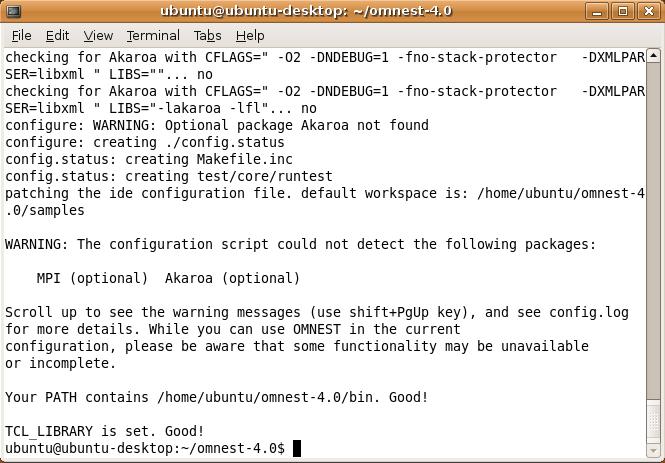
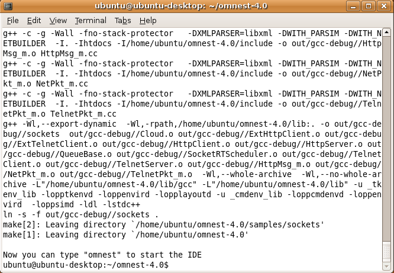
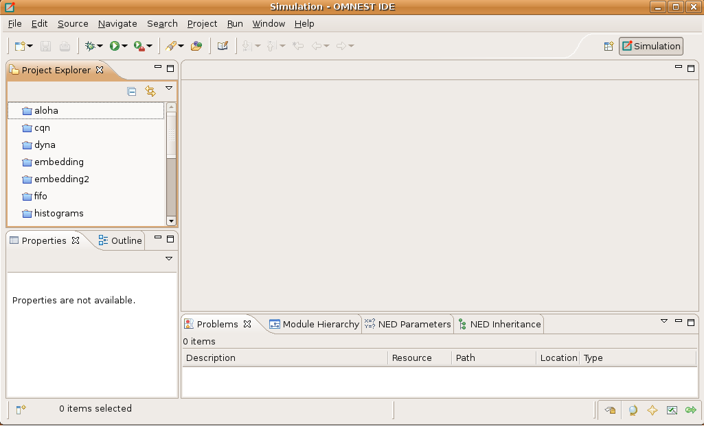

Generic Unix
============

Introduction
------------

This chapter provides additional information for installing |omnet++| on Unix-like operating systems not specifically
covered by this Installation Guide. The list includes FreeBSD, Solaris, and Linux distributions not covered in other
chapters.

.. note::

   In addition to Windows and macOS, the Simulation IDE will only work on Linux x86/arm 64-bit platforms. Other operating
   systems (FreeBSD, Solaris, etc.) and architectures may still be used as simulation platforms, without the IDE.

Dependencies
------------

The following packages are required for |omnet++| to work:

build-essential, GNU make, gcc, g++, bison (3.0+), flex, perl, python3, xdg-utils
   These packages are needed for compiling |omnet++| and simulation models, and also for certain |omnet++| tools to
   work.

It is also recommended to install the *clang* and *lld* package as they provide faster compilation and linking.

.. note::

   You may opt to use gcc instead of the clang compiler and/or use the system default linker instead of *lld* by setting
   the ``PREFER_CLANG`` and ``PREFER_LLD`` variables in the *configure.user* file. If you do not need the 3D
   visualization capabilities, you can disable them in the *configure.user* file, too.

.. warning::
   
   The IDE requires GLIBC 2.28 version or later, so you will need at least Debian 10, RedHat 8 or Ubuntu 18.10 to run the IDE.

The following packages are strongly recommended, because their absence results in severe feature loss:

Qt 5.9 or later
   Required by the Qtenv simulation runtime environment. You need the *devel* packages that include header files as
   well.

OpenSceneGraph (3.4+) and osgEarth (2.9+)
   These packages will enable 3D visualization in Qtenv. You need the *devel* packages that include header files as
   well.

The following packages are required if you want to take advantage of some advanced |omnet++| features:

LibXML2
   LibXML2 is needed for |omnet++| to be able to DTD validate an XML file. The *devel* packages (that include the header
   files) are needed.

GraphViz, Doxygen
   These packages are used by the NED documentation generation feature of the IDE. When they are missing, documentation
   will have less content.

MPI
   openmpi or some other MPI implementation is required to support parallel simulation execution.

Akaroa
   Implements Multiple Replications In Parallel (MRIP). Akaroa can be downloaded from the project’s website.

The exact names of these packages may differ across distributions.

Determining Package Names
-------------------------

If you have a distro unrelated to the ones covered in this Installation Guide, you need to figure out what is the
established way of installing packages on your system, and what are the names of the packages you need.

Qt
~~

If your platform does not have suitable Qt packages, you may still use |omnet++| to run simulations from the command
line. To disable the Qtenv runtime environment, use:

.. code::

   $ ./configure WITH_QTENV=no

This will prevent the build system to link with Qt libraries. It is also recommended if you are installing |omnet++|
from a remote terminal session.

MPI
~~~

|omnet++| is not sensitive to the particular MPI implementation. You may use OpenMPI, or any other standards-compliant
MPI package.

Downloading and Unpacking
-------------------------

Download |omnet++| from |downloadsite|. Make sure you select to download
the generic archive, ``|omnetpp|-|version|-core.tgz``.

Copy the archive to the directory where you want to install it. This is usually your home directory, ``/home/<you>``.
Open a terminal, and extract the archive using the following command:

.. code::

   $ tar xvfz |omnetpp|-|version|-core.tgz

This will create an ``|omnetpp|-|version|`` subdirectory with the |omnet++| files in it.

Environment Variables
---------------------

In general |omnet++| requires that certain environment variables are set and the
``|omnetpp|-|version|/bin`` directory is in the PATH. Source the ``setenv``
script to set up all these variables.

.. code::

  $ cd |omnetpp|-|version|
  $ source setenv

To set the environment variables permanently, edit ``.profile`` or ``.zprofile`` in your home directory and
add a line something like this:

.. code::

   [ -f "$HOME/|omnetpp|-|version|/setenv" ] && source "$HOME/|omnetpp|-|version|/setenv"

.. note::

   If you use a shell other than bash, consult the man page of that shell to find out which startup file to edit, and
   how to set and export variables.

Configuring and Building |omnet++|
----------------------------------

In the top-level |omnet++| directory, type:

.. code::

   $ ./configure

The ``configure`` script detects installed software and configuration of your system. It writes the results into the
``Makefile.inc`` file, which will be read by the makefiles during the build process.

   Configuring |omnet++|

.. note::

   If there is an error during ``configure``, the output may give hints about what went wrong. Scroll up to see the
   messages. (Use Shift+PgUp; you may need to increase the scrollback buffer size of the terminal and re-run
   ``./configure``.) The script also writes a very detailed log of its operation into ``config.log`` to help track down
   errors. Since ``config.log`` is very long, it is recommended that you open it in an editor and search for phrases
   like *error* or the name of the package associated with the problem.

   The ``configure`` script tries to build and run small test programs that are using specific libraries or features of
   the system. You can check the ``config.log`` file to see which test program has failed and why. In most cases the
   problem is that the script cannot figure out the location of a specific library. Specifying the include file or
   library location in the ``configure.user`` file and then re-running the ``configure`` script usually solves the
   problem.

When ``./configure`` has finished, you can compile |omnet++|. Type in the terminal:

.. code::

   $ make

   Building |omnet++|

.. tip::

   To take advantage of multiple processor cores, add the ``-j8`` option (for 8 cores) to the ``make`` command line.

.. note::

   The build process will not write anything outside its directory, so no special privileges are needed.

.. tip::

   The make command will seemingly compile everything twice. This is because both debug and optimized versions of the
   libraries are built. If you only want to build one set of the libraries, specify ``MODE=debug`` or ``MODE=release``:

Verifying the Installation
--------------------------

You can now verify that the sample simulations run correctly. For example, the aloha simulation is started by entering
the following commands:

.. code::

   $ cd samples/aloha
   $ ./aloha

By default, the samples will run using the Qtenv environment. You should see nice gui windows and dialogs.

Starting the IDE
----------------

.. note::

   The IDE is supported only on 64-bit versions of Windows, macOS and Linux.

You can run the IDE by typing the following command in the terminal:

.. code::

   $ |omnetpp|

   The Simulation IDE

If you would like to be able to access the IDE from the application launcher or via a desktop shortcut, run one or both
of the commands below:

.. code::

   $ make install-menu-item
   $ make install-desktop-icon

.. note::

   The above commands assume that your system has the ``xdg`` commands, which most modern distributions do.

Optional Packages
-----------------

Akaroa
~~~~~~

If you wish to use Akaroa, it must be downloaded, compiled, and installed manually before installing |omnet++|.

.. note::

   As of version 2.7.9, Akaroa only supports Linux and Solaris.

Download Akaroa 2.7.9 from: http://www.cosc.canterbury.ac.nz/research/RG/net_sim/simulation_group/akaroa/download.chtml

Extract it into a temporary directory:

.. code::

   $ tar xfz akaroa-2.7.9.tar.gz

Configure, build and install the Akaroa library. By default, it will be installed into the ``/usr/local/akaroa``
directory.

.. code::

   $ ./configure
   $ make
   $ sudo make install

Go to the |omnet++| directory, and (re-)run the ``configure`` script. Akaroa will be automatically detected if you
installed it to the default location.

.. ifconfig:: what=='omnest'

   SystemC
   ~~~~~~~

   To enable SystemC integration, add SYSTEMC=yes to the configure.user file, run *configure* and then rebuild your
   project. You can check the systemc examples in the samples/systemc-embedding directory.
