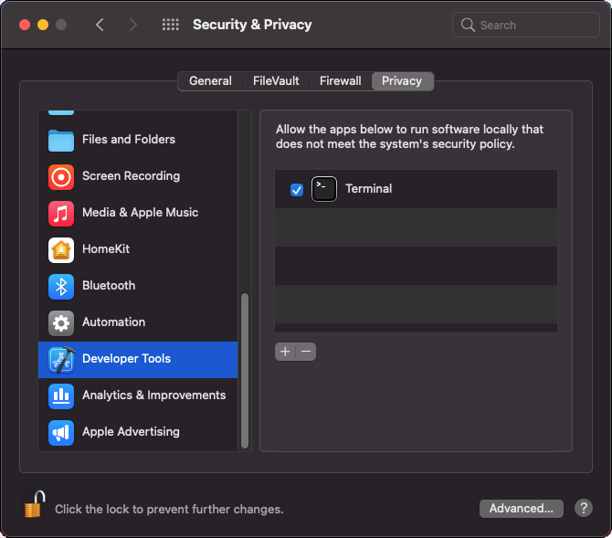

macOS
=====

Supported Releases
------------------

This chapter provides additional information for installing |omnet++| on macOS.

The following releases are covered:

-  macOS 11.x

Installing the Prerequisite Packages
------------------------------------

Install the command line developer tools for macOS (compiler, debugger, etc.)

.. code::

   $ xcode-select --install

Installing additional packages will enable more functionality in |omnet++|; see the *Additional packages* section at the
end of this chapter.

Enabling Development Mode in Terminal
-------------------------------------

MacOS has a strict default security policy preventing the execution of unsigned code. This behavior often
interferes with the development process so you must explicitly allow running unsigned code from a Terminal.
On the *System Preferences / Security and Privacy / Privacy* tab, select *Development Tools* on the left side,
unlock the panel with the lock icon on the bottom left and select the Terminal app on the right side to
override the default security policy for the Terminal app.

   Enable Running Unsigned Code in Terminal

.. note::

   If you do not see the *Terminal* item in the *Development Tools* section, you should execute
   `spctl developer-mode enable-terminal` in the terminal and then restart *System Preferences*
   applet.

Debugging Unsigned Code
-----------------------

Even if you have enabled development mode in the terminal, missing code signatures will still
cause problems during debugging, because the debugged process is started by the IDE, not the terminal.
To be able to debug, you must disable code signature checking globally by typing:

.. code::

   $ sudo spctl --master-disable

After issuing the above command go to *System Preferences / Security and Privacy / General* and
select *Any* at the bottom of the dialog. After restarting your terminal application, you will be 
able to debug your unsigned simulation models.

Running |omnet++| on Apple Silicon
----------------------------------

|omnet++| does not currently support the Apple M1 processor natively, but you can run the x86_64 version using
the Rosetta 2 emulator. To run |omnet++| under emulation, open a terminal window, then execute:

.. code::

   $ arch -x86_64 /bin/zsh --login

After this, follow the normal installation instructions and be sure to execute all commands in this terminal.

.. note::
   
   The above command may graphically prompt you to allow the installation of the emulator component.
   You can also manually trigger the installation from the command line using the following command:
   `softwareupdate --install-rosetta --agree-to-license`.   
   
.. note::

   Typing `source setenv` will launch the x86_64 emulator automatically for you. Make sure to execute
   all commands from that terminal.

Additional Steps Required on macOS to Use the Debugger
------------------------------------------------------

The Command Line Developer Tools package contains the ``lldb`` debugger. |omnet++| 6.0 and later contains the necessary
driver binary (``lldbmi2``) that allows ``lldb`` to be used in the |omnet++| IDE. If you are upgrading from an earlier
version of |omnet++|, be sure to delete and recreate all Launch Configurations in the IDE. This is required because
older Launch Configurations were using ``gdb`` as the debugger, but the new IDE uses ``lldbmi2`` as the debugger
executable.

On the first debug session the OS may prompt you to allow debugging with the ``lldb`` executable.

Downloading and Unpacking |omnet++|
-----------------------------------

Download |omnet++| from |downloadsite|. Make sure you select to download
the macOS specific archive, ``|omnetpp|-|version|-macos-x86_64.tgz``.

Copy the archive to the directory where you want to install it. This is usually your home directory, ``/Users/<you>``.
Open a terminal, and extract the archive using the following command:

.. code::

   $ tar zxvf |omnetpp|-|version|-macos-x86_64.tgz

A subdirectory called ``|omnetpp|-|version|`` will be created, containing the simulator files.

Alternatively, you can also unpack the archive using Finder.

.. note::

   The Terminal can be found in the Applications / Utilities folder.

Environment Variables
---------------------

In general |omnet++| requires that certain environment variables are set and the
``|omnetpp|-|version|/bin`` directory is in the PATH. Source the ``setenv`` 
script to set up all these variables. 

.. code::

  $ cd |omnetpp|-|version|
  $ source setenv

To set the environment variables permanently, edit ``.profile``, ``.zprofile`` or ``.zshenv`` in your home directory and
add a line something like this:
  
.. code::
  
   [ -f "$HOME/|omnetpp|-|version|/setenv" ] && source "$HOME/|omnetpp|-|version|/setenv"
  

Configuring and Building |omnet++|
----------------------------------

Check ``configure.user`` to make sure it contains the settings you need. In most cases you don’t need to change anything
in it.

In the top-level |omnet++| directory, type:

.. code::

   $ ./configure

The ``configure`` script detects installed software and configuration of your system. It writes the results into the
``Makefile.inc`` file, which will be read by the makefiles during the build process.

.. note::

   If there is an error during ``configure``, the output may give hints about what went wrong. Scroll up to see the
   messages. (You may need to increase the scrollback buffer size of the terminal and re-run ``./configure``.) The
   script also writes a very detailed log of its operation into ``config.log`` to help track down errors. Since
   ``config.log`` is very long, it is recommended that you open it in an editor and search for phrases like *error* or
   the name of the package associated with the problem.

When ``./configure`` has finished, you can compile |omnet++|. Type in the terminal:

.. code::

   $ make

.. tip::

   To take advantage of multiple processor cores, add the ``-j4`` option to the ``make`` command line.

.. note::

   The build process will not write anything outside its directory, so no special privileges are needed.

.. tip::

   The make command will seemingly compile everything twice. This is because both debug and optimized versions of the
   libraries are built. If you only want to build one set of the libraries, specify ``MODE=debug`` or ``MODE=release``:

Verifying the Installation
--------------------------

You can now verify that the sample simulations run correctly. For example, the aloha simulation is started by entering
the following commands:

.. code::

   $ cd samples/aloha
   $ ./aloha

By default, the samples will run using the Qtenv environment. You should see nice gui windows and dialogs.

Starting the IDE
----------------

|omnet++| comes with an Eclipse-based simulation IDE.

Start the IDE by typing:

.. code::

   $ |omnetpp|

If you would like to be able to launch the IDE via Applications, the Dock or a desktop shortcut, do the following: open
the ``|omnetpp|-|version|`` folder in Finder, go into the ``ide`` subfolder, create an alias for the |omnetpp| program
there (right-click, *Make Alias*), and drag the new alias into the Applications folder, onto the Dock, or onto the
desktop.

Alternatively, run one or both of the commands below:

.. code::

   $ make install-menu-item
   $ make install-desktop-icon

which will do roughly the same.

Using the IDE
-------------

When you try to build a project in the IDE, you may get the following warning message:

   Toolchain "…" is not supported on this platform or installation. Please go to the Project menu, and activate a
   different build configuration. (You may need to switch to the C/C++ perspective first, so that the required menu
   items appear in the Project menu.)

If you encounter this message, choose *Project > Properties > C/C++ Build > Tool Chain Editor > Current toolchain >
GCC for |omnet++|*.

The IDE is documented in detail in the *User Guide*.

Reconfiguring the Libraries
---------------------------

If you need to recompile the |omnet++| components with different flags (e.g. different optimization), then change the
top-level |omnet++| directory, edit ``configure.user`` accordingly, then type:

.. code::

   $ ./configure
   $ make clean
   $ make

.. tip::

   To take advantage of multiple processor cores, add the ``-j4`` option to the ``make`` command line.

If you want to recompile just a single library, then change to the directory of the library (e.g. ``cd src/sim``) and
type:

.. code::

   $ make clean
   $ make

By default, libraries are compiled in both debug and release mode. If you want to make release or debug builds only,
use:

.. code::

   $ make MODE=release

or

.. code::

   $ make MODE=debug

By default, shared libraries will be created. If you want to build static libraries, set ``SHARED_LIBS=no`` in
``configure.user`` and re-configure your project.

.. note::

   The built libraries and programs are immediately copied to the ``lib/`` and ``bin/`` subdirectories.

Additional Packages
-------------------

OpenMPI
~~~~~~~

MacOS does not come with OpenMPI, so you must install it manually. You can install it from the Homebrew repo
(http://brew.sh) by typing ``brew install open-mpi``. In this case, you have to manually set the MPI_CFLAGS and MPI_LIBS
variables in ``configure.user`` and re-run ``./configure``.

Akaroa
~~~~~~

Akaroa 2.7.9, which is the latest version at the time of writing, does not support macOS. You may try to port it using
the porting guide from the Akaroa distribution.

.. ifconfig:: what=='omnest'

   SystemC
   ~~~~~~~

   SystemC integration is not available on macOS because the bundled SystemC reference implementation does not currently
   support macOS.
