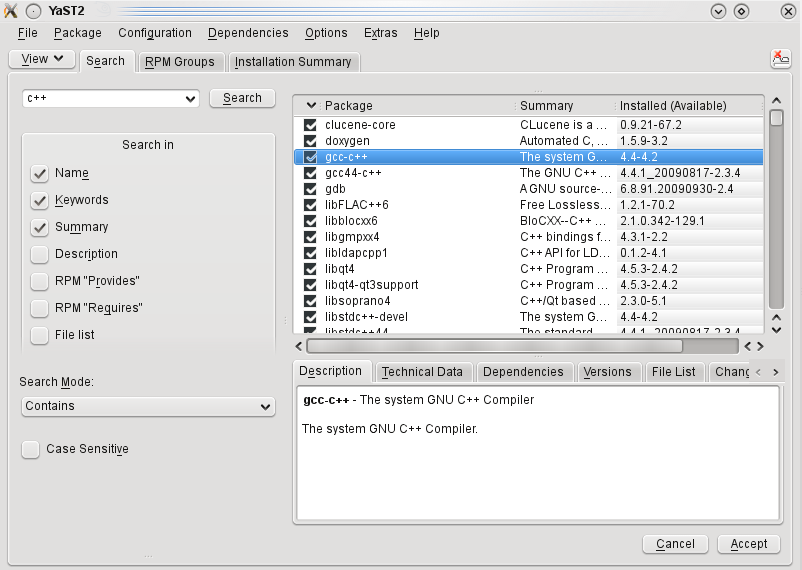

OpenSUSE
========

Supported Releases
------------------

This chapter provides additional information for installing |omnet++| on openSUSE installations. The overall
installation procedure is described in the *Linux* chapter.

The following openSUSE release is covered:

-  openSUSE Leap 15.3

It was tested on the following architectures:

-  Intel 64-bit

Opening a Terminal
------------------

Open the Search bar, and type *Terminal*.

Installing the Prerequisite Packages
------------------------------------

You can perform the installation using the graphical user interface or from the terminal, whichever you prefer.

Command-Line Installation
~~~~~~~~~~~~~~~~~~~~~~~~~

To install the required packages, type in the terminal:

.. code::

   $ sudo zypper install make gcc gcc-c++ clang lld bison flex perl \
       python3 python3-pip libqt5-qtbase-devel libxml2-devel zlib-devel \
       doxygen graphviz xdg-utils
   $ python3 -m pip install --user --upgrade numpy pandas matplotlib scipy \
       seaborn posix_ipc

.. note::

   You may opt to use gcc instead of the clang compiler and/or use the system default linker instead of *lld* by setting
   the ``PREFER_CLANG`` and ``PREFER_LLD`` variables in the *configure.user* file. In this case, you don’t have to
   install the ``clang`` and ``lld`` packages. If you do not need the 3D visualization capabilities, you can disable
   them in the *configure.user* file, too.

To use 3D visualization support in Qtenv (recommended), you should install the OpenSceneGraph-devel (3.2 or later) and
osgEarth-devel (2.7 or later) packages. These packages are not available from the official RedHat repository so you may
need to get them from different sources (e.g. rpmfind.net).

To enable the optional parallel simulation support you will need to install the MPI package:

.. code::

   $ sudo zypper install openmpi-devel

Note that *openmpi* will not be available by default, first you need to log out and log in again, or source your
``.profile`` script:

.. code::

   $ . ~/.profile

Graphical Installation
~~~~~~~~~~~~~~~~~~~~~~

The graphical installer can be launched by opening the Search bar and typing *Software Management*.

   Yast Software Management

Search for the following packages in the list. Select the checkboxes in front of the names, and pick the latest version
of each package.

The packages:

-  make, gcc, gcc-c++, clang, lld, bison, flex, perl, libqt5-qtbase-devel, libxml2-devel, zlib-devel,
   xdg-utils, doxygen, graphviz, openmpi-devel

Click *Accept*, then follow the instructions.
