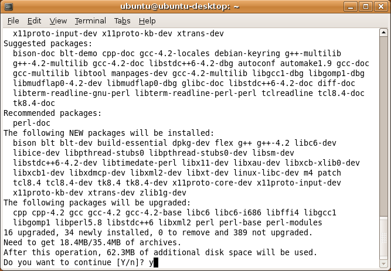

Ubuntu
======

Supported Releases
------------------

This chapter provides additional information for installing |omnet++| on Ubuntu Linux installations. The overall
installation procedure is described in the *Linux* chapter.

The following Ubuntu releases are covered:

-  Ubuntu 22.04 LTS or 24.04 LTS

The instructions below assume that you use the default desktop and the bash shell. If you use another desktop
environment or shell, you may need to adjust the instructions accordingly.

Opening a Terminal
------------------

Type *terminal* in your program launcher and click on the Terminal icon.

Installing the Prerequisite Packages
------------------------------------

You can perform the installation using the graphical user interface or from the terminal, whichever you prefer.

Command-Line Installation
~~~~~~~~~~~~~~~~~~~~~~~~~

Before starting the installation, refresh the database of available packages. Type in the terminal:

.. code::

   $ sudo apt-get update

To install the required packages, change into the root of the |omnet++| installation 
and type in the terminal:

.. code::

   $ sudo apt-get install build-essential clang lld gdb bison flex perl \
       python3 python3-pip libpython3-dev qtbase5-dev qtchooser qt5-qmake qtbase5-dev-tools \
       libqt5opengl5-dev libxml2-dev zlib1g-dev doxygen graphviz \
       libwebkit2gtk-4.1-0 xdg-utils libdw-dev
   $ python3 -m venv .venv && source .venv/bin/activate
   $ python3 -m pip install -r python/requirements.txt

To use Qtenv with 3D visualization support, install the development packages for OpenSceneGraph (3.4 or later) and the
osgEarth (2.9 or later) packages. (You may need to enable the *Universe* software repository in Software Sources.
and also enable `WITH_OSGEARTH` in `configure.user`.)

.. code::

   $ sudo apt-get install openscenegraph-plugin-osgearth libosgearth-dev

.. warning::

   Ubuntu 22.04 no longer provides the `libosgearth` package so osgEarth must be installed
   from sources. OpenSceneGraph can still be installed using
   `sudo apt-get install libopenscenegraph-dev`.

.. note::

   You may opt to use gcc instead of the clang compiler and/or use the system default linker instead of *lld* by setting
   the ``PREFER_CLANG`` and ``PREFER_LLD`` variables in the *configure.user* file. In this case, you don’t have to
   install the ``clang`` and ``lld`` packages. If you do not need the 3D visualization capabilities, you can disable
   them in the *configure.user* file, too.

To enable the optional parallel simulation support you will need to install the MPI packages:

.. code::

   $ sudo apt-get install mpi-default-dev

At the confirmation questions (*Do you want to continue? [Y/N]*), answer *Y*.

   Command-Line Package Installation

Post-Installation Steps
~~~~~~~~~~~~~~~~~~~~~~~

Setting Up Debugging
^^^^^^^^^^^^^^^^^^^^

By default, Ubuntu does not allow ptracing of non-child processes by non-root users. That is, if you want to be able to
debug simulation processes by attaching to them with a debugger, or similar, you want to be able to use |omnet++|
just-in-time debugging (``debugger-attach-on-startup`` and ``debugger-attach-on-error`` configuration options), you need
to explicitly enable them.

To temporarily allow ptracing non-child processes, enter the following command:

.. code::

   $ echo 0 | sudo tee /proc/sys/kernel/yama/ptrace_scope

To permanently allow it, edit ``/etc/sysctl.d/10-ptrace.conf`` and change the line:

.. code::

   kernel.yama.ptrace_scope = 1

to read

.. code::

   kernel.yama.ptrace_scope = 0
