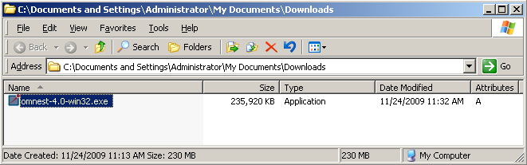
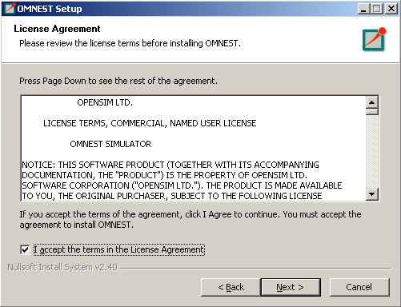
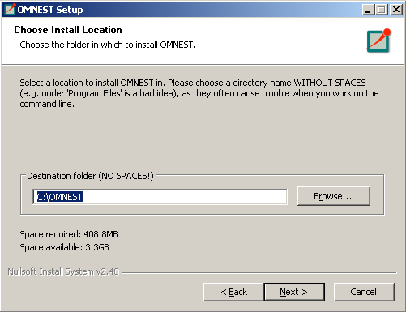
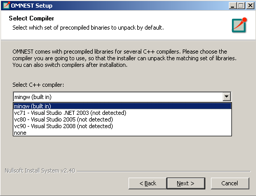
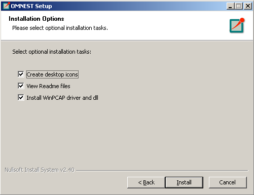
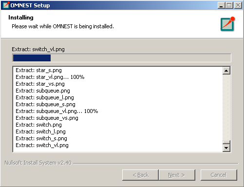

:orphan:

Windows - Using the Installer
=============================

Supported Windows Versions
--------------------------

|omnet++| supports 64-bit versions of Windows.

Pre-installation Steps
----------------------

Download ``|omnetpp|-|version|-win64.exe`` from |downloadsite|.

.. note::

   The MinGW GCC and Clang compilers are bundled with |omnet++|. You do not need to install any additional compiler to
   work with |omnet++|. These comilers use the industry standard Itanium C++ ABI
   (http://itanium-cxx-abi.github.io/cxx-abi/. If you would like to use Microsoft ABI compliant compilers from *MS
   Visual Studio* or *MS Build Tools*, you should install *MSVC v142 - VS 2019 C++ x64/x86 build tools* (from Build
   Tools 2019 or Visual Studio 2019) along with the *Microsoft Windows 10 SDK* and the *C++ Clang tools for Windows
   (9.0.0 - x64/x86)* component, before installing |omnet++|.

Installing |omnet++|
--------------------

Find the downloaded installation file using Windows Explorer, and double-click the file. This will start the
installation process.

   Starting the installer

To start the installation, accept the Licensing agreements:

   License agreement

Select an installation target directory. Please make sure that the installation path does not contain spaces.

   Selecting the installation directory

On the next page you have to specify which compiler you intend to use with |omnet++|. This can be the bundled MinGW GCC
compiler (recommended), or the Clang compiler from Microsoft Visual Studio/MS Build Tools 2019. If you do not install
any pre-built binary packages (none), you have to compile |omnet++| manually after the installation has finished.

   Compiler selection

On the last page, you can optionally create program launcher icons for your desktop, too.

   Installation options

After this step the installation process starts, and all files required by |omnet++| will be copied to the installation
folder.

   Installation options

Finally, a new Start Menu folder is created (along with desktop shortcuts). You can start the *|omnet++| Shell* or the
*|omnet++| IDE* by clicking on the icons.

.. tip::

   If you want to work from the command line, use the provided *|omnet++| Shell*. This shell sets all environment
   variables and the path necessary to run |omnet++| simulations.

Using the IDE
-------------

Once the installation has finished, you can start using |omnet++| by launching the IDE. The IDE can be launched with the
corresponding Start Menu or desktop shortcut, or by typing ``|omnetpp|`` at the |omnet++| Shell prompt.

In the IDE, each simulation example is a separate project. To build an example, open its project using the context menu
(right-click, *Open Project*), and click the *Run* button on the toolbar. To rebuild the example, first make sure that
the correct configuration is selected (context menu, *Build Configurations* > *Set Active*), then choose *Clean Project*
and *Build Project* from the context menu.

The IDE is documented in detail in the *User Guide*.

Using |omnet++| with the MinGW GCC Compiler
-------------------------------------------

The bundled MinGW GCC compiler is preconfigured for |omnet++|. Note that only the bundled version of MinGW has been
tested and is supported with |omnet++|.

If you have installed the pre-compiled binary package for the MinGW compiler, make sure that the ``<installdir>/bin``
and ``<installdir>/lib`` directories contain the correct executables and libraries. You should see ``libopp*.dll`` files
in the ``<installdir>/bin`` directory and similarly named ``*.a`` files in ``<installdir>/lib``. If you do not see them,
check the "Switching Compilers" or the "Recompiling |omnet++|" section before proceeding.

To test the installation, try to run models from the ``<installdir>/samples`` directory.

Compiling Simulations on the Command Line
~~~~~~~~~~~~~~~~~~~~~~~~~~~~~~~~~~~~~~~~~

To build simulations from the command line, the following directories have to be included in the path:
``<installdir>\bin``, ``<installdir>\tools\win64\usr\bin`` and ``<installdir>\tools\win64\mingw64\bin``.

|omnet++| provides a *|omnet++| MinGW Shell* window (``mingwenv.cmd``), which sets the path and environment variables.

Before compiling a model, you must generate a ``Makefile`` for it. Change into the model directory and execute:

.. code::

   $ opp_makemake -f --deep

This command will generate a ``Makefile`` that can compile all your .cc files in the model directory.

.. code::

   $ make

will compile and build your project.

.. tip::

   Be sure to check the *Manual* for all the options and features of ``opp_makemake``.

Recompiling |omnet++|
~~~~~~~~~~~~~~~~~~~~~

Open the *|omnet++| MinGW Shell* window and type:

.. code::

   $ ./configure

This command will detect all required software on your machine, and configure your build environment. The configuration
process creates a file called ``Makefile.inc`` in your installation root. This file will be included in all of your
makefiles, and contains all variables, paths and settings for the build process.

If you do not have binary files in your ``bin`` directory (no pre-compiled binaries were installed), you should compile
|omnet++| now manually by typing:

.. code::

   $ make

.. tip::

   The above command creates both debug and release versions of the libraries. If you want to create only one type, use
   the ``make MODE=debug`` or ``make MODE=release`` commands.

.. tip::

   If you have a dual-core machine, you can speed up the compilation by adding the ``-j2`` option to the ``make``
   command line, which enables parallel build support.

Using |omnet++| with Microsoft Visual Studio Clang compiler
-----------------------------------------------------------

|omnet++| comes with pre-built binaries for the Clang compiler. If you have installed the pre-compiled binary package
for the Clang compiler, make sure that the ``<installdir>/bin`` and ``<installdir>/lib`` directories contain the correct
executables and libraries. You should see ``opp*.dll`` files in the ``<installdir>/bin`` directory and ``opp*.lib``
files in the ``<installdir>/lib`` directory. If you do not see them, check the "Switching Compilers" or the "Recompiling
|omnet++|" section before proceeding.

To test the installation try to run models from the ``<installdir>/samples`` directory.

.. note::

   Be sure to modify the path to point to your Visual Studio installation (VS_INSTALL_DIR) and Clang compiler version
   (ClangToolsInstallDir) in the ``<installdir>\vcenv.cmd`` file. By default, the file is using the MS Build Tools 2019
   installation on your C: drive. If you have installed Visual Stuido instead of the Build Tools package, you must
   modify this file.

.. note::

   For now, the |omnet++| IDE cannot be used for debugging Visual C++ binaries. This is a limitation of the Eclipse
   CDT component that |omnet++| build on. We recommend that you use the Visual Studio IDE for debugging.

Compiling Simulations on the Command Line (MS ABI)
~~~~~~~~~~~~~~~~~~~~~~~~~~~~~~~~~~~~~~~~~~~~~~~~~~

To build simulations from the command line, the following directories have to be included in the path:
``<installdir>\bin``, ``<installdir>\tools\win64\usr\bin``, ``<installdir>\tools\win64\visualc\bin`` plus the
directories required by Visual Studio Clang itself. To include the required Visual C++ directories, VC provides a
batch file called ``vcvars64.bat`` in its ``bin`` directory.

|omnet++| provides a *|omnet++| Visual C++ Shell* window (``vcenv.cmd``), which sets the path and environment
variables and properly class also the ``vcvars64.bat`` file.

.. note::

   You may need to adjust your Visual Studio/MS Build Tools and Clang installation directory in the ``vcenv.cmd`` file.

Before compiling a model, you must generate a ``Makefile`` for it. Change into the model directory and execute:

.. code::

   > opp_makemake -f --deep

This command will generate a ``Makefile`` file that can compile all your .cc files in the model directory.

.. code::

   > make

will build your project.

Compiling Simulations from the IDE
~~~~~~~~~~~~~~~~~~~~~~~~~~~~~~~~~~

Before compiling simulations from the IDE, make sure that the correct build configuration (*debug* or *release*) is
selected then choose ``Build`` in the ``Project`` menu.

Recompiling |omnet++|
~~~~~~~~~~~~~~~~~~~~~

Open the *|omnet++| Visual C++ Shell* window (``vcenv.cmd``). Make sure that ``USE_MS_ABI`` is set to *yes* (and
uncommented) in the ``configure.user`` file and configure the installation with ``./configure``.

If you do not have binary files in your ``bin`` directory (no pre-compiled binaries were installed), you should compile
|omnet++| now manually by typing:

.. code::

   > make

Switching Compilers
-------------------

If you want to switch compilers after you have installed |omnet++|, we recommend uninstalling the software and
reinstalling it with the selected new compiler.

It is also possible to manually change the compiler used:

First you have to delete all executable files generated by that compiler.

Open the *|omnet++| MinGW Shell* window (``mingwenv.cmd``) and clean |omnet++| by executing the following command in
``<installdir>``

.. code::

   $ make cleanall

Pre-built binaries are stored in the ``<installdir>/store`` directory. You must extract their content in the root
|omnet++| directory. Execute:

.. code::

   $ 7za x store/mingw-bin.7z

or

.. code::

   $ 7za x store/clangc2-bin.7z

depending on your compiler. After extracting the executables you will be able to run the sample simulations immediately.

Finally, you may need to modify the shortcut that is used to start the IDE. Open the shortcut properties and change the
command to "mingw.env ide" or "vcenv.cmd ide" depending on the compiler you intend to use.

.. note::

   Be sure to modify the path to your Visual Studio installation (VS_INSTALL_DIR) and Clang compiler version
   (ClangToolsInstallDir) in the ``<installdir>\vcenv.cmd`` file if you are switching between different versions of
   Visual Studio or MS Build Tools.

Additional Packages
-------------------

Note that Doxygen and GraphViz are already included in the |omnet++| package, and will be used by the IDE automatically.

MPI
~~~

MPI is only needed if you would like to run parallel simulations.

There are several MPI implementations for Windows, and |omnet++| does not mandate any specific one. We recommend
DeinoMPI, which can be downloaded from http://mpi.deino.net.

DeinoMPI ships with binaries compiled with MSVC. After installing DeinoMPI, adjust the ``MPI_DIR`` setting in
``configure.user``, and recompile |omnet++| with the version of MSVC that matches the DeinoMPI binaries.

.. note::

   In general, if you would like to run parallel simulations, we recommend that you use Linux, macOS, or another
   unix-like platform.

Akaroa
~~~~~~

Akaroa 2.6.7, which is the latest version at the time of writing, does not support Windows. You may try to port it using
the porting guide from the Akaroa distribution.

SystemC
~~~~~~~

.. note::

   SystemC integration is not available on Windows, because the bundled SystemC reference implementation is not
   supported with MinGW or Clang.
