C++ Development
===============

Introduction
------------

The |omnet++| IDE contains editors, views, and other tools to assist you in developing your C++ code. C++ files open in
the IDE in the C++ source editor. The C++ source editor supports syntax highlighting, documentation tooltips, content
assist, automatic indentation, code formatting, refactoring, and several other useful features. The IDE also allows you
to configure the build, start the build process, launch simulations, and debug the model without leaving the IDE.

Most of these features are provided by the Eclipse CDT (C/C++ Development Tooling) project (http://eclipse.org/cdt).
This chapter briefly explains the basics of using CDT to develop simulation models. If you want to learn more about
how to use CDT effectively, we recommend that you read the CDT documentation in the IDE help system (Help/Help Content).

The |omnet++| IDE extends CDT with the following features to facilitate model development:

-  A new |omnet++| project creation wizard enables you to create simple, working simulation models in one step.
-  Makefiles are automatically generated for your project based on the project build configuration. The built-in
   makefile generator is compatible with the command line :command:`opp_makemake` tool and features deep makefiles, recursive
   make, cross-project references, invoking the message compiler, automatic linking with the |omnet++| libraries, and support
   for building executables, shared libraries, or static libraries.
-  Makefile generation and the project build system can be configured using a GUI interface.
-  Project Features: Large projects can be partitioned into smaller units that can be independently excluded or
   included in the build. Disabling parts of the project can significantly reduce build time or make it possible to
   build the project at all.

Prerequisites
-------------

The |omnet++| IDE (and the |omnet++| simulation framework itself) requires a preinstalled compiler toolchain to function
properly.

-  On Windows: The |omnet++| distribution comes with a preconfigured MinGW compiler toolchain. There is no need to
   manually install anything. By default, the IDE uses the Clang compiler from MinGW, but it is also possible to switch
   to the GCC compiler (also part of MinGW).
-  On Linux: By default, the Clang compiler is used, but |omnet++| falls back to using GCC if Clang is not present on the
   system. You have to install Clang or GCC on your system before trying to compile a simulation with |omnet++|. Please
   read the Install Guide for detailed instructions.
-  On macOS: You need to install Xcode Developer Tools to get compiler support before trying to compile a simulation
   with |omnet++|. Please read the Install Guide for detailed instructions.

Creating a C++ Project
----------------------

To create an |omnet++| project that supports C++ development, select :menuselection:`File --> New --> |omnet++| Project`.

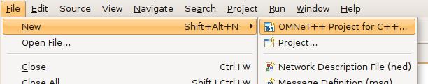

   Creating an |omnet++| project

This menu item will bring up the :guilabel:`New |omnet++| Project` wizard. The wizard lets you create an |omnet++|-specific
project, which includes support for NED, MSG, and INI file editing, as well as C++ development of simple modules.

On the first page of the wizard, specify the project name and ensure that the :guilabel:`Support C++ Development`
checkbox is selected.

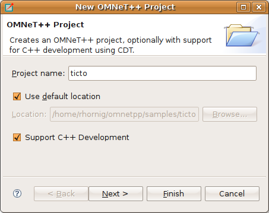

   Setting project name and enabling C++ support

Select a project template. A template defines the initial content and layout of the project.

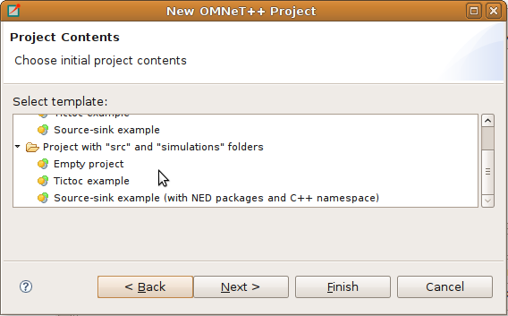

   Selecting a project template

Select a toolchain that is supported on your platform. Usually, you will see only a single supported toolchain, so there
is no need to change anything on the page.

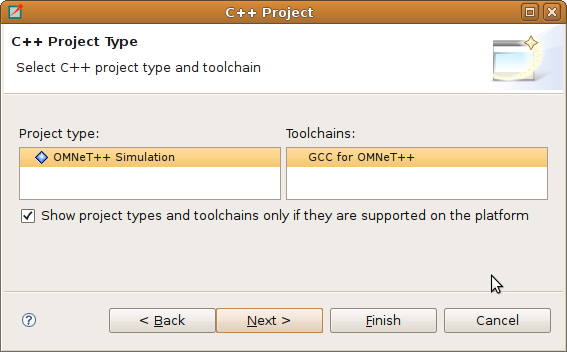

   Selecting a toolchain

Finally, select one or more from the preset build configurations. A configuration is a set of options that are
associated with the build process. It is mainly used to build debug and release versions of your program.

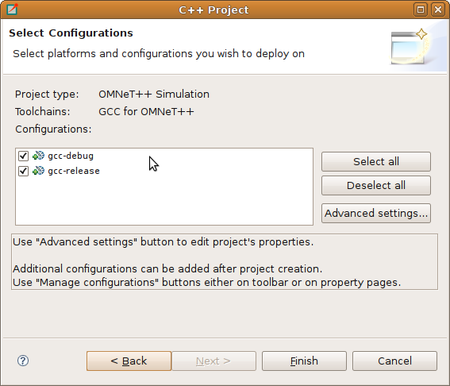

   Selecting configurations

Clicking the :guilabel:`Finish` button will create the project.

Editing C++ Code
----------------

The |omnet++| IDE comes with a C/C++ editor. In addition to standard editing features, the C/C++ editor provides syntax
highlighting, content assistance, and other C++ specific functionality. The source is continually parsed as you type,
and errors and warnings are displayed as markers on the editor rulers.

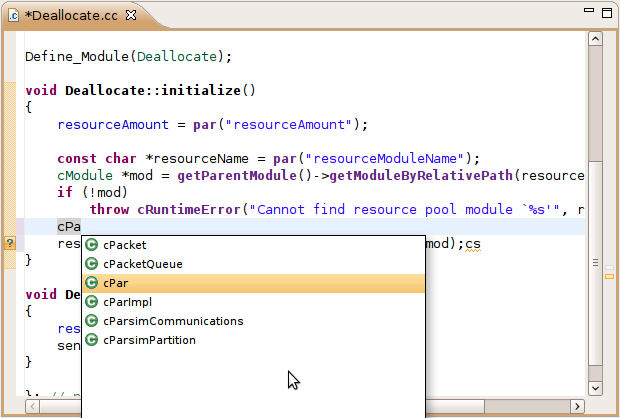

   C++ source editor

The C++ Editor
~~~~~~~~~~~~~~

The C++ source editor provides the usual features of Eclipse-based text editors, such as syntax highlighting, clipboard
cut/copy/paste, unlimited undo/redo, folding, find/replace, and incremental search.

The IDE scans and indexes the C++ files in your project in the background and provides navigation and code analysis
features based on that knowledge. This database is kept up to date as you edit the source.

Basic Functions
^^^^^^^^^^^^^^^

Some of the most useful features of the source editor:

-  Undo :kbd:`Ctrl+Z`, Redo :kbd:`Ctrl+Y`
-  Switch between a C++ source and its matching header file :kbd:`Ctrl+TAB`
-  Indent/unindent code blocks :kbd:`TAB` / :kbd:`Shift+TAB`
-  Correct indentation :kbd:`Ctrl+I`
-  Move lines :kbd:`Alt+UP` / :kbd:`Alt+DOWN`
-  Find :kbd:`Ctrl+F`, incremental search :kbd:`Ctrl+J`

.. tip::

   The following functions help you explore the IDE:

   -  :kbd:`Ctrl+Shift+L` brings up a window listing all keyboard bindings, and
   -  :kbd:`Ctrl+3` shows a filtered list of all available commands.

View Documentation
^^^^^^^^^^^^^^^^^^

Hovering the mouse over an identifier displays its declaration and the documentation comment in a "tooltip" window.
The window can be made persistent by hitting F2.

.. tip::

   If you are on Ubuntu and see all-black tooltips, you need to change the tooltip colors in Ubuntu; see the Ubuntu
   chapter of the :ref:`install-guide` for details.

Content Assist
^^^^^^^^^^^^^^

If you need help, just press :kbd:`Ctrl+SPACE`. The editor will offer possible completions (variable names, type names,
argument lists, etc.).

Navigation
^^^^^^^^^^

Hitting :kbd:`F3` or holding the :kbd:`Ctrl` key and clicking an identifier will jump to the definition/declaration.

The Eclipse platform's bookmarking and navigation history facilities are also available in the C++ editor.

Commenting
^^^^^^^^^^

To comment out the selected lines, press :kbd:`Ctrl+/`. To remove the comment, press :kbd:`Ctrl+/` again.

Open Type
^^^^^^^^^

Pressing Ctrl+Shift+T will bring up the :guilabel:`Open Element` dialog, which lets you type a class name, method name, or
any other identifier and opens its declaration in a new editor.

Exploring the Code
^^^^^^^^^^^^^^^^^^

The editor offers various ways to explore the code: Open Declaration :kbd:`F3`, Open Type Hierarchy :kbd:`F4`, Open Call Hierarchy
:kbd:`Ctrl+Alt+H`, Quick Outline :kbd:`Ctrl+O`, Quick Type Hierarchy :kbd:`Ctrl+T`, Explore Macro Expansion :kbd:`Ctrl+=`, Search for
References :kbd:`Ctrl+Shift+G`, etc.

Refactoring
^^^^^^^^^^^

Several refactoring operations are available, such as Rename :kbd:`Shift+Alt+R`.

.. note::

   Several features such as content assist, go to definition, type hierarchy, and refactorings rely on the
   *Index*. The index contains the locations of all functions, classes, enums, defines, etc. in the project
   and referenced projects. Initial indexing of large projects may take a significant amount of time. The index is kept
   up to date mostly automatically, but occasionally it may be necessary to manually request reindexing the project.
   Index-related actions can be found in the :guilabel:`Index` submenu of the project's context menu.

Include Browser View
~~~~~~~~~~~~~~~~~~~~

Dropping a C++ file into the :guilabel:`Include Browser View` displays the include files used by the C++ file (either
directly or indirectly).

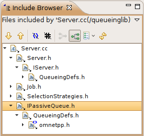

   Include Browser

Outline View
~~~~~~~~~~~~

During source editing, the :guilabel:`Outline View` gives you an overview of the structure of your source file and can
be used to quickly navigate within the file.

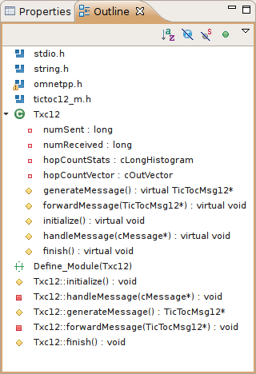

   Navigating with the Outline View

Type Hierarchy View
~~~~~~~~~~~~~~~~~~~

Displaying the C++ type hierarchy may be helpful in understanding the inheritance relationships among your classes (and
among |omnet++| classes).

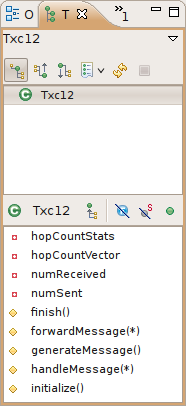

   C++ Type hierarchy

Building the Project
--------------------

Basics
~~~~~~

Once you have created your source files and configured your project settings, you can build the project by selecting
:guilabel:`Build Project` from the :guilabel:`Project` menu or from the project context menu. You can also press
:kbd:`Ctrl+B` to build all open projects in the workspace.

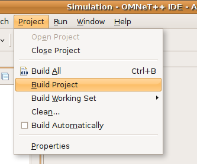

   Building a project

Build Output
^^^^^^^^^^^^

The build output (standard output and standard error) is displayed in the :guilabel:`Console View` as the build
progresses. Errors and warnings parsed from the output are displayed in the :guilabel:`Problems View`. Double-clicking a
line in the :guilabel:`Problems View` will jump to the corresponding source line. Conversely, the :guilabel:`Console
View` is more useful when you want to look at the build messages in their natural order (:guilabel:`Problems View` is
usually sorted), for example when you get a lot of build errors and you want to begin by looking at the first one.

Makefile Generation
^^^^^^^^^^^^^^^^^^^

When you start the build process, a makefile is created or refreshed in each folder where makefile creation is
configured. After that, make will be invoked with the ``all`` target in the folder configured as the build root.

.. note::

   During the build process, the makefile will print out only the names of the compiled files. If you want to see the
   full command line used to compile each file, specify ``V=1`` (verbose on) on the make command line. To add this
   option, open :menuselection:`Project Properties --> C/C++ Build --> Behavior (tab)` and replace ``all`` with ``all V=1`` on
   the :guilabel:`Build` target line.

Cleaning the Project
^^^^^^^^^^^^^^^^^^^^

To clean the project, choose :guilabel:`Clean` from the :guilabel:`Project` menu or :guilabel:`Clean Project` from
the project context menu. This will invoke :command:`make` with the ``clean`` target in the project's build root folder, and
also in referenced projects. To clean only the local project and keep referenced projects intact, use :guilabel:`Clean
Local` from the project context menu (see next section).

Referenced Projects and the Build Process
^^^^^^^^^^^^^^^^^^^^^^^^^^^^^^^^^^^^^^^^^

When you start the build, the IDE will build the referenced projects first. When you clean the project, the IDE will
also clean the referenced projects first. This is often inconvenient (especially if your project depends on a large
third-party project). To avoid cleaning the referenced projects, use :guilabel:`Clean Local` from the project context
menu.

Build Configurations
^^^^^^^^^^^^^^^^^^^^

A project is built using the active build configuration. A project may have several build configurations, where each
configuration selects a compiler toolchain, debug or release mode, defines symbols, etc. To set the active build
configuration, choose :menuselection:`Build Configurations --> Set Active` from the project context menu.

.. figure:: pictures/CPP-BuildConfiguration.png
   :width: 60%

   Activating a build configuration

Console View
~~~~~~~~~~~~

The :guilabel:`Console View` displays the output of the build process.

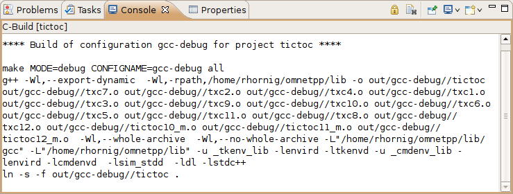

   Build output in a console

Problems View
~~~~~~~~~~~~~

The :guilabel:`Problems View` contains the errors and warnings generated by the build process. You can browse the
problem list and double-click any message to go to the problem location in the source file. NED file and INI file
problems are also reported in this view along with C++ problems. The editors are annotated with these markers as well.
Hover over an error marker in the editor window to get the corresponding message as a tooltip.

.. figure:: pictures/CPP-ProblemsView.png
   :width: 80%

   C++ problems

Configuring the Project
-----------------------

Configuring the Build Process
~~~~~~~~~~~~~~~~~~~~~~~~~~~~~

The make invocation can be configured on the :guilabel:`C/C++ Build` page of the :guilabel:`Project Properties` dialog. Most
settings are already set correctly and do not need to be changed. One exception is the :guilabel:`Enable parallel build`
option on the :guilabel:`Behavior` tab that you may want to enable, especially if you have a multi-core computer.

.. warning::

   Do not set the number of parallel jobs to be significantly higher than the number of CPU cores you have. In
   particular, never turn on the :guilabel:`Use unlimited jobs` option, as it will start an excessive number of compile
   processes and can easily consume all available memory in the system.

We do not recommend changing any setting on property pages under the :guilabel:`C/C++ Build` tree node.

Managing Build Configurations
~~~~~~~~~~~~~~~~~~~~~~~~~~~~~

A project may have several build configurations, where each configuration describes the selected compiler toolchain,
debug or release mode, extra include and linker paths, defined symbols, etc. You can activate, create, or delete build
configurations under the :guilabel:`Build Configurations` submenu of the project context menu.

.. note::

   Make sure that the names of all configurations contain the ``debug`` or ``release`` substring. The IDE launcher uses
   the name of the configuration to switch to the matching configuration depending on whether you want to debug or run
   the simulation.

Configuring the Project Build System
~~~~~~~~~~~~~~~~~~~~~~~~~~~~~~~~~~~~

|omnet++| uses makefiles to build the project. You can use a single makefile for the entire project or a hierarchy of
makefiles. Each makefile may be hand-written (provided by you) or generated automatically. The IDE offers
several options for automatically created makefiles.

The build system for an |omnet++| project can be configured on the :menuselection:`|omnet++| --> Makemake` page of the
:guilabel:`Project Properties` dialog. All settings on this page will affect all build configurations.

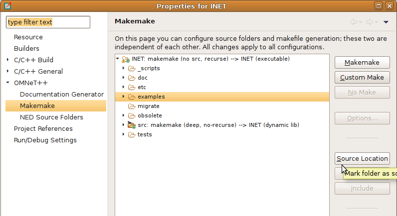

   Configuring Makefiles

Folders and Makefiles
^^^^^^^^^^^^^^^^^^^^^

The page displays the folder tree of the project. Using controls on the page (:guilabel:`Build` group in the top-right
corner), you can declare that a selected folder contains a hand-written (custom) makefile or tell the IDE to generate a
makefile for you. Generated makefiles will be automatically refreshed before each build. If a makefile is configured for
a folder, the makefile kind will be indicated with a small decoration on the folder icon.

The build root folder is indicated with a small arrow. This is the folder in which the IDE's :guilabel:`Build` function
will invoke the make command, so it should contain a makefile. It is expected that this makefile will build the entire
project by invoking all other makefiles, either directly or indirectly. By default, the build root folder is the
project root. This is usually fine, but if you really need to change the project build root, overwrite the
:guilabel:`Build location` setting in the :guilabel:`C/C++ Build` page of the same dialog.

.. note::

   All generated makefiles will be named :file:`Makefile`. Custom makefiles are also expected to have this name.

Source Folders
^^^^^^^^^^^^^^

In addition to makefiles, you also need to specify where your C++ files are located (source folders). This is usually
the :file:`src` folder of the project or, for small projects, the project root. It is also possible to exclude folders from
a source folder. The controls on the bottom-right part of the dialog (:guilabel:`Source` group) allow you to set up
source folders and exclusions for the project. Source files outside source folders or in an excluded folder will be
ignored by both the IDE and the build process.

.. note::

   Source folders and exclusions configured on this page actually modify the contents of the :guilabel:`Source Location`
   tab of the :menuselection:`C++ General --> Paths and Symbols` page of the project properties dialog, and the changes
   will affect all build configurations.

Automatically created makefiles are by default :guilabel:`deep`, meaning that they include all (non-excluded) source
files under them in the build. That is, a source file will be included in the build if it is under a source folder and
covered by a makefile. (This applies to automatically generated makefiles; the IDE has no control over the behavior
of custom makefiles.)

Makefile Generation
^^^^^^^^^^^^^^^^^^^

Makefile generation for the selected folder can be configured on the :guilabel:`Makemake Options` dialog, which can be
accessed by clicking the :guilabel:`Options` button on the page. The dialog is described in the next section.

Command-line Build
^^^^^^^^^^^^^^^^^^

To recreate your makefiles on the command line, you can export the settings by clicking the :guilabel:`Export` button.
This action will create a file named :file:`makemakefiles`. After exporting, execute :command:`make -f makemakefiles` from
the command line.

Configuring Makefile Generation for a Folder
~~~~~~~~~~~~~~~~~~~~~~~~~~~~~~~~~~~~~~~~~~~~

Makefile generation for a folder can be configured on the :guilabel:`Makemake Options` dialog. To access the dialog,
open the :menuselection:`|omnet++| --> Makemake` page in the :guilabel:`Project Properties` dialog, select the folder,
make sure makefile generation is enabled for it, and click the :guilabel:`Options` button.

The following sections describe each page of the dialog.

The :guilabel:`Target` Tab
^^^^^^^^^^^^^^^^^^^^^^^^^^

On the first, :guilabel:`Target` tab of the dialog, you can specify how the final target of the makefile is created.

-  :guilabel:`Target type`: The build target can be an executable, a shared or static library, or the linking step may
   be omitted altogether. Makemake options: :literal:`--make-so`, :literal:`--make-lib`, :literal:`--nolink`
-  :guilabel:`Export this shared/static library for other projects`: This option is observed if a library (shared or
   static) is selected as the target type and works in conjunction with the :guilabel:`Link with libraries exported from
   referenced projects` option on the :guilabel:`Link` tab. Namely, referencing projects will automatically link with
   this library if both the library is exported from this project AND linking with exported libraries is enabled in the
   referencing project. Makemake option: :literal:`--meta:export-library`
-  :guilabel:`Target name`: You may set the target name. The default value is derived from the project name. Makemake
   option: :literal:`-o` (If you are building a debug configuration, the target name will be implicitly suffixed with the
   ``_dbg`` string.)
-  :guilabel:`Output directory`: The output directory specifies where the object files and the final target will be
   created, relative to the project root. Makemake option: :literal:`-O`

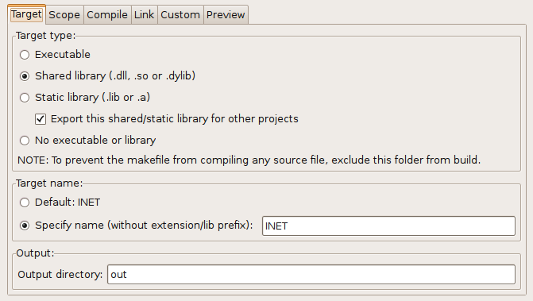

   Target definition

The :guilabel:`Scope` Tab
^^^^^^^^^^^^^^^^^^^^^^^^^

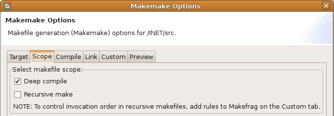

   Scope of the makefile

The :guilabel:`Scope` tab allows you to configure the scope of the makefile and specify which source files will be included.

-  :guilabel:`Deep compile`: When enabled, the makefile will compile the source files in the entire subdirectory tree
   (except excluded folders and folders covered by other makefiles). When disabled, the makefile will only compile
   sources in the makefile's folder. Makemake option: :literal:`--deep`
-  :guilabel:`Recursive make`: When enabled, the build will invoke make in all descendant folders that are configured to
   contain a makefile. Makemake option: :literal:`--meta:recurse` (expands to multiple :literal:`-d` options)
-  :guilabel:`More » Additionally invoke make in the following directories`: If you want to invoke additional makefiles
   from this makefile, specify which directories should be visited (relative to this makefile). This option is useful if
   you want to invoke makefiles outside this source tree. Makemake option: :literal:`-d`

The :guilabel:`Compile` Tab
^^^^^^^^^^^^^^^^^^^^^^^^^^^

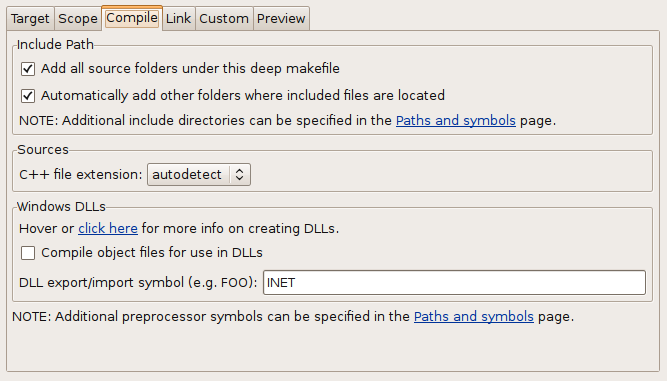

   Compiler options

The :guilabel:`Compile` tab allows you to adjust the parameters passed to the compiler during the build process.

Settings that affect the include path:

-  :guilabel:`Export include path for other projects` makes this project's include path available for other dependent
   projects. This is usually required if your project expects other independent models to extend it in the future.
-  :guilabel:`Add include paths exported from referenced projects` allows a dependent project to use header files from
   dependencies if those projects have exported their include path (i.e., the above option is turned on.)
-  :guilabel:`Add include dirs and other compile options from enabled project features`: Project features may require
   additional include paths and defines to compile properly. Enabling this option will add those command-line arguments
   (specified in the :file:`.oppfeatures` file) to the compiler command line.

Source files:

-  :guilabel:`C++ file extension`: You can specify the source file extension used in the project (:file:`.cc` or
   :file:`.cpp`). We recommend using :file:`.cc` in your projects. Makemake option: :literal:`-e`

If you build a Windows DLL, symbols you want to be available from other DLLs (or executables) need to be explicitly
exported from the DLL. Functions, variables, and classes must be marked with ``__declspec(dllexport)`` when the DLL is
compiled and with ``__declspec(dllimport)`` when you reference them from external code. This is achieved by defining a
macro that expands differently in the two cases. The |omnet++| convention is to name the macro ``FOO_API``, where
``FOO`` is your project's short name. The macro should be defined as follows:

.. code-block:: cpp

   #if defined(FOO_EXPORT)
   #  define FOO_API OPP_DLLEXPORT
   #elif defined(FOO_IMPORT)
   #  define FOO_API OPP_DLLIMPORT
   #else
   #  define FOO_API
   #endif
             

The above definition should be manually placed into a header file that is included by all headers where the macro is
used. ``OPP_DLLEXPORT`` and ``OPP_DLLIMPORT`` are provided by ``<omnetpp.h>``, and the generated makefile will provide the
``FOO_EXPORT`` / ``FOO_IMPORT`` macros that control the macro expansion via a compile option.

The ``FOO_API`` macro is used as illustrated in the following code:

.. code-block:: cpp

   class FOO_API ExportedClass {
      // public methods will be automatically exported
   };
   int FOO_API exportedFunction(...);
   extern int FOO_API exportedGlobalVariable;
             

Settings for Windows DLLs:

-  :guilabel:`Force compiling object files for use in DLLs`: If the makefile target is a DLL, |omnet++| automatically
   compiles the sources for use in the DLL (defines the ``FOO_EXPORT`` macro, etc.), regardless of the state of this
   option. Rather, this option is useful if the makefile target is **not** a DLL, but the code compiled here will
   eventually end up in a DLL. Makemake option: :literal:`-S`
-  :guilabel:`DLL export/import symbol`: Name for the DLL import/export symbol, i.e., ``FOO`` in the above examples.
   Makemake option: :literal:`-p`

The :guilabel:`Link` Tab
^^^^^^^^^^^^^^^^^^^^^^^^

Link options allow you to fine-tune the linking steps at the end of the build process.

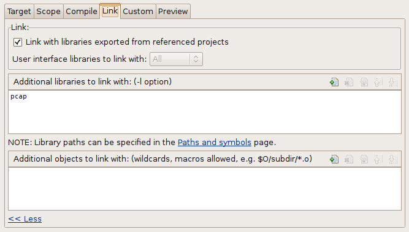

   Linker options

-  :guilabel:`Link with libraries exported from referenced projects`: If your project references other projects that
   build static or dynamic libraries, you can instruct the linker to automatically link with those libraries by enabling
   this option. The libraries from the other projects must be exported via the :guilabel:`Export this shared/static
   library for other projects` option on the :guilabel:`Target` tab. Makemake option: :literal:`--meta:use-exported-libs`
-  :guilabel:`Add libraries and other linker options from enabled project features`: Project features may require
   additional libraries and linker options to properly build. Enabling this option will add those command line arguments
   (specified in the :file:`.oppfeatures` file) to the linker command line.
-  :guilabel:`User interface libraries to link with`: If the makefile target is an executable, you may specify which
   |omnet++| user interface libraries (Cmdenv, Qtenv, or both) should be linked into the program. Makemake option: :literal:`-u`
-  :guilabel:`More » Additional libraries to link with`: This box allows you to specify additional libraries to link
   with. Specify the library name without its path, possible prefix (``lib``), and file extension, and also without the
   :literal:`-l` option. The library must be on the linker path, which can be edited on the :guilabel:`Library Paths`
   tab of the :menuselection:`C/C++ General --> Paths and Symbols` page of the :guilabel:`Project Properties` dialog. Makemake
   option: :literal:`-l`
-  :guilabel:`More » Additional objects to link with`: Additional object files and libraries can be specified here. The
   files must be given with their full paths and file extensions. Wildcards and makefile macros are also accepted.
   Example: :file:`$O/subdir/*.o`. Makemake option: none (files will become plain makemake arguments)

The :guilabel:`Custom` Tab
^^^^^^^^^^^^^^^^^^^^^^^^^^

The :guilabel:`Custom` tab allows you to customize the makefiles by inserting handwritten makefile fragments into the
automatically generated makefile. This lets you add additional targets, rules, variables, etc., to the generated makefile.

-  :guilabel:`Makefrag`: If the folder contains a file named :file:`makefrag`, its contents will be automatically copied
   into the generated makefile, just above the first target rule. :file:`makefrag` allows you to customize the generated
   makefile to some extent. For example, you can add new targets (e.g., to generate documentation or run a test suite),
   new rules (e.g., to generate source files during the build), override the default target, add new dependencies to
   existing targets, or overwrite variables. The dialog lets you edit the contents of the :file:`makefrag` file
   directly (it will be saved when you accept the dialog).
-  :guilabel:`More » Fragment files to include`: Here, you can explicitly specify a list of makefile fragment files to
   include, instead of the default :file:`makefrag`. Makemake option: :literal:`-i`

The :guilabel:`Preview` Tab
^^^^^^^^^^^^^^^^^^^^^^^^^^^

The :guilabel:`Preview` tab displays the command line options that will be passed to :command:`opp_makemake` to generate the
makefile. It consists of two parts:

-  :guilabel:`Makemake options`: This is an editable list of makefile generation options. Most options map directly
   to checkboxes, edit fields, and other controls on the previous tabs of the dialog. If you check the :guilabel:`Deep
   compile` checkbox on the :guilabel:`Scope` tab, the :literal:`--deep` option will be added to the command line. If
   you delete :literal:`--deep` from the command line options, that will cause the :guilabel:`Deep compile` checkbox to be
   unchecked. Some options are directly understood by :command:`opp_makemake`, others are "meta" options that
   the IDE will resolve to one or more :command:`opp_makemake` options; see below.
-  :guilabel:`Makemake options modified with CDT settings and with meta-options resolved`: This read-only text
   field is displayed for information purposes only. Not all options in the above options list are directly understood by
   :command:`opp_makemake`; namely, the options that start with :literal:`--meta:` denote higher-level features offered by the IDE
   only. Meta options will be translated to :command:`opp_makemake` options by the IDE. For example,
   :literal:`--meta:auto-include-path` will be resolved by the IDE to multiple :literal:`-I` options, one for each directory in the
   C++ source trees of the project. This field shows the :command:`opp_makemake` options after the resolution of the meta
   options.

Project References and Makefile Generation
~~~~~~~~~~~~~~~~~~~~~~~~~~~~~~~~~~~~~~~~~~

When your project references another project (such as the INET Framework), your project's build will be affected in the
following way:

-  Include path: Source folders in referenced projects will be automatically added to the include path of your makefile
   if the :guilabel:`Add include paths exported from referenced projects` option on the :guilabel:`Compile` tab is
   checked, and the referenced projects also enable the :guilabel:`Export include path for other projects` option.
-  Linking: If the :guilabel:`Link with libraries exported from referenced projects` option on the :guilabel:`Link` tab
   is enabled, then the makefile target will be linked with those libraries in referenced projects that have the
   :guilabel:`Export this shared/static library for other projects` option checked on the :guilabel:`Target` tab.
-  NED types: NED types defined in a referenced project are automatically available in referencing projects.

Project Features
----------------

Motivation
~~~~~~~~~~

Long compile times are often an inconvenience when working with large |omnet++|-based model frameworks like the INET
Framework. The IDE feature called :guilabel:`Project Features` enables you to reduce build times by excluding or disabling
parts of the model framework that you do not use for your simulation study. For example, when working on mobile
ad-hoc simulations in INET, you can disable the compilation of Ethernet, IPv6/MIPv6, MPLS, and other unrelated protocol
models. The word *feature* refers to a piece of the project codebase that can be turned off as a whole.

Additional benefits of project features include a less cluttered model palette in the NED editor, being able to exclude
code that does not compile on your system, and enforcing cleaner separation of unrelated parts in the model framework.

.. note::

   A similar effect could also be achieved by breaking up the model framework (e.g., INET) into several smaller projects,
   but that would cause other kinds of inconveniences for model developers and users alike.

What is a Project Feature
~~~~~~~~~~~~~~~~~~~~~~~~~

Features can be defined per project. As mentioned earlier, a feature is a portion of the project codebase that can be
turned off as a whole, meaning it can be excluded from the C++ sources (and thus from the build) as well as from NED. Feature
definitions are typically written and distributed by the project author, and end users are only presented with the
option of enabling/disabling those features. A feature definition contains:

-  ``ID``, which is a unique identifier within the feature definition file.
-  ``Feature name``, for example ``"UDP"`` or ``"Mobility examples"``.
-  ``Feature description``. This is a brief description of what the feature is or does, for example
   ``"Implementation of the UDP protocol"``.
-  ``Labels``. This is a list of labels or keywords that facilitate grouping or finding features.
-  ``Initially enabled``. This is a boolean flag that determines the initial enablement of the feature.
-  ``Required features``. Some features may be built on top of others; for example, a HMIPv6 protocol
   implementation relies on MIPv6, which in turn relies on IPv6. Thus, HMIPv6 can only be enabled if MIPv6 and IPv6 are
   enabled as well. This is a space-separated list of feature IDs.
-  ``NED packages``. This is a space-separated list of NED package names that identify the code that implements
   the feature. When you disable the feature, NED types defined in those packages and their subpackages will be
   excluded; also, C++ code in the folders that correspond to the packages (i.e., in the same folders as excluded NED
   files) will also be excluded.
-  ``Extra C++ source folders``. If the feature contains C++ code that lives outside NED source folders
   (non-typical), those folders are listed here.
-  ``Compile options``, for example :literal:`-DWITH_IPv6`. When the feature is enabled, the compiler options listed
   here are either added to the compiler command line of all C++ files or they can be used to generate a header file
   containing all these defines so that header file can be included in all C++ files. A typical use of this field is
   defining symbols (:literal:`WITH_xxx`) that allows you to write conditional code that only compiles when a given feature is
   enabled. Currently, only the :literal:`-D` option (*define symbol*) is supported here.
-  ``Linker options``. When the feature is enabled, the linker options listed here are added to the linker
   command line. A typical use of this field is linking with additional libraries that the feature's code requires, for
   example libavcodec. Currently, only the :literal:`-l` option (:guilabel:`link with library`) is supported here.

The Project Features Dialog
~~~~~~~~~~~~~~~~~~~~~~~~~~~

Features can be viewed, enabled, and disabled on the :guilabel:`Project Features` page of the :guilabel:`Project
Properties` dialog. The :menuselection:`Project --> Project Features` menu item is a direct shortcut to this property page.

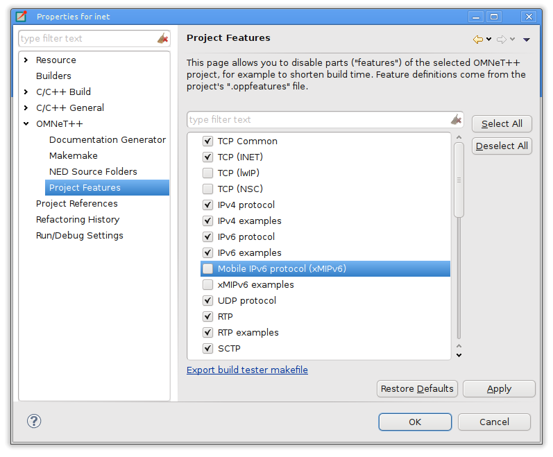

   The Project Features page

The central area of the dialog page lists the features defined for the project. Hovering the mouse over a list item will
display the description and other fields of the feature in a tooltip window. Checking an item enables the feature, and
unchecking disables it.

When you enable a feature that requires other features to work, the dialog will ask for permission to enable the
required features as well. Also, if you disable a feature that others depend on, they will be disabled too.

The :guilabel:`Apply`, :guilabel:`OK`, and :guilabel:`Cancel` buttons work as expected. :guilabel:`Restore Defaults`
restores the features to their initial state (see the :guilabel:`Initially enabled` attribute above).

Above the list, there is a notification area in the dialog. If the IDE detects that your project's configuration is
inconsistent with the feature enablements, it will display a warning there and offer a way to automatically fix the
problems. Fixing means that the IDE will adjust the project's NED and C++ settings to make them consistent with the
feature enablements. Such a check is also performed just before the build.

What Happens When You Enable/Disable a Feature
~~~~~~~~~~~~~~~~~~~~~~~~~~~~~~~~~~~~~~~~~~~~~~

When you enable or disable a feature on the :guilabel:`Project Features` page, several project settings will be
modified:

-  NED package exclusions. This corresponds to the contents of the :guilabel:`Excluded package subtrees` list on the
   :guilabel:`NED Source Folders` property page. When a feature is disabled, its NED packages will be excluded (added to
   the list), and vice versa.
-  C++ folder exclusions. This can be viewed/edited on the :guilabel:`Makemake` property page, and also on the
   :guilabel:`Source Location` tab of the :guilabel:`C/C++ General > Paths and Symbols` property page.
-  Compile options. For example, if the feature defines preprocessor symbols (``-DWITH_xxx``), they can be used to
   generate a header file that contains the enabled macro definitions, and that file can be included in all C++ files.
-  Linker options. For example, if the feature defines additional libraries to link with, they will be displayed on the
   :guilabel:`Libraries` tab of the :menuselection:`C/C++ General --> Paths and Symbols` property page.

.. note::

   Feature enablements are saved to the :file:`.oppfeaturestate` file in the project root.

Using Features from the Command Line
~~~~~~~~~~~~~~~~~~~~~~~~~~~~~~~~~~~~

:guilabel:`Project Features` can be easily configured from the IDE, but command line tools (:command:`opp_makemake`, etc.) can
also use them with the help of the :command:`opp_featuretool` command.

If you want to build the project from the command line with the same feature combination the IDE is using, you need to
generate the makefiles with the same :command:`opp_makemake` options that the IDE uses in that feature combination. The
:command:`opp_featuretool makemakeargs` command (executed in the project's root directory) will show all the required arguments
that you need to specify for the :command:`opp_makemake` command to build the same output as the IDE. This allows you to keep
the same features enabled no matter how you build your project.

Alternatively, you can choose :guilabel:`Export` on the :guilabel:`Makemake` page and copy/paste the options from the
generated :file:`makemakefiles` file. This method is not recommended because you must redo it manually each time after
changing the enablement state of a feature.

The :file:`.oppfeatures` File
~~~~~~~~~~~~~~~~~~~~~~~~~~~~~

Project features are defined in the :file:`.oppfeatures` file in your project's root directory. This is an XML file, and it
currently has to be written manually (there is no specialized editor for it).

The root element is ``<features>``, and it may have several ``<feature>`` child elements, each defining a project
feature. Attributes of the ``<features>`` element define the root(s) of the source folder(s) (``cppSourceRoots``) and
the name of a generated header file that contains all the defines specified by the ``compilerFlags`` attribute in the
enabled features. The fields of a feature are represented with XML attributes; attribute names are ``id``, ``name``,
``description``, ``initiallyEnabled``, ``requires``, ``labels``, ``nedPackages``, ``extraSourceFolders``,
``compileFlags``, and ``linkerFlags``. Items within attributes that represent lists (``requires``, ``labels``, etc.) are
separated by spaces.

Here is an example feature from the INET Framework:

.. code-block:: xml

   <features cppSourceRoots="src" definesFile="src/inet/features.h">
       <feature
           id="TCP_common"
           name="TCP Common"
           description="The common part of TCP implementations"
           initiallyEnabled="true"
           requires=""
           labels=""
           nedPackages="
                          inet.transport.tcp_common
                          inet.applications.tcpapp
                          inet.util.headerserializers.tcp
                         "
           extraSourceFolders=""
           compileFlags="-DWITH_TCP_COMMON"
           linkerFlags=""
       />

How to Introduce a Project Feature
~~~~~~~~~~~~~~~~~~~~~~~~~~~~~~~~~~

If you plan to introduce a project feature into your project, here's what you'll need to do:

-  Isolate the code that implements the feature into a separate source directory (or several directories). This is
   because only whole folders can be declared as part of a feature; individual source files cannot.
-  Check the remainder of the project. If you find source lines that reference code from the new feature, use
   conditional compilation (``#ifdef WITH_YOURFEATURE``) to make sure that the code compiles (and either works sensibly or
   throws an error) when the new feature is disabled. (Your feature should define the ``WITH_YOURFEATURE`` symbol, i.e.
   :literal:`-DWITH_YOURFEATURE` will need to be added to the feature compile flags.)
-  Add the feature description into the :file:`.oppfeatures` file of your project, including the required feature
   dependencies.
-  Test. At the very least, test that your project compiles at all, both with the new feature enabled and disabled. More
   thorough, automated tests can be built using :file:`opp_featuretool`.

Project Files
-------------

Eclipse, CDT, and the |omnet++| IDE use several files in the project to store settings. These files are located in the
project root directory and are normally hidden by the IDE in the :guilabel:`Project Explorer View`. The files
include:

-  :file:`.project` : Eclipse stores the general project properties in this file, including project name, dependencies from
   other projects, and project type (i.e., whether |omnet++|-specific features are supported or this is only a generic
   Eclipse project).
-  :file:`.cproject` : This file contains settings specific to C++ development, including the build configurations; and
   per-configuration settings such as source folder locations and exclusions, include paths, linker paths, symbols; the
   build command, error parsers, debugger settings, and so on.
-  :file:`.oppbuildspec` : Contains settings specific to |omnet++|. This file stores per-folder makefile generation settings
   that can be configured on the :guilabel:`Makemake` page of the :guilabel:`Project Properties` dialog.
-  :file:`.oppfeatures` : Optionally contains the definitions of project features.
-  :file:`.oppfeaturestate` : Optionally contains the current enablement state of the features. (We do not recommend keeping
   this file under version control.)
-  :file:`.nedfolders` : Contains the names of NED source folders; this is the information that can be configured on the
   :guilabel:`NED Source Folders` page of the :guilabel:`Project Properties` dialog.
-  :file:`.nedexclusions` : Contains the names of excluded NED packages.

If you are creating a project where no C++ support is needed (i.e., you are using an existing precompiled simulation
library and you only edit NED and Ini files), the :file:`.cproject` and :file:`.oppbuildspec` files will not be present in your
project.
