.. |filter_image| image:: icons/filter.png
   :class: toolbutton

Editing INI Files
=================

Overview
--------

In |omnet++|, simulation models are parameterized and configured for execution using configuration files with the :file:`.ini`
extension, called INI files. INI files are text files, which can be edited using any text editor. However, |omnet++| 4.x
introduces a tool specifically designed for editing INI files. The INI File Editor is part of the |omnet++| IDE and is highly
effective in assisting the user to author INI files. It is a very useful feature because it has detailed knowledge of
the simulation model, the INI file syntax, and the available configuration options.

.. note::

   The syntax and features of INI files have changed since |omnet++| 3.x. These changes are summarized in the "Configuring
   Simulations" chapter of the "|omnet++| 4.x User Manual."

The INI File Editor is a dual-mode editor. The configuration can be edited using forms and dialogs, or as plain text.
Forms are organized around topics such as general setup, Cmdenv, Qtenv, output files, extensions, and so on. The text editor
provides syntax highlighting and auto completion. Several views can display information, which is useful when editing
INI files. For example, you can see the errors in the current INI file or all the available module parameters in one
view. You can easily navigate from the module parameters to their declaration in the NED file.

Creating INI Files
------------------

To create a new INI file, choose :menuselection:`File --> New --> Initialization File` from the menu. It opens a wizard where
you can enter the name of the new file and select the name of the network to be configured.

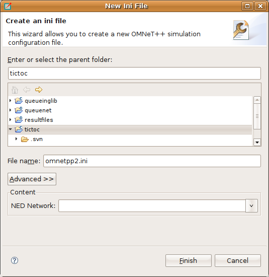

   New Initialization File dialog

Using the INI File Editor
-------------------------

The INI File Editor has two modes. The *Source* mode provides a text editor with syntax highlighting and auto completion
of names. In the *Form* mode, you can edit the configuration by entering the values in a form. You can switch between
the modes by selecting the tabs at the bottom of the editor.

Editing in Form Mode
~~~~~~~~~~~~~~~~~~~~

The INI file contains the configuration of simulation runs. The content of the INI file is divided into sections. In the
simplest case, all parameters are set in the General section. If you want to create several configurations in the same
INI file, you can create named Configuration (Config) sections and refer to them with the :literal:`-c` option when starting
the simulation. The Config sections inherit the settings from the General section or from other Config sections. This
way, you can factor out the common settings into a "base" configuration.

On the first page of the form editor, you can edit the sections. The sections are displayed as a tree; the nodes inherit
settings from their parents. The icon before the section name shows how many runs are configured in that section.
You can use drag and drop to reorganize the sections. You can delete, edit, or add a new child to the selected section.

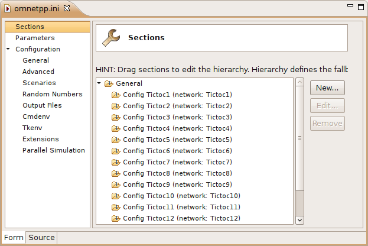

   Editing INI file sections

.. list-table:: Legend of Icons Before Sections
   :widths: 6 94
   :header-rows: 0

   * - .. image:: icons/section_single.png
     - contains a single run

   * - .. image:: icons/section_repeat.png
     - contains multiple replications (specified by 'repeat=...')

   * - .. image:: icons/section_iter.png
     - contains iteration variables

   * - .. image:: icons/section_iterrep.png
     - contains multiple replications for each iteration

The Config sections have a name and an optional description. You can specify a fallback section other than General. If
the network name is not inherited, it can be specified as well.

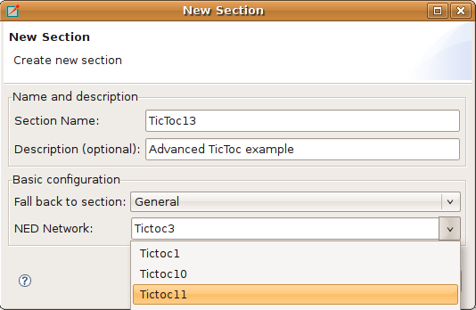

   Creating a new INI file section

On the :guilabel:`Parameters` page of the form editor, you can set module parameters. First, you have to select the
section where the parameters are stored. After selecting the section from the list, the form shows the name of the
edited network and the fallback section. The table below the list box shows the current settings of the section and all
other sections from which it has inherited settings. You can move parameters by dragging them. If you click a table
cell, you can edit the parameter name (or pattern), its value, and the comment attached to it. :kbd:`Ctrl+SPACE` 
brings up a content assist. If you hover over a table row, the parameter is described in the tooltip that appears.

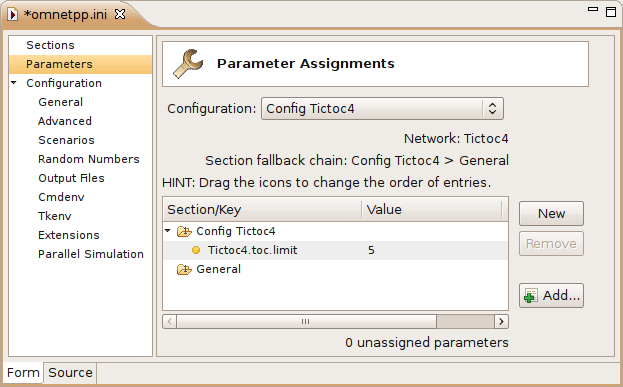

   Editing module parameters

New parameters can be added one by one by pressing the :guilabel:`New` button and filling the new table row. The
selected parameters can be removed with the :guilabel:`Remove` button. If you press the :guilabel:`Add` button, you
can add any missing parameters.

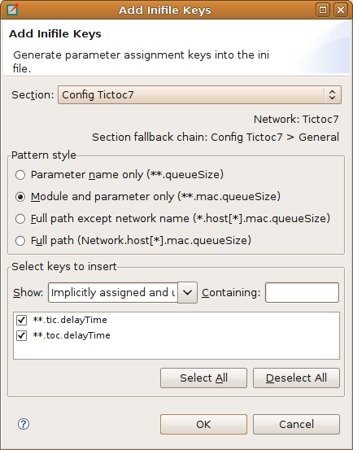

   Add missing module parameters dialog

The rest of the settings do not belong to modules (e.g., configuration of random number generators, output vectors,
simulation time limit). These settings can be edited from the forms listed under the Configuration node. If the field
has a default value and it is not set, the default value is displayed in gray. If its value is set, you can reset the
default value by pressing the :guilabel:`Reset` button. These fields are usually set in the General section. If you want
to specify them in a Config section, press the |expand_image| button and add a section-specific value to
the opening table. If the table contains the Generic section only, then it can be collapsed again by pressing the 
|collapse_image| button. Some fields can be specified in the General section only, so they do not have an
|expand_image| button next to them.

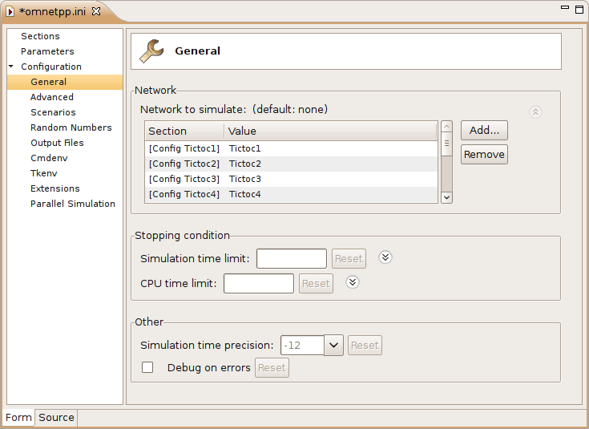

   Editing general configuration

Editing in Text Mode
~~~~~~~~~~~~~~~~~~~~

If you want to edit the INI file as plain text, switch to the Source mode. The editor provides several features in
addition to the usual text editor functions like copy/paste, undo/redo, and text search.

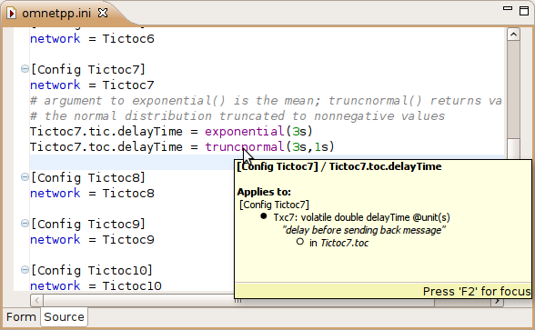

   Editing the INI file in text mode

Opening Old INI Files
^^^^^^^^^^^^^^^^^^^^^

When you open an INI file with the old format, the editor offers to convert it to the new format. It creates Config
sections from Run sections and renames old parameters.

Content Assist
^^^^^^^^^^^^^^

If you press :kbd:`Ctrl+SPACE`, you will get a list of proposals valid at the insertion point. The list may contain section
names, general options, and parameter names and values of the modules of the configured network.

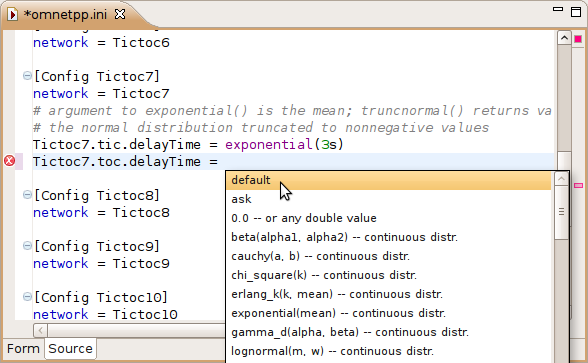

   Content assist in source mode

Tooltip
^^^^^^^

If you hover over a section or parameter, a tooltip appears showing the properties of the section or parameter. The
tooltip for sections displays the inheritance chain, the network name, the number of errors and warnings, and the yet
unassigned parameters. For parameters, the definition, description, and the module name are displayed.

Add Unassigned Parameters
^^^^^^^^^^^^^^^^^^^^^^^^^

You can add the names of unassigned module parameters to a Config section by choosing :guilabel:`Add Missing keys`
from the context menu or pressing :kbd:`Ctrl+Shift+O`.

Commenting
^^^^^^^^^^

To comment out the selected lines, press :kbd:`Ctrl+/`. To remove the comment, press :kbd:`Ctrl+/` again.

Navigation
^^^^^^^^^^

If you press the :kbd:`Ctrl` key and click on a module parameter name, then the declaration of the parameter will be shown in
the NED editor. You can navigate from a network name to its definition too.

Error Markers
^^^^^^^^^^^^^

Errors are marked on the left/right side of the editor. You can move to the next/previous error by pressing :kbd:`Ctrl+.` 
and :kbd:`Ctrl+,` respectively. You can get the error message in a tooltip if you hover over the |error_image| marker.

Associated Views
----------------

There are several views related to the INI editor. These views can be displayed (if not already open) by choosing the
view from the :menuselection:`Window --> Show View` submenu.

.. note::

   If you are working with very large NED or INI files, you may improve the performance of the editor by closing all
   views related to INI files (Parameters, Module Hierarchy, and NED Inheritance View).

Outline View
~~~~~~~~~~~~

The :guilabel:`Outline View` allows an overview of the sections in the current INI file. Clicking on a section will
highlight the corresponding element in the text or form view.

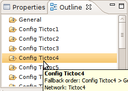

   Outline View showing the content of an INI file

Problems View
~~~~~~~~~~~~~

The :guilabel:`Problems View` contains error and warning messages generated by the parser. Double-clicking on a row will
open the problematic file and move to the location of the problem.

Parameters View
~~~~~~~~~~~~~~~

The :guilabel:`Parameters View` shows parameters of the selected section including inherited parameters. It also
displays the parameters that are unassigned in the configuration. When the |filter_image| toggle button on
the toolbar is on, then all parameters are displayed; otherwise, only the unassigned ones are visible.

If you want to fix the content of the view, press the |unpin_image| button. After pinning, the content of
this view will not follow the selection made by the user in other editors or views.

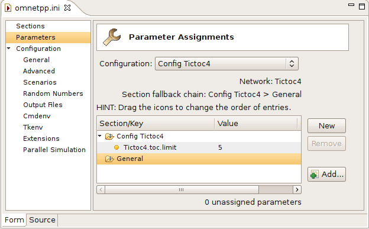

   Parameters View

.. list-table:: Legend of icons before module parameters
   :widths: 6 94
   :header-rows: 0

   * - .. image:: icons/par_ned.png
     - value is set in the NED file

   * - .. image:: icons/par_neddefault.png
     - default from the NED file is explicitly set in the INI file (``**.paramname=default``)

   * - .. image:: icons/par_implicitdefault.png
     - default from the NED file is automatically applied because no value is specified in the INI file

   * - .. image:: icons/par_ini.png
     - value is set in the INI file (may override the value from the NED file)

   * - .. image:: icons/par_inineddefault.png
     - value is set in the INI file to the same value as the NED default

   * - .. image:: icons/par_iniask.png
     - will ask the user at runtime (``**.paramname=ask``)

   * - .. image:: icons/par_unassigned.png
     - unassigned -- has no values specified in the NED or INI files

.. tip::

   Right-clicking on any line will show a context menu that allows you to navigate to the definition of that parameter
   or module.

Module Hierarchy View
~~~~~~~~~~~~~~~~~~~~~

The :guilabel:`Module Hierarchy View` shows the contained submodules, several levels deep. It also displays the module
parameters and where their values come from (INI file, NED file, or unassigned).

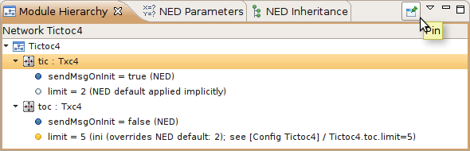

   Module Hierarchy View

.. tip::

   Before you use the context menu to navigate to the ``NED`` definition, pin down the hierarchy view. This way, you will
   not lose the current context and content if the view will not follow the selection.

NED Inheritance View
~~~~~~~~~~~~~~~~~~~~

The :guilabel:`NED Inheritance View` shows the inheritance tree of the network configured in the selected section.

