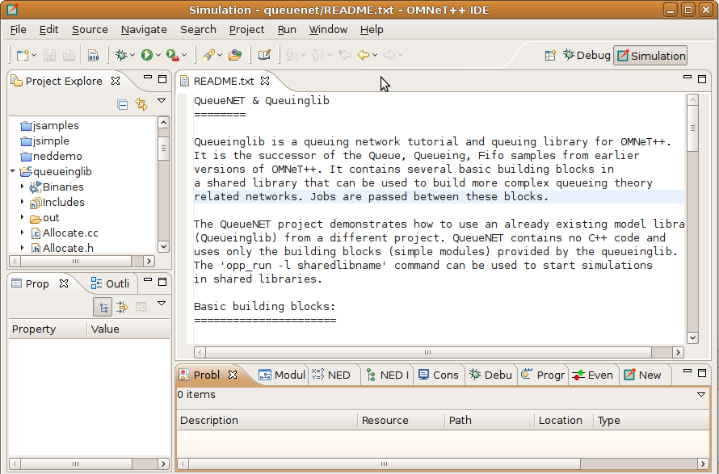
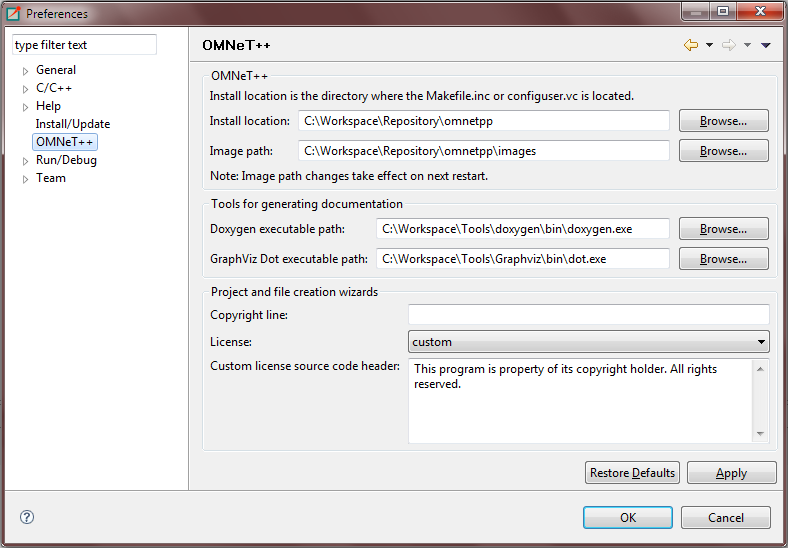
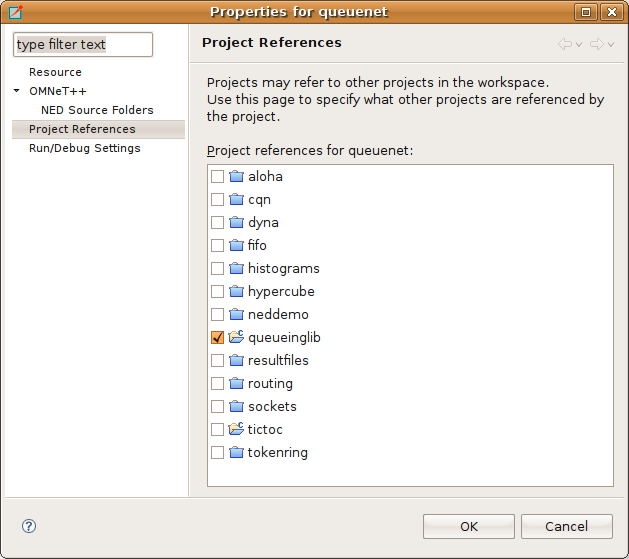

Introduction
============

The |omnet++| simulation IDE is based on the Eclipse platform and extends it with new editors, views, wizards, and other
functionality. |omnet++| adds functionality for creating and configuring models (NED and INI files), performing batch
executions and analyzing the simulation results, while Eclipse provides C++ editing, SVN/GIT integration and other
optional features (UML modeling, bug-tracker integration, database access, etc.) via various open-source and commercial
plug-ins. The environment will be instantly recognizable to those at home with the Eclipse platform.

The Workbench
-------------

The Eclipse main window consists of various Views and Editors. These are collected into Perspectives that define which
Views and Editors are visible and how they are sized and positioned.

Eclipse is a very flexible system. You can move, resize, hide and show various panels, editors and navigators. This
allows you to customize the IDE to your liking, but it also makes it more difficult to describe. First, we need to make
sure that we are looking at the same thing.

The |omnet++| IDE provides a "Simulation perspective" to work with simulation-related NED, INI and MSG files. To switch to
the simulation perspective, select :menuselection:`Window --> Open Perspective --> Simulation`.

.. figure:: pictures/Intro-SelectPerspective.png
   :width: 50%

   Selecting the "Simulation Perspective" in Eclipse

Most interface elements within Eclipse are can be moved or docked freely so you can construct your own workbench to fit
your needs.

   Default layout of the |omnet++| IDE

The :guilabel:`Project Explorer` on the top left part of the screen shows the projects and their content in your
workspace. In the example above, the ``queueinglib`` demo project is open. You can see the various :file:`.ned`,
:file:`.ini` and other files inside. A number of views are docked at the bottom of the window.

The screenshot shows the open README.txt file in the editor area. When a user double-clicks on a file, Eclipse
automatically launches the editor associated with that particular file type.

The :guilabel:`Properties View` contains information on the particular object that is selected in the editor area, or
one of the other views that serve as a selection provider. The :guilabel:`Problems View` references code lines where
Eclipse encountered problems.

Several |omnet++|-specific views exist that can be used during development. We will discuss how you can use them
effectively in a later chapter. You can open any View by selecting :menuselection:`Window --> Show View` from the menu.

Workspaces
----------

A workspace is basically a directory where all your projects are located. You may create and use several workspaces and
switch between them as needed. During the first run, the |omnet++| IDE offers to open the samples directory as the
workspace, so you will be able to experiment with the available examples immediately. Once you start working on your own
projects, we recommend that you create your own workspace by selecting :menuselection:`File --> Switch Workspace --> Other` .
You can switch between workspaces, as necessary. Please be aware that the |omnet++| IDE restarts with each switch in
workspaces. This is normal. You can browse workspace content in the :guilabel:`Project Explorer`, :guilabel:`Navigator`,
:guilabel:`C/C++ Projects` and similar views. We recommend using :guilabel:`Project Explorer`.

The Simulation Perspective
--------------------------

The |omnet++| IDE defines the :guilabel:`Simulation Perspective` so that it is specifically geared towards the design of
simulations. The :guilabel:`Simulation Perspective` is simply a set of conveniently selected views, arranged to make the
creation of NED, INI and MSG files easier. If you are working with INI and NED files a lot, we recommend selecting this
perspective. Other perspectives are optimized for different tasks like C++ development or debugging.

Configuring |omnet++| Preferences
---------------------------------

The |omnet++| IDE preferences dialog is available through the standard preferences menu, which is under the main Window
menu item. These settings are global and shared between all projects. The |omnet++| install locations are automatically
filled in for you after installation. The default settings for the NED documentation generation assume that the PATH
environment variable is already set, so that third party tools can be found. The license configuration settings specify
the preferred license type or a custom license text. The IDE will copy the license into new files and projects. The
license will also be shown in the generated NED documentation. 

   Configuring |omnet++| preferences

Use the Browse buttons to find files or folders easily. Specify full path for executables if you do not want to extend
the PATH environment variable.

Creating |omnet++| Projects
---------------------------

In Eclipse, all files are within projects, so you will need a suitable project first. The project needs to be one
designated as an |omnet++| Project (in Eclipse lingo, it should have the |omnet++| Nature). The easiest way to create such a
project is to use a wizard. Choose :menuselection:`File --> New --> |omnet++| Project` from the menu, specify a project name, and
click the :guilabel:`Finish` button. If you do not plan to write simple modules, you may unselect the :guilabel:`C++
Support` checkbox which will disable all C++ related features for the project.

.. figure:: pictures/Intro-NewProjectWizard.png
   :width: 50%

   Creating a new |omnet++| project

Project References
------------------

Most aspects of a project can be configured in the :guilabel:`Project Properties` dialog. The dialog is accessible via
the :menuselection:`Project --> Properties` menu item, or by right-clicking the project in :guilabel:`Project Explorer` and
choosing :guilabel:`Properties` from the context menu.

An important Eclipse concept is that a project may reference other projects in the workspace; project references can be
configured in the :guilabel:`Project References` page of the properties dialog. To update the list of referenced
projects, simply check those projects in the list that your project depends on, then click :guilabel:`Apply`. Note that
circular references are not allowed (i.e. the dependency graph must be a tree).

   Setting project dependencies

In the |omnet++| IDE, all NED types, C++ code and build artifacts (executables, libraries) in a project are available to
other projects that reference the given project.

.. note::

   To see an example of project references, check the ``queuenet`` and ``queueinglib`` example projects. In this
   example, ``queuenet`` references ``queueinglib``. ``Queuinglib`` provides simple modules (NED files, and a prebuilt
   shared library that contains the code of the simple modules), and makes those modules available to ``queuenet`` that
   contains simulations (networks and ini files) built from them.

Getting Help
------------

You may access the online help system from the :menuselection:`Help --> Help Contents` menu item. The |omnet++| IDE is built on
top of Eclipse, so if you are not familiar with Eclipse, we recommend reading the :guilabel:`Workbench User Guide` and
the :guilabel:`C/C++ Development User Guide` before starting to use |omnet++|-specific features.
