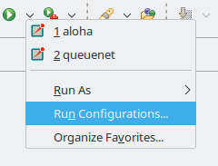
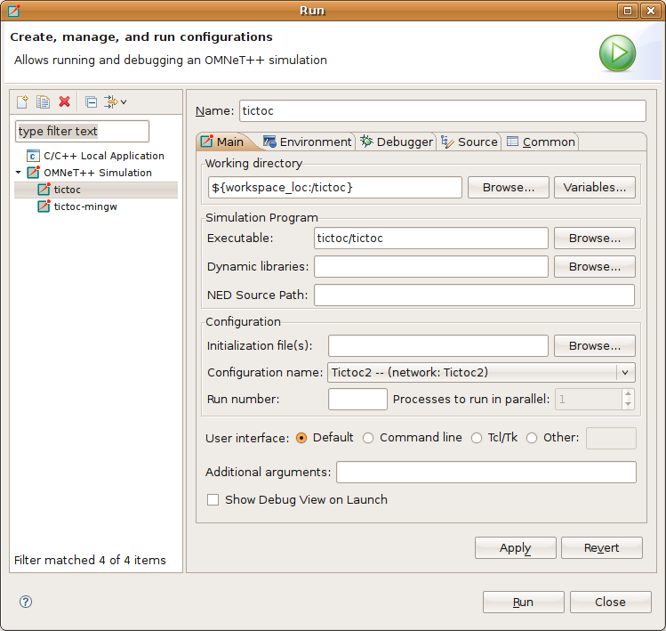
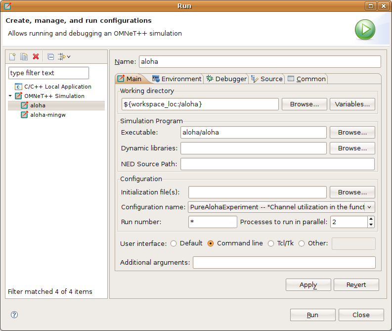
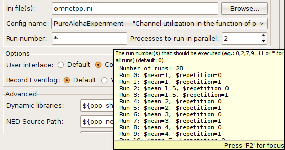
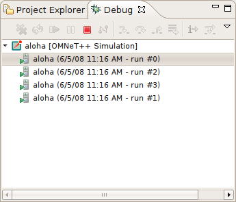
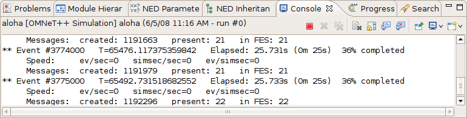
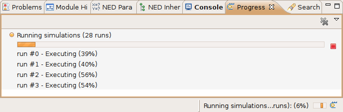

Launching and Debugging
=======================

Introduction
------------

The |omnet++| IDE lets you execute single simulations and simulation batches, and also to debug and, to some extent,
profile simulations. You can choose whether you want the simulation to run in graphical mode (using :guilabel:`Qtenv`)
or in console (using :guilabel:`Cmdenv`); which simulation configuration and run number to execute; whether to record an
eventlog or not; and many other options.

When running simulation batches, you can specify the number of processes allowed to run in parallel, so you can take
advantage of multiple processors or processor cores. The progress of the batch can be monitored, and you can also kill
processes from the batch if needed. Batches are based on the parameter study feature of INI files; you can
read more about it in the |omnet++| Simulation Manual.

Debugging support comes from the Eclipse C/C++ Development Toolkit (CDT), and beyond the basics (single-stepping, stack
trace, breakpoints, watches, etc.) it also offers you several conveniences and advanced functionality such as inspection
tooltips, conditional breakpoints and so on. Debugging with CDT also has extensive literature on the Internet. Currently
CDT uses the GNU Debugger (gdb) as the underlying debugger.

Profiling support is based on the :command:`valgrind` program, http://valgrind.org. Valgrind is a suite of tools for
debugging and profiling on Linux. It can automatically detect various memory access and memory management bugs, and
perform detailed profiling of your program. Valgrind support is brought into the |omnet++| IDE by the Linux Tools Project
of Eclipse.

Launch Configurations
---------------------

Eclipse, and thus the IDE as well, uses *launch configurations* to store particulars of the program to be
launched: what program to run, the list of arguments and environment variables, and other options. Eclipse and its C/C++
Development Toolkit (CDT) already comes with several types of launch configurations (e.g. "C/C++ Application"), and the
IDE adds :guilabel:`|omnet++| Simulation`. The same launch configuration can be used with the :guilabel:`Run`,
:guilabel:`Debug` and :guilabel:`Profile` buttons alike.

Running a Simulation
--------------------

Quick Run
~~~~~~~~~

The easiest way to launch a simulation is by selecting a project, folder, ini or NED file in :guilabel:`Project
Explorer`, and clicking the :guilabel:`Run` button on the toolbar. This will create a suitable launch configuration
(possibly after asking a few questions to clarify what you want to run) if one does not exist already. Instead of the
:guilabel:`Run` button, you can also choose the :menuselection:`Run As --> |omnet++| Simulation` from the item's context
menu.

The details:

-  If a folder is selected and it contains a single INI file, the IDE will use this file to start the simulation.
-  If an INI file is selected, it will be used during the launch as the main INI file for the simulation.
-  If a NED file is selected which contains a network definition, the IDE will scan for INI files in the active projects
   and will try to find a configuration that allows this network to start.

The Run Configurations Dialog
~~~~~~~~~~~~~~~~~~~~~~~~~~~~~

Launch configurations can be managed in the :guilabel:`Run Configurations` dialog. (Two further dialogs,
:guilabel:`Debug Configurations` and :guilabel:`Profile Configurations` are very similar, and allow you to manage
debugging/profiling aspects of launch configurations).

The :guilabel:`Run Configurations` can be opened in various ways: via the main menu (:menuselection:`Run --> Run
Configurations`); via the context menu item of a project, folder or file (:menuselection:`Run As --> Run
Configurations`); via the green :guilabel:`Run` toolbar button (:guilabel:`Run Configurations` item of its
attached menu, or by Ctrl-clicking any other menu item or the toolbar button itself).

   One way of opening the :guilabel:`Run Configurations` dialog

Creating a Launch Configuration
~~~~~~~~~~~~~~~~~~~~~~~~~~~~~~~

|omnet++| IDE adds a new Eclipse launch configuration type, :guilabel:`|omnet++| Simulation`, that supports launching
simulation executables. To create a new run configuration, open the :guilabel:`Run Configurations` dialog. In the
dialog, select :guilabel:`|omnet++| Simulation` from the tree, and click the :guilabel:`New launch configuration` icon in
the top-left corner. A blank launch configuration is created; you can give it a name at the top of the form that
appears.

   The Simulation Launcher

The :guilabel:`Main` tab of the configuration dialog was designed to make the launching of simulations as easy as
possible. The only required field is :guilabel:`Working directory`; all others have defaults. If you only select the
working directory and the simulation program, it will start the first configuration from the :file:`omnetpp.ini` file in the
specified working directory.

.. tip::

   Hover your mouse above the controls in this dialog and you will receive tooltip help for the selected control.

.. note::

   The :guilabel:`Launch` dialog will try to figure out your initial settings automatically. If you select an INI file
   in the :guilabel:`Project Explorer View`, or the active editor contains an INI file before launching the
   :guilabel:`Run` dialog, the INI file and working directory field will be automatically populated for you. The dialog
   will try to guess the executable name based on the settings of your current open projects.

-  :guilabel:`Executable`: You must set the name of the simulation executable here. This is a workspace path. You may
   use the :guilabel:`Browse` button to select the executable directly. If your project output is a shared library,
   select :guilabel:`opp_run`; it will cause the IDE to use the :command:`opp_run` or the :command:`opp_run_dbg` helper executable
   with the :literal:`-l` option to run the simulation. Make sure that the :guilabel:`Dynamic Libraries` field in the advanced
   section contains the libraries you want to load.

-  :guilabel:`Working directory`: Specifies the working directory of the simulation program. This is a workspace path.
   Note that values in several other fields in the dialog are treated as relative to this directory, so changing the
   working directory may invalidate or change the meaning of previously selected entries in other fields of the dialog.

-  :guilabel:`Initialization file(s)`: You should specify one or more INI files that will be used to launch the
   simulation. The default is :file:`omnetpp.ini`. Specifying more than one file (separated by space) will cause the
   simulation to load all those files in the specified order.

-  :guilabel:`Config name`: Once you specify a legal INI file, the box will present all of the Config sections in that
   file. In addition, it will display the description of that section and the information regarding which Config section
   is extended by this section. You may select which Configuration should be launched.

   .. note::

      The working directory and the INI file must contain valid entries before trying to set this option.

-  :guilabel:`Runs`: It is possible to specify which run(s) must be executed for the simulation. An empty field
   corresponds to all runs. You can specify run numbers or a filter expression that refers to iteration variables. Use
   the comma and .. to separate the run numbers; for example, 1,2,5..9,20 corresponds to run numbers 1,2,5,6,7,8,9,20.
   It is also possible to specify run filters, which are boolean expression involving constants and iteration variables
   (e.g. ``$numHosts>5 and $numHosts<10``). Running several simulations in this manner is called batch
   execution.

   .. tip::

      If the executable name and the INI file were already selected, hover the mouse above the field to get the list of
      matching runs.

-  :guilabel:`User interface`: You can specify which UI environment should be used during execution. The dialog offers
   :guilabel:`Cmdenv` (command-line UI) and :guilabel:`Qtenv` (Qt-based GUI). If you have a custom user interface, its
   name can also be specified here. Make sure that the code of the chosen UI library is available (linked into the
   executable/library or loaded dynamically).

   .. note::

      Batch execution and progress feedback during simulation are only supported when using :guilabel:`Cmdenv`.

-  :guilabel:`Allow multiple processes`: With batch execution, it is possible to tell the launcher to keep two or more
   simulations running at a time or to start a new simulation process after a certain number of runs executed. This way
   you can take advantage of multiple CPUs or CPU cores. You can set the number of CPUs to use and the number of runs to
   execute in a single process.

   .. warning::

      Use this option only if your simulation is CPU-limited and you have enough physical RAM to support all of the
      processes at the same time. Do not set it higher than the number of physical processors or cores you have in your
      machine.

-  :guilabel:`Simulation time limit` and :guilabel:`CPU time limit` can be set also to limit the runtime length if the
   simulation from the launch dialog in case those were not set from the INI file.

-  :guilabel:`Output options`: Various options can be set regarding simulation output. These checkboxes may be in one of
   three states: checked (on), unchecked (off), and grayed (unspecified). When a checkbox is the grayed state, the
   launcher lets the corresponding configuration option from the INI file to take effect.

-  Clicking on the :guilabel:`More >>>` link will reveal additional controls.

-  :guilabel:`Dynamic libraries`: A simulation may load additional DLLs or shared libraries before execution or your
   entire simulation may be built as a shared library. The :guilabel:`Browse` button is available to select one or more
   files (use :kbd:`Ctrl` + click for multiple selection). This option can be used to load simulation code (i.e. simple
   modules), user interface libraries, or other extension libraries (scheduler, output file managers, etc.). The special
   macro ``${opp_shared_libs:/workingdir}`` expands to all shared libraries provided by the current project or any other
   project on which you currently depend.

   .. note::

      If your simulation is built as a shared library, you must use the :command:`opp_run` stub executable to start it. 
      :command:`opp_run` is basically an empty |omnet++| executable which understands all command line options, but does
      not contain any simulation code.

   .. warning::

      If you use external shared libraries (i.e. libraries other than the ones provided by the current open projects or
      |omnet++| itself), you must ensure that the executable part has access to the shared library. On Windows, you must
      set the ``PATH``, while on Linux and Mac you must set the ``LD_LIBRARY_PATH`` to point to the directory where the
      DLLs or shared libraries are located. You can set these variables either globally or in the
      :guilabel:`Environment` tab in the :guilabel:`Launcher Configuration Dialog`.

-  :guilabel:`NED Source Path`: The directory or directories where the NED files are read from.

   .. tip::

      The variable ``${opp_ned_path:/workingdir}`` refers to an automatically computed path (derived from project
      settings). If you want to add additional NED folders to the automatically calculated list, use the
      ``${opp_ned_path:/workingdir}:/my/additional/path`` syntax.

-  :guilabel:`Image path`: A path that is used to load images and icons in the model.

-  :guilabel:`Additional arguments`: Other command line arguments can be specified here and will be passed to the
   simulation process.

-  :guilabel:`Build before launch`: This section allows you to configure the behavior of automatic build before
   launching. Build scope can be set either to build :guilabel:`this project and all its dependencies`, :guilabel:`this
   project only` or we can turn of autobuild before launch. Active configuration switching on build can be also
   configured here (:guilabel:`Ask`, :guilabel:`Switch`, :guilabel:`Never switch`.)

Related Command-Line Arguments
^^^^^^^^^^^^^^^^^^^^^^^^^^^^^^

Most settings in the dialog simply translate to command-line options to the simulation executable. This is summarized in
the following list:

-  Initialization files: maps to multiple :literal:`-f <inifile>` options

-  Configuration name: adds a :literal:`-c <configname>` option

-  Run number: adds a :literal:`-r <runnumber/filter>` option

-  User interface: adds a :literal:`-u <userinterface>` option

-  Dynamically loaded libraries: maps to multiple :literal:`-l <library>` options

-  NED Source Path : adds a :literal:`-n <nedpath>` option

Debug vs. Release Launch
~~~~~~~~~~~~~~~~~~~~~~~~

The launcher automatically decides whether the release or debug build of the model should be started. When running,
release mode binaries are used automatically. For debugging, debug builds are started (i.e. those where the binary ends
with ``_dbg`` suffix.) Before starting the simulation, the launcher ensures that the binary is up to date and triggers a
build process (and changes also the active configuration) if necessary.

Batch Execution
---------------

|omnet++| INI files allow you to run a simulation several times with different parameters. You can specify loops or
constraint conditions for specific parameters.

   Iteration variable in the INI file

.. note::

   Batch running is supported only in the command line environment.

If you create an INI file configuration ([Config] section) with one or more iteration variables, you will be able to run
your simulations to explore the parameter space defined by those variables. Practically, the IDE creates the Cartesian
product from these variables and assigns a run number to each product. It is possible to execute one, several or all
runs of the simulation by specifying the :guilabel:`Run number` field in the :guilabel:`Run Dialog`. You can specify a
single number (e.g. ``3``), a combination of several numbers (e.g. ``2,3,6,7..11``), all run numbers (using ``*``) or boolean
expressions using contstants and iteration variables (e.g. ``$numHosts>5 and $numHosts<10``.)

.. tip::

   If you already have specified your executable, chosen the configuration which should be run and selected the command
   line environment, you may try to hover over the :guilabel:`Run Number` field. This will give you a description of the
   possible runs and how they are associated with the iteration variable values (the tooltip is calculated by executing
   the simulation program with the :literal:`-x Configuration -G` options in command line mode).

   Iteration loop expansion in a tooltip

If you have a multi-core or multi-processor system and have ample memory, you may try to set the :guilabel:`Processes to
run parallel` field to a higher number. This will allow the IDE to start more simulation processes in parallel,
resulting in a much lower overall simulation time for the whole batch.

.. warning::

   Be aware that you need enough memory to run all these processes in parallel. We recommend using this feature only if
   your simulation is CPU-bound. If you do not have enough memory, your operating system may start to use virtual
   memory, dramatically decreasing the overall performance.

Debugging a Simulation
----------------------

The |omnet++| IDE integrates with the CDT (C/C++ Development Tooling) of Eclipse which also includes debugging support.
The CDT debugger UI relies on :command:`gdb` for doing the actual work.

Starting a Debug Session
~~~~~~~~~~~~~~~~~~~~~~~~

Launching a simulation in debug mode is very similar to running it (see previous sections), only you have to select the
:guilabel:`Debug` toolbar icon or menu item instead on :guilabel:`Run`. The same launch configurations are used for
debugging that for running, that is, if you open the :guilabel:`Debug Configurations` dialog, you will see the same
launch configurations as in the :guilabel:`Run` dialog. The launcher is automatically using the debug build of the model
(i.e. the executable that has a ``_dbg`` suffix.) The dialog will have extra tab pages where you can configure the
debugger and other details.

.. note::

   If you have problems with starting the debug session, check whether:

   -  your executable is built with debug information,
   -  you can run the same executable without problem (using the same launch configuration, but with adding a ``_dbg``
      suffix to the executable name), and
   -  the debugger type is set properly on the :guilabel:`Debugger` tab of the :guilabel:`Launch` dialog.

.. warning::

   Batch (and parallel) execution is not possible in this launch type, so you may specify only a single run number.

Using the Debugger
~~~~~~~~~~~~~~~~~~

The CDT debugger provides functionality that can be expected from a good C/C++ debugger: run control (run, suspend, step
into, step over, return from function, drop to stack frame); breakpoints (also conditional and counting breakpoints);
watchpoints (a.k.a. expression breakpoints, breakpoints that stop the execution whenever the value of a given expression
changes); watching and inspecting variables; and access to machine-level details such as disassembly, registers and
memory.

Source code is shown in the editor area; additional information and controls are displayed in various Views:
:guilabel:`Debug`, :guilabel:`Breakpoints`, :guilabel:`Expressions`, :guilabel:`Variables`, :guilabel:`Registers,
Memory`, etc.

CDT's conversation with gdb can also be viewed, in the appropriate pages of the :guilabel:`Console View`. (Click the
:guilabel:`Display Selected Console` icon, and choose :guilabel:`gdb` or :guilabel:`gdb traces` from the menu.)

.. tip::

   One little tip that we found useful: if you have a pointer in the program that actually points to an array (of
   objects, etc), you can have it displayed as an array, too. In :guilabel:`Variables`, right-click the variable and
   choose :guilabel:`Display As Array` from the menu. You will be prompted for a start index and the number of
   elements to display.

More information on the debugger is available in the CDT documentation, which is part of the IDE's Help system. See
:guilabel:`C/C++ Development User Guide`, chapter :guilabel:`Running and debugging projects`.

Pretty Printers
~~~~~~~~~~~~~~~

Many programs contain data structures whose contents is difficult to comprehend by looking at "raw" variables in the
program. One example is the ``std::map<T>`` class, which is essentially a dictionary but implemented with a binary tree,
so it is practically impossible to figure out with a C++ debugger what data a concrete map instance contains.

The solution gdb offers to this problem is pretty printers. Pretty printers are Python classes that gdb invokes to
transform some actual data structure to something that is easier for humans to understand. The ``*.py`` files that
provide and register these pretty printers are usually loaded via gdb's startup script, ``.gdbinit`` (or some
``.gdbinit.py`` script, because gdb allows startup scripts to be written in Python, too).

The |omnet++| IDE comes with pretty printers for container classes in the standard C++ library (``std::map<T>``,
``std::vector<T>``, etc.) and also for certain |omnet++| data types, for example ``simtime_t``. These scripts are located
under ``misc/gdb/`` in the |omnet++| root directory. The IDE also supports project-specific pretty printers: if the
debugged project's root folder contains a ``.gdbinit.py`` file, it will be loaded by gdb. (The project's ``.gdbinit.py``
can then load further Python scripts, e.g. from an ``etc/gdb/`` folder of the project.)

Pretty printer loading works in the following way. The IDE invokes gdb with ``misc/gdb/gdbinit.py`` as startup script
(for new launch configurations, the :guilabel:`GDB command file` field on the :guilabel:`Debugger` tab is set to
``${opp_root}/misc/gdb/gdbinit.py``). This script loads the pretty printers under ``misc/gdb``, and also the
project-specific pretty printers.

.. tip::

   If you want to write your own pretty printers, refer to the gdb documentation. It is available online e.g. here:
   http://sourceware.org/gdb/current/onlinedocs/gdb/

Some pretty-printers may occasionally interfere with the debugged program (especially if the program's state is already
corrupted by earlier errors), so at times it may be may be useful to temporarily turn off pretty printers. To prevent
pretty printers from being loaded for a session, clear the :guilabel:`GDB command file` setting in the launch
configuration. To disable them for a currently active debug session, switch to the :guilabel:`gdb` page in the
:guilabel:`Console`, and enter the following gdb command:

.. code-block::

   disable pretty-printer global

Or, to only disable |omnet++|-specific pretty printers (but leave the standard C++ library printers on):

.. code-block::

   disable pretty-printer global omnetpp;.*

Just-in-Time Debugging
----------------------

The |omnet++| runtime has the ability to launch an external debugger and have it attached to the simulation process. One
can configure a simulation to launch the debugger immediately on startup, or when an error (runtime error or crash)
occurs. This just-in-time debugging facility was primarily intended for use on Linux.

To turn on just-in-time debugging, set the ``debugger-attach-on-startup`` or ``debugger-attach-on-error`` configuration
option to ``true``. You can do so by e.g. adding the appropriate line to :file:`omnetpp.ini`, or specifying
``--debugger-attach-on-startup=true`` in the :guilabel:`Additional arguments` field in the launch configuration dialog.
It is also possible to configure the debugger command line.

.. note::

   On some systems (e.g. Ubuntu), just-in-time debugging requires extra setup beyond installing external debugger. See
   the :ref:`install-guide` for more details.

Profiling a Simulation on Linux
-------------------------------

On Linux systems, the |omnet++| IDE supports executing your simulation using the :guilabel:`valgrind` program. Running
your program with valgrind allows you to find memory-related issues and programming errors in your code. The simulation
will run in an emulated environment (much slower than normal execution speeds), but valgrind will generate a detailed
report when it finishes. The report is shown in a separate :guilabel:`Valgrind View` at the end of the simulation run.
The |omnet++| IDE contains support only for the ``memcheck`` tool. If you want to use other tools
(``cachegrind, callgrind, massif`` etc.), you may try to install the full 'Linux Tools Project' from the Eclipse
Marketplace.

To start profiling, right-click on your project in the :guilabel:`Project Explorer` tree and select :menuselection:`Profile
As --> |omnet++| Simulation`. Valgrind must already be installed on your system.

.. note::

   Simulation executes considerably slower than a normal run. Prepare for long run-times or limit the simulation time in
   your .INI file. You do not need statistical convergence here, just run long enough that all the code paths are
   executed in your model.

Controlling the Execution and Progress Reporting
------------------------------------------------

After starting a simulation process or simulation batch you can keep track of the started processes in the
:guilabel:`Debug View`. To open the :guilabel:`Debug View` automatically during launch, check the Show Debug View on
Launch in the run configuration dialog, or select :menuselection:`Window --> Show View --> Other --> Debug --> Debug`.
Select a process and click the terminate button to stop a specific simulation run or use the context menu for more
options to control the process execution.

   Debug View

.. tip::

   Place the Debug View in a different tab group than the console so you will be able to switch between the process
   outputs and see the process list at the same time.

.. note::

   You can terminate all currently running processes by selecting the root of the launch. This will not cancel the whole
   batch; only the currently active processes. If you want to cancel the whole batch, open the :guilabel:`Progress View`
   and cancel the simulation batch there.

Clicking on the process in the :guilabel:`Debug View` switches to the output of that process in the :guilabel:`Console
View`. The process may ask for user input via the console, too. Switch to the appropriate console and enter the
requested parameters.

   Displaying the output of a simulation process in Console View

.. note::

   By default, the :guilabel:`Console View` automatically activates when a process is writing to it. If you are running
   several parallel processes, this might be an annoying behavior and might prevent you from switching to the
   :guilabel:`Progress View`. You can switch off the auto-activation by disabling the :guilabel:`Show Console When
   Standard Out/Error Changes` in the :guilabel:`Console View` toolbar.

Progress Reporting
~~~~~~~~~~~~~~~~~~

If you have executed the simulation in the command line environment, you can monitor the progress of the simulation in
the :guilabel:`Progress View`. See the status line for the overall progress indicator and click on it to open the
detailed progress view. It is possible to terminate the whole batch by clicking on the cancel button in the
:guilabel:`Progress View`.

   Progress report on four parallel processes

.. note::

   When :guilabel:`Progress View` displays "Waiting for user input", the simulation is waiting for the user. Switch to
   the appropriate console and provide the requested input for the simulation.

.. note::

   If you need more frequent progress updates, set the ``cmdenv-status-frequency`` option in your INI file to a lower
   value.
