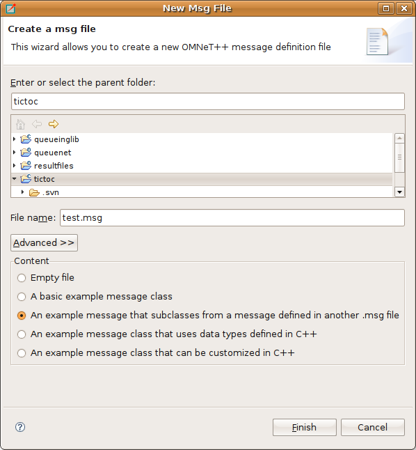
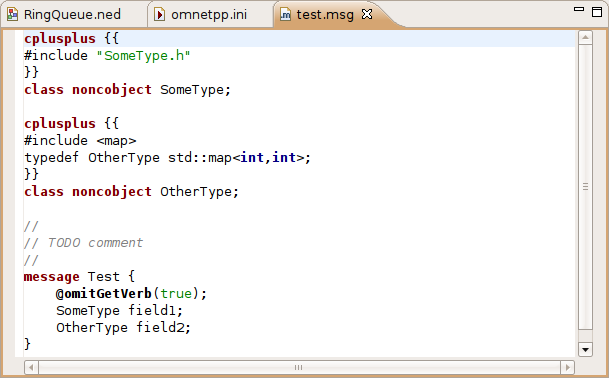

Editing Message Files
=====================

Creating Message Files
----------------------

Choosing :menuselection:`File --> New --> Message Definition (msg)` from the menu will bring up a wizard where you can specify the
target directory and the file name for your message definition. You can choose to create an empty MSG file or choose
from the predefined templates. Once you press the :guilabel:`Finish` button, a new MSG file will be created with the
requested content.

   Creating a new MSG file

The Message File Editor
-----------------------

The message file editor is a basic text editor with syntax highlight support.

   Message File Editor

.. note::

   Currently, the editor does not provide support for advanced features like content assistance or syntax-aware folding.
