Editing NED Files
=================

Overview
--------

When you double-click a :file:`.ned` file in the IDE, it will open in the NED editor. The new NED editor is a dual-mode
editor. In the editor's graphical mode, you can edit the network using the mouse. The textual mode allows you to work
directly on the NED source.

When the IDE detects errors in a NED file, the problem will be flagged with an error marker in the :guilabel:`Project
Explorer` and the :guilabel:`Problems View` will be updated to show the description and location of the problem. In
addition, error markers will appear in the text window or on the graphical representation of the problematic component.
Opening a NED file which contains an error will open the file in text mode. Switching to graphical mode is possible only
if the NED file is syntactically correct.

.. note::

   As a side effect, if there are two modules with the same name and package in related projects, they will collide and
   both will be marked with an error. Furthermore, the name will be treated as undefined and any other modules depending
   on it will also generate an error (thus, a "no such module type" error may mean that there are actually multiple
   definitions which nullify each other).

Opening Older NED Files
-----------------------

The syntax of NED files has changed significantly from the 3.x version. The NED editor primarily supports the new
syntax. However, it is still possible to read and display NED files with the old syntax. It is important to note that
many of the advanced features (syntax highlighting, content assistance, etc.) will not work with the old syntax. There
is automatic conversion from the old syntax to the new, available both from the NED editor and as an external utility
program (:command:`opp_nedtool`).

The ``gned`` program from |omnet++| 3.x viewed NED files in isolation. In contrast, the |omnet++| IDE gathers information
from all ``.ned`` files in all open |omnet++| projects and makes this information available to the NED editor. This is
necessary because |omnet++| 4.x modules may inherit parameters, visual appearance or even submodules and connections from
other modules, so it is only possible to display a compound module correctly if all related NED definitions are
available.

Creating New NED Files
----------------------

Once you have an empty |omnet++| project, you can create new NED files. Choosing :menuselection:`File --> New --> Network Description
File` from the menu will bring up a wizard where you can specify the target directory and the file/module name. You may
choose to create an empty NED file, a simple/compound module, or a network. Once you press the :guilabel:`Finish`
button, a new NED file will be created with the requested content.

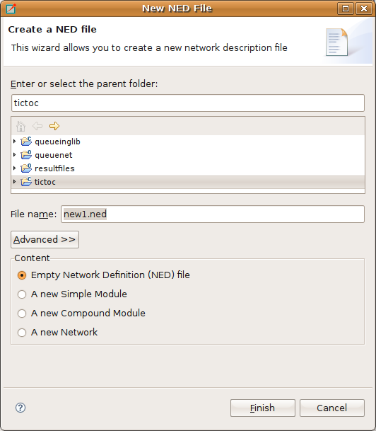

   Creating a new NED file

.. tip::

   Make sure that the NED file and the contained module have the same name. For example, a compound module named
   ``Wireless42`` should be defined within its own ``Wireless42.ned`` file.

NED Source Folders
~~~~~~~~~~~~~~~~~~

It is possible to specify which folders the IDE should scan for NED files and that the IDE will use as the base
directory for your NED package hierarchy. The IDE will not use any NED files outside the specified NED Source Folders
and those files will be opened in a standard text editor. To specify the directory where the NED files will be stored,
right-click on the project in the :guilabel:`Project Explorer` and choose :guilabel:`Properties`. Select the
:menuselection:`|omnet++| --> NED Source Folders` page and click on the folders where you store your NED files. The default
value is the project root.

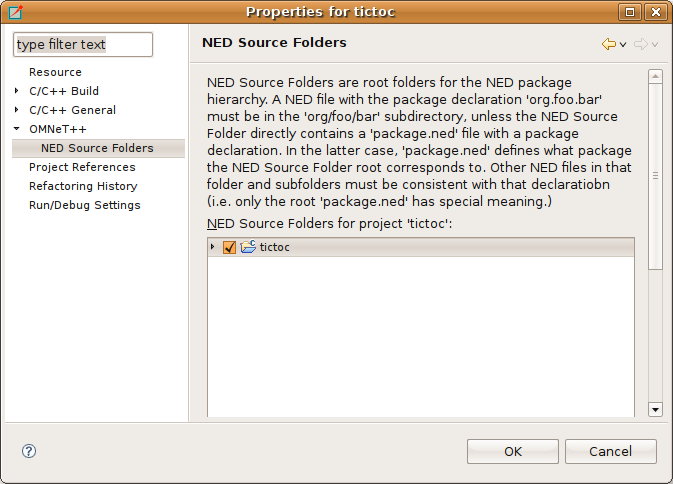

   Specifying which folder will hold your NED files

Using the NED Editor
--------------------

If you want to open an NED file, just double-click its icon in the :guilabel:`Project Explorer`. If the NED file can be
parsed without an error, the graphical representation of the file will be opened; otherwise, the text view will be
opened and the text will be annotated with error markers.

.. warning::

   Only files located in NED Source Folders will be opened with the graphical editor. If a NED file is not in the NED
   Source Folders, it will be opened in a standard text editor.

You can switch between graphical and source editing mode by clicking the tabs at the bottom of the editor, or by using
the :kbd:`Alt+PGUP` / :kbd:`Alt+PGDN` key combinations. The editor will try to keep the selection during the switch.
Selecting an element in a graphical view and then switching to text view will move the cursor to the related element
in the NED file. When switching back to graphical view, the graphical editor will try to select the element that
corresponds to the cursor location in the NED source. This allows you to keep the context, even when switching
back and forth.

Editing in Graphical Mode
~~~~~~~~~~~~~~~~~~~~~~~~~

The graphical editor displays the visible elements of the loaded NED file. Simple modules, compound modules and networks
are represented by figures or icons. Each NED file can contain more than one module or network. If it does, the
corresponding figures will appear in the same order as they are found in the NED file.

.. tip::

   Place only a single module or network into an NED file, and name the file according to the module name.

Simple modules and submodules are represented as icons while compound modules and networks are displayed as rectangles
where other submodules can be dropped. Connections between submodules are represented either by lines or arrows
depending on whether the connection was uni- or bi-directional. Submodules can be dragged or resized using the mouse and
connected by using the Connection Tool in the palette.

.. figure:: pictures/NED-GraphEditor.png
   :width: 60%

   Graphical NED Editor

The palette is normally to the right of the editor area. The upper part of the palette contains the basic tools:
selector, connection selector, and the connection creator tool. To use a palette item, simply click on it. Then, click
in the module where you want to place/activate it. The mouse pointer will give you feedback as to whether the requested
operation is allowed. The middle part of the toolbox contains the basic elements that can be placed at the top level in
a NED file (simple module, compound module, interface, channel, etc.) and a "generic" submodule. Click on any of these
and then click into the editor area to create an instance. The bottom part of the palette contains all module types that
can be instantiated as a submodule. They are shortcuts for creating a generic submodule and then modifying its type.
They will display the default icon (if any) and a short description if you hover the mouse over them. You may configure
the palette by right-clicking on a button and selecting :guilabel:`Settings` or filter its content by selecting
:guilabel:`Select Packages`

Right-clicking any element in the edited NED file will bring up a context menu that allows several actions like changing
the icon, pinning/unpinning a submodule, re-layouting a compound module, or deleting/renaming the element. There are
also items to activate various views. For example, the :guilabel:`Properties View` allows you to edit properties of the
element.

Hovering over an element will display its documentation (the comment in the NED source above the definition) as a
tooltip. Pressing :kbd:`F2` will make the tooltip window persistent, so it can be resized and scrolled for more convenient
reading.

Creating Modules
^^^^^^^^^^^^^^^^

To create a module or a submodule, click on the appropriate palette item and then click where you want to place the new
element. Submodules can be placed only inside compound modules or networks.

Creating Types and Inner Types
^^^^^^^^^^^^^^^^^^^^^^^^^^^^^^

To create a type, or an inner type inside a compound module, click on the appropriate palette item in the "Types"
drawer, and then click where you want to place the new element. If you click on the background, a new top-level type
will be created. Clicking on an existing compound module or network creates an inner type inside that module.

Creating and Changing Connections
^^^^^^^^^^^^^^^^^^^^^^^^^^^^^^^^^

Select the :guilabel:`connection tool` (if there are channels defined in the project, you can use the dropdown to select
the connection channel type). First, click the source module and then, the destination. A popup menu will appear, asking
which gates should be connected on the two selected modules. The tool will offer only valid connections (e.g. it will
not offer to connect two output gates).

Reconnecting Modules
^^^^^^^^^^^^^^^^^^^^

Clicking and dragging a connection end point to another module will reconnect it (optionally, asking which gate should
be connected). If you want to change only the gate, drag the connection end point and drop it over the original module.
A popup will appear asking for the source or destination gate.

Selecting Elements
^^^^^^^^^^^^^^^^^^

Selecting an element is done by clicking on it or by dragging a rectangle over the target modules. A compound module can
be selected by clicking on its border or title. If you want to select only connections within a selection rectangle, use
the :guilabel:`connection selector` tool in the dropdown menu of the :guilabel:`connection tool` . The :kbd:`Ctrl` and :kbd:`Shift`
keys can be used to add/remove to/from the current selection. Note that the keyboard (arrow keys) can also be used to
navigate between submodules. You can also select using a selection rectangle by dragging the mouse around the modules.

Undo, Redo, Deleting Elements
^^^^^^^^^^^^^^^^^^^^^^^^^^^^^

Use :kbd:`Ctrl+Z` and :kbd:`Ctrl+Y` for undo and redo, respectively, and the :kbd:`DEL` key for deletion. These
functions are also available in the :guilabel:`Edit` menu and in the context menu of the selected element.

Moving and Resizing Elements
^^^^^^^^^^^^^^^^^^^^^^^^^^^^

You can move/resize the selected elements with the mouse. Holding down :kbd:`Shift` during move will perform a constrained
(horizontal, diagonal or vertical) move operation. :kbd:`Shift` + resize will keep the aspect ratio of the element.

If you turn on :guilabel:`Snap to Geometry` in the :guilabel:`View` menu, helper lines will appear to help you align
with other modules. Selecting more than one submodule activates the :guilabel:`Alignment` menu (found both in the
:guilabel:`View` menu and in the context menu).

Copying Elements
^^^^^^^^^^^^^^^^

Holding down :kbd:`Ctrl` while dragging will clone the module(s). Copy/Paste can also be used both on single modules and with
group selection.

Zooming
^^^^^^^

Zooming in and out is possible from the :guilabel:`View` menu, or using :kbd:`Ctrl+-`, :kbd:`Ctrl+=`, or holding down :kbd:`Ctrl` and using
the mouse wheel.

Pinning, Unpinning, Re-Layouting
^^^^^^^^^^^^^^^^^^^^^^^^^^^^^^^^

A submodule display string may or may not contain explicit coordinates for the submodule; if it does not, then the
location of the submodule will be determined by the layouting algorithm. A submodule with explicit coordinates is
pinned; one without is unpinned. The Pin action inserts the current coordinates into the display string and the Unpin
action removes them. Moving a submodule also automatically pins it. The position of an unpinned module is undetermined
and may change every time the layouting algorithm runs. For convenience, the layouter does not run when a submodule gets
unpinned (so that the submodule does not jump away on unpinning), but this also means that unpinned submodules may
appear at different locations next time the same NED file is opened.

Changing a Module Property
^^^^^^^^^^^^^^^^^^^^^^^^^^

To change a module property, right-click on it and select the :guilabel:`Properties` menu item from the context menu
or select the module and modify that property in the :guilabel:`Properties View`. Alternatively, you can press
:kbd:`Ctrl+Enter` when the module is selected. NED properties like name, type and vector size are available on
:guilabel:`General` tab. Visual properties like icon, size, color, border etc. can be set on the :guilabel:`Appearance`
tab. You may check how your module will look like in the preview panel at the bottom of the dialog.

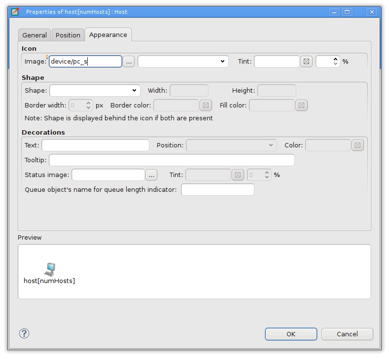

   Editing Visual Properties

.. note::

   You can select several modules at the same time and open the :guilabel:`Properties` dialog to set their common
   properties at the same time.

Changing a Module Parameter
^^^^^^^^^^^^^^^^^^^^^^^^^^^

To change a module parameter, right-click on it and select the :guilabel:`Parameters` menu item from the context
menu. The dialog allows you to add or remove module parameters or assign value to them.

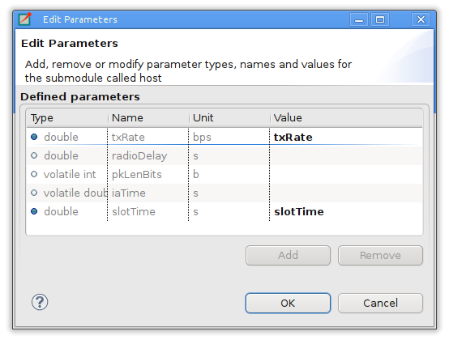

   Editing Module Parameters

Renaming Modules
^^^^^^^^^^^^^^^^

To rename an existing module select its context menu and choose :guilabel:`Rename` or click on an already selected
module a second time. You can specify a new name for the module or even turn a submodule into a vector by adding
``[vectorsize]`` after its name. Alternatively the name of a module can be set in the :guilabel:`Properties` dialog or can
be edited by pressing :kbd:`F6` when the module is selected.

Exporting a Module as an Image
^^^^^^^^^^^^^^^^^^^^^^^^^^^^^^

A module can be exported using several image formats by selecting :guilabel:`Export Image` from the module's context
menu.

Navigation
^^^^^^^^^^

Double-clicking a submodule will open the corresponding module type in a NED editor. Selecting an element in the
graphical editor and then switching to text mode will place the cursor near the previously selected element in the text
editor.

Navigating inside a longer NED file is easier if you open the :guilabel:`Outline View` to see the structure of the file.
Selecting an element in the outline will select the same element in the graphical editor.

If you want to see the selected element in a different view, select the element and right-click on it. Choose
:guilabel:`Show In` from the context menu, and select the desired view.

Opening a NED Type
^^^^^^^^^^^^^^^^^^

If you know only the name of a module type or other NED element, you can use the :guilabel:`Open NED Type` dialog by
pressing :kbd:`Ctrl+Shift+N`. Type the name, or search with wildcards. The requested type will be opened in an editor. This
feature is not tied to the graphical editor: the :guilabel:`Open NED Type` dialog is available from anywhere in the IDE.

Setting Properties
^^^^^^^^^^^^^^^^^^

Elements of the display string and other properties associated with the selected elements can be edited in the
:guilabel:`Properties View`. The Property View is grouped and hierarchically organized; however, you can switch off this
behavior on the view toolbar. Most properties can be edited directly in the :guilabel:`Properties View`, but some also
have specific editors that can be activated by pressing the ellipsis button at the end of the field. Fields marked with
a small light bulb support content assist. Use the :kbd:`Ctrl+SPACE` key combination to get a list of possible values.

.. note::

   The following functions are available only in source editing mode:

   -  Creating or modifying gates
   -  Creating grouped and conditional connections
   -  Adding or editing properties

Editing in Source Mode
~~~~~~~~~~~~~~~~~~~~~~

The NED source editor supports all functionality that one can expect from an Eclipse-based text editor, such as syntax
highlighting, clipboard cut/copy/paste, unlimited undo/redo, folding, find/replace and incremental search.

The NED source is continually parsed as you type, and errors and warnings are displayed as markers on the editor rulers.
At times when the NED text is syntactically correct, the editor has full knowledge of "what is what" in the text buffer.

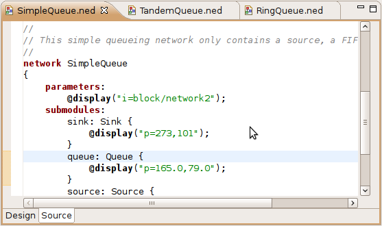

   NED Source Editor

Basic Functions
^^^^^^^^^^^^^^^

-  Undo :kbd:`Ctrl+Z`, Redo :kbd:`Ctrl+Y`

-  Indent/unindent code blocks :kbd:`TAB` / :kbd:`Shift+TAB`

-  Correct indentation (NED syntax aware) :kbd:`Ctrl+I`

-  Find :kbd:`Ctrl+F`, incremental search :kbd:`Ctrl+J`

-  Move lines :kbd:`Alt+UP` :kbd:`Alt+DOWN`

.. tip::

   The following functions can help you explore the IDE:

   -  :kbd:`Ctrl+Shift+L` pops up a window that lists all keyboard bindings, and

   -  :kbd:`Ctrl+3` brings up a filtered list of all available commands.

Converting to the New NED Syntax
^^^^^^^^^^^^^^^^^^^^^^^^^^^^^^^^

If you have an NED file with older syntax, you can still open it. A context menu item allows you to convert it to the
new syntax. If the NED file is already using the new syntax, the :guilabel:`Convert to 4.x Format` menu item is
disabled.

View Documentation
^^^^^^^^^^^^^^^^^^

Hovering the mouse over a NED type name will display the documentation in a "tooltip" window, which can be made
persistent by hitting :kbd:`F2`.

Content Assist
^^^^^^^^^^^^^^

If you need help, just press :kbd:`Ctrl+SPACE`. The editor will offer possible words or templates. This is context sensitive,
so it will offer only valid suggestions. Content assist is also a good way of exploring the new NED syntax and features.

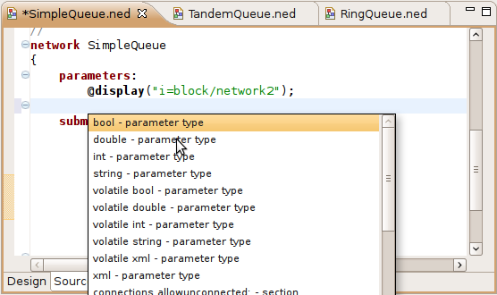

   NED Source Editor with content assist activated

Searching in NED Files
^^^^^^^^^^^^^^^^^^^^^^

Selecting a text or moving the cursor over a word and pressing :kbd:`Ctrl+Shift+G` searches for the selection in all NED files
in the open projects. This function lets you quickly find references to the word or type currently under the cursor. The
results are shown in the standard :guilabel:`Search View`.

Organizing Imports
^^^^^^^^^^^^^^^^^^

Sometimes, it is very inconvenient to add the necessary import statements to the beginning of the NED file by hand. The
IDE can do it for you (almost) automatically. Pressing :kbd:`Ctrl+Shift+O` will cause the IDE to try to insert all necessary
import statements. You will be prompted to specify the used packages in case of ambiguity.

Cleaning Up NED Files
^^^^^^^^^^^^^^^^^^^^^

This function does a general repair on all selected NED files by throwing out or adding import statements as needed,
checking (and fixing) the file's package declaration, and reformatting the source code. It can be activated by clicking
on the :menuselection:`Project --> Clean Up NED Files` menu item from the main menu.

Commenting
^^^^^^^^^^

To comment out the selected lines, press :kbd:`Ctrl+/`. To remove the comment, press :kbd:`Ctrl+/` again.

Formatting the Source Code
^^^^^^^^^^^^^^^^^^^^^^^^^^

It is possible to reformat the whole NED file according to the recommended coding guidelines by activating the
:guilabel:`Format Source` context menu item or by pressing the :kbd:`Ctrl+Shift+F` key combination.

.. note::

   Using the graphical editor and switching to source mode automatically re-formats the NED source code, as well.

Navigation
^^^^^^^^^^

Holding the :kbd:`Ctrl` key and clicking any identifier type will jump to the definition. Alternatively, move the cursor into
the identifier and hit :kbd:`F3` to achieve the same effect.

If you switch to graphical mode from text mode, the editor will try to locate the NED element under the cursor and
select it in the graphical editor.

The Eclipse platform's bookmarking and navigation history facilities also work in the NED editor.

Other Features
~~~~~~~~~~~~~~

Exporting Images
^^^^^^^^^^^^^^^^

To export a compound module as a picture, select the compound module and bring up its context menu, select
:guilabel:`Export Image` and choose file name and type. The module will be exported to the file system. BMP, PNG,
JPEG, SVG and PDF formats are supported.

It is also possible to export images from all (or selected) NED files; the corresponding wizard can be found under
:menuselection:`File --> Export` in the menu.

Associated Views
----------------

There are several views related to the NED editor. These views can be displayed (if not already open) by choosing
:menuselection:`Window --> Show View` in the menu or by selecting a NED element in the graphical editor and selecting
:guilabel:`Show In` from the context menu.

.. note::

   If you are working with very large NED files, you may improve the performance of the editor by closing all NED file
   related views you do not need.

Outline View
~~~~~~~~~~~~

The :guilabel:`Outline View` allows an overview of the current NED file. Clicking on an element will select the
corresponding element in the text or graphical view. It has limited editing functionality; you can copy/cut/paste and
delete an object.

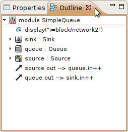

   Outline View

Property View
~~~~~~~~~~~~~

The :guilabel:`Property View` contains all properties of the selected graphical element. Visual appearance, name, type
and other properties can be changed in this view. Some fields have specialized editors that can be activated by clicking
on the ellipsis button in the field editor. Fields marked with a small light bulb icon have content assist support.
Pressing :kbd:`Ctrl+SPACE` will display the possible values the field can hold.

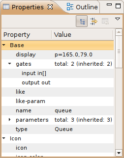

   Properties View

Palette View
~~~~~~~~~~~~

The Palette is normally displayed on the left or right side of the editor area and contains tools to create various NED
elements. It is possible to hide the Palette by clicking on the little arrow in the corner. You can also detach it from
the editor and display it as a normal Eclipse View (:menuselection:`Window --> Show View --> Other --> General --> Palette`).

Problems View
~~~~~~~~~~~~~

The :guilabel:`Problems View` contains error and warning messages generated by the parser. Double-clicking a line will
open the problematic file and move to the appropriate marker.

.. figure:: pictures/NED-ProblemsView.png
   :width: 80%

   Problems View

NED Inheritance View
~~~~~~~~~~~~~~~~~~~~

The :guilabel:`Inheritance View` displays the relationship between different NED types. Select a NED element in the
graphical editor or move the cursor into a NED definition and the :guilabel:`Inheritance View` will display the
ancestors of this type. If you do not want the view to follow the selection in the editor, click the Pin icon on the
view toolbar. This will fix the displayed type to the currently selected one.

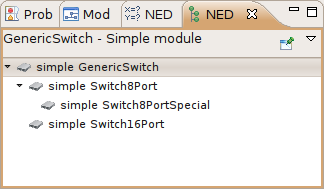

   NED Inheritance View

Module Hierarchy View
~~~~~~~~~~~~~~~~~~~~~

The :guilabel:`Module Hierarchy View` shows the contained submodules and their parameters, several levels deep. It also
displays the parameters and other contained features.

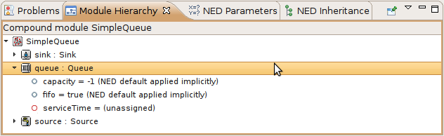

   Module Hierarchy View

Parameters View
~~~~~~~~~~~~~~~

The :guilabel:`Parameters View` shows the parameters of the selected module including inherited parameters.

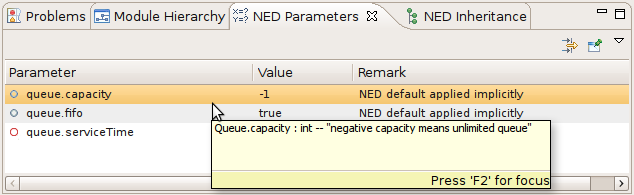

   Outline View

The latter two views are used mainly with the INI File Editor.
