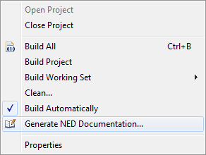
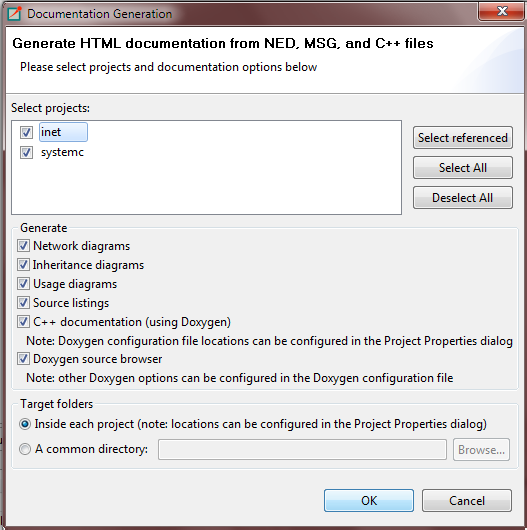
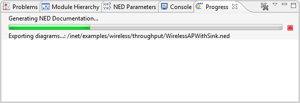
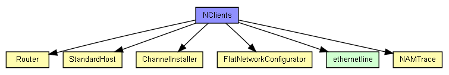
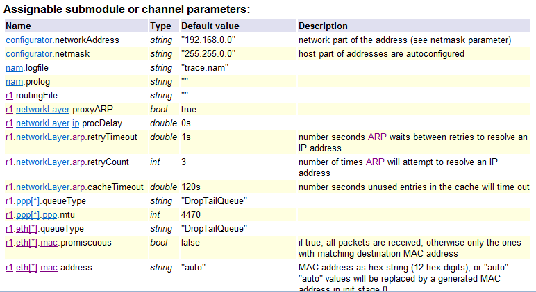

NED Documentation Generator
===========================

Overview
--------

This chapter describes how to use the NED Documentation Generator from the IDE.

Please refer to the |omnet++| Manual for a complete description of the documentation generation features and the available
syntax in NED and MSG file comments.

The generator has several project-specific settings that can be set from the project context menu through the Properties
menu item. The output folders for both NED documentation and C++ documentation can be set separately. The
doxygen-specific configuration is read from the text file :file:`doxy.cfg` by default. The IDE provides a sensible default
configuration for doxygen in case you do not want to go through all the available options. The generated HTML uses CSS
to make its style customizable. You can provide your own style sheet if the default does not meet your needs. In
general, all project-specific settings have good defaults that work well with the documentation generator.

.. figure:: pictures/NEDDOC-ProjectProperties.png
   :width: 60%

   Configuring project-specific settings

To generate NED documentation, you need to select one or more projects. Then, either go to the main :guilabel:`Project` menu or to
the project context menu and select the :guilabel:`Generate NED Documentation` menu item. This will bring up the configuration
dialog where you can set various settings for the current generation before starting it.

   Opening the NED documentation generator

The IDE can generate documentation for multiple projects at the same time. Other options control the content of the
documentation including what kind of diagrams will be generated and whether NED sources should be included. You can
enable doxygen to generate C++ documentation that will be cross-linked from the NED documentation. The tool can generate
the output into each project as configured in the project-specific settings, or into a separate directory. The latter is
useful for exporting standalone documentation for several complex projects at once.

   Configuring the NED documentation generator

The NED generation process might take a while for big projects, so please be patient. For example, the INET project's
complete documentation including the C++ doxygen documentation takes a few minutes to build. You can follow the process
in the IDE's progress monitor.

   Generating NED documentation in progress

The result is a number of cross-linked HTML pages that can be opened by double-clicking the generated :file:`index.html`.
On the left side, you will see a navigation tree, while on the right side there will be an overview of the project. If
you have not yet added a ``@titlepage`` directive into your NED comments, then the overview page will display a default
content.

.. figure:: pictures/NEDDOC-Documentation.png
   :width: 80%

   The resulting NED documentation

The documentation contains various inheritance and usage diagrams that make it easier to understand complex models. The
diagrams are also cross-linked, so that when you click on a box, the corresponding model element's documentation will be
opened. The NED model elements are also exported graphically from the NED Editor. These static images provide
cross-referencing navigation for submodules.

   NED usage diagram

There are also a number of tables that summarize various aspects of modules, networks, messages, packets, etc. The most
interesting is the list of assignable parameters. It shows all parameters from all submodules down the hierarchy that do
not have fixed values. These can be set either through inheritance, encapsulation or from the INI file as experiments.

   NED assignable parameters

There are other tables that list parameters, properties, gates, using modules or networks, and various other data along
with the corresponding descriptions. In general, all text might contain cross-links to other modules, messages, classes,
etc. to make navigation easier.
