The Qtenv Graphical Runtime Environment
=======================================

Features
--------

Qtenv is a graphical runtime interface for simulations. Qtenv supports interactive simulation execution, animation,
inspection, tracing and debugging. In addition to model development and verification, Qtenv is also useful for
presentation and educational purposes, since it allows the user to get a detailed picture of the state and history of
the simulation at any point of its execution.

When used together with a C++ source-level debugger, Qtenv can significantly speed up model development.

Its most important features are:

-  network visualization
-  message flow animation
-  various run modes: event-by-event, normal, fast, express
-  run until (a scheduled event, any event in a module, or given simulation time)
-  simulation can be restarted
-  a different configuration/run or network can be set up
-  log of message flow
-  display of textual module logs
-  inspectors for viewing contents of objects and variables in the model
-  eventlog recording for later analysis
-  capturing a video of the main window
-  snapshots (detailed report about the model: objects, variables, etc.)

Overview of the User Interface
------------------------------

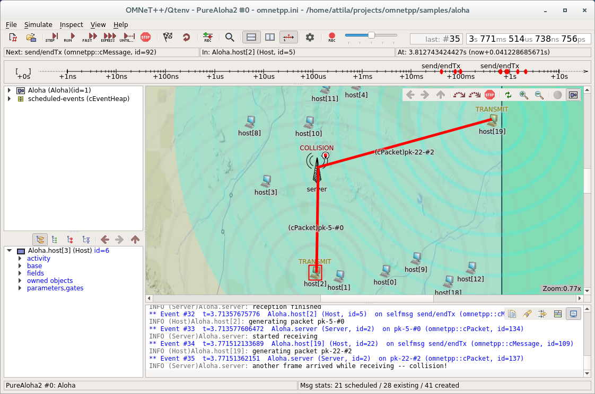

   The main window of Qtenv

.. note::

   If you are experiencing graphics glitches, unreadable text, or the desktop color scheme you have set up is not
   suitable for Qtenv, you can disable the platform integration style plugins of Qt by setting the ``QT_STYLE_OVERRIDE``
   environment variable to ``fusion``. This will make the widgets appear in a platform-independent manner, as shown
   above.

The top of the window contains the following elements below the menu bar:

-  :guilabel:`Toolbar`: The toolbar lets you access the most frequently used functions, such as stepping, running and
   stopping the simulation.
-  :guilabel:`Animation speed`: The slider on the end of the toolbar lets you scale the speed of the built-in
   animations, as well as the playback speed of the custom animations added by the model.
-  :guilabel:`Event Number and Simulation Time`: These two labels on the right end of the toolbar display the event
   number of the last executed or the next future event, and the current simulation time. The display format can be
   changed from context menu.
-  :guilabel:`Top status bar`: Three labels in a row that display either information about the next simulation event (in
   :guilabel:`Step` and :guilabel:`Normal` mode), or performance data like the number of events processed per second (in
   :guilabel:`Fast` and :guilabel:`Express` mode). This can be hidden to free up vertical space.
-  :guilabel:`Timeline`: Displays the contents of the Future Events Set (FES) on a logarithmic time scale. The timeline
   can be turned off to free up vertical space.
-  :guilabel:`Bottom status bar`: Displays the current configuration, the run number, and the name of the root module
   (network) on the left, and a few statistics about the message objects in the model on the right.

The central area of the main window is divided into the following regions:

-  :guilabel:`Object Navigator`: Displays the hierarchy of objects in the current simulation and in the FES.
-  :guilabel:`Object Inspector`: Displays the contents and properties of the selected object.
-  :guilabel:`Network Display`: Displays the network or any module graphically. This is also where animation takes
   place.
-  :guilabel:`Log Viewer`: Displays the log of packets or messages sent between modules, or log messages output by
   modules during simulation.

Additionally, you can open inspector windows that float on top of the main window.

Using Qtenv
-----------

Starting Qtenv
~~~~~~~~~~~~~~

When you launch a simulation from the IDE, by default it will be started with Qtenv. When it does not, you can
explicitly select Qtenv in the :guilabel:`Run` or :guilabel:`Debug` dialog.

Qtenv is also the default when you start the simulation from the command line. When necessary, you can force Qtenv by
adding the ``-u Qtenv`` switch to the command line.

The complete list of command-line options, related environment variables and configuration options can be found at the
end of this chapter.

Setting Up and Running the Simulation
~~~~~~~~~~~~~~~~~~~~~~~~~~~~~~~~~~~~~

On startup, Qtenv reads the ini file(s) specified on the command line (or ``omnetpp.ini`` if none is specified), and
automatically sets up the simulation described in them. If they contain several simulation configurations, Qtenv will
ask you which one you want to set up.

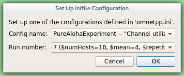

   Setting Up a New Simulation

Once a simulation has been set up (modules have been created and initialized), you can run it in various modes and
examine its state. At any time you can restart the simulation, or set up another simulation. If you choose to quit Qtenv
before the simulation finishes (or try to restart the simulation), Qtenv will ask you whether to finalize the
simulation, which usually translates to saving summary statistics.

Functions related to setting up a simulation are in the :guilabel:`File` and :guilabel:`Simulate` menus,
and the most important ones are accessible via toolbar icons and keyboard shortcuts as well.

Some of these functions are:

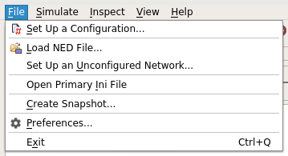

   The File menu

Set up a Configuration
^^^^^^^^^^^^^^^^^^^^^^

This function lets you choose a configuration and run number from the ini file.

Open Primary Ini File
^^^^^^^^^^^^^^^^^^^^^

Opens the first ini file in an text window for viewing.

.. figure:: pictures/Qtenv-simulate-menu.png
   :width: 50%

   The Simulate menu

Step
^^^^

:guilabel:`Step` lets you execute one simulation event, that at the front of the FES. The next event is always shown on
the status bar. The module where the next event will be delivered is highlighted with a red rectangle on the graphical
display.

Run (or Normal Run)
^^^^^^^^^^^^^^^^^^^

In :guilabel:`Run` mode, the simulation runs with all tracing aids on. Message animation is active, simulation time is
interpolated if the model requested a non-zero animation speed, and inspector windows are constantly updated. Output
messages are displayed in the main window and module output windows. You can stop the simulation with the
:guilabel:`Stop` button on the toolbar. You can fully interact with the user interface while the simulation is running
(e.g. you can open inspectors, etc.).

.. note::

   If you find this mode too slow or distracting, you may switch off animation features in the :guilabel:`Preferences`
   dialog.

Fast Run
^^^^^^^^

In :guilabel:`Fast` mode, message animation is turned off. The inspectors are updated much less often. Fast mode is
several times faster than the Run mode; the speed can increase by up to 10 times (or up to the configured event count).

Express Run
^^^^^^^^^^^

In :guilabel:`Express` mode, the simulation runs at about the same speed as with Cmdenv, all tracing disabled. Module
log is not recorded. The simulation can only be interacted with once in a while, thus the run-time overhead of the user
interface is minimal. UI updates can even be disabled completely, in which case you have to explicitly click the
:guilabel:`Update now` button to refresh the inspectors.

Run Until
^^^^^^^^^

You can run the simulation until a specified simulation time, event number or until a specific message has been
delivered or canceled. This is a valuable tool during debugging sessions.
It is also possible to right-click on an event in the simulation timeline and choose the :guilabel:`Run until this
event` menu item.

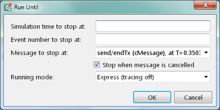

   The Run Until dialog

Run Until Next Event
^^^^^^^^^^^^^^^^^^^^

It is also possible to run until an event occurs in a specified module. Browse for the module and choose :guilabel:`Run
until next event in this module.` Simulation will stop once an event occurs in the selected module.

Debug Next Event
^^^^^^^^^^^^^^^^

This function is useful when you are running the simulation under a C++ source-level debugger. :guilabel:`Debug Next
Event` will perform one simulation event just like :guilabel:`Step`, but executes a software debugger breakpoint
(``int3`` or ``SIGTRAP``) just before entering the module's event handling code (``handleMessage()`` or ``activity()``).
This will cause the debugger to stop the program there, letting you examine state variables, single-step, etc. When you
resume execution, Qtenv will get back control and become responsive again.

Debug On Errors
^^^^^^^^^^^^^^^

This menu item allows you to change the value of the ``debug-on-errors`` configuration variable on the fly. This is
useful if you forgot to set this option before starting the simulation, but would like to debug a runtime error. The
state of this menu item is reset to the value of ``debug-on-errors`` every time Qtenv is started.

Recording an Event Log
^^^^^^^^^^^^^^^^^^^^^^

The |omnet++| simulation kernel allows you to record event related information into a file which later can be used to
analyze the simulation run using the :guilabel:`Sequence Chart` tool in the IDE. Eventlog recording can be turned on
with the ``record-eventlog=true`` ini file option, but also interactively, via the respective item in the
:guilabel:`Simulate` menu, or using a toobar button.

Note that the starting Qtenv with ``record-eventlog=true`` and turning on recording later does not result in exactly the
same eventlog file. In the former case, all steps of setting up the network, such as module creations, are recorded as
they happen; while for the latter, Qtenv has to "fake" a chain of steps that would result in the current state of the
simulation.

Capturing a Video
^^^^^^^^^^^^^^^^^

When active, this feature will save the contents of the main window into a subfolder named ``frames`` in the working
directory with a regular frequency (in animation time). Each frame is a PNG image, with a sequence number in its file
name. Currently the user has to convert (encode) these images into a video file after the fact by using an external tool
(for example ``ffmpeg``, ``avconv``, or ``vlc``). When the recording is started, an info dialog pops up, showing further
details on the output, and an example command for encoding in high quality using ``ffmpeg``. The resulting video is also
affected by the speed slider on the toolbar.

.. note::

   This built-in recording feature is able to produce a smooth video, in contrast to external screen-capture utilities.
   This is possible because it has access to more information, and has more control over the process than external
   tools.

Conclude Simulation
^^^^^^^^^^^^^^^^^^^

This function finalizes the simulation by invoking the user-supplied ``finish()`` member functions on all module and
channel objects in the simulation. The customary implementation of ``finish()`` is to record summary statistics. The
simulation cannot be continued afterwards.

Rebuild Network
^^^^^^^^^^^^^^^

Rebuilds the simulation by deleting the current network and setting it up again. Improperly written simulations often
crash when :guilabel:`Rebuild Network` is invoked; this is usually due to incorrectly written destructors in module
classes.

Inspecting Simulation Objects
~~~~~~~~~~~~~~~~~~~~~~~~~~~~~

Inspectors
^^^^^^^^^^

The :guilabel:`Network Display`, the :guilabel:`Log Viewer` and the :guilabel:`Object Inspector` in the main window
share some common properties: they display various aspects (graphical view / log messages / fields or contents) of a
given object. Such UI parts are called :guilabel:`inspectors` in Qtenv.

The three inspectors mentioned above are built into the main window, but you can open add additional ones at any time.
The new inspectors will open in floating windows above the main window, and you can have any number of them open.

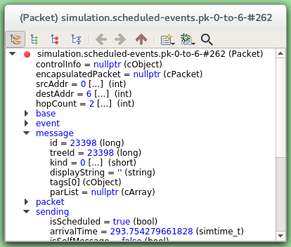

   A floating inspector window

Inspectors come in many flavours. They can be graphical like the network view, textual like the log viewer, tree-based
like the object inspector, or something entirely different.

.. note::

   Some window managers might disable/hide the close button of floating inspectors. If this happens, you can still close
   them with a keyboard shortcut (most commonly
   Alt
   +
   F4
   ), or by right-clicking on the title bar, and choosing the Close option in the appearing menu.

Opening Inspectors
^^^^^^^^^^^^^^^^^^

Inspectors can be opened in various ways: by double-clicking an item in the :guilabel:`Object Navigator` or in other
inspectors; by choosing one of the :guilabel:`Open` menu items from the context menu of an object displayed on the
UI; via the :guilabel:`Find/Inspect Objects` dialog (see later); or even by directly entering the C++ pointer of an
object as a hex value. Inspector-related menu items are in the :guilabel:`Inspect` menu.

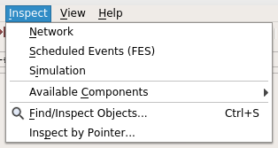

   The Inspect menu

History
^^^^^^^

Inspectors always show some aspect of one simulation object, but they can change objects. For example, in the
:guilabel:`Network View`, when you double-click a submodule which is itself a compound module, the view will switch to
showing the internals of that module; or, the :guilabel:`Object Inspector` will always show information about the object
last clicked in the UI. Inspectors maintain a navigable history: the :guilabel:`Back`/:guilabel:`Forward` functions go
to the object inspected before/after the currently displayed object. Objects that are deleted during simulation also
disappear from the history.

Restoring Inspectors
^^^^^^^^^^^^^^^^^^^^

When you exit and then restart a simulation program, Qtenv tries to restore the open inspector windows. However, as
object identity is not preserved across different runs of the same program, Qtenv uses the object full path, class name
and object ID (where exists) to find and identify the object to be inspected.

Preferences such as zoom level or open/closed state of a tree node are usually maintained per object type (i.e. tied to
the C++ class of the inspected object).

Extending Qtenv
^^^^^^^^^^^^^^^

It is possible for the user to contribute new inspector types without modifying Qtenv code. For this, the inspector C++
code needs to include Qtenv header files and link with the Qtenv library. One caveat is that the Qtenv headers are not
public API and thus subject to change in a new version of |omnet++|.

Using Qtenv with a Debugger
---------------------------

You can use Qtenv together with a C++ debugger, which is mainly useful when developing new models. When you do that,
there are a few things you need to know.

Qtenv is a library that runs as part of the simulation program. This has a lot of implications, the most apparent being
that when the simulation crashes (due to a bug in the model's C++ code), it will bring down the whole OS process,
including the Qtenv GUI.

The second consequence is that suspending the simulation program in a debugger will also freeze the GUI until it is
resumed. Also, Qtenv is single-theaded and runs in the same thread as the simulation program, so even if you only
suspend the simulation's thread in the debugger, the UI will freeze.

The Qtenv UI deals with ``cObject``\ s (the C++ methods that the GUI relies on are defined on ``cObject``). All other data
such as primitive variables, non-``cObject`` classes and structs, STL containers etc, are hidden from Qtenv. You may wrap
objects into ``cObject``\ s to make them visible for Qtenv, that's what e.g. the ``WATCH`` macros do as well.

The following sections go into detail about various parts and functions of the Qtenv UI.

Parts of the Qtenv UI
---------------------

The Status Bars
~~~~~~~~~~~~~~~

The status bars show the simulation's progress. There is one row at the top of the main window, and one at the bottom.
The top one can be hidden using the :menuselection:`View --> Status Details` menu item.

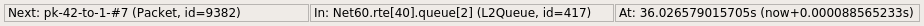

   The top status bar

When the simulation is paused or runs with animation, the top row displays the next expected simulation event. Note the
word :guilabel:`expected`: certain schedulers may insert new events before the displayed event in the last moment. Some
schedulers that tend to do that are those that accept input from outside sources: real-time scheduler, hybrid or
hardware-in-the-loop schedulers, parallel simulation schedulers, etc. Contents of the top row:

1. Name, C++ class and ID of the next message (event) object
2. The module where the next event will occur (i.e. the module where the message will be delivered)
3. The simulation time of the next (expected) simulation event
4. Time of the next event, and delta from the current simulation time

When the simulation is running in :guilabel:`Fast` or :guilabel:`Express` mode, displaying the next event becomes
useless, so the contents of the top row are replaced by the following performance gauges:

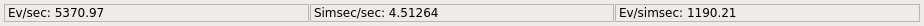

   The top status bar during Fast or Express run

1. Simulation speed: number of events processed per real second
2. Relative speed of the simulation (compared to real-time)
3. Event density: the number of events per simulated seconds

The bottom row contains the following items:

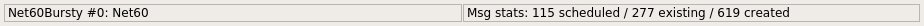

   The bottom status bar

1. Ini config name, run number, and the name of the network
2. Message statistics: the number of messages currently scheduled (i.e. in the FES); the number of message objects that
   currently exists in the simulation; and the number of message objects that have been created this far, including the
   already deleted ones. Out of the three, probably the middle one is the most useful: if it is steadily growing without
   apparent reason, the simulation model is probably missing some ``delete msg`` statements, and needs to be debugged.

The Timeline
~~~~~~~~~~~~

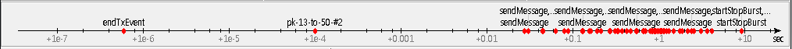

   The timeline

The timeline displays the contents of the Future Events Set on a logarithmic time scale. Each dot represents a message
(event). Messages to be delivered in the current simulation time are grouped into a separate section on the left between
brackets.

Clicking an event will focus it in the :guilabel:`Object Inspector`, and double-clicking will open a floating inspector
window. Right-clicking will bring up a context menu with further actions.

The timeline is often crowded, limiting its usefulness. To overcome this, you can hide uninteresting events from the
timeline: right-click the event, and choose :guilabel:`Exclude Messages Like 'x' From Animation` from the context menu.
This will hide events with similar name and the same C++ class name from the timeline, and also skip the animation when
such messages are sent from one module to another. You can view and edit the list of excluded messages on the
:guilabel:`Filtering` page of the :guilabel:`Preferences` dialog. (Tip: the timeline context menu provides a shortcut to
that dialog).

The whole timeline can be hidden (and revealed again) using the :menuselection:`View --> Timeline` menu item, by pressing a
button on the toolbar, or simply by dragging the handle of the separator under it all the way up.

The Object Navigator
~~~~~~~~~~~~~~~~~~~~

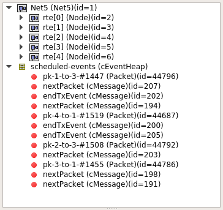

   The object tree

The :guilabel:`Object Navigator` displays inspectable objects reachable from two root objects (the network module and
the FES) in a tree form.

Clicking an object will focus it in the :guilabel:`Object Inspector`, and double-clicking will open a floating inspector
window. Right-clicking will bring up a context menu with further actions.

The Object Inspector
~~~~~~~~~~~~~~~~~~~~

The :guilabel:`Object Inspector` is located below the :guilabel:`Object Navigator`, and lets you examine the contents of
objects in detail. The :guilabel:`Object Inspector` always focuses on the object last clicked (or otherwise selected) on
the Qtenv UI. It can be directly navigated as well, via the :guilabel:`Back`, :guilabel:`Forward`, and :guilabel:`Go to
Parent` buttons, and also by double-clicking objects shown inside the inspector's area.

.. list-table::

   * - .. figure:: pictures/Qtenv-inspector-grouped.png
          :width: 80%

          The object inspector in Grouped mode

     - .. figure:: pictures/Qtenv-inspector-flat.png
          :width: 80%

          The object inspector in Flat mode

The inspector has four display modes: :guilabel:`Grouped`, :guilabel:`Flat`, :guilabel:`Children` and
:guilabel:`Inheritance`. You can switch between these modes using the buttons on the inspector's toolbar.

In :guilabel:`Grouped`, :guilabel:`Flat` and :guilabel:`Inheritance` modes, the tree shows the fields (or data members)
of the object. It uses meta-information generated by the message compiler to obtain the list of fields and their values.
(This is true even for the built-in classes -- the simulation kernel contains their description of msg format.)

The only difference between these three modes is the way the fields are arranged. In :guilabel:`Grouped` mode, they are
organized in categories, in :guilabel:`Flat` mode they form a simple alphabetical list, and in :guilabel:`Inheritance`
mode they are organized based on which superclass they are inherited from.

.. list-table::

   * - .. figure:: pictures/Qtenv-inspector-children.png
          :width: 80%

          The object inspector in Children mode

     - .. figure:: pictures/Qtenv-inspector-inheritance.png
          :width: 80%

          The object inspector in Inheritance mode

In :guilabel:`Children` mode, the tree shows the child objects of the currently inspected object. The child list is
obtained via the ``forEachChild()`` method of the object. This is very similar to how the :guilabel:`Object Navigator`
works, but this can have an arbitrary root.

The Network Display
~~~~~~~~~~~~~~~~~~~

The network view provides a graphical view of the network and in general, modules. Graphical representation is based on
display strings (``@display`` properties in the NED file). You can go into any compound module by double-clicking its
icon.

Message sending, method calls and certain other events are animated in the graphical view. You can customize animation
in the :guilabel:`Animation` page of the :guilabel:`Preferences` dialog.

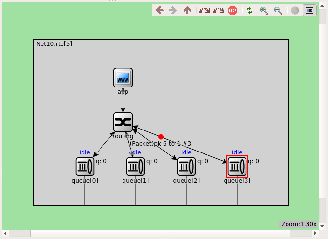

   The network display

The built-in ``cCanvas`` of the inspected object is also rendered in this view together with the module contents to
allow for overlaying custom annotations and animations. This canvas contains the figures declared by the ``@figure``
properties in the NED source of the module.

By choosing the :guilabel:`Show/Hide Canvas Layers` item in the context menu of the inspected module, the displayed
figures can be filtered based on the tags set on them.

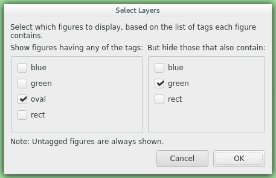

   Figure filtering dialog

Since any figure can have any number of tags, a two-step filtering mechanism is applied to give sufficient control. The
left side is a whitelist, while the right side is a blacklist. The example above would only let all the figures with the
"oval" tag appear, except those that also have the "green" tag on them.

If the inspected module has a built-in ``cOsgCanvas`` (and Qtenv is built with OSG support enabled), this inspector can
also be switched into a 3D display mode with the globe icon on its toolbar. In this case, the 2D network and canvas
display is replaced by the scene encapsulated by the ``cOsgCanvas``.

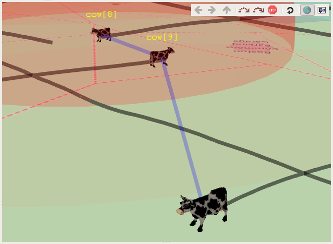

   The network display in 3D mode

The context menu of submodules makes further actions available (see below).

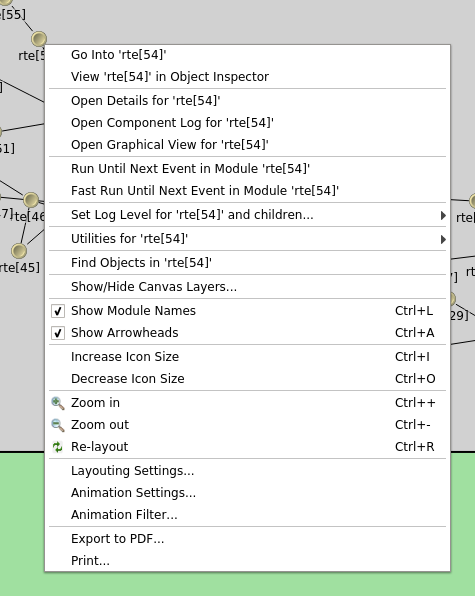

   Submodule context menu

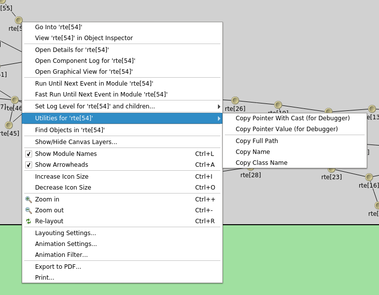

   The Utilities submenu

Zooming and Panning
^^^^^^^^^^^^^^^^^^^

There are several ways for zooming the canvas, both using the mouse and the keyboard:

-  To zoom in around a point, double-click the canvas; use Shift + double-click to zoom out, or scroll while holding
   down Ctrl.

   You can also zoom around the center of the viewport with the looking glass buttons on the canvas toolbar.

-  For marquee zoom, drag out a rectangle with the left mouse button while holding down Ctrl; you can cancel the
   operation with the right mouse button.

-  Panning: moving the mouse while holding down the left mouse button will move the canvas; this is often a more
   comfortable way to navigate the canvas than using the scroll bars. You can of course scroll in any direction with
   simply the mouse wheel, or the similar functionality of many touchpads.

The Log Viewer
~~~~~~~~~~~~~~

When you run the simulation, Qtenv will remember the output from logging statements (``EV << "Hello World\n";``) and the
messages sent between modules, and can present it to you in a meaningful manner. Only the output from the last N events
is preserved (N being configurable in the :guilabel:`Preferences` dialog), and only in Step, Run and Fast Run modes.
(Express mode can be so fast because such overhead is turned off while it's active.)

The :guilabel:`Log Viewer` shows log related to one compound module and its subtree. It has two modes:
:guilabel:`Messages` and :guilabel:`Log` mode, the default being :guilabel:`Messages`. You can switch between the two
modes with tool icons on the inspector's local toolbar.

In :guilabel:`Messages` mode, the window displays messages sent between the (immediate) submodules of the inspected
compound module, and messages sent out of, or into the compound module. The embedded :guilabel:`Log Viewer` shows
content related to the module inspected in the :guilabel:`Network Display` above it at any time. You can view details
about any message in the :guilabel:`Object Inspector` by clicking on it, and access additional functions in its context
menu.

.. note::

   In :guilabel:`Messages` mode, the :guilabel:`Info` column can be customized by writing and registering a custom
   ``cMessagePrinter`` class. This string is split at the tab characters (``'\t'``) into parts that are aligned in
   additional columns.

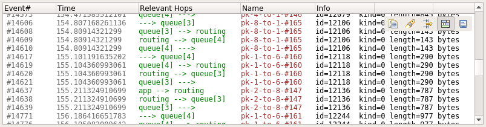

   The log viewer showing message traffic

In :guilabel:`Log` mode, the window displays log lines that belong to submodules under the inspected compound module
(i.e. the whole module subtree.)

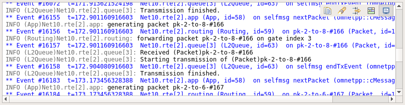

   The log viewer showing module log

You can filter the content of the window to only include messages from specific modules. Open the log window's context
menu and select :guilabel:`Filter Window Contents`.

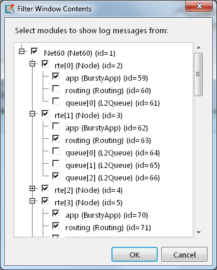

   The log filter dialog

General logging behavior, such as the prefix format, can be controlled in the :guilabel:`Preferences` dialog. The log
level of each module (and its descendants) can be set in its context menu.

It is also possible to open separate log windows for individual modules. A log window for a compound module displays the
log from all of its submodule tree. To open a log window, find the module in the module tree or the network display,
right-click it and choose :guilabel:`Open Component Log` from the context menu.

Inspecting Objects
------------------

Object Inspectors
~~~~~~~~~~~~~~~~~

In addition to the inspectors embedded in the main window, Qtenv also lets you open floating inspector windows for
objects. The screenshow below shows Qtenv with several inspectors open.

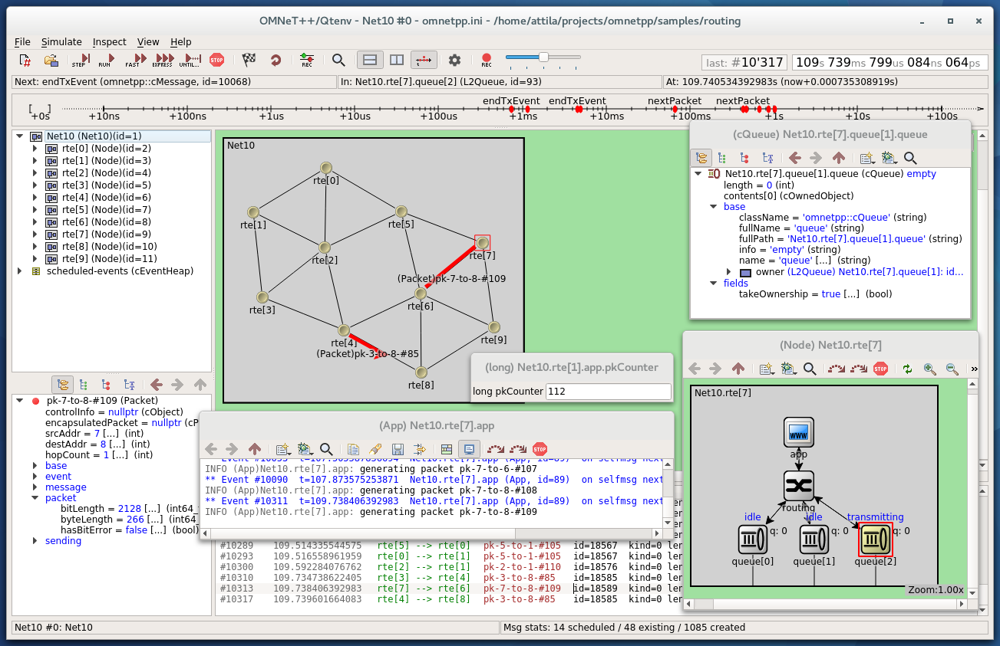

   Qtenv with several floating inspectors open

Browsing the Registered Components
~~~~~~~~~~~~~~~~~~~~~~~~~~~~~~~~~~

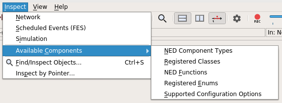

   The Inspect menu

Registered components (NED Types, classes, functions, enums) can be displayed with the :menuselection:`Inspect --> Available
components` menu item. If an error message reports missing types or classes, you can check here whether the missing item
is in fact available, i.e. registered correctly.

Querying Objects
~~~~~~~~~~~~~~~~

The :guilabel:`Find/Inspect Objects` dialog lets you search the simulation for objects that meet certain criteria. The
criteria may be the object name, class name, the value of a field of the object, or the combination of those. The
results are presented in a table which you can sort by columns, and double-click items in it to inspect them.

Some possible use cases:

-  Identifying bottlenecks in the network by looking at the list of all queues, and ordering them by length (i.e. have
   the result table sorted by the :guilabel:`Info` column)
-  Finding nodes with the highest packet drop count. If the drop counts are watched variables (see ``WATCH()`` macro),
   you can get a list of them.
-  Finding modules that leak messages. If the live message count on the status bar keeps climbing up, you can issue a
   search for all message objects, and see where the leaked messages hide.
-  Easy access for some data structures or objects, for example routing tables. You can search by name or class name,
   and use the result list as a collection of hotlinks, sparing you manual navigation in the simulation's object tree.

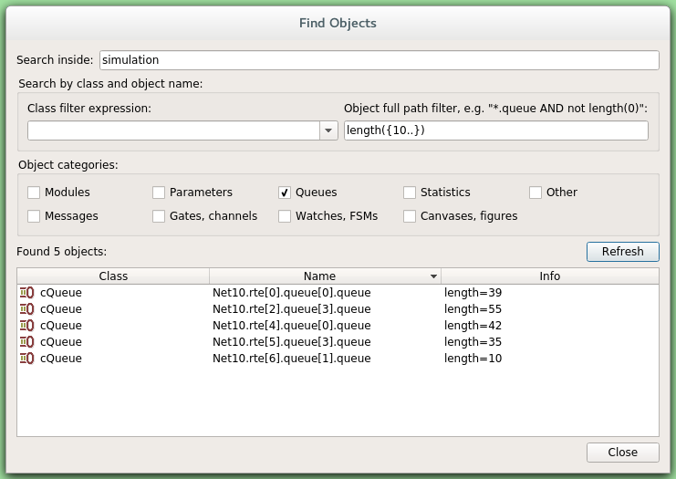

   Using the Find/Inspect Objects dialog for finding long queues

The dialog lets you specify the search root, and the name and class name of the objects to find. The latter two accept
wildcard patterns.

The checkboxes in the dialog can be used to select the object category that interests you. If you select a category, all
objects with that type (and any type derived from it) will be included in the search. Alternatively, if you specify
object class as a class filter expression, the search dialog will try to match the object's class name with the given
string, meaning that objects of derived types will not be included.

You can also provide a generic filter expression, which matches the object's full path by default. Wildcards (``"?"``,
``"*"``) are allowed. ``"{a-exz}"`` matches any character in the range ``"a".."e"`` plus ``"x"`` and ``"z"``. You can
match numbers: ``"*.job{128..191}"`` will match objects named ``"job128"``, ``"job129"``, , ``"job191"``.
``"job{128..}"`` and ``"job{..191}"`` are also understood. You can combine patterns with ``AND``, ``OR`` and ``NOT`` and
parentheses (lowercase ``and``, ``or``, ``not`` are also accepted). You can match other object fields such as queue
length, message kind, etc., with the syntax ``fieldname =~ pattern``. If the pattern contains special characters or space,
you need to enclose it in quotes. (HINT: You will want to start the pattern with ``"*."`` in most cases to match objects
anywhere in the network!).

Examples:

-  ``*.destAddr`` : Matches all objects with the name ``"destAddr"`` (likely module parameters).
-  ``*.node[8..10].*`` : Matches anything inside module ``node[8], node[9]`` and ``node[10]``.
-  ``className =~ omnetpp::cQueue AND NOT length =~ 0`` : Matches non-empty queue objects.
-  ``className =~ omnetpp::cQueue AND length =~ {10..}`` : Matches queue objects with length>=10.
-  ``kind =~ 3 OR kind =~ {7..9}`` : Matches messages with message kind equal to 3, 7, 8 or 9 (only messages have a
   ``"kind"`` attribute).
-  ``className =~ IP* AND *.data-*`` : Matches objects whose class name begins with ``"IP"`` and name begins with
   ``"data-".``
-  ``NOT className =~ omnetpp::cMessage AND byteLength =~ {1500..}`` : Matches messages whose class is not cMessage and
   byteLength is at least 1500 (only messages have a ``"byteLength"`` attribute).
-  ``"TCP packet" OR "*.packet(15)"`` : Quotation marks needed when pattern is a reserved word or
   contains whitespace or special characters

.. note::

   Qtenv uses the ``cObject::forEachChild`` method to collect all objects from a tree recursively. If you have your own
   objects derived from ``cObject``, you should redefine the ``cObject::forEachChild`` to function correctly with an
   object search.

.. note::

   The class names have to be fully qualified, that is, they should contain the namespace(s) they are in, regardless of
   the related setting in the :guilabel:`Preferences dialog`.

.. note::

   If you are debugging the simulation with a source level debugger, you may also use the :guilabel:`Inspect by pointer`
   menu item. Let the debugger display the address of the object to be inspected, and paste it into the dialog. Please
   note that entering an invalid pointer will crash the simulation.

The Preferences Dialog
----------------------

Select :menuselection:`File --> Preferences` from the menu to display the runtime environment's configuration dialog. The
dialog lets you adjust various display, network layouting and animation options.

General
~~~~~~~

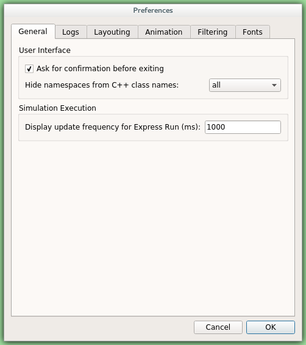

   General settings

The :guilabel:`General` tab can be used to set the default user interface behavior. It is possible to set whether
namespaces should be stripped off the displayed class names, and how often the user interface will be updated while the
simulation runs in :guilabel:`Express` mode.

Logs
~~~~

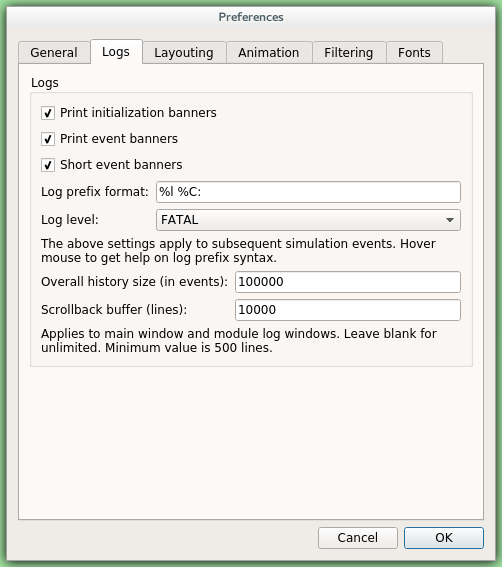

   Logging settings

The :guilabel:`Logs` tab can be used to set the default logging behavior, such as the log level of modules that do not
override it, the prefix format of event banners, and the size limit of the log buffer.

Configuring the Layouting Algorithm
~~~~~~~~~~~~~~~~~~~~~~~~~~~~~~~~~~~

.. figure:: pictures/Qtenv-pref-layouting.png
   :width: 60%

   Layouting settings

Qtenv provides automatic layouting for submodules that do not have their locations specified in the NED files. The
layouting algorithm can be fine-tuned on the :guilabel:`Layouting` page of this dialog.

Configuring Animation
~~~~~~~~~~~~~~~~~~~~~

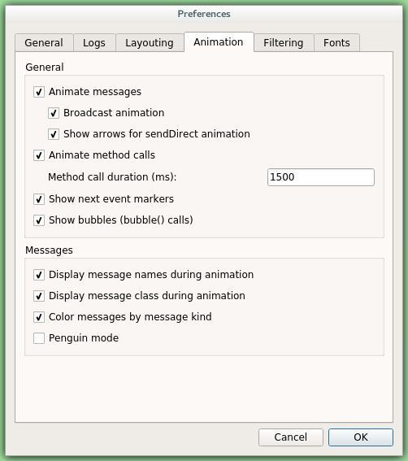

   Animation settings

Qtenv provides automatic animation when you run the simulation. You can fine-tune the animation settings using the
:guilabel:`Animation` page of the settings dialog. If you do not need all visual feedback Qtenv provides, you can
selectively turn off some of the features:

-  Animate messages: Turns on/off the visualization of messages passing between modules.
-  Broadcast animation: Handles message broadcasts in a special way (zero-time messages sent within the same event will
   be animated concurrently).
-  Show next event marker: Highlights the module which will receive the next event.
-  Show a dotted arrow when a ``sendDirect()`` method call is executed.
-  Show a flashing arrow when a method call occurs from one module to another. The call is only animated if the called
   method contains the ``Enter_Method()`` macro.
-  The display of message names and classes can also be turned off.

Timeline and Animation Filtering
~~~~~~~~~~~~~~~~~~~~~~~~~~~~~~~~

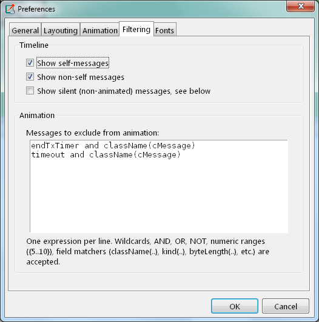

   Filtering

The :guilabel:`Filtering` page of the dialog serves two purposes. First, it lets you filter the contents of the
:guilabel:`Timeline`. You can hide all self-messages (timers), or all non-self messages, and you can further reduce the
number of messages shown on the timeline by also hiding the non-animated messages, explained below.

Second, you can suppress the animation of certain messages. For example, when your focus is routing protocol messages,
you can suppress the animation of data traffic.

The text box lets you specify several filters, one per line. You can filter messages by name, class name, or by any
other property that appears in the :guilabel:`Fields` page of the :guilabel:`Object Inspector` when you focus it on the
given message object.

.. note::

   When you select :guilabel:`Exclude Messages Like 'x' From Animation` from the context menu of a message object
   somewhere in the UI, it will add a new filter on this dialog page.

For object names, wildcards (``"?"``, ``"*"``) are allowed. ``"{a-exz}"`` matches any character in the range
``"a".."e"`` plus ``"x"`` and ``"z"``. You can match numbers: ``"job{128..191}"`` will match ``"job128"``, ``"job129"``,
``"job191"``. ``"job{128..}"`` and ``"job{..191}"`` are also understood. You can combine patterns with ``AND``,
``OR`` and ``NOT`` and parentheses (lowercase and, or, not are also acceptable). You can match against other object
fields such as message length, message kind, etc. with the syntax ``fieldname =~ pattern``. Put quotation marks around a
pattern if it contains special characters.

Some examples:

-  ``m*`` : matches any object whose name begins with "m"
-  ``m* AND *-{0..250}`` : matches any object whose name begins with "m" and ends with a dash and a number between 0
   and 250
-  ``NOT *timer*`` : matches any object whose name does not contain the substring "timer"
-  ``NOT (*timer* OR *timeout*)`` : matches any object whose name contains neither "timer" nor "timeout"
-  ``kind =~ 3 OR kind =~ {7..9}`` : matches messages with message kind equal to 3, 7, 8 or 9
-  ``className =~ IP* AND data-*`` : matches objects whose class name begins with "IP" and name begins with "data-"
-  ``NOT className =~ omnetpp::cMessage AND byteLength =~ {1500..}`` : matches objects whose class is not cMessage and whose
   byteLength is at least 1500
-  ``"TCP packet" OR "*.packet(15)"`` : Quotation marks needed when pattern is a reserved word or
   contains whitespace or special characters

There is also a per-module setting the models can adjust programatically that can prevent any animations taking place
when inspecting a given module (``setBuiltinAnimationsAllowed()``).

Configuring Fonts
~~~~~~~~~~~~~~~~~

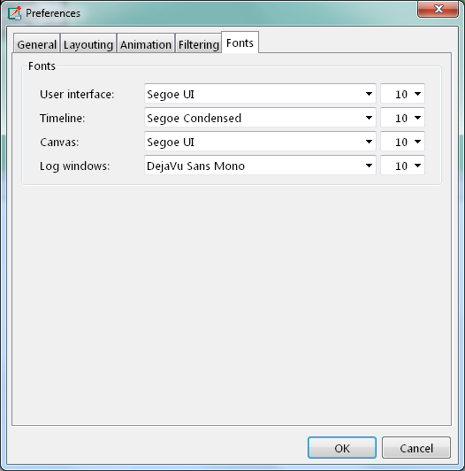

   Font selection

The :guilabel:`Fonts` page of the settings dialog lets you select the typeface and font size for various user interface
elements.

The .qtenvrc File
~~~~~~~~~~~~~~~~~

Settings are stored in ``.qtenvrc`` files. There are two ``.qtenvrc`` files: one is stored in the current directory and
contains project-specific settings like the list of open inspectors; the other is saved into the user's home directory
and contains global settings.

.. note::

   Inspectors are identified by their object names. If you have several components that share the same name (this is
   especially common for messages), you may end up with a lot of inspector windows when you start the simulation. In
   such cases, you may simply delete the ``.qtenvrc`` file.

Qtenv and C++
-------------

This section describes which C++ API functions various parts of Qtenv employ to display data and otherwse perform their
functions. Most functions are member functions of the ``cObject`` class.

Inspectors
~~~~~~~~~~

Inspectors display the hierarchical name (i.e. full path) and class name of the inspected object in the title using the
``getFullPath()`` and ``getClassName()`` ``cObject`` member functions. The :guilabel:`Go to parent` feature in
inspectors uses the ``getOwner()`` method of ``cObject``.

The :guilabel:`Object Navigator` displays the full name and class name of each object (``getFullName()`` and
``getClassName()``), and also the ID for classes that have one (``getId()`` on ``cMessage`` and ``cModule``). When you
hover with the mouse, the tooltip displays the info string (``str()`` method). The roots of the tree are the network
module (``simulation.getSystemModule()``) and the FES (``simulation.getFES()``. Child objects are enumerated with the
help of the ``forEachChild()`` method.

The :guilabel:`Object Inspector` in :guilabel:`Children` mode displays the full name, class name and info string
(``getFullName()``, ``getClassName()``, ``str()``) of child objects enumerated using ``forEachChild()``.
``forEachChild()`` can only enumerate objects that are subclassed from ``cObject``. If you want your non-``cObject``
variables (e.g. primitive types or STL containers) to appear in the :guilabel:`Children` tree, you need to wrap them
into ``cObject``. The ``WATCH()`` macro does exactly that: it creates an object wrapper that displays the variable's
value via the wrapper's ``str()`` method. There are watch macros for STL contains as well, they present the wrapped
object to Qtenv in a more structured way, via custom class descriptors (cClassDescriptor, see below).

One might ask how the ``forEachChild()`` method of modules can enumerate messages, queues, and other objects that are
owned by the module. The answer is that the module class maintains a list of owned objects, and ``cObject``
automatically joins that list.

The :guilabel:`Object Inspector` displays an object's fields by making use of the class descriptor
(``cClassDescriptor``) for that class. Class descriptors are automatically generated for new classes by the message
compiler. Class descriptors for the |omnet++| library classes are also generated by the message compiler, see
``src/sim/sim_std.msg`` in the source tree.

The :guilabel:`Network Display` uses ``cSubmoduleIterator`` to enumerate submodules, and its :guilabel:`Go to parent
module` function uses ``getParentModule()``. Background and submodule rendering is based on display strings
(``getDisplayString()`` method of ``cComponent``).

The module log page of :guilabel:`Log Viewer` displays the output to ``EV`` streams from modules and channels.

The message/packet traffic page of :guilabel:`Log Viewer` shows information based on stored copies of sent messages (the
copy is created using ``dup()``), and stored sendhop information. The :guilabel:`Name` column displays the message name
(``getFullName()``). However, the :guilabel:`Info` column does not display the string returned from ``str()``, but
rather, strings produced by a ``cMessagePrinter`` object. Message printers can be dynamically registered.

During Simulation
~~~~~~~~~~~~~~~~~

Qtenv sets up a network by calling ``simulation.setupNetwork()``, then immediately proceeds to invoke
``callInitialize()`` on the root module. During simulation, ``simulation.takeNextEvent()`` and
``simulation.executeEvent()`` are called iteratively. When the simulation ends, Qtenv invokes ``callFinish()`` on the
root module; the same happens when you select the :guilabel:`Conclude Simulation` menu item. The purpose of
``callFinish()`` is to record summary statistics at the end of a successful simulation run, so it will be skipped if an
error occurs during simulation. On exit, and before a new network is set up, ``simulation.deleteNetwork()`` is called.

The :guilabel:`Debug Next Event` menu item issues the ``int3`` x86 assembly instruction on Windows, and raises a
``SIGTRAP`` signal on other systems.

Reference
---------

Command-Line Options
~~~~~~~~~~~~~~~~~~~~

A simulation program built with Qtenv accepts the following command line switches:

-  ``-h``: The program prints a help message and exits.
-  ``-u Qtenv``: Causes the program to start with Qtenv. (This is the default, unless the program hasn't been linked
   with Qtenv, or has another, custom environment library with a higher priority than Qtenv.)
-  ``-f filename``: Specifies the name of the configuration file. The default is ``omnetpp.ini``. Multiple ``-f``
   switches can be given; this allows you to partition your configuration file. For example, one file can contain your
   general settings, another one most of the module parameters, and a third one the module parameters you change
   frequently. The ``-f`` switch is optional and can be omitted.
-  ``-l filename``: Loads a shared library (``.so`` file on Unix, ``.dll`` on Windows, and ``.dylib`` on Mac OS X).
   Multiple ``-l`` switches are accepted. Shared libraries may contain simple modules and other, arbitrary code. File
   names may be specified without the file extension and the ``lib`` name prefix (i.e. ``foo`` instead of
   ``libfoo.so``).
-  ``-n filepath``: When present, overrides the ``NEDPATH`` environment variable and sets the source locations for
   simulation NED files.
-  ``-c configname``: Selects an INI configuration for execution.
-  ``-r runnumber``: It has the same effect as (but takes priority over) the :guilabel:`qtenv-default-run=` INI file
   configuration option. Run filters are also accepted. If there is more than one matching run, they are grouped to the
   top of the combobox.

Environment Variables
~~~~~~~~~~~~~~~~~~~~~

-  ``OMNETPP_IMAGE_PATH``: It controls where Qtenv will load images for network graphics (modules, background, etc.)
   from. The value should be a semicolon-separated list of directories, but on non-Windows systems, the colon is also
   accepted as separator. The default is ``./bitmaps;./images;<omnetpp>/images``, that is, by default Qtenv looks into
   the ``bitmaps`` and ``images`` folder of the simulation, and ``images`` folder in the working directory of your
   installation. The directories will be scanned recursively, and subdirectory names become part of the icon name; for
   example, if an ``images/`` directory is listed, the file ``images/misc/foo.png`` will be registered as icon
   ``misc/foo``. PNG, JPG and GIF files are accepted.
-  ``OMNETPP_DEBUGGER_COMMAND``: When set, overrides the factory default for the command used to launch the just-in-time
   debugger (``debugger-attach-command``). It must contain '%u' (which will be substituted with the process ID of the
   simulation), and must not contain any additional '%' characters. Since the command has to return immediately, on
   Linux and macOS it is recommended that it ends with an ampersand ('&'). Settings on the command line or in an
   ``.ini`` file take precedence over this environment variable.

Configuration Options
~~~~~~~~~~~~~~~~~~~~~

Qtenv accepts the following configuration options in the INI file.

-  ``qtenv-extra-stack``: Specifies the extra amount of stack (in kilobytes) that is reserved for each ``activity()``
   simple module when the simulation is run under Qtenv. This value is significantly higher than the similar one for
   Cmdenv (handling GUI events requires a large amount of stack space).
-  ``qtenv-default-config``: Specifies which INI file configuration Qtenv should set up automatically after startup. If
   there is no such option, Qtenv will ask which configuration to set up.
-  ``qtenv-default-run``: Specifies which run of the selected configuration Qtenv should set up after startup. If there
   is no such option, Qtenv will ask.

All other Qtenv settings can be changed via the GUI, and are saved into the ``.qtenvrc`` file in the user's home
directory or in the current directory.
