Analyzing the Results
=====================

Overview
--------

Analyzing the simulation result is a time consuming process. The result
of the simulation is recorded as scalar values, vector values,
histograms, and evaluated parameters. Information about each run, such
as iteration variables, configuration entries, and run attributes, are
also stored. You can then apply statistical methods to extract the
relevant information and to draw a conclusion. This process may include
several steps. Usually you need to filter and transform the data, and
chart the result. Automation is very important here - you do not want to
repeat the steps of recreating charts every time you rerun simulations.

In |omnet++| 6.x, the statistical analysis tool is integrated into the
Eclipse environment. Querying, processing and plotting the simulation
results is done with Python 3 scripts, using APIs provided by the IDE.
These scripts and APIs rely heavily on the NumPy, Pandas, and Matplotlib
Python packages. Your scripts and settings (i.e. your recipe for finding
results from the raw data) will be recorded in analysis files (.anf) and
will become instantly reproducible. This means that if simulations need
to be rerun due to a model bug or misconfiguration, existing charts need
not be recreated all over again. Simply replacing the old result files
with the new ones will result in the charts being automatically
displayed with the new data.

When creating an analysis, the user first selects the input of the
analysis by specifying file names or file name patterns (e.g.
``adhoc-*.vec``). Data in result files are tagged with meta information.
Experiment, measurement and replication labels are added to the result
files to make the filtering process easy. It is possible to create very
sophisticated filtering rules (e.g. all 802.11 retry counts of
host[5..10] in experiment X, where the iteration variable numHost had a
value of 7).

You can open charts from the selected data with one click. The Analysis
Editor supports bar charts, line charts, histogram charts and scatter
charts. Charts are interactive; users can zoom, scroll, and access
tooltips that give information about the data items.

Charts can be customized. Some of the customizable options include
titles, fonts, legends, grid lines, colors, line styles, and symbols.

The charts made in the IDE can also be viewed and exported later
from the command line, using a tool called ``opp_charttool``. Its
usage and operation is detailed in the Simulation Manual.

Creating Analysis Files
-----------------------

The usual way of creating an analysis file is to "imitate" opening an |omnet++|
result file by double-clicking it in the :guilabel:`Project Explorer` view.
Result files cannot be opened directly, so the IDE will offer creating an
analysis file for it instead.

If the result file name looks like the file was created as part of an experiment
or parameter study, the IDE creates an analysis file that includes all result
files from that experiment as input. The variable part of the file name will be replaced by
an asterisk (``*``), will be added with both the ``.sca`` and ``.vec`` file extension.
For example, double-clicking a file called ``PureAloha-numHosts=10,iaMean=1-#3.sca``
will add ``PureAloha-*.sca`` and ``PureAloha-*.vec`` to the analysis.

Upon double-clicking, the :guilabel:`New Analysis File` dialog will open. The
folder and the file name are pre-filled according to the location and name of
the result file. Press :guilabel:`Finish` to create the new analysis file.

The same dialog is also available from the menu as :menuselection:`File --> New
--> Analysis File`. However, analysis files created that way will contain no
reference to result files, so file name patterns will need to be added later.

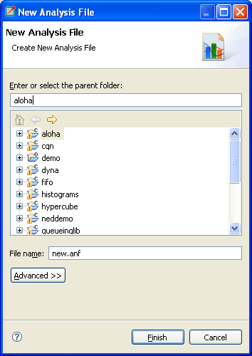

   New Analysis File dialog

.. tip::

   If the analysis file already exists, double-clicking on the result
   file will open it.

Opening Older Analysis Files
----------------------------

The format of the analysis files (``*.anf``) has changed in |omnet++| 6.0 in a
non-backward compatible way, meaning that older |omnet++| versions will not be
able to open new analysis files. |omnet++| 6.0, however, attempts to open and
convert analysis files created by older versions. Keep in mind that the
conversion is "best-effort": the result may be incomplete or incorrect. Always
check that the converted charts indeed correspond to the original ones, and
refine the result if needed.

Using the Analysis Editor
-------------------------

The usual workflow of result analysis consists of a few distinct steps.
These are: adding input files to the analysis, browsing simulation results
and selecting those of interest, creating a chart of an appropriate type from
the results, then viewing them as plots, and finally exporting data and/or
images if needed.

The Analysis Editor is implemented as a multi-page editor. What the editor
edits is the "recipe": what result files to take as inputs, and what kind of
charts to create from them. The pages (tabs on the bottom) of the editor
roughly correspond to some of the steps described above.

In the next sections, we will go through the individual pages of the editor,
and which analysis steps can be performed using them.

The Inputs Page
---------------

The first page in the editor is the :guilabel:`Inputs` page, where you specify
input files for analysis. You can add a set of file name patterns that specify
which result files to load. When the IDE expands the patterns, it displays the
list of matched files under each one. The contents of files are also displayed
in a tree structure.

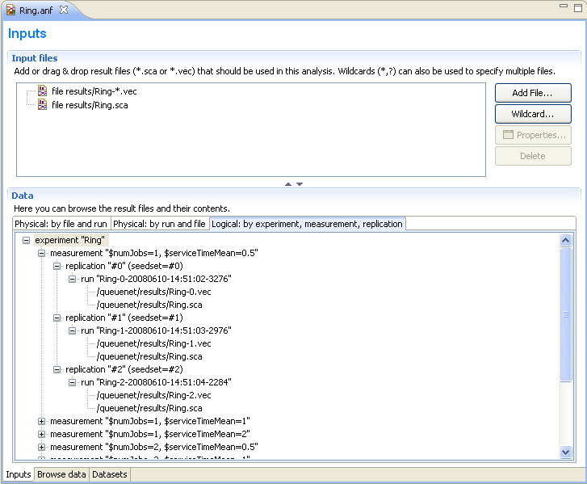

   The Inputs page

New input files can be added to the analysis by dragging vector and scalar files
from the :guilabel:`Project Explorer` view, or by opening a dialog with the
:guilabel:`New Input` button on the local toolbar.

Resolution Rules
^^^^^^^^^^^^^^^^

Input file patterns are resolved with the following rules:

1. An asterisk (``*``) matches files/folders within a single folder;
2. A double asterisk (``**``) may match multiple levels in the folder hierarchy;
3. If the pattern starts with slash (``/``), it is understood as a workspace full path,
   with its first component being a project name;
4. If the pattern does not start with slash (``/``),  it is interpreted as
   relative to the folder of the analysis file;
5. If the pattern identifies a folder, it will match all result files in it
   (i.e. ``/foo/results`` is equivalent to ``/foo/results/**.sca`` plus
   ``/foo/results/**.vec``).

Refresh Files
^^^^^^^^^^^^^

The input files are loaded when the analysis file is opened.

If files change on the disk or new files are created while the analysis is open
(for example, because a simulation was re-run), a refresh can be triggered with the
:guilabel:`Refresh Files` button on the toolbar. :guilabel:`Refresh Files` expands
the file name patterns again, then loads any new matching files, unloads files
that no longer exist on the disk, and reloads the files that have changed
since being loaded. Open charts are also refreshed.

.. note::

   In the design of the Analysis Tool, it was a conscious choice to opt for
   explicit reload in favor of an automatic one. Automatic reload would make it
   difficult to look at partial results due to excessive refreshing while a large
   simulation campaign is underway, or when a simulation is continually writing
   into a loaded vector file.

Reload Files
^^^^^^^^^^^^

It is also possible to let the Analysis Tool completely forget all loaded result files,
and have them reloaded from scratch. The functionality is available from the
context menu as :guilabel:`Reload All Files`.

Are Files Kept in Memory?
^^^^^^^^^^^^^^^^^^^^^^^^^

The contents of scalar files *are* loaded in memory.

Vector files are not loaded directly; instead, a much smaller index file
(``*.vci``) is created and the vector attributes (name, module, run, statistics,
etc.) are loaded from the index file. The index files are generated during the
simulation, but can be safely deleted without loss of information. If the index
file is missing or the vector file was modified, the IDE rebuilds the index in
the background.

.. tip::

   The :guilabel:`Progress` view displays the progress of the
   indexing process if it takes a long time.

The Browse Data Page
--------------------

The second page of the Analysis editor displays results (parameters,
scalars, histograms, and vectors) from all files in tables and lets the
user browse them. Results can be sorted and filtered. Simple filtering
is possible with combo boxes, or when that is not enough, the user can
write arbitrarily complex filters using a generic pattern-matching
expression language. Selected or filtered data can be immediately
plotted.

.. tip::

   You can switch between the :guilabel:`All`, :guilabel:`Parameters`,
   :guilabel:`Scalars`, :guilabel:`Histograms`, and :guilabel:`Vectors`
   pages using the underlined shortcuts (:kbd:`Alt+letter` combination) or the
   :kbd:`Ctrl+PgUp` and :kbd:`Ctrl+PgDown` keys.

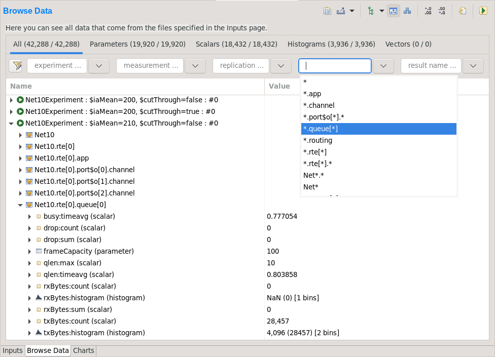

   Browsing all data generated by the simulation

The :guilabel:`All` tab shows a tree containing all loaded result items.
The structure of this tree can be altered with the :guilabel:`Tree Levels`
and :guilabel:`Flat Module Tree` options on the local toolbar and in the
context menu.

The other tabs show tables containing the values and attributes of
all results of the given type. To hide or show table columns, open
:guilabel:`Choose table columns` from the context menu and select
the columns to be displayed. The settings are persistent and applied
in each subsequently opened editor. The table rows can be sorted by
clicking on the column name.

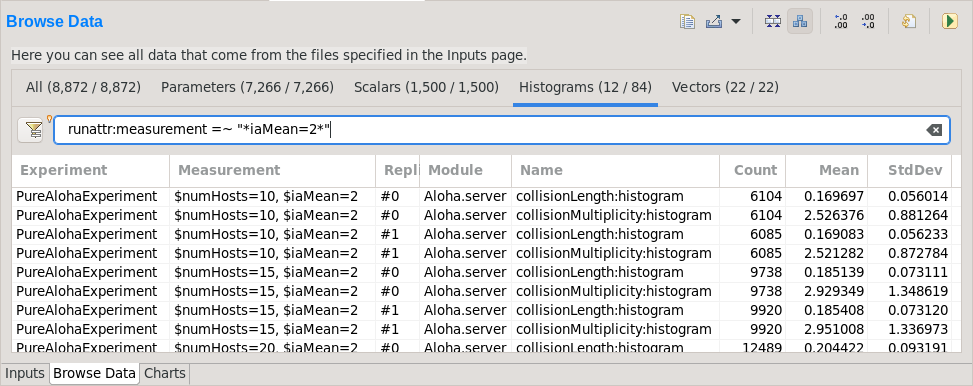

   Browsing a subset of result items selected using a filter expression

Individual fields of composite results (eg. the `:mean` and `:count` fields
of statistics, histograms or vectors) can also be included as scalars by
enabling the :guilabel:`Show Statistics/Vector Fields as Scalars` option.

Filtering
^^^^^^^^^

Filtering of the table contents is possible with the combo boxes above the
tables. The strings in the combo boxes may contain wildcards, and the combo
boxes also support content assist (:kbd:`Ctrl+SPACE`), both of which are useful if
there are a huge number of items with different names.

If a more sophisticated selection criteria is needed, it is possible to switch
to a more generic filter expression. After pressing the :guilabel:`Filter
Expression` button in the filter row, you can enter an arbitrary filter
expression. The expression language is described in section
:ref:`ana-filter-expression`.

Plotting
^^^^^^^^

You can display the selected data items on a chart. To open the chart, choose
one of the :guilabel:`Plot` items from the context menu, or press Enter
(double-click also works for single data lines). See section
:ref:`ana-creating-charts` for more information.

Viewing the Details of Result Items
^^^^^^^^^^^^^^^^^^^^^^^^^^^^^^^^^^^

To see the properties of the selected result item, open the
:guilabel:`Properties` view. This is useful for checking properties that are not
displayed in the table, such as result attributes (``title``, ``unit``,
``interpolationmode``, etc.), or the full list of bins of a histogram.

Viewing the Contents of a Vector
^^^^^^^^^^^^^^^^^^^^^^^^^^^^^^^^

When selecting a vector, its data can also be displayed in a table.
Make sure that the :guilabel:`Output Vector` view is opened. If it is
not open, you can open it from the context menu (:guilabel:`Show Output
Vector View`). This view always shows the contents of the selected vector.

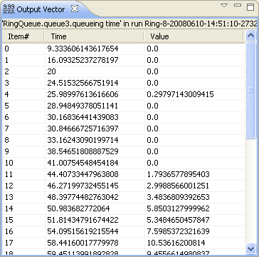

   The Output Vector View With its Context Menu

Exporting Data
^^^^^^^^^^^^^^

Selected results can be exported to files in different data formats
using the :guilabel:`Export Data` context menu option. After selecting
the data format, a dialog to select the output file and configure additional
exporting options is shown.

A variety of formats is available, including two CSV-based ones (CSV-R for
programmatic consumption and CSV-S for loading into spreadsheets), SQLite,
JSON, and so on. Vectors can be also cropped to a time interval in the export.

.. tip::

   You can switch between the :guilabel:`Inputs`, :guilabel:`Browse Data` and
   :guilabel:`Charts` pages using the :kbd:`Alt+PgUp` and :kbd:`Alt+PgDown`
   keys.

The Charts Page
---------------

The third page displays the charts created during the analysis.

This page works much like a usual graphical file manager. Each icon
represents a chart, and the charts can be selected, reordered by dragging,
copied, pasted, renamed, deleted, opened, or their context menu accessed.

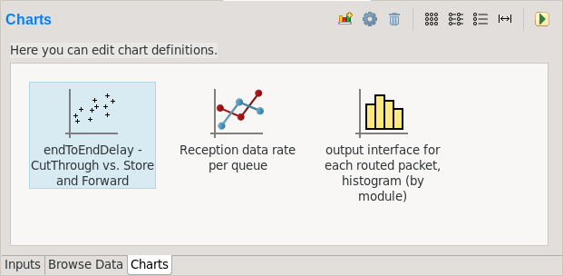

   Charts Page

The Outline View
----------------

The :guilabel:`Outline` view shows an overview of the current analysis. Clicking
on an element will select the corresponding element in the editor.

.. tip::

   If you select a chart which is currently open, the editor will switch to its
   page in the editor instead of selecting it in the :guilabel:`Charts` page. If
   there are many charts open, this can actually be a more convenient way of
   switching between them than using the tabs at the bottom of the editor window.

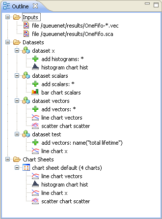

   Outline View of the analysis

.. _ana-creating-charts:

Creating Charts
---------------

The following sections walk you through working with charts,
starting from the very basics, all the way to more advanced
topics involving Python scripting.

Charts can be created in two ways: first, based on the set of selected results
on the :guilabel:`Browse Data` page, and second, choosing from the list of
available chart types on the :guilabel:`Charts` page. In the latter case, the
results which serve as input for the chart need to be configured manually, while
in the former case it happens implicitly.

Various types of charts are available. There are a number of
built-in ones, and you can also add your own to your projects.

The Analysis Tools can display plots in two ways: with Matplotlib, and with the
built-in ("native") plot widgets. The former one makes the full functionality of
Matplotlib available in the IDE (which basically means that you can draw
anything). In contrast, native plot widgets are more limited in functionality,
can only display three types of plots (bar, line, and histogram plot), but they
are also more responsive and much more scalable.

.. note::

   It is usually indicated in the name of a chart type whether it is
   Matplotlib-based or uses a native plot widget.

.. _ana-plotting-results:

From the Browse Data Page
^^^^^^^^^^^^^^^^^^^^^^^^^

Most often, a new chart is created from a set of simulation results,
selected on the :guilabel:`Browse Data` page.

First, select the results you wish to plot. Then, right-clicking on the selected
set of results presents you with a choice of chart templates, showing only those
that accept the given set of results as input.

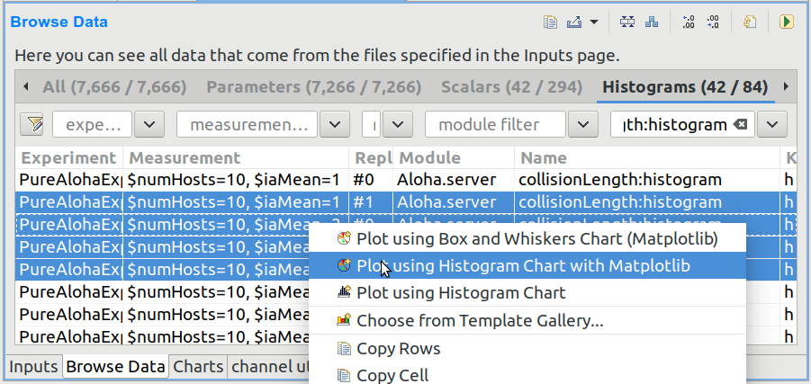

   Plotting the selected results

The :guilabel:`Choose from Template Gallery` menu item shows
the same filtered list of templates in the gallery dialog (see next section),
where you can see a description with screenshots for each.

Simply double-clicking on a result, or selecting some and pressing
Enter, will also open a suitable chart.

.. note::

   Charts opened this way are not saved into the analysis, i.e. they
   will be discarded when you close them. In order to preserve a chart
   as part of the analysis, you need to choose :guilabel:`Save
   Chart` from the toolbar or the context menu of the chart's page.
   When you do that, the chart will appear on the :guilabel:`Charts` page.
   See :ref:`ana-temporary-charts` for more info.

From the Charts Page
^^^^^^^^^^^^^^^^^^^^

Right clicking in an empty area on the :guilabel:`Charts` page and opening
the :guilabel:`New` submenu lists all the available chart templates.
Clicking on one creates a new chart from that template.

The :guilabel:`New Chart` button on the toolbar opens a gallery-like
dialog, where more information (with a short description and some screenshots)
is shown about each of the chart templates. Selecting one and pressing
:guilabel:`OK` instantiates that template into a new chart.

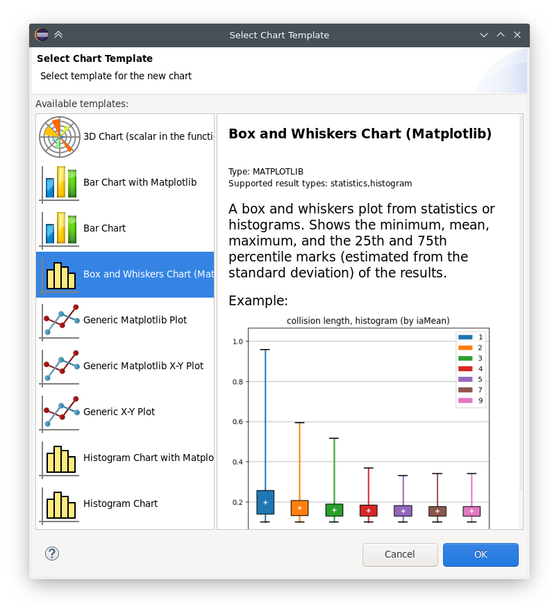

   The New Chart Dialog

Any chart created in any of these two ways will be initially empty,
as no result selection filter expression was configured for them yet.

Using Charts
------------

This section introduces you to the basics of working with charts in the
|omnet++| IDE. It shows how to navigate on plots, how to configure their
appearance, and export data and images.

Opening a Chart
^^^^^^^^^^^^^^^

To open an existing chart, double-click it in the :guilabel:`Charts` page, or
select it and hit :kbd:`Enter`.

.. _ana-temporary-charts:

Temporary Charts
^^^^^^^^^^^^^^^^

Temporary charts are created when simulation results are plotted directly from
the :guilabel:`Browse Data` page. Temporary charts are not part of the analysis,
which means they don't appear on the :guilabel:`Charts` page, and will disappear
when closed (unless saved into the analysis).

.. tip::

   The easiest way to see whether an open chart is a temporary chart is to check
   the leftmost icon on the local toolbar. If you see :guilabel:`Save Chart`,
   then it is temporary chart; if you see :guilabel:`Go To Chart Definition`,
   then the chart is part of the analysis (and the button will take you to the
   :guilabel:`Charts` page to show it).

When you try to close a temporary chart, the IDE will ask whether you want to
save it into the analysis.

On saving a temporary chart, it is recommended that you check the filter
expression on the :guilabel:`Inputs` page of the chart configuration dialog, and
refine or simplify it as needed. When the temporary chart is created, the IDE
generates a filter expression based on the selection, but the generated
expression is not always optimal, and it may not accurately express your
intended selection criteria.

Navigation
^^^^^^^^^^

In an open chart, the mouse pointer has two different operation modes in the plot area. In Pan mode, you
can scroll with the mouse wheel and drag the chart. In Zoom mode, the user can
zoom in on the chart by left-clicking and zoom out by doing a
:kbd:`Shift` plus left-click, or using the mouse wheel. Dragging selects a rectangular
area for zooming. The toolbar icons and switch between Pan and Zoom modes.
You can also find toolbar buttons to zoom in, zoom out and zoom to fit.
Zooming and moving actions are remembered in the navigation history.

The navigation of Matplotlib charts is slightly different from this,
as that follows how Matplotlib charts usually handle navigation.
One addition compared to that is that scrolling, :kbd:`Shift` plus scrolling and
:kbd:`Ctrl` plus scrolling pans vertically/horizontally, or zooms. There is also
a third mode, called interactive mode, which is used to manipulate
interactive elements on the plot, such as widgets, if present.

The Chart Properties Dialog
^^^^^^^^^^^^^^^^^^^^^^^^^^^

Charts have a set of properties that define their behavior and looks.
These properties can be edited in a configuration dialog, accessible
from the :guilabel:`Configure Chart` toolbar button and context menu item.

The dialog has a tabbed layout, where the list of tabs and the form on each page
differ for each chart type. Pages that are common to nearly all chart types
(albeit with slightly differing contents) are:

- :guilabel:`Input`: Defines what results simulation results should be used
  as input for the chart, and their roles (e.g. which ones to use for the
  horizontal axis, iso lines, etc).
- :guilabel:`Plot`, :guilabel:`Lines`, :guilabel:`Bars`, etc: For configuring the labels, markers, ticks, grid, etc.
- :guilabel:`Styling`: Visual properties for the plot.
- :guilabel:`Advanced`: Lets you manually add custom plot properties that don't occur on the other pages.
- :guilabel:`Export`: Properties to be used during image/data export.

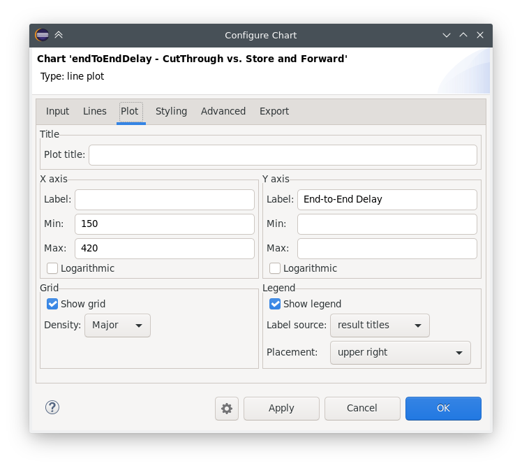

   The Chart Properties Dialog

For many input fields, autocompletion and smart suggestions are available
by pressing :kbd:`Ctrl+SPACE`.

.. _ana-filter-expression:

Filter Expressions
^^^^^^^^^^^^^^^^^^

Filter expressions are used at multiple places in the Analysis Tool, e.g. for
filtering the table/tree contents on the :guilabel:`Browse Data page`, and on
:guilabel:`Input` pages of chart properties dialogs for selecting simulation
results as input for the chart.

A filter expression is composed of terms that can be combined with the `AND`,
`OR`, `NOT` operators, and parentheses. A term filters for the value of some property of
the item, and has the form `<property> =~ <pattern>`, or simply `<pattern>`. The latter
is equivalent to `name =~ <pattern>`.

The following properties are available:
 - `name`: Name of the result or item.
 - `module`: Full path of the result's module.
 - `type`: Type of the item. Value is one of: `scalar`, `vector`, `parameter`, `histogram`, `statistics`.
 - `isfield`: `true` is the item is a synthetic scalar that represents a field of statistic or a vector, `false` if not.
 - `file`: File name of the result or item.
 - `run`: Unique run ID of the run that contains the result or item.
 - `runattr:<name>`: Run attribute of the run that contains the result or item. Example: `runattr:measurement`.
 - `attr:<name>`: Attribute of the result. Example: `attr:unit`.
 - `itervar:<name>`: Iteration variable of the run that contains the result or item. Example: `itervar:numHosts`.
 - `config:<key>`: Configuration key of the run that contains the result or item. Example: `config:sim-time-limit`, `config:**.sendIaTime`.

Patterns may contain the following wildcards:
 - `?` matches any character except '.'
 - `*` matches zero or more characters except '.'
 - `**` matches zero or more characters (any character)
 - `{a-z}` matches a character in range a-z
 - `{^a-z}` matches a character not in range a-z
 - `{32..255}` any number (i.e. sequence of digits) in range 32..255 (e.g. `99`)
 - `[32..255]` any number in square brackets in range 32..255 (e.g. `[99]`)
 - `\\` takes away the special meaning of the subsequent character

Patterns only need to be surrounded with quotes if they contain whitespace or
other characters that would cause ambiguity in parsing the expression.

Example: `module =~ "**.host*" AND (name =~ "pkSent*" OR name =~ "pkRecvd*")`

.. tip::

   Content Assist is available in text fields where you can enter filter
   expressions, vector operations, run metadata selectors, advanced styling
   options, and similar. Press :kbd:`Ctrl+SPACE` to get a list of appropriate
   suggestions at the cursor position.

Vector Operations
^^^^^^^^^^^^^^^^^

The charts that show vector results offer a selection of operations
to transform the data before plotting.

These can be added to the chart under the :guilabel:`Apply` or
:guilabel:`Compute` context menu items.
Both ways of adding operations compute new vectors from existing
ones. The difference between them is that Apply replaces the original
data with the computation result, while Compute keeps both.

Some operations have parameters that can be edited before adding it,
in the confirmation dialog that pops up after selecting the operation.

Most operations perform a fairly simple transformation on each individual
vector independently: summation, windowed average, etc. ``expression``
facilitates a more complex, freeform computation in one go. And two exceptions
are ``aggregate`` and ``merge``, as these operate on the entire DataFrame,
combining multiple vectors into one.

For example, see the screenshots illustrating the effects of the following
vector operations:

.. code-block::

  apply:sum
  apply:diffquot
  apply:movingavg(alpha=0.05)

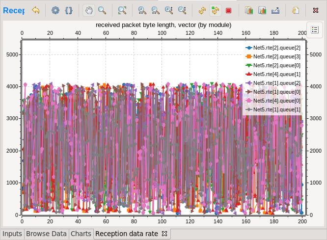

   Vector Operations - Before

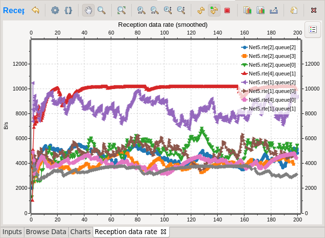

   Vector Operations - After

See a description of all built-in vector operations in the Simulation Manual.

Exporting Data
^^^^^^^^^^^^^^

Both the input data used by a chart, and the final result after any processing,
can be exported.

The first one is essentially the same as the result exporting option on the
:guilabel:`Browse Data` page, except that it uses the result filter expression
of the given chart to select which results to export. This is available under the
:guilabel:`Export Chart Input As` context menu item of charts.

The second one includes any transformations the chart might perform on the data
before plotting it, and is available under the common :guilabel:`Export Chart`
option, as discussed in section :ref:`ana-batch-export`.

..
  TODO: which ways support which data formats? (csv+json only, all that pandas has to offer)

Exporting Images
^^^^^^^^^^^^^^^^

There are multiple, significantly different ways of exporting a chart to an image:

- You can copy the chart to the clipboard by selecting :guilabel:`Copy to
  Clipboard` from the context menu. The chart is copied as a bitmap image the
  same size as the chart on the screen, taking the current navigation state into
  account.

- The :guilabel:`Save Image` option saves the currently shown part of the chart
  to an image file. Popular raster and vector formats are accepted, including
  PNG, JPG, SVG, GIF, TIFF, etc.

- Finally, the :guilabel:`Export Chart` option opens the common
  image/data exporting dialog (see section :ref:`ana-batch-export`) for this
  chart only. This option relies on the chart script for doing the actual
  exporting. (It runs the chart script  in the background, asking it to perform
  the export.)

.. _ana-batch-export:

Batch Export
^^^^^^^^^^^^

When exporting multiple charts, or when selecting the :guilabel:`Export Chart`
option for a single chart, a common export dialog is opened.

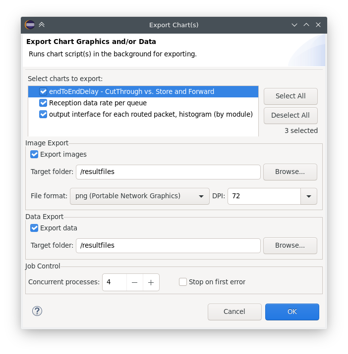

   Export Charts Dialog

Some additional parameters of the images/data exported this way can
be configured on the :guilabel:`Export` tab of the property configuration
dialog of each chart.

Note that native charts exported this way will look a bit different than in the
IDE, because they will be drawn by Matplotlib during the export procedure.

This is also the way ``opp_charttool`` exports charts from the command line.

Customizing Charts
------------------

All charts are powered by Python scripts, which take their configuration
settings from properties that can be edited in the :guilabel:`Chart
Configuration` dialog. All of these elements are under your full control so that
you can create exactly the plots that you need for your analysis: you can edit
the chart script, you can edit the properties using the configuration dialog,
and you can also modify/tweak the configuration dialog itself to add input
fields for extra properties, for example. Each chart has its own copy of
everything (the chart script, properties and config dialog pages), so modifying
one chart will not affect other similar charts.

Editing the Chart Script
^^^^^^^^^^^^^^^^^^^^^^^^

To see or edit the chart's Python script, click the :guilabel:`Show Code Editor`
button on the toolbar of an open chart. With the code editor open, you are free
to make any changes to the chart's script.

The integrated editor is that of the PyDev project. It provides syntax
highlighting, code navigation (go to definition, etc.), helpful tooltips (using
docstrings), and content assist (completion suggestions).

.. figure:: pictures/ANF-ChartScriptEditor.png

   Chart Script Editor

Refreshing
^^^^^^^^^^

Normally, the chart script is automatically re-executed with some delay after
each edit. This functionality can be enabled/disabled using the
:guilabel:`Automatic Refresh` button on the chart page toolbar. Independent of
the auto-refresh state, you can always trigger a manual refresh (re-execution of
chart script) by pressing the :guilabel:`Refresh` on the toolbar. If the chart
script execution takes too long, you can abort it by clicking the
:guilabel:`Kill Python Process of the Chart` button on the toolbar.

.. tip::

   The viewport (zoom/pan state) is usually preserved after refresh. If the area
   occupied by the displayed data changes significantly for some reason, it is
   possible that you will see an empty plot after the refresh, simply because
   valuable content now falls outside the viewport. Push the :guilabel:`Home`
   icon on the toolbar in these cases to bring all plotted elements into view.

Console Output
^^^^^^^^^^^^^^

The console output of the script, i.e. text written to the *stdout* and *stderr*
streams, is displayed in the :guilabel:`Console` view. Each chart has a console
of its own in the view, which is activated when switching to the chart's page in
the editor. Text written to the standard error stream appears in red. You can
write to the console using Python's ``print()`` statement. Notably,
``print(df)`` is a very useful line that you'll probably end up using quite often.

.. note::

   Even though PyDev offers a variety of tools for debugging Python scripts,
   these unfortunately don't work on chart scripts. Limited debugging can be
   performed using print statements, throwing exceptions, and dumping stack traces,
   which is usually enough. If you really need debugging to get a piece of code
   working, one way is to factor out the code to be able to run independently,
   and use an external debugger (or the IDE's debugger) on the resulting ``.py`` file.

Errors
^^^^^^

Errors are marked in the source code with a red squiggle and a sidebar icon.
Hover over them to see a tooltip describing the error. The errors are also
entered into the :guilabel:`Problems` view. Double clicking these problem
entries will reveal the line in the code editor where the error came from.
Errors marked this way include Python syntax errors, and runtime errors which
manifest themselves in the form of Python exceptions. For exceptions, the
stack trace is printed in the :guilabel:`Console` view.

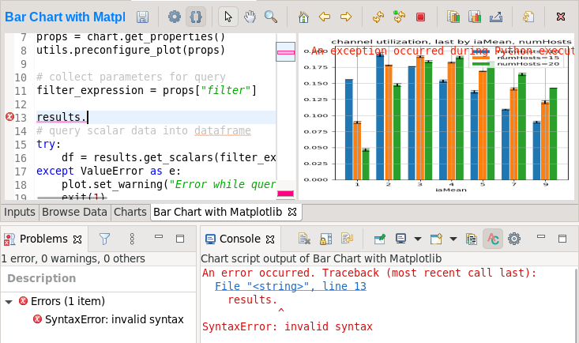

   A Python error is marked on the GUI

Editing Dialog Pages
^^^^^^^^^^^^^^^^^^^^

If you need to add support for new configuration properties to the chart, you
will need to edit the forms on the :guilabel:`Configure Chart` dialog. Pages
(tabs) in the configuration dialog are represented as XSWT forms. To see or edit
the pages and forms within, click the :guilabel:`Edit Dialog Pages` button on
the property editor dialog.

The action will bring up the :guilabel:`Edit Chart Dialog Pages` dialog, which
lets you edit the forms that make up the configuration dialog of the chart.
You can add, remove, reorder and rename tabs, and you can edit the XSWT form
on each tab. A preview of the edited form is also shown.

XSWT is an XML-based UI description language for SWT, the widget toolkit
of Eclipse on which the |omnet++| IDE is based. The content of XSWT files
closely mirror SWT widget trees.

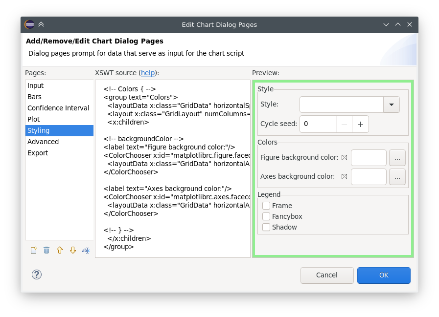

   Editing Chart Properties Editor Pages

Some XML attributes in the XSWT source have special roles:

- ``x:id`` binds the contents of the widget to a chart property. For example,
  an edit control defined as ``<text x:id="title">`` edits the ``title`` chart
  property, which can be accessed as ``props["title"]`` in the chart script.
- ``x:id.default`` provides a default value for the chart property named in the
  ``x:id`` attribute.
- Further ``x:id.*`` attributes are also used, e.g. ``x:id.contentAssist``
  defines the kind of content assist requested for the edit control, or
  ``x:id.isEnabler`` denotes a checkbox as the enabler of the widget group
  that contains it.

.. tip::

   The easiest way to add a new field to a page is to look at other pages (or
   other charts' pages), and copy/paste from them.

The :guilabel:`New Page` in the dialog brings up a mini wizard, which can create
a full-fledged XSWT page from a shorthand notation of its content provided by
you.

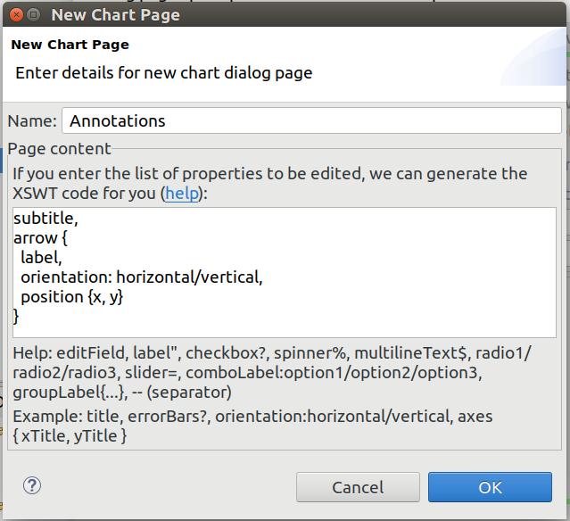

   The Creating a New Dialog Page From a Shorthand Notation

Reset to Template
^^^^^^^^^^^^^^^^^

If changes to a chart script or a dialog page prove to be a dead-end, it might
be a good idea to start afresh.

The :guilabel:`Reset to Template` option in the charts context menu
does lets you select some aspects of the chart to be restored to
its original state, as it is in its template: the code of the charts script,
the values of its properties, and/or the layout of its property editor dialog.

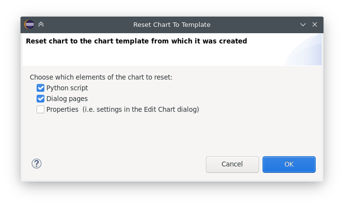

   Resetting Chart to Template

Chart Programming
-----------------

Data processing in chart scripts is based on the NumPy and Pandas packages,
with some modules provided by |omnet++|.

Python Modules
^^^^^^^^^^^^^^

The chart scripts can access some functionality of the IDE through a couple of
modules under the ``omnetpp.scave`` package.
These include: ``chart``, ``results``, ``ideplot``, ``vectorops``, and ``utils``.
The complete API of these modules is described in the Simulation Manual.

The ``chart`` module exposes information about the chart object (as
part of the analysis, and visible on the :guilabel:`Charts` page), most
importantly its set of properties, but also its name, and what type
of chart it is.

The ``results`` module provides access to the set of result items (and
corresponding metadata) currently loaded in the analysis in the IDE.
This data is accessible through a set of query functions, each taking
a filter expression, and returning a Pandas DataFrame.

The ``ideplot`` module is the interface for displaying plots using the IDE's
native (non-Matplotlib) plotting widgets from chart scripts. The API is
intentionally very close to ``matplotlib.pyplot``. When ``ideplot`` is used
outside the context of a native plotting widget (such as during the run of
``opp_charttool``, or in IDE during image export), the functions are emulated
with Matplotlib.

The ``vectorops`` module contains the implementations of the built-in vector
operations.

The ``utils`` module is a collection of utility functions for processing and
plotting data. Most chart scripts heavily rely on ``utils``.

Additionally, the well known ``numpy``, ``pandas``, ``matplotlib``, and
sometimes the ``scipy`` and ``seaborn`` packages are often utilized.
All other packages installed on the system are also fully available.

.. tip::

   See Simulation Manual for details on the |omnet++| result analysis
   Python modules. It contains a section on chart programming, and
   an API reference in the Appendix.

Tips and Tricks
^^^^^^^^^^^^^^^

This section is a collection of tips for use cases that might
come up often when working with charts, especially when editing
their scripts.

Sharing Code Among Charts
~~~~~~~~~~~~~~~~~~~~~~~~~

For future releases, we are planning to support "snippets" as part of the
analysis file, as a means of sharing code among charts. Until that feature is
implemented, a workaround is to put shared code in ``.py`` files.
These scripts can be imported as modules. They will be looked for in the
folder containing the ``.anf`` file, and in the ``python`` folders of the
containing project and all of its referenced projects.
Chart scripts can import these files as modules, and thereby use the
functionality they provide. This also makes it possible to use external
code editors for parts of your code.

Customizing the Legend
~~~~~~~~~~~~~~~~~~~~~~

The order of items appearing in the legend, and in which they are drawn,
is determined by their order in the data used for plotting. They can
therefore be reordered by sorting the rows of the dataframe before plotting it.
For example: ``df = df.sort_values(by=['iaMean'])``

Normally, labels for the legend are concatenated, using some heuristics, from
columns that best differentiate the data items. If you are not satisfied with
the result, there are two ways to affect it:

- If you add ``comment`` column to the dataframe, its contents will be appended
  to the auto-generated legend labels in parentheses.

- If you add a ``legend`` column, its contents will be used instead of
  auto-generated legend labels, so you can create your own legend labels.
  Example:

  ``df["legend"] = "iaMean=" + df["iaMean"]``

Adding Extra Data Items to the Plot
~~~~~~~~~~~~~~~~~~~~~~~~~~~~~~~~~~~

It's possible to add new data items to the queried results before plotting.
These can be either computed from existing items, or synthesized from a
formula. Example uses:

- Computing derived results:

  ``df["bitrate"] = df["txBytes"] / df["sim-time-limit"]``

- Adding analytical references, like theoretical values in an ideal scenario:

  ``df["analytical"] =  df["p"] * (1 - df["p"]) ** (df["N"]-1)``

- Summarizing results:

  ``df["mean"] = df["vecvalues"].map(np.mean)``

Simplifying Complex Queries
~~~~~~~~~~~~~~~~~~~~~~~~~~~

Instead of coming up with an elaborate filter expression, it is sometimes more
straightforward to query results multiple times within a script, and combine
them with ``pd.concat``, ``pd.join`` or ``pd.merge``. Other functions like
``pf.pivot`` and ``pd.pivot_table`` are also often useful in these cases.

Defining New Vector Operations
~~~~~~~~~~~~~~~~~~~~~~~~~~~~~~

You can define your own vector operations by injecting them into the
``vectorops`` module, even if this injection is done in an external module
(``.py`` file imported from the directory of the ``.anf`` file)

.. code-block:: python3

   from omnetpp.scave import vectorops
   def myoperation(row, sigma):
      row["vecvalue"] = row["vecvalue"] + sigma
      return row
   vectorops.myoperation = myoperation

After injection, use it like any other vector operation, on the
:guilabel:`Input` page of Line Charts for example: ``apply:
myoperation(sigma=4)``

Customized Export
~~~~~~~~~~~~~~~~~

If the built-in image/data exporting facilities are not sufficient for your
use case, you can always add your own export code, either by manually
``open()``-ing a file, or by utilizing a data exporter library/function of
your liking. Functions such as ``plt.savefig()`` and ``df.to_*()`` can be
useful for this.

Caching the Result of Expensive Operations
~~~~~~~~~~~~~~~~~~~~~~~~~~~~~~~~~~~~~~~~~~

Since the entire chart script is executed on every chart refresh, even if only a
visual property has changed, it can sometimes help to cache the result of some
expensive data querying or processing procedure in the script. And because every
execution is in a fresh Python process, caching can only really be done on the
disk.

There are existing packages that can help you in this, such as ``diskcache``,
``cache.py`` or ``memozo``. (Note that caching the result of a function call is
often called *memoization*; using that term in online searches may give you
additional insight.)

If the sequence of operations whose result is cached includes simulation result
querying (``results.get_scalars()``, etc.), it is important to invalidate
(clear) the cache whenever there is a change in the loaded result files. The
change can be detected calling the ``results.get_serial()`` function, which
returns an integer which is incremented every time a result file is loaded,
unloaded or reloaded.

Arbitrary Plot Types
~~~~~~~~~~~~~~~~~~~~

In charts using Matplotlib, the whole range of its functionality is available:

- Arbitrary plots can be drawn (heatmaps, violin plots, geographical maps, 3D curves, etc.)
- Advanced functionality like mouse event handlers, graphical effects, animations, and widgets, all works
- It's also possible to just add small customizations, like annotations
- Any extension library on top of Matplotlib can be used, such as: *seaborn*, *ggplot*, *holoviews*, *plotnine*, *cartopy*, *geoplot*
- The built-in plotting capability of Pandas DataFrames (under ``df.plot``) works too

Per-Item Styling on Native Plots
~~~~~~~~~~~~~~~~~~~~~~~~~~~~~~~~

For native plots, properties affecting individual data items can be specified
with the following additional syntax: ``<propertyname>/<itemkey>``. Unless
overridden manually, the data item keys are sequentially increasing integers,
starting with ``1``. For example, adding the following line on the Advanced tab
in the property editor dialog of a line chart will set the color of second line
(or of the line identified with the key ``2``) to red.

``Line.Color/2 : #FF0000``

Custom Chart Templates
----------------------

When charts are created, they are instantiated from a template. The list of
available chart templates can be browsed in the template gallery dialog,
available from the :guilabel:`Charts` page as :guilabel:`New Chart`, and from
the :guilabel:`Browse Data` page as :guilabel:`Choose from Template Gallery`.
The dialog shows some properties (chart type, accepted result types), a
description, and often also sample images for each one.

The IDE contains a number of built-in chart templates, but the user can add
their own, too. Custom chart templates live in the ``charttemplates`` folder of
every project, and are available in analyses in the same project and all
projects that depend on it.

Exporting a Chart as Template
^^^^^^^^^^^^^^^^^^^^^^^^^^^^^

The easiest way of creating a custom chart template is by customizing a chart,
then saving it as a template. The :guilabel:`Save as Template` option in the
chart's context menu writes the contents of the given chart into the
``charttemplates`` directory of the project.

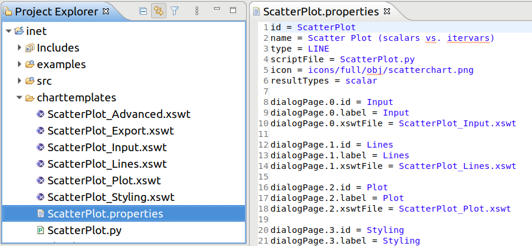

   An Exported Chart Template

You may want to tweak some properties (e.g. the descriptive name) of the saved
chart template before use, but regardless, the new chart template is immediately
available for use.

Parts of a Chart Template
^^^^^^^^^^^^^^^^^^^^^^^^^

A chart template consists of several parts, describing the initial contents of
charts created from it: what kind of drawing widget it needs (Matplotlib or one
of the native widgets), what script it executes, how its configuration
dialog looks like, what types of result items it can process/show, and which
icon should be used for it.

Namely, there are several files:

- ``<name>.properties``: This is the main file file. It defines the name and other
  attributes of the chart template, and references all other files by name. The
  syntax is Java property file.
- ``<name>.py``: The Python file that contains the chart script.
- ``*.xswt``: The dialog pages.

.. note::

   Scripts and dialog pages can be shared by multiple chart templates.

Notable keys in the properties file:

- ``id``: Internal identifier
- ``name``: Descriptive name
- ``type``: ``MATPLOTLIB``, or one of ``LINE``, ``BAR`` and ``HISTOGRAM`` for native charts
- ``scriptFile``: The chart script Python file
- ``icon``: Icon file, e.g. in PNG format
- ``resultTypes``: One or more of ``scalar``, ``vector``, ``parameter``, ``histogram`` and ``statistics``, separated by comma
- ``description``: Long description of the chart in HTML format
- ``dialogPage.<n>.id``: Internal identifier of the nth dialog page
- ``dialogPage.<n>.label``: Label of the tab of the nth dialog page
- ``dialogPage.<n>.xswtFile``: XSWT file of the nth dialog page

Under the Hood
--------------

This section details the internal workings of the Python integration in the
Analysis Tool. Its contents are not directly useful for most users, only for
those who are curious about the technicalities, or want to troubleshoot an issue.

Chart scripts are executed by separate Python processes, launched from the
``python3[.exe]`` found in ``$PATH``. This decision was made so a rogue chart script
can't make the entire IDE unresponsive, or crash it. Also, it's possible to
put resource or permission constraints on these processes without hindering the
IDE itself, and can be killed at any time with no major consequences to the rest
of the Analysis Tool - for example, in the event of a deadlock or thrashing.

These processes are ephemeral, a fresh one is used for each refresh,
so no interpreter state preserved across executions. A small number of
processes are kept pre-spawned in a pool, so they can be put to use quickly
when needed.

If you wish to utilize virtual environments, start the entire IDE from a shell
in which the environment to use has been activated. This way the spawned Python
interpreter processes will also run in that environment.

The level of flexibility offered by this arbitrary scripting unfortunately
comes with its own dangers too. Note that the scripts running in charts have
full access to everything on your computer without any sandboxing, so they can
read/write/delete files, open graphical windows, make network connections,
utilize any hardware resources, etc.! Because of this, make sure to only ever
open analysis files from sources you trust! (Or files from untrusted sources
only on systems that are not critical.)

Communication between the Eclipse IDE and the spawned Python processes
is done via the Py4J project, through an ordinary network (TCP) socket.

To avoid the CPU and RAM inefficiencies caused by the string-based nature of
the Py4J protocol, bulk data is transferred in shared memory (POSIX SHM,
or unnamed file mappings on Windows) instead of the socket. Without this,
binary data would have to be base64 encoded, then represented as UTF-16,
which would be about 3x the size on top of the original content, which is
already present in both processes. Data passed this way includes any queried
results (in pickle format), and in the other direction, the data to plot on
native widgets, or the raw pixel data rendered by Matplotlib.

Many other kinds of information, like GUI events or smaller pieces of data
(like chart properties) are passed through the Py4J socket, as regular function
call parameters.
