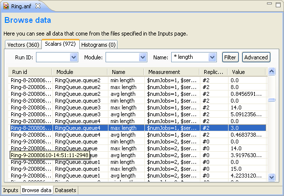
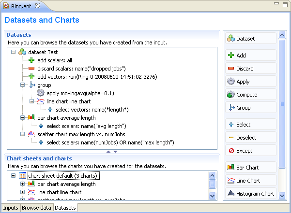
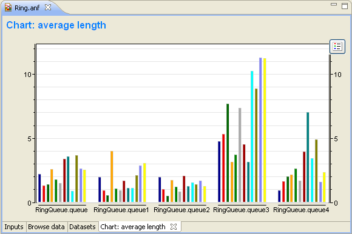
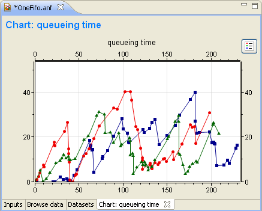
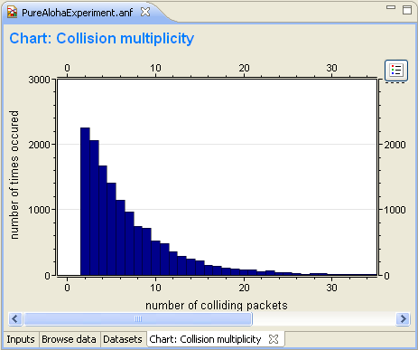
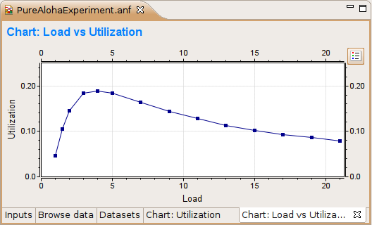
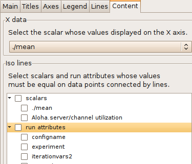
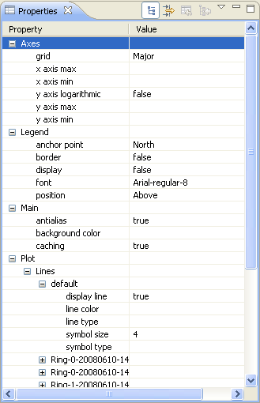
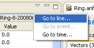
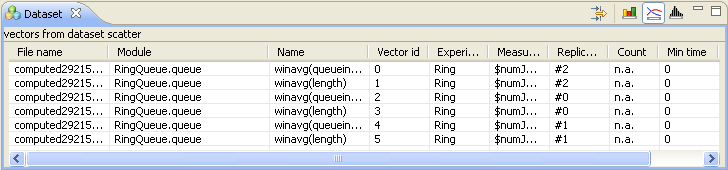

Analyzing the Results
=====================

Overview
--------

Analyzing the simulation result is a lengthy and time consuming process. The result of the simulation is recorded as
scalar values, vector values and histograms. The user then applies statistical methods to extract the relevant
information and to draw a conclusion. This process may include several steps. Usually you need to filter and transform
the data, and chart the result. Automation is very important here. You do not want to repeat the steps of recreating
charts every time you rerun simulations.

In |omnet++| 4.x, the statistical analysis tool is integrated into the Eclipse environment. Your settings (i.e. your
recipe for finding results from the raw data) will be recorded in analysis files (.anf) and will become instantly
reproducible. This means that all processing and charts are stored as datasets; for example, if simulations need to be
rerun due to a model bug or misconfiguration, existing charts need not be recreated all over again. Simply replacing the
old result files with the new ones will result in the charts being automatically displayed with the new data.

When creating an analysis, the user first selects the input of the analysis by specifying file names or file name
patterns (e.g. "adhoc-\*.vec"). Data of interest can be selected into datasets using additional pattern rules. The user
can define datasets by adding various processing, filtering and charting steps; all using the GUI. Data in result files
are tagged with meta information. Experiment, measurement and replication labels are added to the result files to make
the filtering process easy. It is possible to create very sophisticated filtering rules (e.g. all 802.11 retry counts of
host[5..10] in experiment X, averaged over replications). In addition, datasets can use other datasets as their input so
datasets can build on each other.

Creating Analysis Files
-----------------------

To create a new analysis file, choose :menuselection:` File --> New --> Analysis File ` from the menu. Select the folder for
the new file and enter the file name. Press :guilabel:`Finish` to create and open an empty analysis file.

.. figure:: pictures/ANF-NewAnalysisFileDialog.png
   :alt: New Analysis File dialog

   New Analysis File dialog

There is a quick way to create an analysis file for a result file. Just double-click on the result file in the
:guilabel:`Project Explorer View` to open the :guilabel:`New Analysis File` dialog. The folder and file name is
prefilled according to the location and name of the result file. Press :guilabel:`Finish` to create a new analysis file
containing the vector and scalar files whose names correspond to the result file. If the name of the result file
contains a numeric suffix (e.g. ``aloha-10.vec``), then all files with the same prefix will be added to the analysis
file (i.e. ``aloha-*.vec`` and ``aloha-*.sca``).

.. tip::

   If the analysis file already exists, double-clicking on the result file will open it.

Using the Analysis Editor
-------------------------

The Analysis Editor is implemented as a multi-page editor. What the editor edits is the "recipe": what result files to
take as inputs, what data to select from them, what (optional) processing steps to apply, and what kind of charts to
create from them. The pages (tabs) of the editor roughly correspond to these steps.

Input Files
~~~~~~~~~~~

Selecting input files
^^^^^^^^^^^^^^^^^^^^^

The first page displays the result files that serve as input for the analysis. The upper half specifies what files to
select using explicit filenames or wildcards. New input files can be added to the analysis by dragging vector and scalar
files from the :guilabel:`Project Explorer View`, or by opening dialogs with the :guilabel:`Add File...` or
:guilabel:`Wildcard...` buttons. If the file name starts with '/,' it is interpreted relative to the workspace root;
otherwise, it is relative to the folder of the analysis file.

.. figure:: pictures/ANF-InputsPage.png
   :alt: Specifying input files for data analysis

   Specifying input files for data analysis

The input files are loaded when the analysis file is opened. When the file changes on the disk, it is reloaded
automatically when the workspace is refreshed (Eclipse refreshes the workspace automatically if the
:guilabel:`General|Workspace|Refresh automatically` option is turned on in the Preferences). Vector files are not loaded
directly; instead, an index file is created and the vector attributes (name, module, run, statistics, etc.) are loaded
from the index file. The index files are generated during the simulation, but can be safely deleted without loss of
information. If the index file is missing or the vector file was modified, the IDE rebuilds the index in the background.

.. tip::

   The :guilabel:`Progress View` displays the progress of the indexing process.

The lower half shows what files matched the input specification and what runs they contain. Note that |omnet++| 4.x result
files contain a unique run ID and several metadata annotations in addition to the actual recorded data. The third tree
organizes simulation runs according to their experiment-measurement-replication labels.

The underlying assumption is that users will organize their simulation-based research into various
:guilabel:`experiments` . An experiment will consist of several :guilabel:`measurements`, which are typically (but not
necessarily) simulations done with the same model but with different parameter settings (i.e. the user will explore the
parameter space with several simulation runs). To gain statistical confidence in the results, each measurement may be
repeated several times with different random number seeds. It is easy to set up such scenarios with the improved INI
files of |omnet++| 4.x. Then, the experiment-measurement-replication labels will be assigned automatically (Note: please
refer to the chapter "Configuring and Running Simulations" in the manual for more discussion).

Browsing input
^^^^^^^^^^^^^^

The second page of the Analysis editor displays results (vectors, scalars and histograms) from all files in tables and
lets the user browse them. Results can be sorted and filtered. Simple filtering is possible with combo boxes, or when
that is not enough, the user can write arbitrarily complex filters using a generic pattern-matching expression language.
Selected or filtered data can be immediately plotted, or remembered in named datasets for further processing.

.. tip::

   You can switch between the :guilabel:`All`, :guilabel:`Vectors`, :guilabel:`Scalars` and :guilabel:`Histograms` pages
   using the underlined keys (
   Alt+KEY
   combination) or the
   Ctrl+PgUp
   and
   Ctrl+PgDown
   keys.

Pressing the :guilabel:`Advanced` button switches to advanced filter mode. In the text field, you can enter a complex
filter pattern.

.. tip::

   You can easily display the data of a selected file, run, experiment, measurement or replication if you double-click
   on the required tree node in the lower part of the :guilabel:`Inputs` page. It sets the appropriate filter and shows
   the data on the :guilabel:`Browse Data` page.

   If you right-click on a table cell and select the :guilabel:`Set filter: ...` action from the menu, you can set the
   value of that cell as the filter expression.

   Browsing vector and scalar data generated by the simulation

To hide or show table columns, open :guilabel:`Choose table columns...` from the context menu and select the columns to
be displayed. The settings are persistent and applied in each subsequently opened editor. The table rows can be sorted
by clicking on the column name.

You can display the selected data items on a chart. To open the chart, choose :guilabel:`Plot` from the context menu
(double-click also works for single data lines). The opened chart is not added automatically to the analysis file, so
you can explore the data by opening the chart this way and closing the chart page without making the editor "dirty."

The selected vector's data can also be displayed in a table. Make sure that the :guilabel:`Output Vector View` is
opened. If it is not open, you can open it from the context menu (:guilabel:`Show Output Vector View`). If you select a
vector in the editor, the view will display its content.

You can create a dataset from the selected result items. Select :guilabel:`Add Filter Expression to Dataset...` if you
want to add all items displayed in the table. Select :guilabel:`Add Filter Selected Data to Dataset...` if you want to
add the selected items only. You can add the items to an existing dataset, or you can create a new dataset in the
opening dialog.

.. tip::

   You can switch between the :guilabel:`Inputs`, :guilabel:`Browse Data` and :guilabel:`Dataset` pages using the
   Alt+PgUp
   and
   Alt+PgDown
   keys.

Filter expressions
^^^^^^^^^^^^^^^^^^

A filter expression is composed of atomic patterns with the AND, OR, NOT operators. An atomic pattern filters for the
value of a field of the result item and has the form <field_name>(<pattern>). The following table shows the valid field
names. You can omit the name field and simply use the name pattern as a filter expression. It must be quoted if it
contains whitespace or parentheses.

.. list-table::
   :widths: 50 50
   :header-rows: 0

   * - Field
     - Description

   * - name
     - the name of the scalar, vector or histogram

   * - module
     - the name of the module

   * - file
     - the file of the result item

   * - run
     - the run identifier

   * - attr: name
     - the value of the run attribute named name, e.g. attr:experiment

   * - param: name
     - the value of the module parameter named name

In the pattern specifying the field value, you can use the following shortcuts:

.. list-table::
   :widths: 50 50
   :header-rows: 0

   * - Pattern
     - Description

   * - ?
     - matches any character except '.'

   * - \*
     - matches zero or more characters except '.'

   * - \*\*
     - matches zero or more characters (any character)

   * - {a-z}
     - matches a character in range a-z

   * - {^a-z}
     - matches a character not in range a-z

   * - {32..255}
     - any number (i.e. sequence of digits) in range 32..255 (e.g. "99")

   * - [32..255]
     - any number in square brackets in range 32..255 (e.g. "[99]")

   * - \\
     - takes away the special meaning of the subsequent character

.. tip::

   Content Assist is available in the text fields where you can enter a filter expression. Press Ctrl+Space to get a
   list of appropriate suggestions related to the expression at the cursor position.

Examples
^^^^^^^^

.. container:: informalexample

   ``"queuing time"``

   filters for result items named :guilabel:`queuing time`.

.. container:: informalexample

   ``module(**.sink) AND (name("queuing time") OR`` ``name("transmission time"))``

   results in the :guilabel:`queuing times` and :guilabel:`transmission times` that are written by modules named
   :guilabel:`sink`.

Datasets
~~~~~~~~

Overview
^^^^^^^^

The third page displays the datasets and charts created during the analysis. Datasets describe a set of input data, the
processing applied to them and the charts. The dataset is displayed as a tree of processing steps and charts. There are
nodes for adding and discarding data, applying processing to vectors and scalars, selecting the operands of the
operations and content of charts, and for creating charts.

   Defining datasets to be analyzed

.. tip::

   You can browse the dataset's content in the :guilabel:`Dataset View`. Open the view by selecting :guilabel:`Show
   Dataset View` from the context menu. Select a chart to display its content or another node to display the content of
   the dataset after processing is applied.

Editing datasets
^^^^^^^^^^^^^^^^

The usual tree editing operations work on the Dataset tree. New elements can be added by dragging elements from the
palette on the right to an appropriate place on the tree. Alternatively, you can select the parent node and press the
button on the toolbar. An existing element can be edited by selecting the element and editing its properties on the
property sheet, or by opening an item-specific edit dialog by choosing :guilabel:`Properties...` from the context menu.

.. tip::

   Datasets can be opened on a separate page by double-clicking on them. It is easier to edit the tree on this page.
   Double-clicking a chart node will display the chart.

Computations can be applied to the data by adding Apply to Vectors/Compute Vectors/Compute Scalars nodes to the dataset.
The input of the computations can be selected by adding Select/Deselect children to the processing node. By default, the
computation input is the whole content of the dataset at the processing node. Details of the computations are described
in the next sections.

Processing steps within a Group node only affect the group. This way, you can create branches in the dataset. To group a
range of sibling nodes, select them and choose :guilabel:`Group` from the context menu. To remove the grouping, select
the Group node and choose :guilabel:`Ungroup`.

Charts can be inserted to display data. The data items to be displayed can be selected by adding Select/Deselect
children to the chart node. By default, the chart displays all data in the dataset at its position. You can modify the
content of the chart by adding Select and Deselect children to it. Charts can be fully customized including setting
titles, colors, adding legends, grid lines, etc. See the `Charts <#charts>`__ section for details.

Computing Vectors
^^^^^^^^^^^^^^^^^

Both Compute Vectors and Apply to Vectors nodes compute new vectors from other vectors. The difference between them is
that Apply to Vectors will remove its input from the dataset, while Compute keeps the original data, too.

`table_title <#processing-operations>`__ contains the list of available operations on vectors.

.. table:: Processing operations

   .. list-table::
      :widths: 50 50
      :header-rows: 0
   
   
      * - Name
        - Description
   
      * - scatter
        - Create scatter plot dataset. The first two arguments identifies the scalarselected for the X axis. Additional arguments identify the iso attributes; theyare (module, scalar) pairs, or names of run attributes.
   
      * - add
        - Adds a constant to the input: *y\ out\ k = y\ k + c*
   
      * - compare
        - Compares value against a threshold, and optionally replaces it with a constant
   
      * - crop
        - Discards values outside the [t1, t2] interval
   
      * - difference
        - Substracts the previous value from every value: *y\ out\ k = y\ k - y\ k-1*
   
      * - diffquot
        - Calculates the difference quotient of every value and the subsequent one:*y\ out\ k = (y\ k+1-y\ k) / (t\ k+1-t\ k)*
   
      * - divide-by
        - Divides input by a constant: *y\ out\ k = y\ k / a*
   
      * - divtime
        - Divides input by the current time: *y\ out\ k = y\ k / t\ k*
   
      * - expression
        - Evaluates an arbitrary expression. Use t for time, y for value, and tprev, yprevfor the previous values.
   
      * - integrate
        - Integrates the input as a step function (sample-hold or backward-sample-hold) orwith linear interpolation
   
      * - lineartrend
        - Adds linear component to input series: *y\ out\ k = y\ k + a \* t\ k*
   
      * - mean
        - Calculates mean on (0,t)
   
      * - modulo
        - Computes input modulo a constant: *y\ out\ k = y\ k % a*
   
      * - movingavg
        - Applies the exponentially weighted moving average filter: *y\ out\ k = y\ out\ k-1+ alpha*(y\ k-y\ out\ k-1)*
   
      * - multiply-by
        - Multiplies input by a constant: *y\ out\ k = a \* y\ k*
   
      * - nop
        - Does nothing
   
      * - removerepeats
        - Removes repeated y values
   
      * - slidingwinavg
        - Replaces every value with the mean of values in the window: *y\ out\ k =SUM(y\ i,i=k-winsize+1..k)/winsize*
   
      * - subtractfirstval
        - Subtract the first value from every subsequent values: *y\ out\ k = y\ k - y[0]*
   
      * - sum
        - Sums up values: *y\ out\ k = SUM(y\ i, i=0..k)*
   
      * - timeavg
        - Calculates the time average of the input (integral divided by time)
   
      * - timediff
        - Returns the difference in time between this and the previous value: *y\ out\ k =t\ k - t\ k-1*
   
      * - timeshift
        - Shifts the input series in time by a constant: *t\ out\ k = t\ k + dt*
   
      * - timetoserial
        - Replaces time values with their index: *t\ out\ k = k*
   
      * - timewinavg
        - Calculates time average: replaces input values in every \`windowSize' intervalwith their mean. *t\ out\ k = k \* winSize y\ out\ k = average of y values in the[(k-1)*winSize, k*winSize) interval*
   
      * - winavg
        - Calculates batched average: replaces every \`winsize' input values with theirmean. Time is the time of the first value in the batch.
   

Computing Scalars
^^^^^^^^^^^^^^^^^

The Compute Scalars dataset node adds new scalars to the dataset whose values are computed from other statistics in the
dataset. The input of the computation can be restricted by adding Select/Deselect nodes under it.

.. figure:: pictures/ANF-EditComputeScalars.png
   :alt: Edit 'Compute Scalars' dialog
   :width: 80.0%

   Edit 'Compute Scalars' dialog

In the :guilabel:`Properties` dialog of the Compute Scalars node, you can set the name and module of the generated
scalars, and the expression that computes their values. You can also can enter a grouping expression, and set flags to
average the values across replications. Content Assist (Ctrl+SPACE) is available for the :guilabel:`Value` field, it can
propose statistic and function names.

The content of the dialog is validated after each keystroke, and errors are displayed as small icons next to the edit
field. Hovering over the error icon shows the error message. However, not all errors can be detected statically, in the
dialog. If an error occurs while performing the computation, then an error marker is added to the analysis file and to
the corresponding dataset node in the Analysis editor. You can view the error in the :guilabel:`Problems View`, and
double-clicking the problem item navigates back to the :guilabel:`Compute Scalars` node.

When a :guilabel:`Compute Scalars` node in the dataset is evaluated, computations will use the fields rougly in the
order they appear in the dialog. First, grouping takes place (by simulation run, and then by the optional grouping
expression); then values are computed; then values are stored by the given name and module; and finally, averaging
across simulation runs takes place.

Explanation the dialog fields:

**Value..**

This is an arithmetic expression for the value of the generated scalar(s). You can use the values of existing scalars,
various properties of existing vectors and histograms (mean, min, max, etc), normal and aggregate functions (mean, min,
max, etc), and the usual set of operators.

To refer to the value of a scalar, simply use the scalar name (e.g. ``pkLoss``), or enclose it with apostrophes if the
name of the scalar contains special characters (e.g. ``'rcvdPk:count'``.) If there are several scalars with that name in
the input dataset, usually recorded by different modules or in different runs, then the computation will be performed on
each. The scalar name cannot contain wildcards or dollar variables (see later.)

When necessary, you can qualify the scalar name with a module name pattern that will be matched against the full paths
of modules. The same pattern syntax is used as in ini files and in other parts of the Analysis Tool (Quick reminder: use
``*`` and ``**`` for wildcards, ``{5..10}`` for numeric range, ``[5..10``] for module index range). If multiple scalars
match the qualified name, the expression will be computed for each. If there are several such patterns in the
expression, then the computation will be performed on their Cartesian product.

If the expression mentions several unqualified scalars (i.e. without module pattern), they are expected to come from the
same module. For example, if your expression is ``foo+bar`` but the ``foo`` and ``bar`` scalars have been recorded by
different modules, the result will be empty.

The iteration can be restricted by binding some part of the module name to variables, and use those variables in other
patterns. The ``${x=<pattern>}`` syntax in a module name pattern binds the part of the module name matched to
:guilabel:`pattern` to a variable named ``x``. These variables can be referred as ``${x}`` in other patterns. The
``${...}`` syntax also allows you to embed expressions (e.g. ``${x+1}``) into the pattern.

To make use of vectors and histograms in the computation, you can use the ``count()``, ``mean()``, ``min()``, ``max()``,
``stddev()`` and ``variance()`` functions to access their properties (e.g. ``count(**.mac.pkDrop)`` or ``max('end-to-end
delay')``).

The following functions can be applied to scalars or to an expression that yields a scalar value: ``count()``,
``mean()``, ``min()``, ``max()``, ``stddev()``, ``variance()``. These aggregate functions produce one value for a group
of scalars instead of one for each scalar. By default, each scalar belongs to the same group, but it is possible to
group them by module name (see Grouping). Aggregate functions cannot cross simulation run boundaries, e.g they cannot be
used to compute average over all replications of the same configuration; use the :guilabel:`Average replications`
checkbox for that.

**Grouping..**

Scalars can be grouped by module or value before the value computation, and you can enter a grouping expression here.
Grouping is the most useful when you want to use aggregate functions (``count()``, ``mean()``, etc.) in the value
expression.

The grouping expression is evaluated for each statistic in the input dataset, and the resulting value denotes the
statistic's group. For example, if the expression produces 0 for some statistics and 1 for others, there will be two
groups. Aggregate functions (``count()``, ``mean()``, etc.) are performed on each group independently.

In the grouping expression, you can refer to the name, module and values of the statistic (``module``, ``name`` and
``value``; the latter is only meaningful on scalars, and produces :guilabel:`NaN` for histograms and vectors), and to
attributes of the simulation run (``run``, ``configname``, ``runnumber``, ``experiment``, ``measurement``,
``replication``, iteration variables of the ini file, etc.) However, note that run attributes are not as useful as they
would appear, because grouping only takes place within simulation runs, you cannot join data from several simulation
runs into one group this way.

Often you want derive the group identifier from some part of the module name. A useful tool for that is the pattern
matching operator (``=~``) combined with conditionals (``? :``). The expression ``<str> =~ <pat>`` matches the string
``str`` with the pattern ``pat``. If there is no match, the value of the expression is ``false``, otherwise the input
string ``str`` (which counts as true). The useful bit is that you can bind parts of the matching string to variables
with the ``${x=<pattern>}`` syntax in the pattern (see above), and you can use those variables later in the grouping
expression, and also in the :guilabel:`Value`, :guilabel:`Name` and :guilabel:`Module` fields.

**Name..**

This is the name for the generated scalars. You can enter a literal string here. You can also use dollar variables bound
in the :guilabel:`Value` and :guilabel:`Grouping` fields (e.g. ``${x}``), and their expressions (e.g. ``${x+y+1}``).

**Module..**

This is the place where you can enter the module name for the newly computed scalars. If the value expression contains
unqualified scalars (those without module name patterns) that are not subject to aggregate functions, and you agree to
place the new scalars into the same modules as theirs, then this field can be left empty. Otherwise, enter the module
name. You can use dollar variables bound in the :guilabel:`Value` and :guilabel:`Grouping` fields (e.g. ``${x}``), and
their expressions (e.g. ``${x+y+1}``). Note that the module name does not need to be an existing module name; you can
"make up" new modules by entering arbitrary names here.

**Average replications checkbox..**

Check to compute only the avarage value across repetitions.

The computation is performed in each run independently by default. If some run is a replication of the same measurement
with different seeds, you may want to average the results. If the :guilabel:`Average replications` checkbox is selected,
then only one scalar is added to the dataset for each measurement.

A new run generated for the scalar which represents the set of replications which it is computed from. The attributes of
this run are those that have the same value in all replications.

**Other checkboxes..**

In addition to mean, you can also add other statistical properties of the computed scalar to the dataset by selecting
the corresponding checkboxes in the dialog. The names of these new scalars will be formed by adding the ``:stddev``,
``:confint``, ``:min``, or ``:max`` suffix to the base name of the scalar.

.. note::

   A more formal description of the :guilabel:`Compute Scalars` feature's operation, together with the list of available
   functions and other details, can be found in the Appendix (see
   ).

**Examples..**

Let us illustrate the usage of the computations with some examples.

1.  Assume that you have several source modules in the network that generate CBR traffic, parameterized with packet
    length (in bytes) and send interval (seconds). Both parameters are saved as scalars by each module (``pkLen``,
    ``sendInterval``), but you want to use the bit rate for further computations or charts. Adding a :guilabel:`Compute
    Scalar` node with the following content will create an additional ``bitrate`` scalar for each source module:

    -  **Value**: ``pkLen*8/sendInterval``

    -  **Name**: ``bitrate``

2.  Assume that several sink modules record ``rcvdByteCount`` scalars, and the simulation duration is saved globally as
    the ``duration`` scalar of the toplevel module. We are interested in the throughput at each sink module. In the
    value expression we can refer to the ``duration`` scalar by its qualified name, i.e. prefix it with the full name of
    its module. ``rcvdByteCount`` can be left unqualified, and then the :guilabel:`Module` field doesn't need to be
    filled out because it will be inferred from the ``rcvdByteCount`` statistic.

    -  **Value**: ``8*rcvdByteCount / Network.duration``

    -  **Name**: ``throughput``

3.  If you are interested in the total number of bytes received in the network, you can use the ``sum()`` function. In
    this example we store the result as a new scalar of the toplevel module, ``Network``.

    -  **Value**: ``sum(rcvdByteCount)``

    -  **Name**: ``totalRcvdBytes``

    -  **Module**: ``Network``

4.  If several modules record scalars named ``rcvdByteCount`` but you are only interested in the ones recorded from
    network hosts, you can qualify the scalar name with a pattern:

    -  **Value**: ``sum(**.host*.**.rcvdByteCount)``

    -  **Name**: ``totalHostRcvdBytes``

    -  **Module**: ``Network``

    .. note::

       An alternative solution would be to restrict the input of the Compute Scalars node by adding a Select child under
       it.

5.  If several modules record vectors named ``end-to-end delay`` and you are interested in the average of the peak
    end-to-end delays experienced by each module, you can use the ``max()`` function on the vectors to get the peak,
    then ``mean()`` to obtain their averages. Note that the vector name needs to be quoted with apostrophes because it
    contains spaces.

    -  **Value**: ``mean(max('end-to-end delay'))``

    -  **Name**: ``avgPeakDelay``

    -  **Module**: ``Network``

6.  Let's assume there are 3 clients (``cli0, cli1, cli2``) and 3 servers (``srv0, srv1, srv2``) in the network, and
    each client sends datagrams to the corresponding server. The packet loss per client-server pair can be computed from
    the number of sent and received packets. We use the ``i`` variable to match the corresponding clients and servers.
    (Without the ``i`` variable, i.e. by writing just ``Net.cli*.pkSent - Net.srv*.pkRcvd``, the result would be
    Cartesian product.)

    -  **Value**: ``Net.cli${i={0..2}}.pkSent - Net.srv${i}.pkRcvd``

    -  **Name**: ``pkLoss``

    -  **Module**: ``Net.srv${i}``

7.  A similar example is when you want to compute the total number of transport packets (the sum of the TCP and UDP
    packet counts) for each host. Since the input scalars are recorded by different modules, we need the ``host``
    variable to match TCP and UDP modules under the same host.

    -  **Value**: ``${host=**}.udp.pkCount + ${host}.tcp.pkCount``

    -  **Name**: ``transportPkCount``

    -  **Module**: ``${host}``

8.  This example is a slight modification of the previous example. Assume that the TCP module writes an output vector
    (named ``pkSent``) containing the length of each packet sent, and the UDP module writes a histogram of the sent
    packet lengths. As in the previous example, we want to compute the number of sent packets for each host; we use
    ``count()`` to extract the number of values from histograms and output vectors.

    -  **Value**: ``count(${host=**}.udp.pkSent) + count(${host}.tcp.pkSent)``

    -  **Name**: ``pkCount``

    -  **Module**: ``${host}``

9.  Now we are computing the average number of data packets sent by the hosts. We will use the ``mean()`` function in
    the :guilabel:`Value` expression: ``mean(${host=**}.udp.pkCount + ${host}.tcp.pkCount)``. The ``mean`` function
    computes one value from a set of values. Because this value can not be associated with one host, the ``host``
    variable will be undefined outside the ``mean()`` function call. Therefore you can not enter ``${host}`` into the
    :guilabel:`Module`, but an appropriate module name should be choosen. Important: the ``mean()`` function cannot be
    used to compute the average of values that come from different runs, as the :guilabel:`Value` expression is always
    evaluated with input statistics that come from the same run; you have to use the :guilabel:`Average replications`
    checkbox for that instead.

    -  **Value**: ``mean(${host=**}.udp.pkCount + ${host}.tcp.pkCount))``

    -  **Name**: ``avgPkCount``

    -  **Module**: ``Network``

10. Again, we are interested in the average number of sent packets, but we want to compute the average for each subnet.
    In SQL you would use the GROUP BY clause to generate that report, here you can use the :guilabel:`Grouping`
    expression. Let us assume that the subnets are at the second level of the module hierarhcy, so they can be
    identified by the second component of the full names of modules. Giving ``(module =~ \*.${subnet=*}.**) ? subnet :
    "n/a"`` as the :guilabel:`Grouping` expression, the group identifier will be the subnet of the modules (and ``n/a``
    for the network). Now the same :guilabel:`Value` expression as in the previous example computes the average for each
    subnet. The ``group`` variable now contains the name of the subnet, so you can use the ``${group}`` expression as
    the :guilabel:`Module`.

    -  **Value**: ``mean(${host=**}.udp.pkCount + ${host}.tcp.pkCount))``

    -  **Grouping**: ``(module =~ \*.${subnet=*}.**) ? subnet : "n/a"``

    -  **Name**: ``avgPkCount``

    -  **Module**: ``${group}``

11. It is also possible to group the scalars by their values.

    -  **Value**: ``count(responseTime)``

    -  **Grouping**: ``value > 1.0 ? "Large" : "Normal"``

    -  **Name**: ``num${group}ResponseTimes``

    -  :guilabel:`or:` ``${"num" ++ group ++ "ResponseTimes"}``

    -  **Module**: ``Network``

    .. note::

       Note the use of ``++`` for string concatenation in the name expression. The normal ``+`` operator does numeric
       addition, and it would attempt to convert both operands to a numbers beforehand.

12. Assume that you run the simulation with the same parameter settings, but different seeds, i.e. you have runs that
    are replications of the same measurement. Then computations are repeated for each run, therefore they produce values
    for each replications. If you are not interested in the individual results in the replications, you can generate
    only their average by turning on the :guilabel:`Average replications` checkbox. The average will be saved with the
    name entered into the :guilabel:`Name` field. The minimum/maximum value, the standard deviation of the distribution,
    and the confidence interval of the mean can also be generated. Their name will contain a ``:min``, ``:max``,
    ``:stddev``, ``:confint`` suffix.

13. To add a constant value as a scalar, enter the value into :guilabel:`Value` field, its name into the
    :guilabel:`Name`, and the module name into the :guilabel:`Module` field. Note that you can use any name for the
    target module, not just names of existing modules. As a result of the computation, one scalar will be added in every
    run that is present in the input dataset.

    -  **Value**: ``299792458``

    -  **Name**: ``speedOfLight``

    -  **Module**: ``Network.channelControl``

14. If you want to add the constant for each module in your dataset, then enter ``module`` into the :guilabel:`Grouping`
    field, and ``${group}`` into the :guilabel:`Module` field. In this case the statistics of the input dataset are
    grouped not only by their run, but by their module name too. The expression entered into the :guilabel:`Grouping`
    field is a predefined variable, that refers to the module name of the statistic which the group identifier is
    generated for. We refer to the value of the group identifier (i.e. the module name) in the :guilabel:`Module` field.

    -  **Value**: ``3.1415927``

    -  **Grouping**: ``module``

    -  **Name**: ``pi``

    -  **Module**: ``${group}``

15. Sometimes multiple steps are needed to compute what you need. Assume you have a network where various modules record
    ping round-trip delays (RTT), and you want to count the modules with large RTT values (where the average RTT is more
    than twice the global average in the network). The following examples achieves that. Step 1 and 2 could be merged,
    but we left them separate for better readability.

    Step 1:

    -  **Value**: ``mean('rtt:vector')``

    -  **Name**: ``average``

    Step 2:

    -  **Value**: ``average / mean(**.average)``

    -  **Name**: ``relativeAverage``

    Step 3:

    -  **Value**: ``count(relativeAverage)``

    -  **Grouping**: ``value > 2.0 ? "Above" : "Normal"``

    -  **Name**: ``num${group}``

    -  **Module**: ``Net``

16. In this example, we have 100 routers (``Net.rte[0]..Net.rte[99] ``) that all record the number of dropped packets
    (``drops`` scalar), and we want to know how many routers dropped 0..99 packets, 100..199 packets, 200..299 packets,
    and so on. For this we group the scalars by their values, and count the scalars in each group.

    -  **Value**: ``count(drops)``

    -  **Grouping**: ``floor(value / 100)``

    -  **Name**: ``values in the ${group}00- group``

    -  **Module**: ``Net``

17. Assume we have the same 100 routers with drop count scalars as in the previous example. We want to group the routers
    in batches of 10 by index, and compute the average drop count in each batch.

    -  **Value**: ``mean(drops)``

    -  **Grouping**: ``(module=~ \*.rte[${index=*}]) ? floor(index/10) : "n/a"``

    -  **Name**: ``avgDropsInGroup${group}``

    -  **Module**: ``Net``

18. This is a variation of the previous example: if the batches are not of equal size, we can use the
    ``locate(x,a1,a2,a3,...an)`` function to group them. ``locate()`` returns the index of the first element of
    :guilabel:`a1..an` that is less or equal than :guilabel:`x` (or 0 if :guilabel:`x < a1`).

    -  **Value**: ``mean(drops)``

    -  **Grouping**:

    -  ``(module=~ \*.rte[${index=*}]) ? locate(index,5,15,35,85) : "n/a"``

    -  **Name**: ``avgDropsInGroup${group}``

    -  **Module**: ``Net``

Export
^^^^^^

You can export the content of the dataset into text files. Three formats are supported: comma separated values (CSV),
Octave text files and Matlab script. Right-click on the processing node or chart, and select the format from the
:guilabel:`Export to File` submenu. The file will contain the data of the chart, or the dataset after the selected
processing is applied. Enter the name of the file and press :guilabel:`Finish`.

Vectors are always written as two columns into the CSV files, but the shape of the scalars table can be changed by
selecting the grouping attributes in the dialog. For example, assume we have two scalars (named s1 and s2) written by
two modules (m1 and m2) in two runs (r1 and r2), resulting in a total of 8 scalar values. If none of the checkboxes is
selected in the :guilabel:`Scalars grouped by` group, then the data is written as:

.. list-table::
   :widths: 12 12 12 12 12 12 12 12
   :header-rows: 0

   * - r1 m1 s1
     - r1 m1 s2
     - r1 m2 s1
     - r1 m2 s2
     - r2 m1 s1
     - r2 m1 s2
     - r2 m2 s1
     - r2 m2 s2

   * - 1
     - 2
     - 3
     - 4
     - 5
     - 6
     - 7
     - 8

Grouping the scalars by module name and scalar name would have the following result:

.. list-table::
   :widths: 25 25 25 25
   :header-rows: 0

   * - Module
     - Name
     - r1
     - r2

   * - m1
     - s1
     - 1
     - 5

   * - m1
     - s2
     - 2
     - 6

   * - m2
     - s1
     - 3
     - 7

   * - m2
     - s2
     - 4
     - 8

The settings specific to the file format are:

**CSV.**

You can select the separator, line ends and quoting character. The default setting corresponds to RFC4180. The precision
of the numeric values can also be set. The CSV file contains an optional header followed by the vector's data or groups
of scalars. If multiple vectors are exported, each vector is written into a separate file.

**Octave.**

The data is exported as an Octave text file. This format can be loaded into the `R <http:://www.r-project.org>`__
statistical data analysis tool, as well. The tables are saved as structures containing an array for each column.

**Matlab.**

The data is exported as a Matlab script file. It can be loaded into Matlab/Octave with the source() function.

Chart sheets
^^^^^^^^^^^^

Sometimes, it is useful to display several charts on one page. When you create a chart, it is automatically added to a
default chart sheet. Chart sheets and the their charts are displayed on the lower pane of the :guilabel:`Datasets` page.
To create a new chart sheet, use the :guilabel:`Chart Sheet` button on the palette. You can add charts to it either by
using the opening dialog or by dragging charts. To move charts between chart sheets, use drag and drop or Cut/Paste. You
can display the charts by double-clicking on the chart sheet node.

.. figure:: pictures/ANF-ChartSheetPage.png
   :alt: Chart Sheet page with three charts

   Chart Sheet page with three charts

Charts
~~~~~~

Overview
^^^^^^^^

You typically want to display the recorded data in charts. In |omnet++| 4.x, you can open charts for scalar, vector or
histogram data with one click. Charts can be saved into the analysis file, too. The Analysis Editor supports bar charts,
line charts, histogram charts and scatter charts. Charts are interactive; users can zoom, scroll, and access tooltips
that give information about the data items.

Charts can be customized. Some of the customizable options include titles, fonts, legends, grid lines, colors, line
styles, and symbols.

Creating charts
^^^^^^^^^^^^^^^

To create a chart, use the palette on the :guilabel:`Dataset` page. Drag the chart button and drop it to the dataset at
the position you want it to appear. If you press the chart button then it opens a dialog where you can edit the
properties of the new chart. In this case the new chart will be added at the end of the selected dataset or after the
selected dataset item.

Temporary charts can be created on the :guilabel:`Browse Data` page for quick view. Select the scalars, vectors or
histograms and choose :guilabel:`Plot` from the context menu. If you want to save such a temporary chart in the
analysis, then choose :guilabel:`Convert to dataset...` from the context menu of the chart or .. image::
icons/template.gif from the toolbar.

Editing charts
^^^^^^^^^^^^^^

You can open a dialog for editing charts from the context menu. The dialog is divided into several pages. The pages can
be opened directly from the context menu. When you select a line and choose :guilabel:`Lines...` from the menu, you can
edit the properties of the selected line.

You can also use the :guilabel:`Properties View` to edit the chart. It is recommended that users display the properties
grouped according to their category ( .. image:: icons/Eclipse_ShowCategories.png on the toolbar of the
:guilabel:`Properties View`).

.. table:: Common chart properties

   .. list-table::
      :widths: 50 50
      :header-rows: 0
   
   
      * - Main
        - 
   
      * - antialias
        - Enables antialising.
   
      * - caching
        - Enables caching. Caching makes scrolling faster, but sometimes the plot mightnot be correct.
   
      * - background color
        - Background color of the chart.
   
      * - Titles
        - 
   
      * - graph title
        - Main title of the chart.
   
      * - graph title font
        - Font used to draw the title.
   
      * - x axis title
        - Title of the horizontal axis.
   
      * - y axis title
        - Title of the vertical axis.
   
      * - axis title font
        - Font used to draw the axes titles.
   
      * - labels font
        - Font used to draw the tick labels.
   
      * - x labels rotated by
        - Rotates the tick labels of the horizontal axis by the given angle (indegrees).
   
      * - Axes
        - 
   
      * - y axis min
        - Crops the input below this y value.
   
      * - y axis max
        - Crops the input above this y value.
   
      * - y axis logarithmic
        - Applies a logarithmic transformation to the y values.
   
      * - grid
        - Add grid lines to the plot.
   
      * - Legend
        - 
   
      * - display
        - Displays the legend.
   
      * - border
        - Add border around the legend.
   
      * - font
        - Font used to draw the legend items.
   
      * - position
        - Position of the legend.
   
      * - anchor point
        - Anchor point of the legend.
   

Zooming and panning
^^^^^^^^^^^^^^^^^^^

Charts have two mouse modes. In Pan mode, you can scroll with the mouse wheel and drag the chart. In Zoom mode, the user
can zoom in on the chart by left-clicking and zoom out by doing a +Shift+ +left+ click, or using the mouse wheel.
Dragging selects a rectangular area for zooming. The toolbar icons .. image:: icons/hand.gif and .. image::
icons/zoom.png switch between Pan and Zoom modes. You can also find toolbar buttons to zoom in .. image::
icons/zoomplus.png , zoom out ( .. image:: icons/zoomminus.png ) and zoom to fit ( .. image:: icons/zoomtofit.png ).
Zooming and moving actions are remembered in the navigation history.

Tooltip
^^^^^^^

When the user hovers the mouse over a data point, the appearing tooltip shows line labels and the values of the points
close to the cursor. The names of all lines can be displayed by hovering over the .. image:: icons/legend.gif button at
the top right corner of the chart.

Copy to clipboard
^^^^^^^^^^^^^^^^^

You can copy the chart to the clipboard by selecting :guilabel:`Copy to Clipboard` from the context menu. The chart is
copied as a bitmap image and is the same size as the chart on the screen.

Bar charts
^^^^^^^^^^

Bar charts display scalars as groups of vertical bars. The bars can be positioned within a group next to, above or in
front of each other. The baseline of the bars can be changed. Optionally, a logarithmic transformation can be applied to
the values.

   Bar chart

The scalar chart's content can be specified on the :guilabel:`Content` tab of their :guilabel:`Properties` dialog.
Attributes in the "Groups" list box determine the groups so that within a group each attribute has the same value.
Attributes in the "Bars" list box determine the bars; the bar height is the average of scalars that have the same values
as the "Bar" attributes. You can classify the attributes by dragging them from the upper list boxes to the lower list
boxes. You will normally want to group the scalars by modules and label the bars with the scalar name. This is the
default setting, if you leave each attribute in the upper list box.

.. figure:: pictures/ANF-ScalarChartEditDialog.png
   :alt: Dialog page for bar chart content

   Dialog page for bar chart content

In addition to the common chart properties, the properties of bar charts include:

.. table:: Bar chart properties

   .. list-table::
      :widths: 50 50
      :header-rows: 0
   
   
      * - Titles
        - 
   
      * - wrap labels
        - If true labels are wrapped, otherwise aligned vertically.
   
      * - Plot
        - 
   
      * - bar baseline
        - Baseline of the bars.
   
      * - bar placement
        - Arrangement of the bars within a group.
   
      * - Bars
        - 
   
      * - color
        - Color of the bar. Color name or #RRGGBB. Press Ctrl+Space for a list of colornames.
   

Line charts
^^^^^^^^^^^

Line charts can be used to display output vectors. Each vector in the dataset gives a line on the chart. You can specify
the symbols drawn at the data points (cross, diamond, dot, plus, square triangle or none), how the points are connected
(linear, step-wise, pins or none) and the color of the lines. Individual lines can be hidden.

   Line chart

Line names identify lines on the legend, property sheets and edit dialogs. They are formed automatically from attributes
of the vector (like file, run, module, vector name, etc.). If you want to name the lines yourself, you can enter a name
pattern in the :guilabel:`Line names` field of the :guilabel:`Properties` dialog (:guilabel:`Main` tab). You can use
"{file}", "{run}", "{module}", or "{name}" to refer to an attribute value. Press +Ctrl+ +Space+ for the complete list.

Processing operations can be applied to the dataset of the chart by selecting :guilabel:`Apply` or :guilabel:`Compute`
from the context menu. If you want to remove an existing operation, you can do it from the context menu, too.

Line charts are synchronized with :guilabel:`Output Vector` and :guilabel:`Dataset` views. Select a data point and you
will see that the data point and the vector are selected in the Output Vector and :guilabel:`Dataset View,` as well.

.. table:: Line chart properties

   .. list-table::
      :widths: 50 50
      :header-rows: 0
   
   
      * - Axes
        - 
   
      * - x axis min
        - Crops the input below this x value.
   
      * - x axis max
        - Crops the input above this x value.
   
      * - Lines
        - 
   
      * - display name
        - Display name of the line.
   
      * - display line
        - Displays the line.
   
      * - symbol type
        - The symbol drawn at the data points.
   
      * - symbol size
        - The size of the symbol drawn at the data points.
   
      * - line type
        - Line drawing method. One of Linear, Pins, Dots, Points, Sample-Hold orBackward Sample-Hold.
   
      * - line color
        - Color of the line. Color name or #RRGGBB. Press Ctrl+Space for a list ofcolor names.
   

Histogram charts
^^^^^^^^^^^^^^^^

Histogram charts can display data of histograms. They support three view modes:

Count
   The chart shows the recorded counts of data points in each cell.

Probability density
   The chart shows the probability density function computed from the histogram data.

Cumulative density
   The chart shows the cumulative density function computed from the histogram data.

   Histogram chart

.. tip::

   When drawing several histograms on one chart, set the "Bar type" property to Outline. This way the histograms will
   not cover each other.

.. table:: Histogram chart properties

   .. list-table::
      :widths: 50 50
      :header-rows: 0
   
   
      * - Plot
        - 
   
      * - bar type
        - Histogram drawing method.
   
      * - bar baseline
        - Baseline of the bars.
   
      * - histogram data type
        - Histogram data. Counts, probability density and cumulative density can bedisplayed.
   
      * - show overflow cell
        - Show over/underflow cells.
   
      * - Histograms
        - 
   
      * - hist color
        - Color of the bar. Color name or #RRGGBB. Press Ctrl+Space for a list of colornames.
   

Scatter charts
^^^^^^^^^^^^^^

Scatter charts can be created from both scalar and vector data. You have to select one statistic for the x coordinates;
other data items give the y coordinates. How the x and y values are paired differs for scalars and vectors.

**Scalars.**

For each value of the x scalar, the y values are selected from scalars in the same run.

**Vectors.**

For each value of the x vector, the y values are selected from the same run and with the same simulation time.

   A scatter chart

By default, each data point that comes from the same y scalar belongs to the same line. This is not always what you want
because these values may have been generated in runs having different parameter settings; therefore, they are not
homogenous. You can specify scalars to determine the "iso" lines of the scatter chart. Only those points that have the
same values of these "iso" attributes are connected by lines.

   A scatter chart

.. tip::

   If you want to use a module parameter as an iso attribute, you can record it as a scalar by setting
   "<module>.<parameter_name>.param-record-as-scalar=true" in the INI file.

.. table:: Scatter chart properties

   .. list-table::
      :widths: 50 50
      :header-rows: 0
   
   
      * - Axes
        - 
   
      * - x axis min
        - Crops the input below this x value.
   
      * - x axis max
        - Crops the input above this x value.
   
      * - Lines
        - 
   
      * - display name
        - Display name of the line.
   
      * - display line
        - Displays the line.
   
      * - symbol type
        - The symbol drawn at the data points.
   
      * - symbol size
        - The size of the symbol drawn at the data points.
   
      * - line type
        - Line drawing method. One of Linear, Pins, Dots, Points, Sample-Hold orBackward Sample-Hold.
   
      * - line color
        - Color of the line. Color name or #RRGGBB. Press Ctrl+Space for a list ofcolor names.
   

Associated Views
----------------

Outline View
~~~~~~~~~~~~

The :guilabel:`Outline View` shows an overview of the current analysis. Clicking on an element will select the
corresponding element in the current editor. Tree editing operations also work in this view.

.. figure:: pictures/ANF-OutlineView.png
   :alt: Outline View of the analysis

   Outline View of the analysis

Properties View
~~~~~~~~~~~~~~~

The Properties View displays the properties of the selected dataset, processing node and chart. Font and color
properties can be edited as text or by opening dialogs. Text fields that have a bulb on the left side have a content
assist; press Ctrl+Space to activate it.

   Properties View showing chart properties

Output Vector View
~~~~~~~~~~~~~~~~~~

The :guilabel:`Output Vector View` shows the content of the selected vector. It displays the serial number, simulation
time and value of the data points. When event numbers are recorded during the simulation, they are also displayed. Large
output files are handled efficiently; only the visible part of the vector is read from the disk. Vectors that are the
result of a computation are saved in temporary files.

.. figure:: pictures/ANF-OutputVectorView.png
   :alt: Output Vector View

   Output Vector View

To navigate to a specific line, use the scroll bar or the menu of the view:

   View Menu
   
Dataset View
~~~~~~~~~~~~

The :guilabel:`Dataset View` displays the dataset's content of the selected dataset item. It is divided into three
tables, similar to the ones on the :guilabel:`Browse Data` page. The tables can be selected by the .. image::
icons/ShowScalars.gif .. image:: icons/ShowVectors.gif .. image:: icons/ShowHistograms.gif icons. There is also a tool
button ( .. image:: icons/filter.png) to show or hide the filter.

   Dataset View
