.. |axisordering_image| image:: icons/axisordering.png
   :class: toolbutton

.. |incr_spacing_image| image:: icons/incr_spacing.png
   :class: toolbutton

.. |refresh_image| image:: icons/refresh.png
   :class: toolbutton

Sequence Charts
===============

Introduction
------------

This chapter describes the Sequence Chart and the Eventlog Table tools. Both of them display an eventlog file recorded
by the |omnet++| simulation kernel.

An eventlog file contains a log of messages sent during the simulation and the details of events that prompted their
sending or reception. This includes both messages sent between modules and self-messages (timers). The user can control
the amount of data recorded from messages, start/stop time, which modules to include in the log, and so on. The file
also contains the topology of the model (i.e. the modules and their interconnections).

.. note::

   Please refer to the |omnet++| Manual for further details on eventlog files and their exact format.

The Sequence Chart displays eventlog files in a graphical form, focusing on the causes and consequences of events and
message sends. They help the user understand complex simulation models and help with the correct implementation of the
desired component behaviors. The Eventlog Table displays an eventlog file in a more detailed and direct way. It is in a
tabular format, so that it can show the exact data. Both tools can display filtered eventlogs created via the Eventlog
Tool filter command as described in the |omnet++| Manual, by a third party custom filter tool, or by the IDE's in-memory
filtering.

Using these tools, you will be able to easily examine every detail of your simulation back and forth in terms of
simulation time or events. You will be able to focus on the behavior instead of the statistical results of your model.

Creating an Eventlog File
-------------------------

The INI File Editor in the |omnet++| IDE provides a group of widgets in the :guilabel:`Output Files` section to configure
automatic eventlog recording. To enable it, simply put a checkmark next to its checkbox, or insert the line

.. code-block:: ini

   record-eventlog = true

into the INI file. Additionally, you can use the :literal:`--record-evenlog` command line option or just click the
record button on the Qtenv toolbar before starting the simulation.

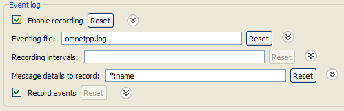

   INI file eventlog configuration

By default, the recorded eventlog file will be put in the project's :file:`results` directory, with the name
:file:`${configname}-${runnumber}.elog` .

.. warning::

   If you override the default file name, please make sure that the file extension is :file:`elog` , so that the |omnet++|
   IDE tools will be able to recognize it automatically.

The 'recording intervals' and 'record events' configuration keys control which events will be recorded based on their
simulation time and on the module where they occur. The 'message details' configuration key specifies what will be
recorded from a message's content. Message content will be recorded each time a message gets sent.

The amount of data recorded will affect the eventlog file size, as well as the execution speed of the simulation.
Therefore, it is often a good idea to tailor these settings to get a reasonable tradeoff between performance and
details.

.. note::

   Please refer to the |omnet++| Manual for a complete description of eventlog recording settings.

Sequence Chart
--------------

This section describes the Sequence Chart in detail, focusing on its features without a particular example.

The Sequence Chart is divided into three parts: the top gutter, the bottom gutter and the main area. The gutters show
the simulation time while the main area displays module axes, events and message sends. The chart grows horizontally
with simulation time and vertically with the number of modules. Module axes can optionally display enumerated or
numerical vector data.

There are various options, which control how and what the Sequence Chart displays. Some of these are available on the
toolbar, while others are accessible only from the context menu.

Legend
~~~~~~

Graphical elements on the Sequence Chart represent modules, events and messages, as listed in the following table.

.. list-table::
   :widths: 10 90
   :header-rows: 0

   * - .. image:: pictures/SequenceChart-Legend-SimpleModuleAxis.png
     - simple module axis

   * - .. image:: pictures/SequenceChart-Legend-CompoundModuleAxis.png
     - compound module axis

   * - .. image:: pictures/SequenceChart-Legend-AxisWithAttachedVector.png
     - axis with attached vector data

   * - .. image:: pictures/SequenceChart-Legend-ModuleFullPath.png
     - module full path as axis label

   * - .. image:: pictures/SequenceChart-Legend-InitializationEvent.png
     - (hollow circle) initialization event

   * - .. image:: pictures/SequenceChart-Legend-SelfMessageProcessingEvent.png
     - (green disc) self-message processing event

   * - .. image:: pictures/SequenceChart-Legend-MessageProcessingEvent.png
     - (reddisc) message processing event

   * - .. image:: pictures/SequenceChart-Legend-EventNumber.png
     - event number

   * - .. image:: pictures/SequenceChart-Legend-SelfMessage.png
     - (bluearrow, arched) self-message

   * - .. image:: pictures/SequenceChart-Legend-MessageSend.png
     - (bluearrow) message send

   * - .. image:: pictures/SequenceChart-Legend-MessageReuse.png
     - (greendotted arrow) message reuse

   * - .. image:: pictures/SequenceChart-Legend-MethodCall.png
     - (browndotted arrow)method call

   * - .. image:: pictures/SequenceChart-Legend-SplitArrow.png
     - (arrow with a dashed segment) message send that goes far away; split arrow

   * - .. image:: pictures/SequenceChart-Legend-ZigZagArrow.png
     - (arrow with zigzag) virtual message send; zigzag arrow

   * - .. image:: pictures/SequenceChart-Legend-TransmissionDuration-ReceptionAtStart.png
     - (blue parallelogram) transmission duration; reception at start

   * - .. image:: pictures/SequenceChart-Legend-TransmissionDuration-ReceptionAtEnd.png
     - (blue parallelogram) transmission duration; reception at end

   * - .. image:: pictures/SequenceChart-Legend-SplitTransmissionDuration-ReceptionAtStart.png
     - (blue strips) split transmission duration; reception at start

   * - .. image:: pictures/SequenceChart-Legend-SplitTransmissionDuration-ReceptionAtEnd.png
     - (blue strips) split transmission duration; reception at end

   * - .. image:: pictures/SequenceChart-Legend-MessageName.png
     - (blueletters) message name

   * - .. image:: pictures/SequenceChart-Legend-MethodName.png
     - (brownletters) method name

   * - .. image:: pictures/SequenceChart-Legend-ZeroSimulationTimeRegion.png
     - (graybackground) zero simulation time region

   * - .. image:: pictures/SequenceChart-Legend-SimulationTimeHairline.png
     - (dashedgray line) simulation time hairline

Timeline
~~~~~~~~

Simulation time may be mapped onto the horizontal axis in various ways; linear mapping is only one of the ways. The
reason for having multiple mapping modes is that intervals between interesting events are often of different magnitudes
(e.g. microsecond timings in a MAC protocol versus multi-second timeouts in higher layers), which is impossible to
visualize using a linear scale.

The available timeline modes are:

-  Linear -- the simulation time is proportional to the distance measured in pixels.
-  Event number -- the event number is proportional to the distance measured in pixels.
-  Step -- the distance between subsequent events, even if they have non-subsequent event numbers, is the same.
-  Nonlinear -- the distance between subsequent events is a nonlinear function of the simulation time between them. This
   makes the figure compact even if there are several magnitudes difference between simulation time intervals. On the
   other hand, it is still possible to decide which interval is longer and which one is shorter.
-  Custom nonlinear -- like nonlinear. This is useful in those rare cases when the automatic nonlinear mode does not
   work well. The best practice is to switch to :guilabel:`Nonlinear` mode first and then to :guilabel:`Custom
   nonlinear`, so that the chart will continuously refresh as the parameters change. At the extreme, you can set the
   parameters so that the nonlinear mode becomes equivalent to linear mode or step mode.

You can switch between timeline modes using the |timelinemode_image| button on the toolbar or from the
context menu.

Zero Simulation Time Regions
~~~~~~~~~~~~~~~~~~~~~~~~~~~~

It is quite common in simulation models for multiple events to occur at the same simulation time, possibly in different
modules. A region with a gray background indicates that the simulation time does not change along the horizontal axis
within the area, thus all events inside it have the same simulation time associated with them.

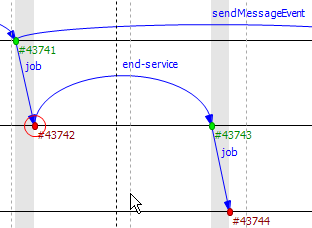

   Nonlinear simulation time

Module Axes
~~~~~~~~~~~

The Sequence Chart's vertical axis corresponds to modules in the simulation. By default, each simple module is displayed
on a separate horizontal axis and events that occurred in that module are shown as circles on it. A compound module is
represented with a double line and it will display events from all contained simple modules, except internal events and
those that have their own axes displayed. An event is internal to a compound module if it only processes a message from,
and sends out messages to, other modules inside.

It is not uncommon for some axes to not have any events at all. These axes would waste space by occupying some place on
the screen, so by default they are omitted from the chart unless the :guilabel:`Show Axes Without Events` option is
turned on. The discovery process is done lazily as you navigate through the chart, and it may add new axes dynamically
as soon as it turns out that they actually have events.

Module axes can be reordered with the option :guilabel:`Axis Ordering Mode` |axisordering_image|. Ordering
can be manual, or sorted by module name, by module id or by minimizing the total number of axes that arrows cross.

.. note::

   The algorithm that minimizes crossings works by taking a random sample from the file and determines the order of axes
   from that (which means that the resulting order will only be an approximation). A more precise algorithm, which takes
   all arrows into account would not be practical because of the typically large size of eventlog files.

Gutter
~~~~~~

The upper and lower edges of the Sequence Chart show a gutter that displays the simulation time. The left side of the
top gutter displays a *time prefix* value, which should be added to each individual simulation time shown at the
vertical hairlines. This reduces the number of characters on the gutter and allows easier recognition of simulation time
changes in the significant digits. The right side of the figure displays the simulation time range that is currently
visible within the window.

.. tip::

   To see the simulation time at a specific point on the chart, move the mouse to the desired place and read the value
   in the blue box horizontally aligned with the mouse on the gutter.

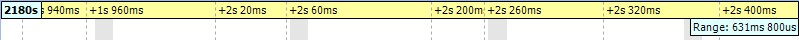

   Gutter and range

Events
~~~~~~

Events are displayed as filled circles along the module axes. A green circle represents the processing of a
self-message, while a red circle is an event caused by receiving a message from another module. The event with event
number zero represents the module initialization phase and may spread across multiple module axes because the simulation
kernel calls each module during initialization. This event is displayed with a white background.

Event numbers are displayed below and to the right of their corresponding events and are prefixed with '#'. Their color
changes according to their events' colors.

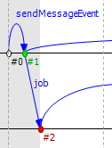

   Various event kinds

Messages
~~~~~~~~

The Sequence Chart represents message sends with blue arrows. Vertically, the arrow starts at the module which sent the
message and ends at the module which processed the message. Horizontally, the start and end points of the arrow
correspond to the sender and receiver events. The message name is displayed near the middle of the arrow, but not
exactly in the middle to avoid overlapping with other names between the same modules.

Sometimes, when a message arrives at a module, it simply stores it and later sends the very same message out. The
events, where the message arrived, and where the message was actually sent, are in a so-called "message reuse"
relationship. This is represented by a green dotted arrow between the two events. These arrows are not shown by default
because timer self-messages are usually reused continuously. This would add unnecessary clutter to the chart and would
make it hard to understand. To show and hide these arrows, use the :guilabel:`Show Reuse Messages` 
|reusearrows_image| button on the toolbar.

Sometimes, depending on the zoom factor, a message send goes far away on the chart. In this case, the line is split into
two smaller parts that are displayed at the two ends pointing towards each other, but without a continuous line
connecting them. At one end of both arrow pieces is a dotted line while at the other end is a solid line. The one which
is solid always points exactly to, or from, the event to which it is connected. The other one, which is dotted, either
specifies the module where the arrow starts, or ends, or in the case of a self-message, it points toward the other arrow
horizontally.

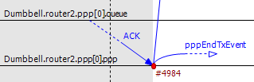

   Split arrows

Displaying Module State on Axes
~~~~~~~~~~~~~~~~~~~~~~~~~~~~~~~

It is possible to display a module's state on an axis. The axis is then rendered as a colored strip that changes color
every time the module state changes. The data are taken from an output vector in an *output vector file*,
normally recorded by the simulation together with the eventlog file.

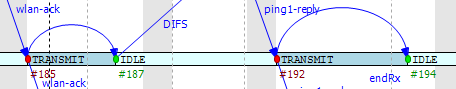

   Axis with state information displayed

To attach an output vector to an axis, right-click the desired axis and select :guilabel:`Attach Vector to Axis` from
the context menu. You will be prompted for an output vector file and for a vector in the file. If the vector is of type
enum (that is, it has metadata attached that assigns symbolic names to values, e.g. ``IDLE`` for 0,
``TRANSMIT`` for 1, etc.), then the chart will display symbolic names inside the strip, otherwise it will
display the values as numbers. The background coloring for the strip is automatic.

.. note::

   Recording output vectors is explained in the *|omnet++| Simulation Manual*. It is recommended to turn on
   recording event numbers (``**.vector-record-eventnumbers = true`` inifile setting), because that allows the Sequence
   Chart tool to display state changes accurately even if there are multiple events at the same simulation time.

   The format of output vector files is documented in an appendix of the Manual. To see whether a given output vector is
   suitable for the Sequence Chart, search for the vector declaration (``vector... `` line) in the file. When event
   numbers are enabled, the vector declaration will end in ``ETV`` (not ``TV``). If a vector has an enum attached, there
   will be an ``attr enum`` line after the vector declaration. An example vector declaration with an enum:

   .. code-block
   
      vector 5 Net.host[2].radio state ETV
      attr enum "IDLE=0,TRANSMIT=1,RECEIVE=2"

Zooming
~~~~~~~

To zoom in or out horizontally along the timeline, use the :guilabel:`Zoom In` |zoomplus_image| and
:guilabel:`Zoom Out` |zoomminus_image| buttons on the toolbar. To decrease or increase the distance between
the axes, use the :guilabel:`Increase/Decrease Spacing` |incr_spacing_image| |decr_spacing_image| commands.

.. warning::

   When you zoom out, more events and messages become visible on the chart, making it slower. When you zoom in, message
   lines start break, making it less informative. Try to keep a reasonable zoom level.

Navigation
~~~~~~~~~~

To scroll through the Sequence Chart, use either the scroll bars, drag with the left mouse button or scroll with the
mouse wheel using the :kbd:`Shift` modifier key for horizontal scroll.

There are also navigation options to go to the previous :kbd:`Shift+LEFT` or next :kbd:`Shift+RIGHT` event in the same module.

Similar to navigating in the Eventlog Table, to go to the cause event, press :kbd:`Ctrl+LEFT`. To go to the arrival of a
message send, press :kbd:`Ctrl+RIGHT` while an event is selected.

Tooltips
~~~~~~~~

The Sequence Chart displays tooltips for axes, events, message sends and reuses. When a tooltip is shown for any of the
above, the chart will highlight the corresponding parts. Sometimes, when the chart is zoomed out it might show a complex
tooltip immediately because there are multiple items under the mouse.

.. tip::

   To measure the simulation time difference between two events, select one of them while staying at the other to
   display the tooltip.

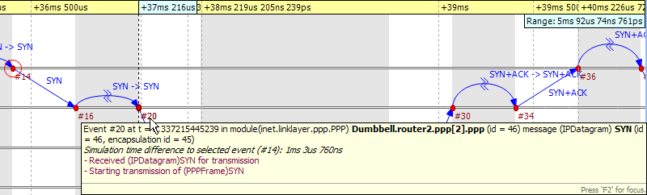

   Event tooltip

Bookmarks
~~~~~~~~~

Just like the Eventlog Table, the Sequence Chart also supports bookmarks to make navigation easier. Bookmarks are saved
for the files rather than the various editors, therefore they are shared between them. The chart highlights bookmarked
events with a circle around them similar to primary selection but with a different color.

Exporting
~~~~~~~~~

The Sequence Chart supports exporting continuous parts into SVG format for documentation purposes. This function is
available from the context menu |export_wiz_image|. You can export the whole Sequence Chart, a region
between two selected events, or the currently visible area.

Associated Views
~~~~~~~~~~~~~~~~

When you open an eventlog file in the Sequence Chart editor, it will automatically open the :guilabel:`Eventlog Table
View` with the same file. If you select an event on the Sequence Chart editor, then the :guilabel:`Eventlog Table View`
will jump to the same event and vice versa. This interconnection makes navigation easier and you can immediately see the
details of the selected event's raw data.

Filtering
~~~~~~~~~

You can also filter the contents of the Sequence Chart. This actually means that some of the events are not displayed on
the chart so that the user can focus on the relevant parts. When filtering is turned on (displayed in the status line),
some of the message arrows might have a filter sign (a double zigzag crossing the arrow line's center). Such a message
arrow means that there is a message going out from the source module, which after processing in some other filtered out
modules, reaches the target module. The message name of the arrow in this case corresponds to the first and the last
message in the chain that was filtered out.

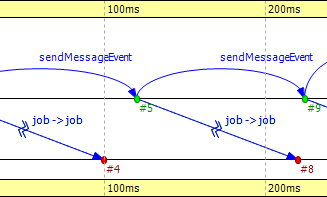

   Zigzag arrows

When a module filter is used, it will determine which modules will have axes. If the events that occurred in a module
are completely filtered out, then the Sequence Chart will not display the superfluous axis belonging to that module.
This reduces the number of axes and makes it easier to understand the figure.

Events may not have subsequent event numbers, which means that the events in between have been filtered out. At the
extreme, the chart may even be empty, meaning that there are no matching events at all.

To filter the Sequence Chart, open the :guilabel:`Filter Dialog` using the filter button |filter_image| on
the toolbar. You can also filter from the context menu using the shortcuts provided for events and message sends
currently under the mouse.

Eventlog Table
--------------

This section describes the Eventlog Table in details focusing on its features without a particular example.

The Eventlog Table has one row per line in the eventlog file. It has three columns. The first two are called event
number and simulation time respectively. They show the values corresponding to the simulation event where the line was
recorded. The third column, called details, contains the actual data, which varies for each line kind. The different
kinds of lines can be easily recognized by their icons. Some lines, such as sending a message through a sequence of
gates, relate to each other and are indented so that the user can recognize them more easily.

There are various options, which control how and what the Eventlog Table displays. Some of these are available on the
toolbar, while others are accessible only from the context menu.

Display Mode
~~~~~~~~~~~~

The eventlog file content may be displayed in two different notations. The :guilabel:`Raw` data notation shows exactly
what is present in the file.

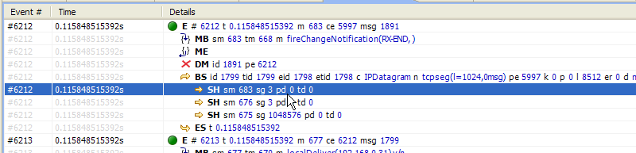

   Raw notation

The :guilabel:`Descriptive` notation, after some preprocessing, displays the log file in a readable format. It also
resolves references and types, so that less navigation is required to understand what is going on. To switch between the
two, use the :guilabel:`Display Mode` |displaymode_image| button on the toolbar or the context menu.

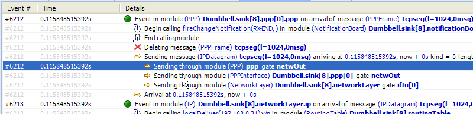

   Descriptive notation

Name Mode
~~~~~~~~~

There are three different ways to display names in the Eventlog Table; it is configurable with the :guilabel:`Name Mode`
|NameMode_image| option. Full path and full name shows what you would expect. The smart mode uses the
context of the line to decide whether a full path or a full name should be displayed. For each event line, this mode
always displays the full path. For all other lines, if the name is the same as the enclosing event's module name, then
it shows the full name only. This choice makes lines shorter and allows for faster reading.

Type Mode
~~~~~~~~~

The option called :guilabel:`Type Mode` can be used to switch between displaying the C++ class name or the NED type name
in parenthesis before module names. This is rarely used, so it is only available from the context menu.

Line Filter
~~~~~~~~~~~

The Eventlog Table may be filtered by using the :guilabel:`Line Filter` |LineFilterMode_image| button on
the toolbar. This option allows filtering for lines with specific kinds. There are some predefined filters.

You can also provide a custom filter pattern, referring to fields present in :guilabel:`Raw` mode, using a match
expression. The following example is a custom filter, which will show message sends where the message's class is
AirFrame.

.. code-block::

   BS and c(AirFrame)

Please refer to the |omnet++| Manual for more details on match expressions.

.. note::

   To avoid confusion, event lines marked with green circles |Event_image| are always shown in the Eventlog
   Table and are independent of the line filter.

Navigation
~~~~~~~~~~

You can navigate using your keyboard and mouse just like in any other table. There are a couple of non-standard
navigation options in the context menu, which can also be used with the keyboard.

The simplest are the :guilabel:`Goto Event` and the :guilabel:`Goto Simulation Time`, both of which simply jump to the
designated location.

There are navigation options for going to the previous :kbd:`Alt+UP` or next :kbd:`Alt+DOWN` event in general, and to go to the
previous :kbd:`Shift+UP` or next :kbd:`Shift+DOWN` event in the same module.

Some of the navigation options focus on the causes of events and consequences of message sends. To go to the cause
event, press :kbd:`Ctrl+UP`. To go to the arrival of a message send, press :kbd:`Ctrl+DOWN`, after selecting the message being sent.

Finally, there are navigation options for message reuse relationships. You can go to the original event of a message
from the line where it was being reused. In the other direction, you can go to the reused event of a message from the
event where it was received. These options are enabled only if they actually make sense for the current selection.

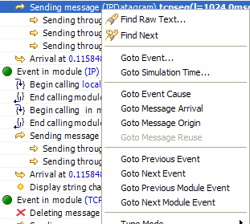

   Navigation context menu

Selection
~~~~~~~~~

The Eventlog Table uses multiple selection even though most of the user commands require single selection.

Searching
~~~~~~~~~

For performance reasons, the search |Search_image| function works directly on the eventlog file and not the
text displayed in the Eventlog Table. It means that some static text present in :guilabel:`Descriptive` mode cannot be
found. Usually, it is easier to figure out what to search for in :guilabel:`Raw` mode, where the eventlog file's content
is directly displayed. The search can work in both directions, starting from the current selection, and may be case
insensitive. To repeat the last search, use the :guilabel:`Find Next` |SearchNext_image| command.

Bookmarks
~~~~~~~~~

For easier navigation, the Eventlog Table supports navigation history. This is accessible from the standard IDE toolbar
just like for other kinds of editors. It works by remembering each position where the user stayed more than 3 seconds.
The navigation history is temporary and thus it is not saved when the file is closed.

Persistent bookmarks |bkmrk_nav_image| are also supported and they can be added from the context menu. A
Bookmarked event is highlighted with a different background color.

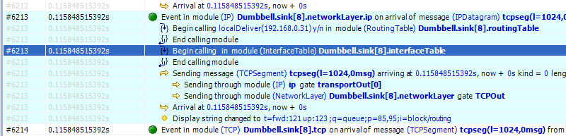

   A bookmark

To jump to a bookmark, use the standard :guilabel:`Bookmark View` (this is possible even after restarting the IDE).

Tooltips
~~~~~~~~

Currently, only the message send lines have tooltips. If message detail recording was configured for the simulation,
then a tooltip will show the recorded content of a message send over the corresponding line.

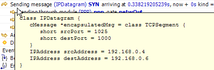

   A message send tooltip

Associated Views
~~~~~~~~~~~~~~~~

When you open an eventlog file in the Eventlog Table editor, it will automatically open the :guilabel:`Sequence Chart
View` with the same file. If you select an event on the Eventlog Table editor, then the :guilabel:`Sequence Chart View`
will jump to the same event and vice versa. This interconnection makes navigation easier, and you can immediately see
the cause and effect relationships of the selected event.

Filtering
~~~~~~~~~

If the Eventlog Table displays a filtered eventlog, then subsequent events may not have subsequent event numbers. This
means that the events in between have been filtered out. At the extreme, the table may even be empty, which means that
there are no matching events at all.

Filter Dialog
-------------

The content of an eventlog can be filtered within the |omnet++| IDE. This is on-the-fly filtering as opposed to the file
content filtering provided by the :guilabel:`Eventlog` tool. To use on the fly filtering, open the filter configuration dialog
with the button |filter_image| on the toolbar, enable some of the range, module, message, or trace filters,
set the various filter parameters, and apply the settings. The result is another eventlog, resident in memory, that
filters out some events.

.. note::

   Similar to the command line :command:`opp_eventlogtool` described in the |omnet++| Manual, the in-memory filtering can only
   filter out whole events.

In-memory, on-the-fly filtering means that the filter's result is not saved into an eventlog file, but it is computed
and stored within memory. This allows rapid switching between different views of the same eventlog within both the
:guilabel:`Sequence Chart` and the :guilabel:`Eventlog Table`.

The filter configuration dialog shown in :numref:`fig-filter-dialog` has many options.
They are organized into a tree with each part restricting the eventlog's content. The individual filter components may
be turned on and off independent of each other. This allows remembering the filter settings even if some of them are
temporarily unused.

The combination of various filter options might be complicated and hard to understand. To make it easier, the
:guilabel:`Filter Dialog` automatically displays the current filter in a human readable form at the bottom of the
dialog.

.. _fig-filter-dialog:
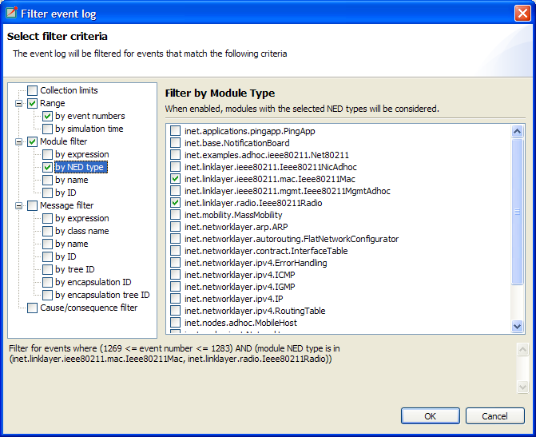

   Filter Dialog

Range Filter
~~~~~~~~~~~~

This is the simplest filter, which filters out events from the beginning and end of the eventlog. It might help to
reduce the computation time dramatically when defining filters, which otherwise would be very expensive to compute for
the whole eventlog file.

Module Filter
~~~~~~~~~~~~~

With this kind of filter, you can filter out events that did not occur in any of the specified modules. The modules
which will be included in the result can be selected by their NED type, full path, module id, or by a match expression.
The expression may refer to the raw data present in the lines marked with 'MC' in the eventlog file.

Message Filter
~~~~~~~~~~~~~~

This filter is the most complicated one. It allows filtering for events, which either process or send specific messages.
The messages can be selected based on their C++ class name, message name, various message ids, and a match expression.
The expression may refer to the raw data present in the lines marked with 'BS' in the eventlog file.

There are four different message ids to filter, each with different characteristics. The most basic one is the id, which
is unique for each constructed message independent of how it was created. The tree id is special because it gets copied
over when a message is created by copying (duplicating) another. The encapsulation id is different in that it gives the
id of the innermost encapsulated message. Finally, the encapsulation tree id combines the two by providing the innermost
encapsulated message's tree id.

Tracing Causes/Consequences
~~~~~~~~~~~~~~~~~~~~~~~~~~~

The trace filter allows filtering for causes and consequence of a particular event specified by its event number. The
cause/consequence relation between two events means that there is a message send/reuse path from the cause event to the
consequence event. If there was a message reuse in the path, then the whole path is considered to be a message reuse
itself.

.. warning::

   Since computing the causes and consequences in an eventlog file that is far away from the traced event might be a
   time consuming task, the user can set extra range limits around the traced event. These limits are separate from the
   range filter due to being relative to the traced event. This means that if you change the traced event, there is no
   need to change the range parameters. It is strongly recommended that users provide these limits when tracing events
   to avoid long running operations.

Collection Limits
~~~~~~~~~~~~~~~~~

When an in-memory filter is applied to an eventlog, it does not only filter out events, but it also provides automatic
discovery for virtual message sends. It means that two events far away, and not directly related to each other, might
have a virtual message send (or reuse) between them. Recall that there is a virtual message send (or reuse) between two
events if and only if there is a path of message sends (or reuses) connecting the two.

The process of collecting these virtual message dependencies is time consuming and thus has to be limited. There are two
options. The first one limits the number of virtual message sends collected per event. The other one limits the depth of
cause/consequence chains during collection.

Long-Running Operations
~~~~~~~~~~~~~~~~~~~~~~~

Sometimes, computing the filter's result takes a lot of time, especially when tracing causes/consequences without
specifying proper range limits in terms of event numbers or simulation times. If you cancel a long running operation,
you can go back to the :guilabel:`Filter Dialog` to modify the filter parameters, or simply turn the filter off. To
restart drawing, use the refresh button |refresh_image| on the toolbar.

.. tip::

   Providing a proper range filter is always a good idea to speed up computing the filter's result.

Other Features
--------------

Both the Sequence Chart and the Eventlog Table tools can be used as an editor and also as a view. The difference between
an editor or a view is quite important because there is only at most one instance of a view of the same kind. It means
that even if multiple eventlog files are open in Sequence Chart editors, there is no more than one :guilabel:`Eventlog
Table` view shared between them. This single view will automatically display the eventlog file of the active editor. It
will also remember its position and state when it switches among editors. For more details on editors and views, and
their differences, please refer to the Eclipse documentation.

.. note::

   Despite the name "editor", which is a concept of the Eclipse platform, neither the :guilabel:`Sequence Chart`, 
   nor the :guilabel:`Eventlog Table` can be used to actually change the contents of an eventlog file.

It is possible to open the same eventlog file in multiple editors and to navigate to different locations, or use
different display modes or filters in a location. Once an eventlog is open in an editor, you can use the
:menuselection:`Window --> New Editor` to open it again.

.. tip::

   Dragging one of the editors from the tabbed pane to the side of the editor's area allows you to interact with the two
   simultaneously.

Settings
~~~~~~~~

There are various settings for both tools which affect the display, such as display modes, content position, filter
parameters, etc. These user-specified settings are automatically saved for each file and they are reused whenever the
file is revisited. The per file settings are stored under the |omnet++| workspace, in the directory
:file:`.metadata\.plugins\org.eclipse.core.resources\.projects\<project-name>` .

Large File Support
~~~~~~~~~~~~~~~~~~

Since an eventlog file might be several Gigabytes, both tools are designed in a way that allows for efficient displaying
of such a file without requiring large amounts of physical memory to load it at once. As you navigate through the file,
physical memory is filled up with the content lazily. Since it is difficult to reliably identify when the system is
getting low on physical memory, it is up to the user to release the allocated memory when needed. This operation,
although usually not required, is available from the context menu as :menuselection:`Release Memory`. It does not affect the
user interface in any way.

The fact that the eventlog file is loaded lazily and optionally filtered also means that the exact number of lines and
events it contains cannot be easily determined. This affects the way scrollbars work in the lazy directions: horizontal
for the Sequence Chart and vertical for the Eventlog Table. These scrollbars act as a non-linear approximation in that
direction. For the most, the user will be unaware of these approximations unless the file is really small.

Viewing a Running Simulation's Results
~~~~~~~~~~~~~~~~~~~~~~~~~~~~~~~~~~~~~~

Even though the simulation kernel keeps the eventlog file open for writing while the simulation is running, it may be
open in the |omnet++| IDE simultaneously. Both tools can be guided by pressing the END key to follow the eventlog's end as
new content is appended to it. If you pause the simulation in the runtime environment, then after a few seconds the
tools will refresh their content and jump to the very end. This process makes it possible to follow the simulation
step-by-step on the Sequence Chart.

Caveats
~~~~~~~

Sometimes, drawing the Sequence Chart may take a lot of time. Zooming out too much, for example, might result in slow
response times. A dialog might pop up telling the user that a long running eventlog operation is in progress. You can
safely cancel these operations at any time you like, or just wait until they finish. To restart the rendering process,
simply press the refresh button |refresh_image| on the toolbar. Before refreshing, it is a good idea to
revert to some defaults (e.g. default zoom level) or revert the last changes (e.g. navigate back, turn filter off,
etc.).

.. warning::

   An operation which runs for an unreasonably long time might be a sign of a problem that should be reported.

Examples
--------

This section will guide you through the use of the Sequence Chart and Eventlog Table tools, using example simulations
from |omnet++| and the INET Framework. Before running any of the simulations, make sure that eventlog recording is enabled
by adding the line

.. code-block:: ini

   record-eventlog = true

in the :file:`omnetpp.ini` file in the simulation's directory. To open the generated eventlog in the |omnet++| IDE, go to
the example's :file:`results` directory in the :guilabel:`Resource Navigator` View, and double-click the log file. By
default, the file will open in the Sequence Chart.

.. tip::

   To open the file in the Eventlog Table as editor, right-click the file, and choose the corresponding item from the
   context menu's :menuselection:`Open With` submenu.

Tictoc
~~~~~~

The Tictoc example is available in the |omnet++| installation under the directory :file:`samples/tictoc` . Tictoc is the
most basic example in this chapter and it provides a quick overview on how to use and understand the Sequence Chart.

Start the simulation and choose the simplest configuration, 'Tictoc1', which specifies only two nodes called 'tic' and
'toc.' During initialization, one of the nodes will send a message to the other. From then on, every time a node
receives the message, it will simply send it back. This process continues until you stop the simulation. In
:numref:`fig-tictoc-two` you can see how this is represented on a Sequence
Chart. The two horizontal black lines correspond to the two nodes and are labeled 'tic' and 'toc.' The red circles
represent events and the blue arrows represent message sends. It is easy to see that all message sends take 100
milliseconds and that the first sender is the node 'tic.'

.. _fig-tictoc-two:
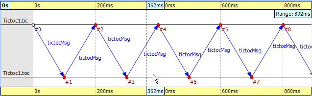

   Tictoc with two nodes

In the next Tictoc example, there are six nodes tossing a message around until it reaches its destination. To generate
the eventlog file, restart the simulation and choose the configuration 'Tictoc9'. In
:numref:`fig-tictoc-several` you can see how the message goes from one
node to another, starting from node '0' and passing through it twice more, until it finally reaches its destination,
node '3.' The chart also shows that this example, unlike the previous one, starts with a self-message instead of
immediately sending a message from initialize to another node.

.. _fig-tictoc-several:
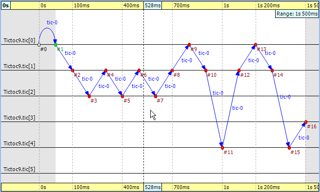

   Tictoc with six nodes

Let us demonstrate with this simple example how filtering works with the Sequence Chart. Open the :guilabel:`Filter
Dialog` with the toolbar button |filter_image| and put a checkmark for node '0' and '3' on the
:menuselection:`Module filter --> by name` panel, and apply it. The chart now displays only two axes that correspond to the two
selected nodes. Note that the arrows on this figure are decorated with zigzags, meaning that they represent a sequence
of message sends. Such arrows will be called virtual message sends in the rest of this chapter. The first two arrows
show the message returning to node '0' at event #9 and event #13, and the third shows that it reaches the destination at
event #16. The events where the message was in between are filtered out.

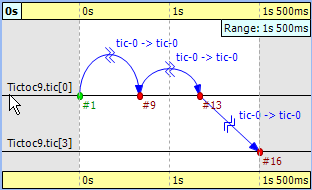

   Filtering for node '0' and '3'

FIFO
~~~~

The FIFO example is available in the |omnet++| installation under the directory :file:`samples/fifo` . The FIFO is an
important example because it uses a queue, which is an essential part of discrete event simulations and introduces the
notion of message reuses.

When you start the simulation, choose the configuration 'low job arrival rate' and let it run for a while. In
:numref:`fig-fifo` you can see three modules: a ``source``, a ``queue``, and a
``sink``. The simulation starts with a self-message and then the generator sends the first message to the queue at event
#1. It is immediately obvious that the message stays in the queue for a certain period of time, between event #2 and
event #3.

.. tip::

   When you select one event and hover with the mouse above the other, the Sequence Chart will show the length of this
   time period in a tooltip.

Finally, the message is sent to the ``sink`` where it is deleted at event #4.

.. _fig-fifo:
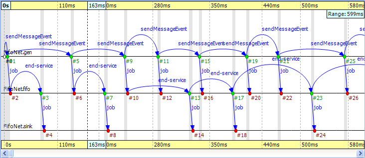

   The FIFO example

Something interesting happens at event #12 where the incoming message suddenly disappears. It seems like the queue does
not send the message out. Actually, what happens is that the queue enqueues the job because it is busy serving the
message received at event #10. Since this queue is a FIFO, it will send out the first message at event #13. To see how
this happens, turn on :guilabel:`Show Reuse Messages` from the context menu; the result is shown in
:numref:`fig-fifo-reuse`. It displays a couple of green dotted arrows, one of
which starts at event #12 and arrives at event #17. This is a reuse arrow; it means that the message sent out from the
queue at event #17 is the same as the one received and enqueued at event #12. Note that the service of this message
actually begins at event #13, which is the moment that the queue becomes free after it completes the job received at
event #10.

.. _fig-fifo-reuse:
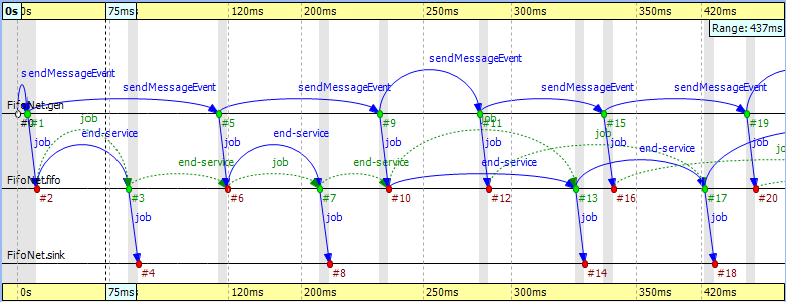

   Showing reuse messages

Another type of message reuse is portrayed with the arrow from event #3 to event #6. The arrow shows that the queue
reuses the same timer message instead of creating a new one each time.

.. note::

   Whenever you see a reuse arrow, it means that the underlying implementation remembers the message between the two
   events. It might be stored in a pointer variable, a queue, or some other data structure.

The last part of this example is about filtering out the queue from the chart. Open the :guilabel:`Filter Dialog`,
select :guilabel:`sink` and :guilabel:`source` on the :menuselection:`Module filter --> by NED type` panel, and apply the change in settings. If you
look at the result in :numref:`fig-fifo-filtered`, you will see zigzag arrows
going from the 'source' to the 'sink.' These arrows show that a message is being sent through the queue from 'source' to
'sink.' The first two arrows do not overlap in simulation time, which means the queue did not have more than one message
during that time. The third and fourth arrows do overlap because the fourth job reached the queue while it was busy with
the third one. Scrolling forward you can find other places where the queue becomes empty and the arrows do not overlap.

.. _fig-fifo-filtered:
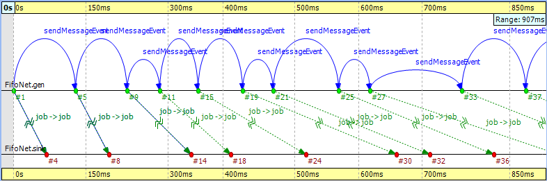

   Filtering the queue

Routing
~~~~~~~

The Routing example is available in the |omnet++| installation under the directory :file:`samples/routing` . The
predefined configuration called 'Net10' specifies a network with 10 nodes with each node having an application, a few
queues and a routing module inside. Three preselected nodes, namely the node '1,' '6,' and '8' are destinations, while
all nodes are message sources. The routing module uses the shortest path algorithm to find the route to the destination.
The goal in this example is to create a sequence chart that shows messages which travel simultaneously from multiple
sources to their destinations.

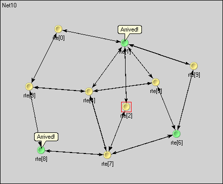

   Network with 10 nodes

Since we do not care about the details regarding what happens within nodes, we can simply turn on filtering for the NED
type ``node.Node``. The chart will have 10 axes with each axis drawn as two parallel solid black lines close to each
other. These are the compound modules that represent the nodes in the network. So far events could be directly drawn on
the simple module's axis where they occurred, but now they will be drawn on the compound module's axis of their
ancestor.

.. _fig-routing:
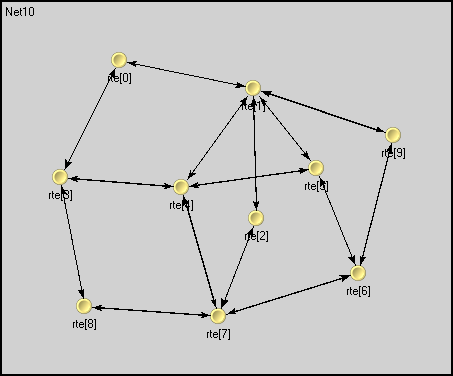

   Filtering for nodes

To reduce clutter, the chart will automatically omit events which are internal to a compound module. An event is
internal to a compound module if it only processes a message from, and sends out messages to, other modules inside the
compound module.

If you look at :numref:`fig-routing` you will see a message going from node
'7' at event #10 to node '1' at event #23. This message stays in node '2' between event #15 and event #17. The gray
background area between them means that zero simulation time has elapsed (i.e. the model does not account for processing
time inside the network nodes).

.. note::

   This model contains both finite propagation delay and transmission time; arrows in the sequence chart correspond to
   the interval between the start of the transmission and the end of the reception.

This example also demonstrates message detail recording configured by

.. code-block:: ini

   eventlog-message-detail-pattern = Packet:declaredOn(Packet)

in the INI file. The example in :numref:`fig-routing-tooltip` shows the tooltip
presented for the second message send between event #17 and event #23.

.. _fig-routing-tooltip:
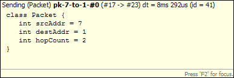

   Message detail tooltip

It is very easy to find another message on the chart that goes through the network parallel in simulation time. The one
sent from node '3' at event #13 to node '8' arriving at event #19 is such a message.

Wireless
~~~~~~~~

The Wireless example is available in the INET Framework under the directory :file:`examples/adhoc/ieee80211` . The
predefined configuration called 'Config1' specifies two mobile hosts moving around on the playground and communicating
via the IEEE 802.11 wireless protocol. The network devices are configured for ad-hoc mode and the transmitter power is
set so that hosts can move out of range. One of the hosts is continuously pinging the other.

In this section, we will explore the protocol's MAC layer, using two sequence charts. The first chart will show a
successful ping message being sent through the wireless channel. The second chart will show ping messages getting lost
and being continuously re-sent.

We also would like to record some message details during the simulation. To perform that function, comment out the
following line from ``omnetpp.ini``:

.. code-block:: ini

   eventlog-message-detail-pattern = *:(not declaredOn(cMessage) and not
     declaredOn(cNamedObject) and not declaredOn(cObject))

To generate the eventlog file, start the simulation environment and choose the configuration 'host1 pinging host0.' Run
the simulation in fast mode until about event #5000.

Preparing the Result
^^^^^^^^^^^^^^^^^^^^

When you open the :guilabel:`Sequence Chart`, it will show a couple of self-messages named 'move' being scheduled regularly. These
are self-messages that control the movement of the hosts on the playground. There is an axis labeled 'pingApp,' which
starts with a 'sendPing' message that is processed in an event far away on the chart. This is indicated by a split
arrow.

.. _fig-wireless-beg:
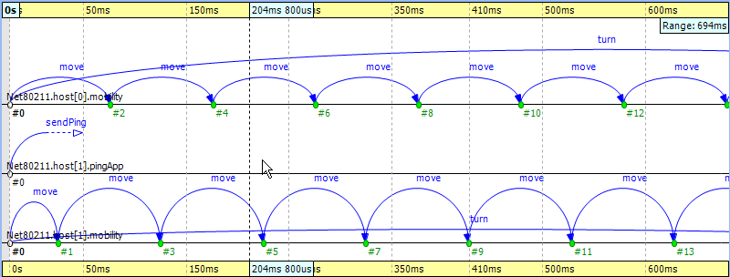

   The beginning

You might notice that there are only three axes in
:numref:`fig-wireless-beg` even though the simulation model clearly
contains more simple modules. This is because the Sequence Chart displays the first few events by default and in this
scenario, they all happen to be within those modules. If you scroll forward or zoom out, new axes will be added
automatically as needed.

For this example, ignore the 'move' messages and focus on the MAC layer instead. To begin with, open the
:guilabel:`Filter Dialog`, select 'Ieee80211Mac' and 'Ieee80211Radio' on the :menuselection:`Module filter --> by NED type`
panel, and apply the selected changes. The chart will have four axes, two for the MAC and two for the radio simple
modules.

The next step is to attach vector data to these axes. Open the context menu for each axis by clicking on them one by one
and select the :guilabel:`Attach Vector to Axis` submenu. Accept the vector file offered by default. Then, choose the
vector 'mac:State' for the MAC modules and 'mac:RadioState' for the radio modules. You will have to edit the filter in
the vector selection dialog (i.e. delete the last segment) for the radio modules because at the moment the radio state
is recorded by the MAC module, so the default filter will not be right. When this step is completed, the chart should
display four thick colored bars as module axes. The colors and labels on the bars specify the state of the corresponding
state machine at the given simulation time.

To aid comprehension, you might want to manually reorder the axis, so that the radio modules are put next to each other.
Use the button |axisordering_image| on the toolbar to switch to manual ordering. With a little zooming and
scrolling, you should be able to fit the first message exchange between the two hosts into the window.

Successful Ping
^^^^^^^^^^^^^^^

The first message sent by 'host1' is not a ping request but an ARP request. The processing of this message in 'host0'
generates the corresponding ARP reply. This is shown by the zigzag arrow between event #85 and event #90. The reply goes
back to 'host1,' which then sends a WLAN acknowledge in return. In this process, 'host1' discovers the MAC address of
'host0' based on its IP address.

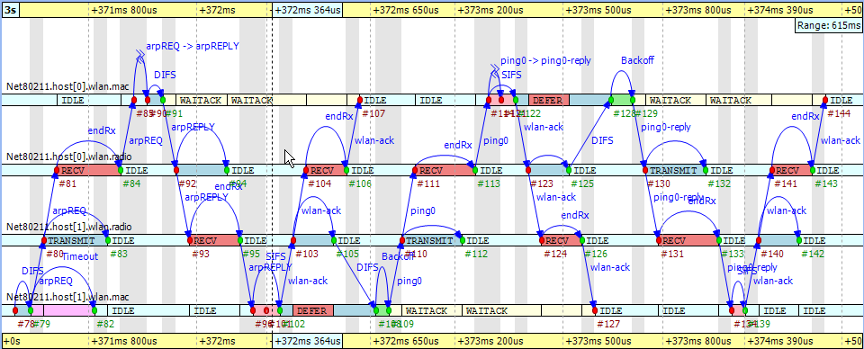

   Discovering the MAC address

The send procedure for the first ping message starts at event #105 in 'host1' and finishes by receiving the acknowledge
at event #127. The ping reply send procedure starts at event #125 in 'host0' and finishes by receiving the WLAN
acknowledge at event #144. If you scroll forward, you can see as in
:numref:`fig-wireless-succping` the second complete successful ping
procedure between event #170 and event #206. To focus on the second successful ping message exchange, open the
:guilabel:`Filter Dialog` and enter these numbers in the range filter.

Timing is critical in a protocol implementation, so we will take a look at it using the Sequence Chart. The first self
message represents the fact that the MAC module listens to the radio for a DIFS period before sending the message out.
The message send from event #171 to event #172 occurs in zero simulation time as indicated by the gray background. It
represents the moment when the MAC module decides to send the ping request down to its radio module. The back-off
procedure was skipped for this message because there was no transmission during the DIFS period. If you look at event
#172 and event #173, you will see how the message propagates through the air from 'radio1' to 'radio0.' This finite
amount of time is calculated from the physical distance of the two modules and the speed of light. In addition, by
looking at event #172 and event #174, you will notice that the transmission time is not zero. This time interval is
calculated from the message's length and the radio module's bitrate.

.. _fig-wireless-succping:
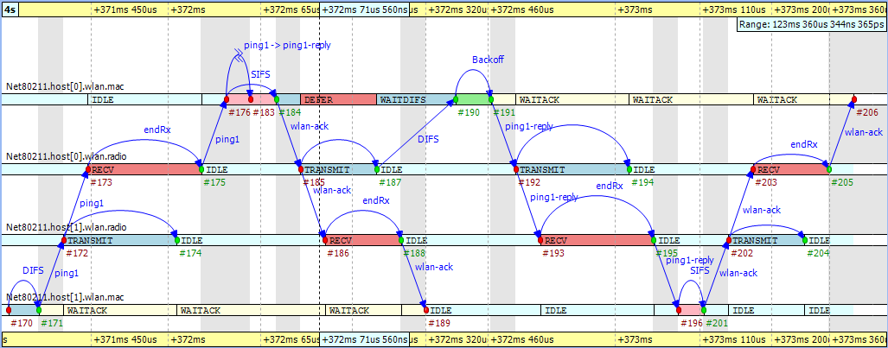

   The second ping procedure

Another interesting fact seen in the figure is that the higher level protocol layers do not add delay for generating the
ping reply message in 'host0' between event #176 and event #183. The MAC layer procedure ends with sending back a WLAN
acknowledge after waiting a SIFS period.

Finally, you can get a quick overview of the relative timings of the IEEE 802.11 protocol by switching to linear
timeline mode. Use the button |timelinemode_image| on the toolbar and notice how the figure changes
dramatically. You might need to scroll and zoom in or out to see the details. This shows the usefulness of the nonlinear
timeline mode.

You can export this sequence chart for documentation purposes using the context menu's :menuselection:`Export to SVG` option.

Unsuccessful Ping
^^^^^^^^^^^^^^^^^

To see how the chart looks when the ping messages get lost in the air, first turn off range filtering. Then, go to event
#1269 by selecting the :guilabel:`Goto Event` option from the :guilabel:`Eventlog Table` View's context menu. In
:numref:`fig-wireless-unsuccping` you can see how the receiver radio does
not send up the incoming message to its MAC layer due to the signal level being too low. This actually happens at event
#1274 in 'host0.' Shortly thereafter, the transmitter MAC layer in 'host1' receives the timeout message at event #1275,
and starts the backoff procedure before resending the very same ping message. This process goes on with statistically
increasing backoff time intervals until event #1317. Finally, the maximum number of retries is reached and the message
is dropped.

.. _fig-wireless-unsuccping:
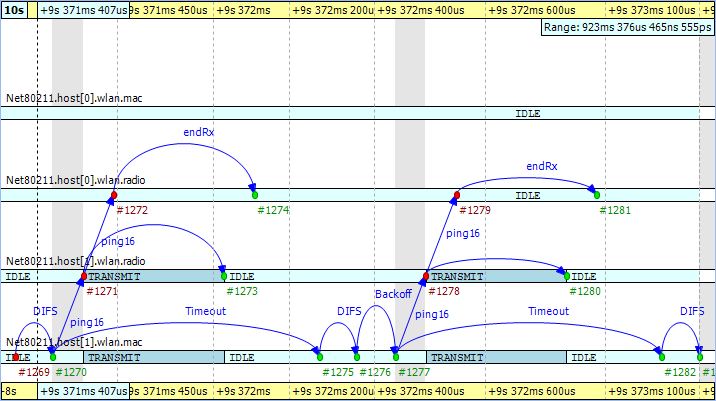

   Ping messages get lost

The chart also shows that during the unsuccessful ping period, there are no events occurring in the MAC layer of 'host0'
and it is continuously in 'IDLE' state.
